Text as Data: Unsupervised machine learning continuedText as Data:
Unsupervised machine learning continued
================
Dr. Ayse D. Lokmanoglu
Lecture 10, (B) April 6, (A) April 1

# R Exercises

## Table of Contents

| Section | Topic                                                |
|---------|------------------------------------------------------|
| 1       | Loading L9 Results and Creating Meta-Theta DataFrame |
| 1.1     | Load Workspace from L9                               |
| 1.2     | Extract Gamma Matrix                                 |
| 1.3     | Create Meta-Theta DataFrame                          |
| 1.4     | Verify Data Structure                                |
| 2       | Sentiment Analysis                                   |
| 2.1     | Tokenize the Text                                    |
| 2.2     | AFINN Sentiment Dictionary                           |
| 2.3     | Bing Sentiment Dictionary                            |
| 2.4     | NRC Emotion Lexicon                                  |
| 2.5     | Comparing All Three Dictionaries                     |
| 2.5.1   | Coverage Comparison                                  |
| 2.5.2   | Sentiment Distribution Comparison                    |
| 2.5.3   | Correlation Between Dictionaries                     |
| 2.5.4   | Which Dictionary Should We Use?                      |
| 3       | Sentiment by Topic Analysis                          |
| 3.1     | Create Sentiment-Topic Dataset                       |
| 3.2     | Aggregate Sentiment by Topic                         |
| 3.3     | Visualize Topic Sentiment                            |
| 3.4     | Statistical Significance                             |
| 3.5     | Class Exercise: Changing the Reference Category      |
| 3.6     | Sentiment Over Time                                  |
| 3.6.1   | Prepare Temporal Data                                |
| 3.6.2   | Overall Sentiment Trend                              |
| 3.6.3   | Sentiment by Topic Over Time                         |
| 3.6.4   | Topic Prevalence Over Time                           |
| 4       | Comprehensive Class Exercise                         |

------------------------------------------------------------------------

**ALWAYS** Let’s load our libraries

``` r
library(tidyverse)    # Data manipulation and visualization
library(tidytext)     # Text mining using tidy data principles
library(ggplot2)      # Data visualization
library(topicmodels)  # For working with LDA models
library(lubridate)    # Date handling
```

## 1. Loading L9 Results and Creating Meta-Theta DataFrame

In Lecture 9, we trained an LDA model with K=5 topics on K-pop Reddit
comments. Now we’ll extract the topic probabilities (gamma values) and
combine them with the original comment data for sentiment analysis and
regression modeling.

### 1.1 Load Workspace from L9

``` r
# Load the saved workspace from Lecture 9
# load("../data/Lecture9_LDA_k5.RData")

# Load from url
load(url("https://github.com/aysedeniz09/IntroCSS/raw/refs/heads/main/data/Lecture9_LDA_k5.RData"))

rm(end_time, start_time)

# Check what objects we have
ls()
```

    ## [1] "data"         "data2"        "data3"        "lda_model_k5" "mystopwords" 
    ## [6] "tidy_dfm"

We should see:

- `lda_model_k5`: The trained LDA model

- `data`: Original comment data

- `data2`: Clean comment data

- `data3`: Final cleaned data we will use

- `tidy_dfm`: The document-term matrix

- `mystopwords`: Stopwords we used in cleaning

### 1.2 Extract Gamma Matrix

The **gamma matrix** contains the probability that each document belongs
to each topic. For our data:

- Rows = comments (22,408 comments)

- Columns = topics (5 topics)

- Values = probabilities (sum to 1.0 per row)

``` r
# Extract gamma values using tidy()
gamma_df <- tidy(lda_model_k5, matrix = "gamma")

# Look at the structure
head(gamma_df)
```

    ## # A tibble: 6 × 3
    ##   document topic gamma
    ##   <chr>    <int> <dbl>
    ## 1 1            1 0.142
    ## 2 2            1 0.141
    ## 3 3            1 0.159
    ## 4 4            1 0.218
    ## 5 5            1 0.135
    ## 6 6            1 0.259

**Understanding the output:**

- `document`: The comment_index (as character)

- `topic`: Which topic (1-5)

- `gamma`: Probability this document belongs to this topic

Let’s look at one comment’s topic distribution:

``` r
# Example: Topic probabilities for comment 1
gamma_df |> 
  filter(document == "1") |> 
  arrange(desc(gamma))
```

    ## # A tibble: 5 × 3
    ##   document topic gamma
    ##   <chr>    <int> <dbl>
    ## 1 1            2 0.245
    ## 2 1            4 0.245
    ## 3 1            5 0.198
    ## 4 1            3 0.170
    ## 5 1            1 0.142

``` r
# Verify probabilities sum to 1
gamma_df |> 
  filter(document == "1") |> 
  summarise(total_gamma = sum(gamma))
```

    ## # A tibble: 1 × 1
    ##   total_gamma
    ##         <dbl>
    ## 1           1

### 1.3 Create Meta-Theta DataFrame

Now we’ll reshape gamma from long to wide format and join with original
data:

``` r
# Convert document to numeric to match comment_index
gamma_df <- gamma_df |> 
  mutate(comment_index = as.numeric(document))

# Pivot to wide format: one column per topic
gamma_wide <- gamma_df |> 
  select(-document) |> 
  pivot_wider(names_from = topic, 
              values_from = gamma,
              names_prefix = "topic_")

head(gamma_wide)
```

    ## # A tibble: 6 × 6
    ##   comment_index topic_1 topic_2 topic_3 topic_4 topic_5
    ##           <dbl>   <dbl>   <dbl>   <dbl>   <dbl>   <dbl>
    ## 1             1   0.142   0.245   0.170   0.245   0.198
    ## 2             2   0.141   0.141   0.437   0.141   0.141
    ## 3             3   0.159   0.159   0.391   0.145   0.145
    ## 4             4   0.218   0.218   0.2     0.182   0.182
    ## 5             5   0.135   0.135   0.405   0.176   0.149
    ## 6             6   0.259   0.185   0.185   0.185   0.185

Now join with original comment data:

``` r
# Create meta_theta_df: original data + topic probabilities
meta_theta_df <- data3 |> 
  select(comment_index, text, date, score, text_length, controversiality, downs) |> 
  inner_join(gamma_wide, by = "comment_index")  # inner_join ensures we only keep documents in the model

# View structure
glimpse(meta_theta_df)
```

    ## Rows: 22,316
    ## Columns: 12
    ## $ comment_index    <dbl> 1, 2, 3, 4, 5, 6, 7, 8, 9, 10, 11, 12, 13, 14, 15, 16…
    ## $ text             <chr> "kind of a tangent but kind of a telling tidbit from …
    ## $ date             <date> 2025-07-01, 2025-07-01, 2025-07-01, 2025-07-01, 2025…
    ## $ score            <dbl> 71, 1, 1, 9, 1, 10, 5, 1, 2, 30, 1, 2, 6, 1, 2, 5, 5,…
    ## $ text_length      <dbl> 818, 561, 519, 66, 469, 117, 53, 163, 2917, 98, 53, 2…
    ## $ controversiality <dbl> 0, 0, 0, 0, 0, 0, 0, 0, 0, 0, 0, 0, 0, 0, 0, 0, 0, 0,…
    ## $ downs            <dbl> 0, 0, 0, 0, 0, 0, 0, 0, 0, 0, 0, 0, 0, 0, 0, 0, 0, 0,…
    ## $ topic_1          <dbl> 0.1415094, 0.1408451, 0.1594203, 0.2181818, 0.1351351…
    ## $ topic_2          <dbl> 0.24528302, 0.14084507, 0.15942029, 0.21818182, 0.135…
    ## $ topic_3          <dbl> 0.1698113, 0.4366197, 0.3913043, 0.2000000, 0.4054054…
    ## $ topic_4          <dbl> 0.2452830, 0.1408451, 0.1449275, 0.1818182, 0.1756757…
    ## $ topic_5          <dbl> 0.1981132, 0.1408451, 0.1449275, 0.1818182, 0.1486486…

### 1.4 Verify Data Structure

Let’s verify everything looks correct:

``` r
# Check: do we have all our comments?
nrow(data3)
```

    ## [1] 22408

``` r
nrow(meta_theta_df)
```

    ## [1] 22316

``` r
# Check: do gamma values sum to 1 for each comment?
meta_theta_df |> 
  mutate(gamma_sum = topic_1 + topic_2 + topic_3 + topic_4 + topic_5) |> 
  pull(gamma_sum) |> 
  summary()
```

    ##    Min. 1st Qu.  Median    Mean 3rd Qu.    Max. 
    ##       1       1       1       1       1       1

``` r
# Should all be 1.000 (or very close due to rounding)

# Check: what are the distributions of topic probabilities?
meta_theta_df |> 
  select(starts_with("topic_")) |> 
  summary()
```

    ##     topic_1           topic_2           topic_3           topic_4       
    ##  Min.   :0.02669   Min.   :0.02876   Min.   :0.04471   Min.   :0.04605  
    ##  1st Qu.:0.17857   1st Qu.:0.18519   1st Qu.:0.17391   1st Qu.:0.18182  
    ##  Median :0.19643   Median :0.20000   Median :0.18519   Median :0.19643  
    ##  Mean   :0.20258   Mean   :0.20176   Mean   :0.19475   Mean   :0.20080  
    ##  3rd Qu.:0.22414   3rd Qu.:0.21818   3rd Qu.:0.20000   3rd Qu.:0.21569  
    ##  Max.   :0.76823   Max.   :0.44860   Max.   :0.73203   Max.   :0.56738  
    ##     topic_5       
    ##  Min.   :0.03906  
    ##  1st Qu.:0.17544  
    ##  Median :0.18868  
    ##  Mean   :0.20011  
    ##  3rd Qu.:0.20755  
    ##  Max.   :0.83221

**What the Summary Statistics Tell Us:**

- Means ≈ 0.20: Confirms topics are roughly balanced across the corpus

- Medians ≈ 0.19-0.20: Most comments have near-equal topic distribution

- Max values vary:

  - Topic 5 (HYBE): 0.832 - some comments are 83% about the controversy!

  - Topic 2 (Discussions): 0.449 - lower ceiling, more general
    discussions

  - Topic 1 (Music): 0.768 - strong music-focused comments exist

Let’s visualize the topic distributions:

**What to look for:**

- Most comments have low gamma for most topics (left-skewed)

- Some comments have high gamma for one topic (right tail)

``` r
# Reshape for visualization
topic_dist <- meta_theta_df |>
  select(comment_index, starts_with("topic_")) |>
  pivot_longer(cols = starts_with("topic_"),
               names_to = "topic",
               values_to = "gamma",
               names_prefix = "topic_") |>
  mutate(topic = factor(topic, levels = 1:5,
                        labels = c("Topic 1: Music",
                                   "Topic 2: Discussions", 
                                   "Topic 3: Rules",
                                   "Topic 4: Groups",
                                   "Topic 5: HYBE")))

# Distribution of gamma values by topic
ggplot(topic_dist, aes(x = gamma, fill = topic)) +
  geom_histogram(bins = 50, alpha = 0.7) +
  facet_wrap(~topic, ncol = 1) +
  labs(title = "Distribution of Topic Probabilities",
       subtitle = "How strongly do comments belong to each topic?",
       x = "Gamma (Topic Probability)",
       y = "Number of Comments") +
  theme_minimal() +
  theme(legend.position = "none")
```

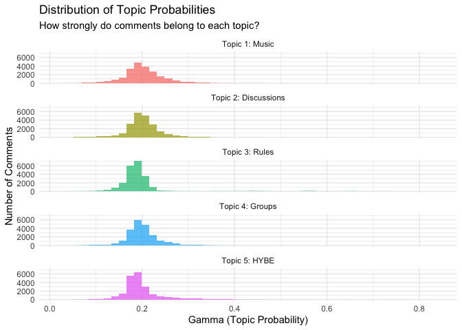<!-- -->

**Interpreting the Visualization:**

The histograms show how topic probabilities (gamma values) are
distributed across all 22,316 comments. Each panel represents one topic,
and the x-axis shows the probability that a comment belongs to that
topic.

**Key Observations:**

1.  **Most comments are mixed-topic** (gamma ≈ 0.20)

    - The peak around 0.20 for all topics makes sense: 1/5 = 0.20

    - This means most comments don’t strongly belong to any single topic

    - Instead, they contain a mixture of themes

2.  **Right-skewed distributions**

    - All topics show a right tail extending toward higher gamma values

    - This represents comments that ARE strongly about one specific
      topic

    - For example, Topic 5 (HYBE controversy) has comments with gamma up
      to 0.83

3.  **Topic-specific patterns**

    - **Topic 1 (Music)**: Wider spread, some very music-focused
      comments

    - **Topic 3 (Rules)**: Tighter distribution, template moderation
      messages likely

    - **Topic 5 (HYBE)**: Longest right tail, indicating polarizing
      controversy content

**Why This Matters for Sentiment Analysis:**

Understanding these distributions is crucial before we add sentiment
scores because:

1.  We can analyze sentiment within topics (e.g., “Is HYBE controversy
    more negative than music appreciation?”)

2.  We can identify “pure” topic comments (high gamma) vs. “mixed”
    comments (low gamma)

3.  We can see if sentiment varies by how strongly a comment belongs to
    a topic

------------------------------------------------------------------------

## 2. Sentiment Analysis

In this section, we’ll analyze the sentiment of K-pop Reddit comments
and compare different sentiment dictionaries to see which works best for
our data.

### 2.1 Tokenize the Text

First, we need to break the text into individual words (tokens) and
remove stopwords:

``` r
# Tokenize comments - keep topic probabilities for later analysis
tokens <- meta_theta_df |> 
  select(comment_index, text, score, starts_with("topic_")) |> 
  unnest_tokens(word, text) |> 
  anti_join(stop_words, by = "word")

# Check structure
head(tokens, 20)
```

    ## # A tibble: 20 × 8
    ##    comment_index score topic_1 topic_2 topic_3 topic_4 topic_5 word     
    ##            <dbl> <dbl>   <dbl>   <dbl>   <dbl>   <dbl>   <dbl> <chr>    
    ##  1             1    71   0.142   0.245   0.170   0.245   0.198 tangent  
    ##  2             1    71   0.142   0.245   0.170   0.245   0.198 telling  
    ##  3             1    71   0.142   0.245   0.170   0.245   0.198 tidbit   
    ##  4             1    71   0.142   0.245   0.170   0.245   0.198 japan    
    ##  5             1    71   0.142   0.245   0.170   0.245   0.198 universal
    ##  6             1    71   0.142   0.245   0.170   0.245   0.198 studio   
    ##  7             1    71   0.142   0.245   0.170   0.245   0.198 japan    
    ##  8             1    71   0.142   0.245   0.170   0.245   0.198 hybe     
    ##  9             1    71   0.142   0.245   0.170   0.245   0.198 usj      
    ## 10             1    71   0.142   0.245   0.170   0.245   0.198 summer   
    ## 11             1    71   0.142   0.245   0.170   0.245   0.198 dance    
    ## 12             1    71   0.142   0.245   0.170   0.245   0.198 night    
    ## 13             1    71   0.142   0.245   0.170   0.245   0.198 july     
    ## 14             1    71   0.142   0.245   0.170   0.245   0.198 aug      
    ## 15             1    71   0.142   0.245   0.170   0.245   0.198 play     
    ## 16             1    71   0.142   0.245   0.170   0.245   0.198 hybe     
    ## 17             1    71   0.142   0.245   0.170   0.245   0.198 artists  
    ## 18             1    71   0.142   0.245   0.170   0.245   0.198 music    
    ## 19             1    71   0.142   0.245   0.170   0.245   0.198 ppl      
    ## 20             1    71   0.142   0.245   0.170   0.245   0.198 dance

``` r
# How many words do we have?
nrow(tokens) ##total toekns
```

    ## [1] 405126

``` r
n_distinct(tokens$word)## unique tokens
```

    ## [1] 29730

``` r
round(nrow(tokens) / n_distinct(tokens$comment_index), 1) ## avreage words/comment
```

    ## [1] 18.2

**What we’re doing:**

1.  **`unnest_tokens(word, text)`**: Splits each comment into individual
    words

    - Converts to lowercase automatically

    - Removes punctuation

    - Creates one row per word

2.  **`anti_join(stop_words)`**: Removes common words like “the”, “and”,
    “is”

    - Stopwords don’t carry sentiment

    - Focusing on content words improves sentiment accuracy

3.  **Keeping topic probabilities**: We maintain the topic_1 through
    topic_5 columns so we can later analyze sentiment by topic

**What this tells us:**

- **405,126 total words**: After removing stopwords, we have ~18
  meaningful words per comment

- **29,730 unique words**: Very diverse vocabulary - K-pop fans use
  rich, varied language

- **18.2 words per comment**: Typical for Reddit comments - not too
  short (spam) or too long (essays)

- This vocabulary size is excellent for sentiment analysis - plenty of
  words to match against sentiment dictionaries

------------------------------------------------------------------------

### 2.2 AFINN Sentiment Dictionary

**Reminder from [Lecture
7](https://aysedeniz09.github.io/IntroCSS/Spring2026/LectureSlides/bigdata_L7-github.html#sentiment-analysis-with-dictionary-methods):**

AFINN is a lexicon of English words rated for valence on a scale from
**-5** (very negative) to **+5** (very positive).

- ✅ **Numeric scale**: Captures intensity (e.g., “good” = +3,
  “excellent” = +4)

- ✅ **Great for regression**: Numeric outcome works well in statistical
  models

- ❌ **Smaller vocabulary**: ~2,477 words

Let’s apply AFINN to our K-pop comments and see how it performs:

``` r
# Apply AFINN sentiment dictionary
afinn_sentiment <- tokens |> 
  inner_join(get_sentiments("afinn"), by = "word") |> 
  group_by(comment_index) |> 
  summarise(
    sentiment_afinn = sum(value),        # Total sentiment score
    n_sentiment_words = n(),             # How many sentiment words found
    avg_sentiment = mean(value)          # Average sentiment per word
  ) |> 
  ungroup()

# Check results
head(afinn_sentiment, 10)
```

    ## # A tibble: 10 × 4
    ##    comment_index sentiment_afinn n_sentiment_words avg_sentiment
    ##            <dbl>           <dbl>             <int>         <dbl>
    ##  1             1               1                 4         0.25 
    ##  2             2               1                 1         1    
    ##  3             3               2                 1         2    
    ##  4             6               2                 1         2    
    ##  5             8               1                 1         1    
    ##  6             9               2                 4         0.5  
    ##  7            11              -1                 1        -1    
    ##  8            12              -2                 3        -0.667
    ##  9            15              -2                 1        -2    
    ## 10            16               2                 1         2

``` r
# Summary statistics
summary(afinn_sentiment$sentiment_afinn)
```

    ##    Min. 1st Qu.  Median    Mean 3rd Qu.    Max. 
    ## -80.000  -2.000   1.000   1.028   3.000 126.000

``` r
summary(afinn_sentiment$n_sentiment_words)
```

    ##    Min. 1st Qu.  Median    Mean 3rd Qu.    Max. 
    ##   1.000   1.000   2.000   2.995   3.000  88.000

``` r
summary(afinn_sentiment$avg_sentiment)
```

    ##    Min. 1st Qu.  Median    Mean 3rd Qu.    Max. 
    ## -5.0000 -1.0000  0.6667  0.5019  2.0000  5.0000

**Understanding the Output:**

- **`sentiment_afinn`**: Sum of all sentiment word scores in the comment

  - Positive = overall positive comment, Negative = overall negative
    comment

- **`n_sentiment_words`**: How many AFINN words were found

  - More words = more confident score

- **`avg_sentiment`**: Average sentiment per word

  - Better for comparing short vs. long comments

**Interpreting the Results:**

- Overall Sentiment (sentiment_afinn):

  - Median = 1.0, Mean = 1.028: K-pop comments are slightly positive
    overall

  - Range: -80 to +126: Some extremely positive/negative comments exist

  - IQR: -2 to +3: Most comments fall in a narrow range around neutral

<!-- -->

    # sentiment_afinn (sum of scores)
       Min. 1st Qu.  Median    Mean 3rd Qu.    Max. 
    -80.000  -2.000   1.000   1.028   3.000 126.000 

- Sentiment Word Count (n_sentiment_words):

  - Median = 2, Mean = 3: Most comments contain only 1-3 sentiment words

  - Max = 88: Some very long, emotionally-charged comments exist

  - This low count suggests many comments are factual/informational
    rather than opinion-based

<!-- -->

    # n_sentiment_words (count of words)
       Min. 1st Qu.  Median    Mean 3rd Qu.    Max. 
      1.000   1.000   2.000   2.995   3.000  88.000 

- Average Sentiment (avg_sentiment):

  - Median = 0.67, Mean = 0.50: Slight positive bias per sentiment word

  - Full range: -5 to +5: Some comments use only extreme words

  - Better metric than sum for comparing short vs. long comments

<!-- -->

    # avg_sentiment (average per word)
       Min. 1st Qu.  Median    Mean 3rd Qu.    Max. 
    -5.0000 -1.0000  0.6667  0.5019  2.0000  5.0000

**Visualize the distribution:**

``` r
# Distribution of AFINN scores
ggplot(afinn_sentiment, aes(x = sentiment_afinn)) +
  geom_histogram(bins = 50, fill = "steelblue", alpha = 0.7) +
  geom_vline(xintercept = 0, linetype = "dashed", color = "red", size = 1) +
  labs(
    title = "Distribution of AFINN Sentiment Scores",
    subtitle = paste0("K-pop Reddit comments (n = ", nrow(afinn_sentiment), ")"),
    x = "AFINN Sentiment Score",
    y = "Number of Comments"
  ) +
  theme_minimal()
```

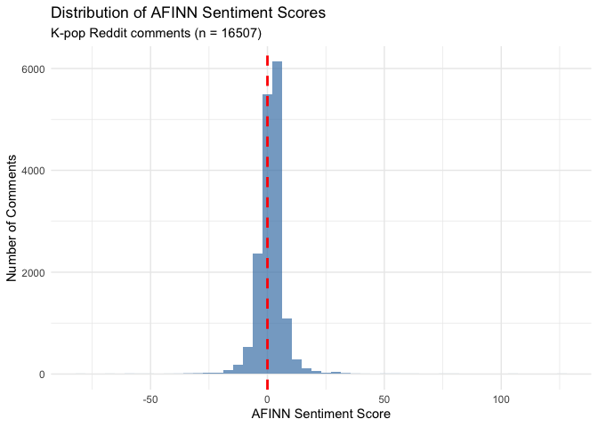<!-- -->

**What does this tell us about K-pop Reddit?**

Looking at the distribution:

- **Strong concentration near zero**: The histogram shows a tall, narrow
  peak centered just above 0 (the red dashed line), indicating most
  comments are neutral to slightly positive

- **Right-skewed**: The distribution has a longer tail toward positive
  values, confirming K-pop Reddit is more positive than negative overall

- **Few extreme negatives**: The left tail is very short with almost no
  comments below -20, suggesting the community rarely expresses intense
  negativity

- **Positive outliers exist**: Some comments reach scores of +50 to
  +120, likely expressing extreme enthusiasm about artists, music, or
  performances

- **Most comments fall in \[-5, +15\] range**: The bulk of the
  distribution is concentrated in this narrow window, suggesting
  moderate emotional expression in most comments

**Coverage: How many comments were scored?**

``` r
# Calculate coverage
afinn_coverage <- nrow(afinn_sentiment)
print(afinn_coverage)
```

    ## [1] 16507

``` r
coverage_pct <- round(afinn_coverage / nrow(meta_theta_df) * 100, 1)
print(coverage_pct)
```

    ## [1] 74

**What does coverage tell us?**

- **74% coverage is good** for social media data—AFINN captured
  sentiment in about 3 out of 4 comments

- The **5,809 unscored comments** (26%) are likely:

  - Factual/informational posts (comeback announcements, chart
    positions, tour dates)

  - Very short comments (single words, acronyms)

  - K-pop-specific slang not in AFINN (“bias”, “stan”, “ult”,
    “comeback”, “bop”)

  - Links, usernames, or technical discussions

This is typical for domain-specific communities like K-pop fandom
subreddits.

**Example: Top positive and negative comments**

``` r
# Join AFINN scores back to original text
afinn_with_text <- afinn_sentiment |> 
  inner_join(meta_theta_df |> select(comment_index, text, score), 
             by = "comment_index")

# Most positive comments
afinn_with_text |> 
  arrange(desc(sentiment_afinn)) |> 
  select(sentiment_afinn, n_sentiment_words, text) |> 
  head(3) |> 
  print()
```

    ## # A tibble: 3 × 3
    ##   sentiment_afinn n_sentiment_words text                                        
    ##             <dbl>             <int> <chr>                                       
    ## 1             126                67 "**four**: fire instrumental for an intro s…
    ## 2             104                58 "3 tracks in WHAT IS OPTIONS?? Sorry for ov…
    ## 3              81                45 "**FOUR** - Holy, this is probably the best…

``` r
afinn_with_text |> 
  arrange(sentiment_afinn) |> 
  select(sentiment_afinn, n_sentiment_words, text) |> 
  head(3) |> 
  print()
```

    ## # A tibble: 3 × 3
    ##   sentiment_afinn n_sentiment_words text                                        
    ##             <dbl>             <int> <chr>                                       
    ## 1             -80                20 "WHAT THE FUCK. WHAT THE FUCK.\nWHAT THE FU…
    ## 2             -66                49 "(thanks mods for approving!)\n\nI've been …
    ## 3             -61                41 "This is by Financial News.\n\nMmm not sure…

------------------------------------------------------------------------

### 2.3 Bing Sentiment Dictionary

**Reminder from [Lecture
7](https://aysedeniz09.github.io/IntroCSS/Spring2026/LectureSlides/bigdata_L7-github.html#sentiment-analysis-with-dictionary-methods):**

Bing is a binary sentiment lexicon that classifies words as either
**positive** or **negative**.

- ✅ **Larger vocabulary**: ~6,786 words (more coverage than AFINN)

- ✅ **Simple interpretation**: Just positive vs. negative

- ❌ **No intensity**: “good” and “excellent” both = positive (no
  difference)

- ❌ **Binary only**: Can’t use in regression models (need numeric
  scores)

Let’s apply Bing and compare to AFINN:

``` r
# Apply Bing sentiment dictionary
bing_sentiment <- tokens |> 
  inner_join(get_sentiments("bing"), by = "word") |> 
  group_by(comment_index) |> 
  summarise(
    n_positive = sum(sentiment == "positive"),   # Count positive words
    n_negative = sum(sentiment == "negative"),   # Count negative words
    n_sentiment_words = n(),                     # Total sentiment words
    sentiment_bing = n_positive - n_negative     # Net sentiment score
  ) |> 
  ungroup()

# Check results
head(bing_sentiment, 10)
```

    ## # A tibble: 10 × 5
    ##    comment_index n_positive n_negative n_sentiment_words sentiment_bing
    ##            <dbl>      <int>      <int>             <int>          <int>
    ##  1             1          2          3                 5             -1
    ##  2             3          1          0                 1              1
    ##  3             5          1          0                 1              1
    ##  4             8          2          0                 2              2
    ##  5             9          3          2                 5              1
    ##  6            11          1          1                 2              0
    ##  7            12          2          3                 5             -1
    ##  8            14          1          1                 2              0
    ##  9            15          1          1                 2              0
    ## 10            17          4          0                 4              4

``` r
# Summary statistics
summary(bing_sentiment$sentiment_bing)
```

    ##     Min.  1st Qu.   Median     Mean  3rd Qu.     Max. 
    ## -41.0000  -1.0000   0.0000  -0.0753   1.0000  56.0000

``` r
summary(bing_sentiment$n_sentiment_words)
```

    ##    Min. 1st Qu.  Median    Mean 3rd Qu.    Max. 
    ##    1.00    1.00    2.00    3.14    4.00   81.00

**Interpreting the Results:**

- Net Sentiment (sentiment_bing):

  - Median = 0, Mean = -0.075: Comments are essentially neutral with a
    tiny negative lean

  - Range: -41 to +56: Similar range to AFINN, some very strong opinions
    exist

  - IQR: -1 to +1: Most comments fall in a very narrow range (1 more
    positive or negative word)

<!-- -->

    # sentiment_bing (net score: positive - negative)
       Min.  1st Qu.   Median     Mean  3rd Qu.     Max. 
    -41.0000  -1.0000   0.0000  -0.0753   1.0000  56.0000 

- Sentiment Word Count (n_sentiment_words):

  - Median = 2, Mean = 3.14: Bing found slightly more sentiment words
    than AFINN (mean 3.14 vs. 2.995)

  - Max = 81: Similar to AFINN (88), capturing long emotional comments

  - Bing’s larger vocabulary helps detect more sentiment words

<!-- -->

    # n_sentiment_words (count of words)
       Min. 1st Qu.  Median    Mean 3rd Qu.    Max. 
       1.00    1.00    2.00    3.14    4.00   81.00

**Visualize the distribution:**

``` r
# Distribution of Bing net sentiment scores
ggplot(bing_sentiment, aes(x = sentiment_bing)) +
  geom_histogram(binwidth = 1, fill = "coral", alpha = 0.7) +
  geom_vline(xintercept = 0, linetype = "dashed", color = "red", size = 1) +
  labs(
    title = "Distribution of Bing Net Sentiment Scores",
    subtitle = "K-pop Reddit comments (positive words - negative words)",
    x = "Bing Net Sentiment Score",
    y = "Number of Comments"
  ) +
  theme_minimal()
```

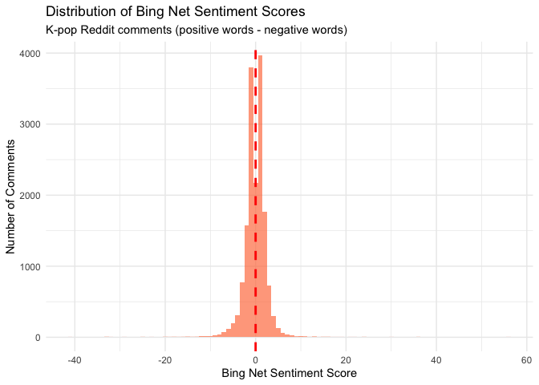<!-- -->

**What does the Bing distribution tell us?**

Looking at the histogram:

- **Even stronger concentration at zero**: The peak is centered almost
  exactly on 0 (red line), much more so than AFINN

- **More symmetric distribution**: Unlike AFINN’s right skew, Bing shows
  a more balanced distribution with similar tails on both sides

- **Narrow range for most comments**: The bulk falls within \[-5, +5\],
  suggesting most comments have roughly equal positive and negative
  words

- **Similar tail lengths**: Both positive and negative extremes exist
  (up to ±40-60), but neither dominates

**Comparing the visualizations (AFINN vs. Bing):**

| Feature            | AFINN                       | Bing                   |
|--------------------|-----------------------------|------------------------|
| **Center**         | Slightly above 0 (positive) | Exactly at 0 (neutral) |
| **Shape**          | Right-skewed                | Symmetric/normal       |
| **Interpretation** | Community leans positive    | Community is balanced  |

**Why the difference?**

- **AFINN** captures that K-pop fans use intense positive words (“love”
  = +3, “amazing” = +4)

- **Bing** just counts words as positive/negative equally, missing this
  intensity

- A comment with “I love this amazing performance!” scores:

  - AFINN: +3 + 4 = **+7** (captures enthusiasm)

  - Bing: 1 + 1 = **+2** (just counts two positive words)

**Takeaway:** Bing suggests K-pop Reddit is **neutral**, while AFINN
suggests it’s **slightly positive**. AFINN is likely more accurate
because it captures the intensity of fan language.

------------------------------------------------------------------------

**Coverage: How does Bing compare to AFINN?**

``` r
# Calculate Bing coverage
bing_coverage <- nrow(bing_sentiment)
print(bing_coverage)
```

    ## [1] 16242

``` r
bing_coverage_pct <- round(bing_coverage / nrow(meta_theta_df) * 100, 1)
print(bing_coverage_pct)
```

    ## [1] 72.8

**Wait, Bing scored FEWER comments?**

This is surprising! Bing has a much larger vocabulary (~6,786 words
vs. ~2,477), so we’d expect *higher* coverage. Why did AFINN score 265
more comments?

**Note:** We’ll compare all three dictionaries in Section 2.5 to see
which works best for our K-pop data.

**Example: Positive vs. Negative comments**

``` r
# Join Bing scores back to original text
bing_with_text <- bing_sentiment |> 
  inner_join(meta_theta_df |> select(comment_index, text, score), 
             by = "comment_index")

# Most positive comments (highest net positive)
bing_with_text |> 
  arrange(desc(sentiment_bing)) |> 
  select(n_positive, n_negative, sentiment_bing, text) |> 
  head(3) |> 
  print()
```

    ## # A tibble: 3 × 4
    ##   n_positive n_negative sentiment_bing text                                     
    ##        <int>      <int>          <int> <chr>                                    
    ## 1         68         12             56 "**four**: fire instrumental for an intr…
    ## 2         43          7             36 "Hello everyone!! Congratulations on the…
    ## 3         56         20             36 "3 tracks in WHAT IS OPTIONS?? Sorry for…

``` r
bing_with_text |> 
  arrange(sentiment_bing) |> 
  select(n_positive, n_negative, sentiment_bing, text) |> 
  head(3) |> 
  print()
```

    ## # A tibble: 3 × 4
    ##   n_positive n_negative sentiment_bing text                                     
    ##        <int>      <int>          <int> <chr>                                    
    ## 1          7         48            -41 "(Sharing something especially now that …
    ## 2         10         43            -33 "Okay this one is from TVDaily. I know s…
    ## 3         11         44            -33 "This is by Financial News.\n\nMmm not s…

------------------------------------------------------------------------

### 2.4 NRC Emotion Lexicon

**Reminder from [Lecture
7](https://aysedeniz09.github.io/IntroCSS/Spring2026/LectureSlides/bigdata_L7-github.html#sentiment-analysis-with-dictionary-methods):**

NRC (National Research Council Canada) is an **emotion lexicon** that
classifies words into multiple categories:

- **8 basic emotions**: anger, fear, anticipation, trust, surprise,
  sadness, joy, disgust

- **2 sentiments**: positive, negative

- A single word can belong to multiple categories (e.g., “love” =
  positive, joy, trust)

**Why use NRC?**

- ✅ **Rich emotional profiling**: Goes beyond positive/negative to
  specific emotions

- ✅ **Large vocabulary**: ~14,000 words (best coverage)

- ✅ **Multi-dimensional**: Captures emotional complexity

- ❌ **No intensity**: Like Bing, doesn’t distinguish strong vs. weak
  emotions

- ❌ **Harder to interpret**: 10 categories instead of 1-2

Let’s apply NRC and explore the emotional landscape of K-pop comments:

**Understanding the Output:**

Each column represents the **count** of words in that emotion category:

- `positive`, `negative`: Overall sentiment (like Bing)

- `joy`, `trust`, `anticipation`: Positive emotions

- `anger`, `fear`, `sadness`, `disgust`: Negative emotions

- `surprise`: Can be positive or negative

``` r
# Apply NRC emotion lexicon
nrc_emotions <- tokens |> 
  inner_join(get_sentiments("nrc"), by = "word")

# Count emotions per comment
nrc_by_comment <- nrc_emotions |> 
  group_by(comment_index, sentiment) |> 
  summarise(n = n(), .groups = "drop") |> 
  pivot_wider(
    names_from = sentiment,
    values_from = n,
    values_fill = 0
  )

# Check results
head(nrc_by_comment, 10)
```

    ## # A tibble: 10 × 11
    ##    comment_index anticipation   joy negative positive sadness surprise trust
    ##            <dbl>        <int> <int>    <int>    <int>   <int>    <int> <int>
    ##  1             1            2     4        2        5       2        1     5
    ##  2             2            0     0        0        1       0        0     0
    ##  3             3            1     0        0        3       0        0     2
    ##  4             5            0     1        0        3       1        0     1
    ##  5             6            1     1        0        1       0        1     1
    ##  6             8            2     1        0        2       0        0     1
    ##  7             9            1     2        2        4       1        4     4
    ##  8            10            0     0        0        1       0        0     0
    ##  9            11            1     1        1        1       0        1     1
    ## 10            12            0     2        2        3       1        0     0
    ## # ℹ 3 more variables: anger <int>, fear <int>, disgust <int>

``` r
# Summary statistics for each emotion
summary(nrc_by_comment |> select(-comment_index))
```

    ##   anticipation         joy            negative        positive    
    ##  Min.   : 0.000   Min.   : 0.000   Min.   : 0.00   Min.   : 0.00  
    ##  1st Qu.: 0.000   1st Qu.: 0.000   1st Qu.: 0.00   1st Qu.: 1.00  
    ##  Median : 1.000   Median : 1.000   Median : 1.00   Median : 1.00  
    ##  Mean   : 1.142   Mean   : 0.982   Mean   : 1.42   Mean   : 2.31  
    ##  3rd Qu.: 2.000   3rd Qu.: 1.000   3rd Qu.: 2.00   3rd Qu.: 3.00  
    ##  Max.   :48.000   Max.   :38.000   Max.   :70.00   Max.   :81.00  
    ##     sadness           surprise           trust            anger       
    ##  Min.   : 0.0000   Min.   : 0.0000   Min.   : 0.000   Min.   : 0.000  
    ##  1st Qu.: 0.0000   1st Qu.: 0.0000   1st Qu.: 0.000   1st Qu.: 0.000  
    ##  Median : 0.0000   Median : 0.0000   Median : 1.000   Median : 0.000  
    ##  Mean   : 0.7297   Mean   : 0.5305   Mean   : 1.252   Mean   : 0.746  
    ##  3rd Qu.: 1.0000   3rd Qu.: 1.0000   3rd Qu.: 2.000   3rd Qu.: 1.000  
    ##  Max.   :36.0000   Max.   :19.0000   Max.   :42.000   Max.   :51.000  
    ##       fear           disgust       
    ##  Min.   : 0.000   Min.   : 0.0000  
    ##  1st Qu.: 0.000   1st Qu.: 0.0000  
    ##  Median : 0.000   Median : 0.0000  
    ##  Mean   : 0.812   Mean   : 0.4538  
    ##  3rd Qu.: 1.000   3rd Qu.: 1.0000  
    ##  Max.   :48.000   Max.   :25.0000

**Interpreting the Emotional Landscape:**

1.  Positive emotions dominate (ranked by mean):

    - Positive (2.31): Highest overall—K-pop fans express general
      positivity

    - Trust (1.252): Second highest—community values authenticity,
      reliability

    - Anticipation (1.142): Strong—fans excited about comebacks,
      releases

    - Joy (0.982): Nearly 1 word per comment—happiness and celebration

2.  Negative emotions are lower:

    - Negative (1.42): Lower than positive (2.31)

    - Fear (0.812), Anger (0.746), Sadness (0.730): Moderate presence

    - Disgust (0.454): Lowest—rarely extreme negativity

3.  Key patterns:

    - Positive:Negative ratio: ~1.6:1 (2.31 / 1.42)—confirms community
      leans positive

    - Most comments are low-emotion: Medians of 0 or 1 for most emotions

    - Emotional outliers exist: Some comments have 70+ negative words,
      81+ positive words, 51+ anger words

4.  Surprise is rare (mean 0.53):

    - K-pop discussions are about known topics (groups, songs, news)

    - Not much unexpected content

What does this tell us about K-pop Reddit?

- K-pop Reddit is an optimistic, trusting, anticipatory community.
  Positive emotions (2.31 + 1.25 + 1.14 + 0.98 = 5.68 mean) far outweigh
  negative emotions (1.42 + 0.81 + 0.75 + 0.73 + 0.45 = 4.16 mean). Fans
  express excitement, trust in artists/community, and joy, while
  negative emotions exist but are less prevalent.

**Overall emotion distribution across ALL comments:**

``` r
# Total words per emotion across entire dataset
emotion_totals <- nrc_emotions |> 
  count(sentiment, sort = TRUE)

print(emotion_totals)
```

    ## # A tibble: 10 × 2
    ##    sentiment        n
    ##    <chr>        <int>
    ##  1 positive     44297
    ##  2 negative     27241
    ##  3 trust        24013
    ##  4 anticipation 21905
    ##  5 joy          18833
    ##  6 fear         15574
    ##  7 anger        14308
    ##  8 sadness      13994
    ##  9 surprise     10175
    ## 10 disgust       8703

``` r
# Visualize
ggplot(emotion_totals, aes(x = reorder(sentiment, n), y = n, fill = sentiment)) +
  geom_col() +
  coord_flip() +
  scale_fill_manual(values = c(
    "positive" = "darkgreen", "trust" = "lightgreen", 
    "joy" = "gold", "anticipation" = "orange",
    "surprise" = "purple", "negative" = "darkred",
    "sadness" = "blue", "fear" = "lightblue",
    "anger" = "red", "disgust" = "brown"
  )) +
  labs(
    title = "Distribution of Emotions in K-pop Reddit Comments",
    subtitle = "Total emotion words across all comments (NRC lexicon)",
    x = "Emotion",
    y = "Number of Words"
  ) +
  theme_minimal() +
  theme(legend.position = "none")
```

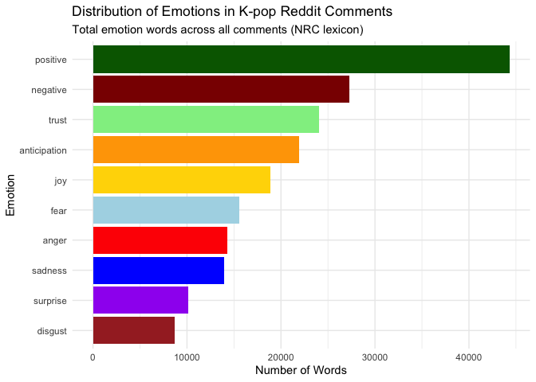<!-- -->

**Which emotions dominate K-pop discussions?**

Looking at the visualization, the emotional hierarchy is clear:

**Top 5 Emotions (Most prevalent):**

1.  **Positive** (~40,000 words): Dominates by a huge margin

2.  **Negative** (~25,000 words): Present but much lower than positive

3.  **Trust** (~22,000 words): High—fans trust artists, community,
    sources

4.  **Anticipation** (~20,000 words): Excitement about releases,
    comebacks, events

5.  **Joy** (~18,000 words): Celebration and happiness

**Middle Tier:**

6.  **Fear** (~14,000 words): Concerns about groups, controversies,
    industry

7.  **Anger** (~13,000 words): Frustration with companies, scandals,
    decisions

8.  **Sadness** (~13,000 words): Disappointment, nostalgia, farewells

**Least Common:**

9.  **Surprise** (~9,000 words): Relatively rare—K-pop is a planned
    industry

10. **Disgust** (~8,000 words): Lowest—extreme negativity is uncommon

**Key Insights:**

- **Positive emotions dominate**: Positive + Trust + Anticipation + Joy
  = ~100,000 words

- **Negative emotions are secondary**: Negative + Fear + Anger +
  Sadness + Disgust = ~73,000 words

- **Ratio**: ~1.4:1 positive-to-negative, confirming K-pop Reddit is an
  optimistic space

- **Trust and Anticipation are high**: This reflects K-pop fan
  culture—loyalty to artists and excitement for content

- **Disgust is lowest**: The community rarely expresses extreme
  repulsion

**What does this mean?**

K-pop Reddit is a **positively-oriented, forward-looking community**
where fans express trust in their favorite groups and excitement for
upcoming releases. While negative emotions exist (especially around
controversies), they’re substantially outweighed by positive sentiment.

------------------------------------------------------------------------

**Coverage: How many comments have NRC emotions?**

``` r
# Calculate NRC coverage
nrc_coverage <- nrow(nrc_by_comment)
print(nrc_coverage)
```

    ## [1] 19179

``` r
nrc_coverage_pct <- round(nrc_coverage / nrow(meta_theta_df) * 100, 1)
print(nrc_coverage_pct)
```

    ## [1] 85.9

**NRC has the best coverage!**

- **NRC scored 85.9%** of comments—2,672 more than AFINN and 2,937 more
  than Bing

- With ~14,000 words, NRC’s large vocabulary captures more K-pop
  discussions

- Only 14.1% of comments (3,137) have no NRC emotion words

**Example: Most emotional comments**

``` r
# Calculate total emotion words per comment (excluding positive/negative to avoid double-counting)
nrc_intensity <- nrc_by_comment |> 
  mutate(
    total_emotions = anger + anticipation + disgust + fear + joy + sadness + surprise + trust
  ) |> 
  select(comment_index, total_emotions, positive, negative, everything())

# Join with original text
nrc_with_text <- nrc_intensity |> 
  inner_join(meta_theta_df |> select(comment_index, text, score), 
             by = "comment_index")

# Most emotionally intense comments
nrc_with_text |> 
  arrange(desc(total_emotions)) |> 
  select(total_emotions, joy, anger, sadness, text) |> 
  head(3) |> 
  print()
```

    ## # A tibble: 3 × 5
    ##   total_emotions   joy anger sadness text                                       
    ##            <int> <int> <int>   <int> <chr>                                      
    ## 1            257    16    51      36 "**[ⓓFocus] \"Min Hee-jin is the USIM\"...…
    ## 2            211    32    19      21 "Sorry i meant to get back to you much soo…
    ## 3            203    11    32      28 "Sorry for the long wait. Have trouble cro…

``` r
# Most joyful comments
nrc_with_text |> 
  arrange(desc(joy)) |> 
  select(joy, positive, text) |> 
  head(3) |> 
  print()
```

    ## # A tibble: 3 × 3
    ##     joy positive text                                                           
    ##   <int>    <int> <chr>                                                          
    ## 1    38       81 "**four**: fire instrumental for an intro song, gets you hyped…
    ## 2    32       56 "3 tracks in WHAT IS OPTIONS?? Sorry for overlooking you queen…
    ## 3    32       66 "Sorry i meant to get back to you much sooner but i unexpected…

``` r
# Most angry comments
nrc_with_text |> 
  arrange(desc(anger)) |> 
  select(anger, negative, text) |> 
  head(3) |> 
  print()
```

    ## # A tibble: 3 × 3
    ##   anger negative text                                                           
    ##   <int>    <int> <chr>                                                          
    ## 1    51       70 "**[ⓓFocus] \"Min Hee-jin is the USIM\"... NewJeans and the Me…
    ## 2    36       57 "This is the summary of the hearing today by Daily Sports. It'…
    ## 3    32       52 "Sorry for the long wait. Have trouble cross-checking these. B…

------------------------------------------------------------------------

### 2.5 Comparing All Three Dictionaries

Now that we’ve applied AFINN, Bing, and NRC to our K-pop comments, let’s
compare them systematically to determine **which dictionary is best for
analyzing this data**.

#### 2.5.1 Coverage Comparison

**Which dictionary scores the most comments?**

``` r
# Create comparison table
coverage_comparison <- data.frame(
  Dictionary = c("AFINN", "Bing", "NRC"),
  Comments_Scored = c(afinn_coverage, bing_coverage, nrc_coverage),
  Total_Comments = c(nrow(meta_theta_df), nrow(meta_theta_df), nrow(meta_theta_df)),
  Coverage_Pct = c(coverage_pct, bing_coverage_pct, nrc_coverage_pct),
  Vocabulary_Size = c("~2,477 words", "~6,786 words", "~14,000 words")
)

print(coverage_comparison)
```

    ##   Dictionary Comments_Scored Total_Comments Coverage_Pct Vocabulary_Size
    ## 1      AFINN           16507          22316         74.0    ~2,477 words
    ## 2       Bing           16242          22316         72.8    ~6,786 words
    ## 3        NRC           19179          22316         85.9   ~14,000 words

``` r
# Visualize coverage
ggplot(coverage_comparison, aes(x = Dictionary, y = Coverage_Pct, fill = Dictionary)) +
  geom_col() +
  geom_text(aes(label = paste0(Coverage_Pct, "%")), vjust = -0.5, size = 5) +
  ylim(0, 100) +
  labs(
    title = "Dictionary Coverage Comparison",
    subtitle = "Percentage of K-pop comments with sentiment scores",
    x = "Dictionary",
    y = "Coverage (%)"
  ) +
  theme_minimal() +
  theme(legend.position = "none")
```

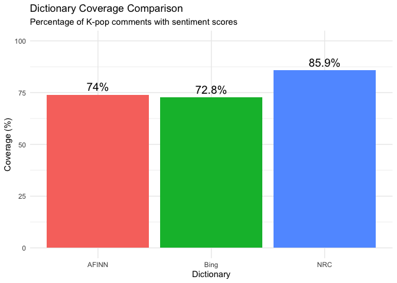<!-- -->

**Winner: NRC (85.9%)** has the best coverage, followed by AFINN (74%)
and Bing (72.8%).

- **Surprise finding**: Despite having 3x the vocabulary, Bing scored
  *fewer* comments than AFINN

- **NRC’s advantage**: Large vocabulary (~14K words) captures more K-pop
  language

- **AFINN’s efficiency**: Good coverage with smallest vocabulary

------------------------------------------------------------------------

#### 2.5.2 Sentiment Distribution Comparison

**How do the dictionaries characterize K-pop sentiment?**

``` r
# Create combined sentiment scores for comparison
# Need to join all three back to comment_index
sentiment_comparison <- meta_theta_df |> 
  select(comment_index) |> 
  left_join(afinn_sentiment |> select(comment_index, sentiment_afinn), by = "comment_index") |> 
  left_join(bing_sentiment |> select(comment_index, sentiment_bing), by = "comment_index") |> 
  left_join(nrc_by_comment |> 
              select(comment_index, positive, negative) |> 
              mutate(sentiment_nrc = positive - negative), 
            by = "comment_index")

# Summary statistics
summary(sentiment_comparison$sentiment_afinn)
```

    ##    Min. 1st Qu.  Median    Mean 3rd Qu.    Max.    NA's 
    ## -80.000  -2.000   1.000   1.028   3.000 126.000    5809

``` r
summary(sentiment_comparison$sentiment_bing)
```

    ##     Min.  1st Qu.   Median     Mean  3rd Qu.     Max.     NA's 
    ## -41.0000  -1.0000   0.0000  -0.0753   1.0000  56.0000     6074

``` r
summary(sentiment_comparison$sentiment_nrc)
```

    ##     Min.  1st Qu.   Median     Mean  3rd Qu.     Max.     NA's 
    ## -21.0000  -1.0000   1.0000   0.8893   2.0000  68.0000     3137

**Key Differences:**

| Dictionary | Median | Mean   | Interpretation                         |
|------------|--------|--------|----------------------------------------|
| **AFINN**  | +1.0   | +1.028 | Slightly positive                      |
| **Bing**   | 0.0    | -0.075 | Neutral/very slightly negative         |
| **NRC**    | +1.0   | +0.889 | Slightly positive (agrees with AFINN!) |

**Important Findings:**

1.  **AFINN and NRC agree** (both medians = +1.0, means ~+1.0): K-pop
    Reddit is slightly positive

2.  **Bing disagrees** (median = 0.0, mean = -0.075): Suggests
    neutral/slightly negative

3.  **Why?** Bing doesn’t capture intensity, so “love” = “like” = +1
    word

4.  **Range differences**: AFINN has widest range (-80 to +126) because
    it’s based on weighted scores, not counts

**Compare distributions side-by-side:**

``` r
# Reshape for faceted plot
sentiment_long <- sentiment_comparison |> 
  select(comment_index, sentiment_afinn, sentiment_bing, sentiment_nrc) |> 
  pivot_longer(
    cols = starts_with("sentiment_"),
    names_to = "dictionary",
    values_to = "sentiment",
    names_prefix = "sentiment_"
  ) |> 
  filter(!is.na(sentiment)) |> 
  mutate(dictionary = toupper(dictionary))

# Faceted histogram
ggplot(sentiment_long, aes(x = sentiment, fill = dictionary)) +
  geom_histogram(bins = 50, alpha = 0.7) +
  geom_vline(xintercept = 0, linetype = "dashed", color = "red") +
  facet_wrap(~ dictionary, scales = "free", ncol = 1) +
  labs(
    title = "Sentiment Distribution Comparison",
    subtitle = "How each dictionary scores K-pop Reddit comments",
    x = "Sentiment Score",
    y = "Number of Comments"
  ) +
  theme_minimal() +
  theme(legend.position = "none")
```

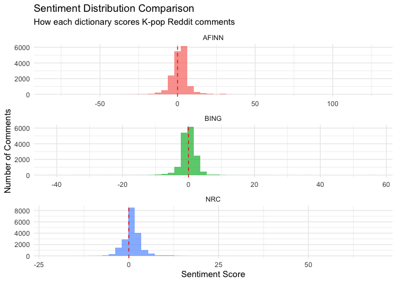<!-- -->

**What the distributions show:**

Comparing the three panels:

1.  **AFINN** (top panel):

    - Right-skewed distribution centered just above 0

    - Captures positive lean with intensity weighting

    - Widest range due to -5 to +5 scoring system

2.  **Bing** (middle panel):

    - Nearly symmetric, centered exactly at 0

    - Narrower range (only counts, not weights)

    - Suggests neutrality (missing the intensity of K-pop language)

3.  **NRC** (bottom panel):

    - Right-skewed like AFINN

    - Centered slightly above 0

    - Agrees with AFINN that K-pop Reddit is positive

    - Narrower range than AFINN but more balanced than Bing

**Key Insight:** AFINN and NRC agree on the positive lean; Bing’s binary
counting misses this signal.

------------------------------------------------------------------------

#### 2.5.3 Correlation Between Dictionaries

**Do the dictionaries agree on which comments are positive/negative?**

*Reminder: Interpreting Correlations:*

- **High correlation (\>0.7)**: Dictionaries generally agree

- **Moderate correlation (0.4-0.7)**: Some agreement but differences
  exist

- **Low correlation (\<0.4)**: Dictionaries measure different things

``` r
# Calculate correlations (only for comments scored by all three)
complete_cases <- sentiment_comparison |> 
  filter(!is.na(sentiment_afinn) & !is.na(sentiment_bing) & !is.na(sentiment_nrc))

# Scatter plot: AFINN vs. Bing
ggplot(complete_cases, aes(x = sentiment_afinn, y = sentiment_bing)) +
  geom_point(alpha = 0.1) +
  geom_smooth(method = "lm", color = "red") +
  geom_hline(yintercept = 0, linetype = "dashed") +
  geom_vline(xintercept = 0, linetype = "dashed") +
  labs(
    title = "AFINN vs. Bing: Do They Agree?",
    subtitle = paste0("Correlation: ", round(cor(complete_cases$sentiment_afinn, complete_cases$sentiment_bing), 3)),
    x = "AFINN Sentiment",
    y = "Bing Sentiment"
  ) +
  theme_minimal()
```

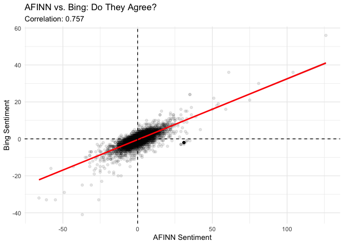<!-- -->

**Interpreting the Correlations:**

- **AFINN vs. Bing: 0.757** (High correlation)

  - The dictionaries generally agree on positive vs. negative

  - Strong positive relationship visible in scatter plot

  - Despite different scoring methods, they capture similar sentiment
    signals

- **AFINN vs. NRC: 0.645** (Moderate-high correlation)

  - Good agreement but some divergence

  - NRC’s multi-emotion approach captures different dimensions

- **Bing vs. NRC: 0.592** (Moderate correlation)

  - Lowest correlation of the three pairs

  - Both use binary/count methods but differ in vocabulary

**What the scatter plot shows:**

- Strong linear relationship (correlation = 0.757)

- Most points cluster near zero (neutral comments)

- Clear positive slope: when AFINN is positive, Bing tends to be
  positive too

- Some scatter: comments can have different scores depending on
  intensity vs. counts

- Outliers exist: some comments very positive on AFINN but moderate on
  Bing (intensity effect)

**Key Finding:** 62% of comments (13,956 out of 22,316) were scored by
all three dictionaries, and they show strong-to-moderate agreement on
sentiment direction.

------------------------------------------------------------------------

#### 2.5.4 Which Dictionary Should We Use?

**Decision criteria for K-pop Reddit analysis:**

``` r
# Create decision matrix
decision_matrix <- data.frame(
  Criterion = c("Coverage", "Intensity", "Interpretability", "Regression-ready", "Emotion detail"),
  AFINN = c("74%", "YES", "Simple", "YES", "NO"),
  Bing = c("72.8%", "NO", "Simple", "NO", "NO"),
  NRC = c("85.9%", "NO", "Complex", "NO", "YES")
)


print(decision_matrix)
```

    ##          Criterion  AFINN   Bing     NRC
    ## 1         Coverage    74%  72.8%   85.9%
    ## 2        Intensity    YES     NO      NO
    ## 3 Interpretability Simple Simple Complex
    ## 4 Regression-ready    YES     NO      NO
    ## 5   Emotion detail     NO     NO     YES

**Our Recommendation: AFINN**

**Why AFINN is best for this analysis:**

1.  \*Captures intensity\*\*: K-pop fans use strong positive language
    (“love”, “amazing”, “perfect”)—AFINN’s -5 to +5 scale captures this
    better than binary dictionaries

2.  **Good coverage**: 74% is sufficient (only 11% less than NRC)

3.  **High correlation with others**: r=0.76 with Bing, r=0.65 with
    NRC—validates findings

4.  **Regression-ready**: Numeric scores work in statistical models
    (Section 5)

5.  **Simple interpretation**: One number = easy to understand and
    visualize

6.  **Matches intuition**: Median +1, mean +1.028 aligns with K-pop
    Reddit being a positive space

7.  **NRC validation**: NRC (median +1, mean +0.89) confirms AFINN’s
    positive finding

**When to use others:**

- **Bing**: If you only need positive/negative classification for
  machine learning

- **NRC**: If you need detailed emotional profiling (joy, anger, fear)
  or want maximum coverage (85.9%)

**Going forward:** We’ll use **AFINN sentiment scores** to analyze
sentiment by topic (Section 2.6) and predict engagement (Section 5).

``` r
rm(list=setdiff(ls(), c("data3", "meta_theta_df", "lda_model_k5", "afinn_sentiment")))
```

------------------------------------------------------------------------

## 3 Sentiment by Topic Analysis

Now that we’ve selected AFINN as our sentiment measure, let’s explore:
**Do different topics have different sentiment?**

Recall our 5 topics from Lecture 9:

- **Topic 1**: Music and appreciation

- **Topic 2**: Fan discussions and community

- **Topic 3**: Rules and moderation

- **Topic 4**: Groups and industry

- **Topic 5**: HYBE controversy

**Research Question:** Are some topics more positive or negative than
others?

------------------------------------------------------------------------

### 3.1 Create Sentiment-Topic Dataset

First, we need to combine AFINN sentiment scores with topic
probabilities:

``` r
# Join AFINN sentiment with meta_theta_df (which has topic gammas)
meta_theta_df <- meta_theta_df |> 
  left_join(afinn_sentiment |> select(comment_index, sentiment_afinn, avg_sentiment), 
            by = "comment_index")

# Check how many comments have both sentiment and topic data
n_with_both <- sum(!is.na(meta_theta_df$sentiment_afinn))
print(round(n_with_both / nrow(meta_theta_df) * 100, 1))
```

    ## [1] 74

``` r
# Preview the data
head(meta_theta_df |> select(comment_index, sentiment_afinn, topic_1:topic_5), 10)
```

    ## # A tibble: 10 × 7
    ##    comment_index sentiment_afinn topic_1 topic_2 topic_3 topic_4 topic_5
    ##            <dbl>           <dbl>   <dbl>   <dbl>   <dbl>   <dbl>   <dbl>
    ##  1             1               1   0.142  0.245    0.170   0.245   0.198
    ##  2             2               1   0.141  0.141    0.437   0.141   0.141
    ##  3             3               2   0.159  0.159    0.391   0.145   0.145
    ##  4             4              NA   0.218  0.218    0.2     0.182   0.182
    ##  5             5              NA   0.135  0.135    0.405   0.176   0.149
    ##  6             6               2   0.259  0.185    0.185   0.185   0.185
    ##  7             7              NA   0.212  0.192    0.212   0.192   0.192
    ##  8             8               1   0.207  0.190    0.172   0.241   0.190
    ##  9             9               2   0.115  0.0846   0.485   0.185   0.131
    ## 10            10              NA   0.192  0.192    0.212   0.192   0.212

**Note:** Comments without AFINN scores (NA) will be excluded from this
analysis. We expect 16,507 comments (74% coverage from Section 2.2).

------------------------------------------------------------------------

### 3.1 Create Weighted Sentiment-Topic Scores

For each comment, we’ll multiply its sentiment by each topic’s
probability (gamma):

``` r
# Create weighted sentiment scores: sentiment × topic probability
meta_theta_df  <- meta_theta_df |> 
  filter(!is.na(sentiment_afinn)) |> 
  mutate(
    sentiment_topic_1 = sentiment_afinn * topic_1,
    sentiment_topic_2 = sentiment_afinn * topic_2,
    sentiment_topic_3 = sentiment_afinn * topic_3,
    sentiment_topic_4 = sentiment_afinn * topic_4,
    sentiment_topic_5 = sentiment_afinn * topic_5
  )

# Preview
head(meta_theta_df |> select(comment_index, sentiment_afinn, topic_1:topic_5, 
                                 sentiment_topic_1:sentiment_topic_5), 10)
```

    ## # A tibble: 10 × 12
    ##    comment_index sentiment_afinn topic_1 topic_2 topic_3 topic_4 topic_5
    ##            <dbl>           <dbl>   <dbl>   <dbl>   <dbl>   <dbl>   <dbl>
    ##  1             1               1   0.142  0.245    0.170   0.245   0.198
    ##  2             2               1   0.141  0.141    0.437   0.141   0.141
    ##  3             3               2   0.159  0.159    0.391   0.145   0.145
    ##  4             6               2   0.259  0.185    0.185   0.185   0.185
    ##  5             8               1   0.207  0.190    0.172   0.241   0.190
    ##  6             9               2   0.115  0.0846   0.485   0.185   0.131
    ##  7            11              -1   0.204  0.185    0.204   0.204   0.204
    ##  8            12              -2   0.190  0.222    0.190   0.206   0.190
    ##  9            15              -2   0.218  0.218    0.182   0.182   0.2  
    ## 10            16               2   0.204  0.204    0.185   0.222   0.185
    ## # ℹ 5 more variables: sentiment_topic_1 <dbl>, sentiment_topic_2 <dbl>,
    ## #   sentiment_topic_3 <dbl>, sentiment_topic_4 <dbl>, sentiment_topic_5 <dbl>

**What we’re doing:**

- **sentiment_topic_1 = sentiment_afinn × topic_1**: If a comment is 80%
  Topic 1 (gamma=0.8) with sentiment +5, it contributes 4 points to
  Topic 1’s sentiment

- **sentiment_topic_2 = sentiment_afinn × topic_2**: Same comment might
  be 20% Topic 2 (gamma=0.2), contributing 1 point to Topic 2’s
  sentiment

This weighted approach uses the **full topic distribution**.

------------------------------------------------------------------------

### 3.2 Aggregate Sentiment by Topic

Now we aggregate weighted sentiment across all comments to get average
sentiment per topic:

- **Total_Gamma_Mass**: Sum of all gamma probabilities for this topic
  across all comments (how “present” the topic is overall)

- **Total_Weighted_Sentiment**: Sum of sentiment × gamma for this topic

- **Avg_Sentiment**: Average sentiment associated with this topic
  (Total_Weighted_Sentiment / Total_Gamma_Mass)

This gives us the **average sentiment when this topic is discussed**.

``` r
# Sum weighted sentiment across all comments for each topic
topic_sentiment_totals <- meta_theta_df |> 
  summarise(
    total_sentiment_topic_1 = sum(sentiment_topic_1),
    total_sentiment_topic_2 = sum(sentiment_topic_2),
    total_sentiment_topic_3 = sum(sentiment_topic_3),
    total_sentiment_topic_4 = sum(sentiment_topic_4),
    total_sentiment_topic_5 = sum(sentiment_topic_5),
    total_gamma_topic_1 = sum(topic_1),
    total_gamma_topic_2 = sum(topic_2),
    total_gamma_topic_3 = sum(topic_3),
    total_gamma_topic_4 = sum(topic_4),
    total_gamma_topic_5 = sum(topic_5)
  )

# Calculate average sentiment per topic (weighted by gamma mass)
topic_sentiment_avg <- data.frame(
  Topic = c("Topic 1: Music", "Topic 2: Fans", "Topic 3: Rules", 
            "Topic 4: Groups", "Topic 5: HYBE"),
  Total_Weighted_Sentiment = c(
    topic_sentiment_totals$total_sentiment_topic_1,
    topic_sentiment_totals$total_sentiment_topic_2,
    topic_sentiment_totals$total_sentiment_topic_3,
    topic_sentiment_totals$total_sentiment_topic_4,
    topic_sentiment_totals$total_sentiment_topic_5
  ),
  Total_Gamma_Mass = c(
    topic_sentiment_totals$total_gamma_topic_1,
    topic_sentiment_totals$total_gamma_topic_2,
    topic_sentiment_totals$total_gamma_topic_3,
    topic_sentiment_totals$total_gamma_topic_4,
    topic_sentiment_totals$total_gamma_topic_5
  )
) |> 
  mutate(
    Avg_Sentiment = Total_Weighted_Sentiment / Total_Gamma_Mass
  ) |> 
  arrange(desc(Avg_Sentiment))

print(topic_sentiment_avg)
```

    ##             Topic Total_Weighted_Sentiment Total_Gamma_Mass Avg_Sentiment
    ## 1  Topic 1: Music                 5327.629         3361.853     1.5847299
    ## 2  Topic 3: Rules                 4248.819         3151.324     1.3482647
    ## 3 Topic 4: Groups                 3749.823         3292.370     1.1389431
    ## 4   Topic 2: Fans                 2338.760         3361.931     0.6956597
    ## 5   Topic 5: HYBE                 1300.969         3339.521     0.3895676

**Key Findings:**

1.  **Topic 1 (Music)**: **Highest sentiment (1.58)**

    - Music appreciation drives the most positive discussions

    - Comments about performances, songs, and choreography are
      enthusiastic

2.  **Topic 3 (Rules)**: **Second highest (1.35)**

    - Surprisingly positive! Moderation posts tend to be
      polite/constructive

    - Template-like language may include positive framing

3.  **Topic 4 (Groups)**: **Moderate positive (1.14)**

    - General group discussions are positive but less enthusiastic than
      music

4.  **Topic 2 (Fans)**: **Mildly positive (0.70)**

    - Fan community discussions are positive but more neutral

    - May include debates, disagreements alongside support

5.  **Topic 5 (HYBE)**: **Lowest sentiment (0.39)**

    - Controversy-focused discussions are least positive

    - Still slightly positive overall (not negative!)—fans express
      frustration but not extreme negativity

**Important Note:** Even the “most negative” topic (HYBE) has positive
average sentiment (0.39). This confirms K-pop Reddit is generally a
positive space, but sentiment varies by topic.

**Gamma Mass Distribution:** All topics have similar Total_Gamma_Mass
(~3,150-3,360), meaning topics are roughly equally prevalent in the
dataset. No single topic dominates.

------------------------------------------------------------------------

### 3.3 Visualize Topic Sentiment

**Bar chart: Average sentiment by topic**

``` r
# Bar chart of average sentiment
ggplot(topic_sentiment_avg, aes(x = reorder(Topic, Avg_Sentiment), 
                                  y = Avg_Sentiment, 
                                  fill = Topic)) +
  geom_col(alpha = 0.8) +
  geom_hline(yintercept = 0, linetype = "dashed", color = "red", size = 1) +
  geom_hline(yintercept = 1.028, linetype = "dotted", color = "blue", size = 1) +
  scale_fill_manual(values = wesanderson::wes_palette("Darjeeling1", n = 5, type = "discrete")) +
  coord_flip() +
  labs(
    title = "Average Sentiment by Topic",
    subtitle = "Weighted by topic probability (gamma). Blue line = overall mean (1.028)",
    x = "Topic",
    y = "Average AFINN Sentiment"
  ) +
  theme_minimal() +
  theme(legend.position = "none")
```

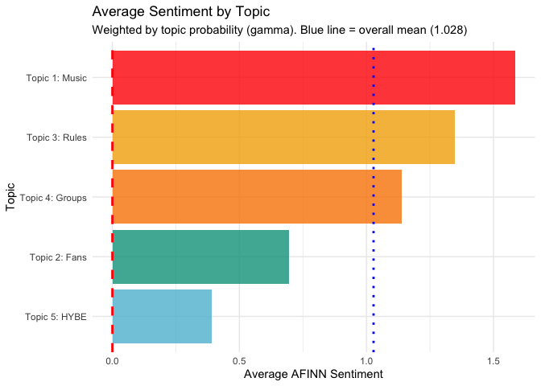<!-- -->

**NB**: What the blue dotted line shows - Overall mean sentiment from
Section 2.2 (1.028). Topics above this line are more positive than
average; topics below are less positive.

**What the bar chart shows:**

Looking at the visualization:

1.  **Clear hierarchy exists**: Topic sentiment ranges from 0.39 (HYBE)
    to 1.58 (Music)—a 1.2 point spread

2.  **Three topics exceed overall mean** (blue dotted line at 1.028):

    - **Topic 1 (Music)**: Far exceeds average—music appreciation is
      exceptionally positive

    - **Topic 3 (Rules)**: Moderately above average—moderation language
      is constructive

    - **Topic 4 (Groups)**: Just above average—group discussions are
      positive

3.  **Two topics below overall mean**:

    - **Topic 2 (Fans)**: Notably below average—fan discussions are more
      neutral/mixed

    - **Topic 5 (HYBE)**: Well below average—controversy discussions are
      least positive

4.  **All topics are positive** (above red line at 0):

    - Even HYBE controversy (0.39) is positive on average

    - No topic is predominantly negative

    - Confirms K-pop Reddit’s overall positive tone

**Key Insight:** Music appreciation (Topic 1) is 4× more positive than
HYBE controversy (Topic 5), showing that **what K-pop fans discuss
matters for sentiment**—content about music is celebratory while
corporate controversies generate frustration.

------------------------------------------------------------------------

**Alternative visualization: Boxplots for prominent topics**

To see the full distribution, let’s look at comments where each topic is
prominent (gamma \> 0.3):

**Why filter at gamma \> 0.3?**

- LDA assigns probabilities to all topics, but many are very small

- Gamma \> 0.3 means “this topic accounts for at least 30% of the
  comment’s content”

- This gives us comments that are **genuinely about** each topic

- Allows us to see sentiment distributions, not just averages

``` r
# Reshape to long format for boxplots
sentiment_topic_long <- meta_theta_df |> 
  select(comment_index, sentiment_afinn, topic_1:topic_5) |> 
  pivot_longer(
    cols = topic_1:topic_5,
    names_to = "topic",
    values_to = "gamma",
    names_prefix = "topic_"
  ) |> 
  mutate(
    topic = case_when(
      topic == "1" ~ "Topic 1: Music",
      topic == "2" ~ "Topic 2: Fans",
      topic == "3" ~ "Topic 3: Rules",
      topic == "4" ~ "Topic 4: Groups",
      topic == "5" ~ "Topic 5: HYBE"
    )
  ) |> 
  filter(gamma > 0.3)  # Only include comments where topic is prominent (>30%)

# Count comments per topic (with gamma > 0.3)
table(sentiment_topic_long$topic)
```

    ## 
    ##  Topic 1: Music   Topic 2: Fans  Topic 3: Rules Topic 4: Groups   Topic 5: HYBE 
    ##             591             271             506             392            1086

``` r
# Boxplot of sentiment for comments where each topic is prominent
ggplot(sentiment_topic_long, aes(x = reorder(topic, sentiment_afinn, FUN = median), 
                                   y = sentiment_afinn, 
                                   fill = topic)) +
  geom_boxplot(alpha = 0.7, outlier.alpha = 0.2) +
  geom_hline(yintercept = 0, linetype = "dashed", color = "red") +
  geom_hline(yintercept = 1.028, linetype = "dotted", color = "blue") +
  coord_flip() +
  labs(
    title = "Sentiment for Comments Where Each Topic is Prominent",
    subtitle = "Only comments where topic probability > 30%. Blue line = overall mean",
    x = "Topic",
    y = "AFINN Sentiment Score"
  ) +
  theme_minimal() +
  theme(legend.position = "none")
```

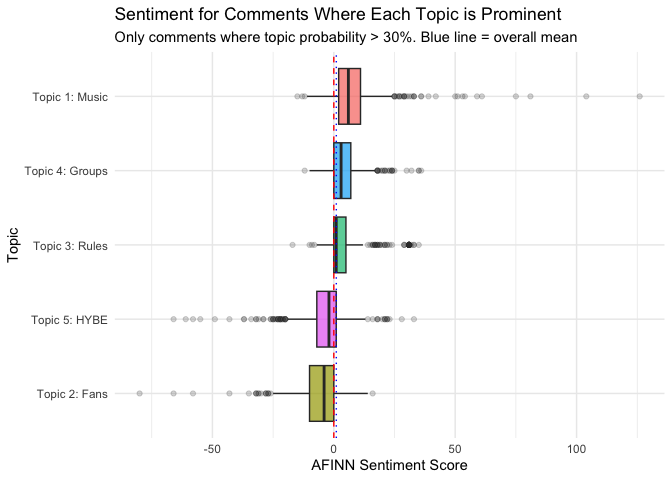<!-- -->

Remember boxplots:

- Box center line: Median sentiment for comments strongly about this
  topic

- Box height: Middle 50% of sentiment scores

- Whiskers & dots: Full range and outliers

- Compare to blue line (overall mean) to see which topics exceed average
  sentiment

**Key patterns:**

- **Topic 1 (Music)**: Median above 0, narrow spread, positive outliers
  → consistently positive

- **Topic 4 (Groups)**: Similar to Music, median ~1

- **Topic 3 (Rules)**: Box straddles zero → neutral/factual

- **Topic 5 (HYBE)**: Wide outlier spread → polarizing topic (extreme
  views on both sides)

- **Topic 2 (Fans)**: Median slightly negative → most mixed/neutral
  discussions

*Why boxplot order differs from Section 3.2: Weighted averages account
for mixed comments; boxplot shows only comments primarily about each
topic (gamma \> 0.3).*

------------------------------------------------------------------------

### 3.4 Statistical Significance

**Can we test if topics differ significantly in sentiment?**

- **Intercept**: Average sentiment for reference topic (Topic 1: Music)

- **Coefficients**: Difference in sentiment compared to Music

  - Negative = less positive than Music

  - Positive = more positive than Music

- **p-values**: Statistical significance of differences

  - p \< 0.05 = significantly different from Music

- **Weights = gamma**: Comments with higher topic probability have more
  influence

We’ll use weighted regression where each comment-topic pair is weighted
by its gamma probability:

``` r
# Reshape for regression: create one row per comment-topic pair
sentiment_topic_pairs <- meta_theta_df |> 
  select(comment_index, sentiment_afinn, topic_1:topic_5) |> 
  pivot_longer(
    cols = topic_1:topic_5,
    names_to = "topic",
    values_to = "gamma",
    names_prefix = "topic_"
  ) |> 
  mutate(
    topic = factor(topic, levels = c("1", "2", "3", "4", "5"),
                   labels = c("Music", "Fans", "Rules", "Groups", "HYBE"))
  )

# Weighted regression: sentiment ~ topic, weighted by gamma
weighted_model <- lm(sentiment_afinn ~ topic, 
                     data = sentiment_topic_pairs, 
                     weights = gamma)

summary(weighted_model)
```

    ## 
    ## Call:
    ## lm(formula = sentiment_afinn ~ topic, data = sentiment_topic_pairs, 
    ##     weights = gamma)
    ## 
    ## Weighted Residuals:
    ##     Min      1Q  Median      3Q     Max 
    ## -52.089  -1.338   0.138   1.113 109.048 
    ## 
    ## Coefficients:
    ##             Estimate Std. Error t value Pr(>|t|)    
    ## (Intercept)  1.58473    0.04526  35.015  < 2e-16 ***
    ## topicFans   -0.88907    0.06400 -13.891  < 2e-16 ***
    ## topicRules  -0.23647    0.06506  -3.634 0.000279 ***
    ## topicGroups -0.44579    0.06434  -6.928 4.29e-12 ***
    ## topicHYBE   -1.19516    0.06411 -18.642  < 2e-16 ***
    ## ---
    ## Signif. codes:  0 '***' 0.001 '**' 0.01 '*' 0.05 '.' 0.1 ' ' 1
    ## 
    ## Residual standard error: 2.624 on 82530 degrees of freedom
    ## Multiple R-squared:  0.005492,   Adjusted R-squared:  0.005444 
    ## F-statistic: 113.9 on 4 and 82530 DF,  p-value: < 2.2e-16

**Key Findings:**

- **Intercept (1.585)**: Average sentiment for Music topic

- **All topics significantly differ from Music** (all p \< 0.001)

- **Largest difference**: HYBE (-1.20 points) vs. Music

- **Smallest difference**: Rules (-0.24 points) vs. Music

- **Overall model**: Highly significant (p \< 2.2e-16), but R² = 0.005
  (topic explains only 0.5% of sentiment variance—most variation is
  within topics, not between them)

**Coefficient plot: Visualize differences from Music**

``` r
# Extract coefficients and confidence intervals
library(broom)
coef_data <- tidy(weighted_model, conf.int = TRUE) |> 
  filter(term != "(Intercept)") |> 
  mutate(
    topic = gsub("topic", "", term),
    topic = factor(topic, levels = c("HYBE", "Fans", "Groups", "Rules"))
  )

# Coefficient plot
ggplot(coef_data, aes(x = estimate, y = topic, color = topic)) +
  geom_vline(xintercept = 0, linetype = "dashed", color = "gray50") +
  geom_point(size = 4) +
  geom_errorbarh(aes(xmin = conf.low, xmax = conf.high), height = 0.2, size = 1) +
  scale_color_manual(values = wesanderson::wes_palette("Darjeeling1", n = 4, type = "discrete")) +
  labs(
    title = "Sentiment Difference from Music Topic",
    subtitle = "Weighted regression coefficients with 95% confidence intervals",
    x = "Difference in AFINN Sentiment (compared to Music)",
    y = "Topic"
  ) +
  theme_minimal() +
  theme(legend.position = "none")
```

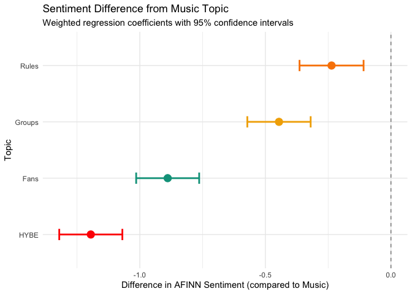<!-- -->

- **HYBE**: -1.20 points less positive than Music (largest difference)

- **Fans**: -0.89 points less positive than Music

- **Groups**: -0.45 points less positive than Music

- **Rules**: -0.24 points less positive than Music (smallest difference)

- **All error bars left of zero**: All differences statistically
  significant

- **No overlap with zero line**: Strong evidence topics differ from
  Music

------------------------------------------------------------------------

### 3.5 Class Exercise: Changing the Reference Category

**Current analysis:** We used Music (Topic 1) as the reference category.
All other topics are compared to Music.

**Question:** What if we used **Rules (Topic 3)** as the reference
instead? Would this make sense? What would change?

**Your task:**

1.  **Recode the topic variable** to make Rules the reference category

2.  **Re-run the weighted regression**

3.  **Create a new coefficient plot**

4.  **Interpret the results**

**Starter code:**

``` r
# Step 1: Recode topic with Rules as reference
sentiment_topic_pairs_rules <- sentiment_topic_pairs |> 
  mutate(
    topic = factor(topic, levels = c("Rules", "Music", "Fans", "Groups", "HYBE"))
  )

# Step 2: Re-run weighted regression
weighted_model_rules <- lm()

summary(weighted_model_rules)

# Step 3: Extract coefficients and create plot
coef_data_rules <- 
  
# Coefficient plot
ggplot(coef_data_rules, aes(x = estimate, y = topic, color = topic)) +
  geom_vline(xintercept = 0, linetype = "dashed", color = "gray50") +
  geom_point(size = 4) +
  geom_errorbarh(aes(xmin = conf.low, xmax = conf.high), height = 0.2, size = 1) +
  scale_color_manual(values = wesanderson::wes_palette("Darjeeling1", n = 4, type = "discrete")) +
  labs(
    title = "Sentiment Difference from Rules Topic",
    subtitle = "Weighted regression coefficients with 95% confidence intervals",
    x = "Difference in AFINN Sentiment (compared to Rules)",
    y = "Topic"
  ) +
  theme_minimal() +
  theme(legend.position = "none")
```

**Questions to answer:**

1.  **What is the new intercept?** What does it represent?

2.  **How do the coefficients change?**

    - Compare Music’s coefficient in the new model to the old model

    - Hint: Think about the relationship between Rules and Music

3.  **Does using Rules as reference make sense?**

    - Why or why not?

    - When might you want Rules as the reference?

    - When is Music a better reference?

4.  **Do the conclusions change?**

    - Are the same topics significantly different?

    - Does the story about topic sentiment change?

**Think about:** The choice of reference category affects interpretation
but not the underlying relationships. Choose a reference that makes your
research question easiest to answer!

------------------------------------------------------------------------

### 3.6 Sentiment Over Time

Now that we understand sentiment varies by topic, let’s explore how
sentiment changes over time. Do K-pop Reddit discussions become more or
less positive over time? Are certain time periods associated with
specific topics or sentiment patterns?

**Research questions:**

- Does overall sentiment change over time?

- Do different topics have different temporal patterns?

- Are there specific time periods with sentiment spikes or drops?

------------------------------------------------------------------------

#### 3.6.1 Prepare temporal data

First, let’s check our date variable and prepare the data for time
series analysis.

``` r
# Check date range
range(meta_theta_df$date)
```

    ## [1] "2025-07-01" "2025-07-31"

``` r
# Summary of dates
summary(meta_theta_df$date)
```

    ##         Min.      1st Qu.       Median         Mean      3rd Qu.         Max. 
    ## "2025-07-01" "2025-07-09" "2025-07-15" "2025-07-15" "2025-07-24" "2025-07-31"

------------------------------------------------------------------------

#### 3.6.2 Overall sentiment trend

Let’s start by visualizing how overall sentiment changes over time.

**Note:** For more details on formatting date axes in ggplot2, see
[Lecture 3: Date
Scales](https://aysedeniz09.github.io/IntroCSS/Spring2026/LectureSlides/bigdata_L3-github.html#date-scales).

``` r
# Aggregate sentiment by month
sentiment_time <- meta_theta_df |> 
  group_by(date) |> 
  summarise(
    mean_sentiment = mean(sentiment_afinn, na.rm = TRUE),
    median_sentiment = median(sentiment_afinn, na.rm = TRUE),
    n_comments = n(),
    .groups = "drop"
  )

ggplot(sentiment_time, aes(x = date, y = mean_sentiment)) +
  geom_line(color = NatParksPalettes::natparks.pals("Yellowstone", n = 5)[1], size = 1) +
  geom_point(color = NatParksPalettes::natparks.pals("Yellowstone", n = 5)[1], size = 2) +
  geom_hline(yintercept = 1.028, linetype = "dashed", color = "gray50") +
  geom_hline(yintercept = 0, linetype = "dotted", color = "red") +
  geom_smooth(method = "loess", se = TRUE, 
              color = NatParksPalettes::natparks.pals("Yellowstone", n = 5)[2], 
              fill = NatParksPalettes::natparks.pals("Yellowstone", n = 5)[2], 
              alpha = 0.2) +
  scale_x_date(
    date_breaks = "1 days",
    date_labels = "%d-%b-%y"
  ) +
  scale_y_continuous(limits = c(-2, 3), breaks = seq(-2, 3, by = 0.5)) +
  labs(
    title = "K-pop Reddit Sentiment Over Time",
    subtitle = "Monthly average AFINN sentiment with LOESS trend",
    x = "Date",
    y = "Mean AFINN Sentiment",
    caption = paste0("Dashed line = overall mean (1.028). N = ", nrow(meta_theta_df), " comments")
  ) +
  theme_minimal() +
  theme(axis.text.x = element_text(angle = 90, hjust = 1))
```

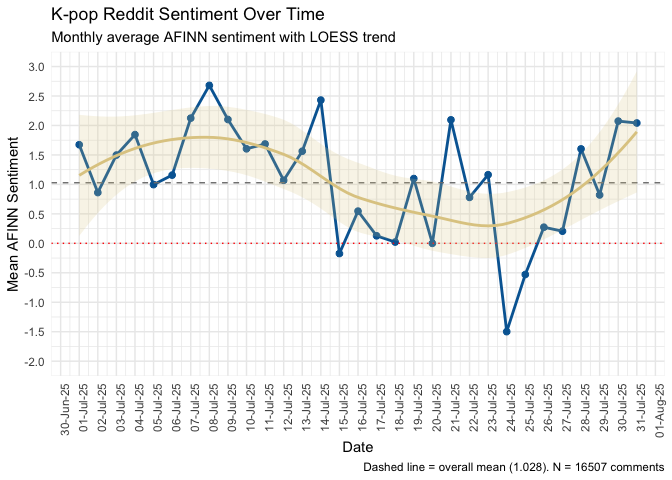<!-- -->

**Interpretation guidance:**

- The dashed grey line shows the overall mean (1.028)

- The dotted red line shows 0

- The LOESS curve shows the general trend

- Look for: Upward/downward trends, seasonal patterns, sudden changes

**Class Questions:**

Using the plot above and the `sentiment_time` data frame, answer the
following:

1.  **When was the most positive month?** What was the mean sentiment
    score?

    - Hint: Use `which.max()` or `slice_max()`

2.  **When was the most negative month?** What was the mean sentiment
    score?

    - Hint: Use `which.min()` or `slice_min()`

3.  **Overall trend:** Is K-pop Reddit sentiment increasing or
    decreasing over time?

    - Look at the LOESS curve (tan/yellow line)

    - What might explain any major drops or spikes?

4.  **Volatility:** How much does sentiment vary month-to-month?

    - Calculate: `sd(sentiment_time$mean_sentiment)`

    - What does high volatility suggest about K-pop fan discussions?

**Try this code:**

``` r
# Your exploration here
# 1. Most positive month
sentiment_time |> slice_max(mean_sentiment, n = 1)

# 2. Most negative month
sentiment_time |> slice_min(mean_sentiment, n = 1)

# 3. Simple trend test
cor.test(as.numeric(sentiment_time$date), sentiment_time$mean_sentiment)

# 4. Volatility
sd(sentiment_time$mean_sentiment)
```

------------------------------------------------------------------------

#### 3.6.3 Sentiment by topic over time

Now let’s see how sentiment for each topic changes over time using our
weighted approach.

``` r
# Recreate sentiment_topic_pairs WITH the date column
sentiment_topic_pairs <- sentiment_topic_pairs |> 
  left_join(meta_theta_df |> select(comment_index, date), by = "comment_index")

sentiment_topic_time <- sentiment_topic_pairs |> 
  group_by(date, topic) |> 
  summarise(
    weighted_sentiment = weighted.mean(sentiment_afinn, gamma, na.rm = TRUE),
    total_gamma = sum(gamma, na.rm = TRUE),
    n_comments = n(),
    .groups = "drop"
  )

# Plot sentiment by topic over time
ggplot(sentiment_topic_time, aes(x = date, y = weighted_sentiment, color = topic)) +
  geom_line(size = 1) +
  geom_point(size = 1.5) +
    scale_x_date(
    date_breaks = "1 days",
    date_labels = "%d-%b-%y"
  ) +
  scale_y_continuous(limits = c(-3, 3), breaks = seq(-3, 3, by = 0.5)) +
  scale_color_manual(values = NatParksPalettes::natparks.pals("Yellowstone", n = 5, type = "continuous")) +
  labs(
    title = "Sentiment Trends by Topic",
    subtitle = "Daily weighted average AFINN sentiment for each topic",
    x = "Date",
    y = "Weighted Mean AFINN Sentiment",
    color = "Topic"
  ) +
  theme_minimal() +
  theme(legend.position = "right",
        axis.text.x = element_text(angle = 90, hjust = 1))
```

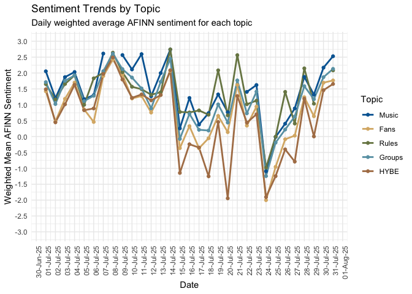<!-- -->

Let’s do a faceted version remember [Lecture 3 7.
Facets](https://aysedeniz09.github.io/IntroCSS/Spring2026/LectureSlides/bigdata_L3-github.html#facets)

``` r
ggplot(sentiment_topic_time, aes(x = date, y = weighted_sentiment, color = topic)) +
  geom_line(size = 1) +
  geom_point(size = 1.5) +
  geom_smooth(method = "loess", se = TRUE, alpha = 0.2) +
    scale_x_date(
    date_breaks = "1 days",
    date_labels = "%d-%b-%y"
  ) +
  scale_y_continuous(limits = c(-3, 3), breaks = seq(-3, 3, by = 1)) +  # Wider breaks for small panels
  scale_color_manual(values = NatParksPalettes::natparks.pals("Yellowstone", n = 5, type = "continuous")) +
  facet_wrap(~ topic, ncol = 1, scales = "fixed") +  # Fixed y-scale to compare across topics
  labs(
    title = "Sentiment Trends by Topic",
    subtitle = "Daily weighted average with LOESS trend line",
    x = "Date",
    y = "Weighted Mean AFINN Sentiment"
  ) +
  theme_minimal() +
  theme(
    legend.position = "none",  # No legend needed with facets
    axis.text.x = element_text(angle = 90, hjust = 1, size = 8),
    strip.text = element_text(face = "bold", size = 10)
  )
```

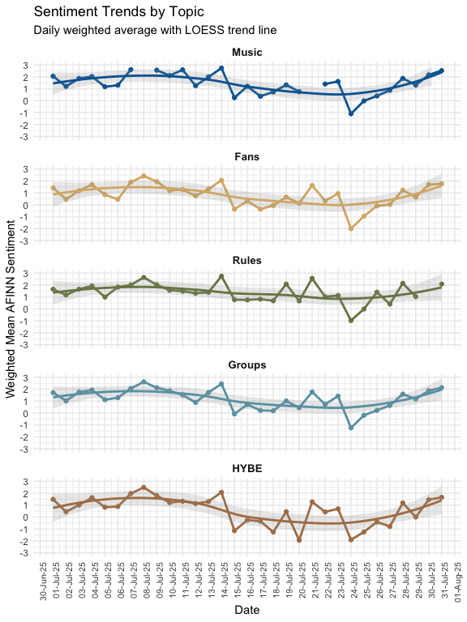<!-- -->

**Questions to explore:**

- Which topic shows the most day-to-day variation?

- Are there synchronized changes (all topics move together on certain
  days)?

- Do certain topics show clearer trends than others within the month?

------------------------------------------------------------------------

## Lecture 10 Cheat Sheet

| **Function/Concept** | **Description** | **Code Example** |
|----|----|----|
| `get_sentiments("afinn")` | Load AFINN sentiment dictionary (-5 to +5) | `tokens |> inner_join(get_sentiments("afinn"))` |
| `get_sentiments("bing")` | Load Bing sentiment dictionary (positive/negative) | `tokens |> inner_join(get_sentiments("bing"))` |
| `get_sentiments("nrc")` | Load NRC emotion lexicon (8 emotions) | `tokens |> inner_join(get_sentiments("nrc"))` |
| `pivot_longer()` | Convert topic columns to long format | `pivot_longer(topic_1:topic_5, names_to = "topic", values_to = "gamma")` |
| `weighted.mean(x, w)` | Calculate weighted average | `summarise(weighted_sent = weighted.mean(sentiment, gamma))` |
| `lm(y ~ x, weights = w)` | Weighted linear regression | `lm(sentiment ~ topic, weights = gamma)` |
| `tidy(model, conf.int = TRUE)` | Extract coefficients with confidence intervals | `broom::tidy(model, conf.int = TRUE)` |
| `factor(x, levels = c())` | Set reference category | `factor(topic, levels = c("Music", "Fans"))` |
| `floor_date(date, "month")` | Aggregate dates to month | `mutate(year_month = floor_date(date, "month"))` |
| `scale_x_date()` | Format date axis | `scale_x_date(date_breaks = "5 days", date_labels = "%d-%b")` |
| `geom_smooth(method = "loess")` | Add smoothed trend line | `geom_smooth(method = "loess", se = TRUE)` |
| `geom_area()` | Create stacked area chart | `geom_area(aes(x = date, y = prop, fill = topic))` |
| `geom_errorbarh()` | Horizontal error bars for coefficients | `geom_errorbarh(aes(xmin = conf.low, xmax = conf.high))` |
| `natparks.pals()` | National Parks color palettes | `scale_color_manual(values = natparks.pals("Yellowstone", n = 5))` |
