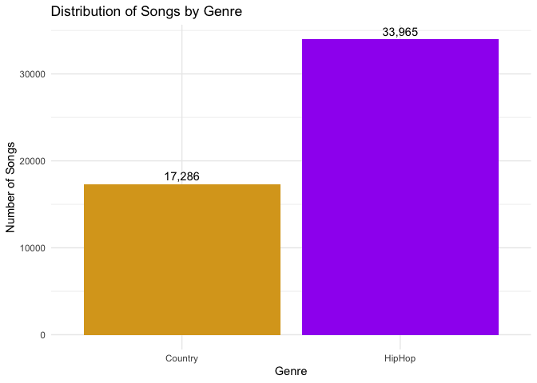
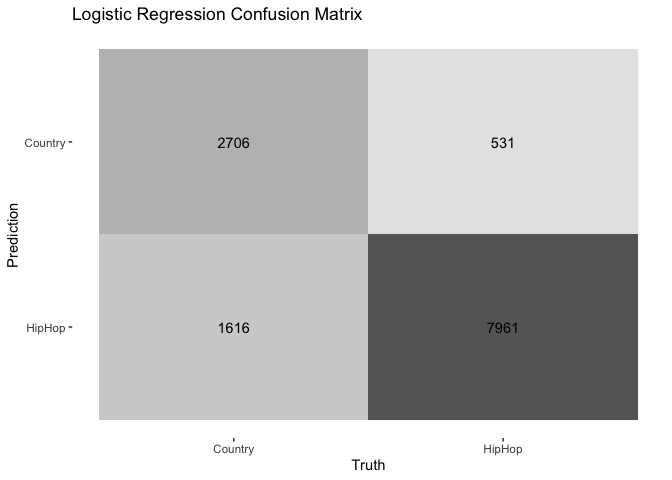
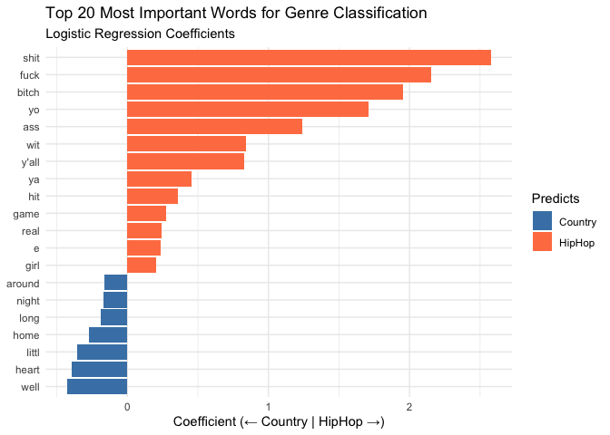
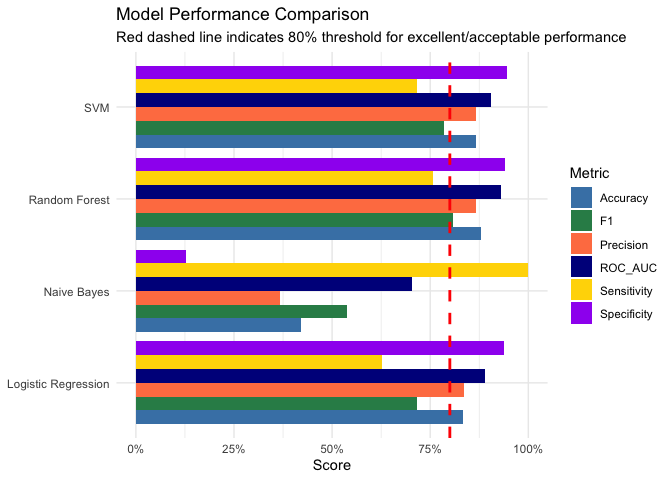
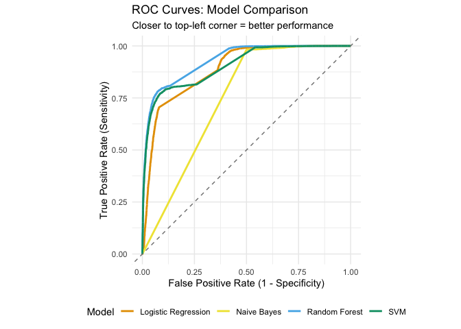
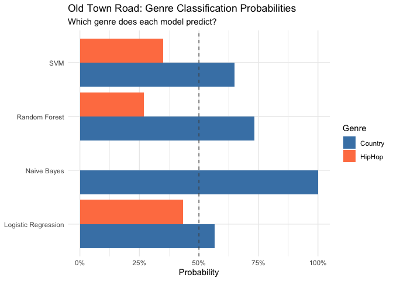

Predictive Modeling
================
Dr. Ayse D. Lokmanoglu
Lecture 11, (B) April 8, (A) April 13

# R Exercises

## Lecture 11 Table of Contents

| Section | Topic                                    |
|---------|------------------------------------------|
| 1       | Introduction to Predictive Modeling      |
| 2       | Music Lyrics Dataset: Country vs Hip Hop |
| 2.1     | Loading the Data                         |
| 2.2     | Exploring the Data                       |
| 2.3     | Genre Distribution                       |
| 3       | Feature Engineering from Text            |
| 3.1     | Creating the Text Recipe                 |
| 3.2     | Preparing the Recipe                     |
| 3.3     | Applying the Recipe to Create Features   |
| 4       | Tidymodels Workflow                      |
| 4.1     | Split the Data                           |
| 4.2     | Create the Recipe                        |
| 4.3     | Specify a Model                          |
| 4.4     | Create a Workflow                        |
| 4.5     | Fit the Model                            |
| 4.6     | Make Predictions                         |
| 4.7     | Evaluate Performance                     |
| 4.8     | Feature Importance                       |
| 5       | Model Comparison                         |
| 5.1     | Define Models                            |
| 5.2     | Create Workflows and Fit Models          |
| 5.3     | Generate Predictions                     |
| 5.4     | Compare Model Performance                |
| 5.5     | Understanding ROC Curves                 |
| 5.6     | Interpret Results                        |
| 6       | Testing on “Old Town Road”               |
| 6.1     | Prepare the Lyrics                       |
| 6.2     | Get Predictions from All Models          |
| 6.3     | Get Probability Estimates                |
| 6.4     | Interpretation                           |
| 7       | Class Exercise: Test Your Own Song!      |
| 7.1     | Instructions                             |
| 7.2     | Discussion Questions                     |
| 7.3     | Optional: Compare Multiple Songs         |

------------------------------------------------------------------------

**ALWAYS** Let’s load our libraries

``` r
# 1. CORE DATA MANIPULATION & VISUALIZATION
# ----------------------------------------------------------------------------
library(tidyverse)    # Suite of packages (dplyr, ggplot2, tidyr, readr, stringr) for data manipulation and visualization

# ----------------------------------------------------------------------------
# 2. TEXT MINING & PREPROCESSING
# ----------------------------------------------------------------------------
library(textrecipes)  # tidymodels extension for text feature engineering (BoW, TF-IDF, tokenization, etc.)

# ----------------------------------------------------------------------------
# 3. TIDYMODELS ECOSYSTEM (Modern ML Framework)
# ----------------------------------------------------------------------------
library(tidymodels)   # Meta-package for predictive modeling (includes rsample, recipes, parsnip, yardstick, workflows, broom)
                      # - rsample: data splitting and resampling
                      # - recipes: feature engineering pipeline
                      # - parsnip: unified model interface
                      # - yardstick: model performance metrics
                      # - workflows: combine preprocessing and models
                      # - broom: tidy model outputs

# ----------------------------------------------------------------------------
# 4. ML MODEL ENGINES (called by parsnip)
# ----------------------------------------------------------------------------
library(ranger)       # Fast Random Forest implementation (engine for parsnip)
library(kernlab)      # Support Vector Machines with kernel methods (engine for parsnip)
library(naivebayes)   # Naive Bayes classifier (engine for parsnip)
library(discrim)      # Discriminant analysis models (provides Naive Bayes interface for tidymodels)
```

## 1. Introduction to Predictive Modeling

Predictive modeling is the process of using statistical and machine
learning techniques to **predict future outcomes** based on historical
data. Unlike descriptive analysis (which tells us *what happened*) or
diagnostic analysis (which tells us *why it happened*), predictive
modeling tells us **what is likely to happen**.

The basic workflow:

1.  **Train** a model on historical data where outcomes are known

2.  **Identify patterns** that distinguish different outcomes

3.  **Apply** those patterns to new data to make predictions

**Why Predictive Modeling in Big Data?**

In the era of big data, we have unprecedented access to information
about human behavior through social media (billions of posts, comments,
likes, shares), digital traces (clicks, views, time spent), and
real-time data streams. This wealth of data allows us to forecast trends
before they go viral, identify influential content early, personalize
experiences based on predicted preferences, detect anomalies like
misinformation, and optimize strategies for content creation and
distribution.

**Predictive Modeling for Social Media Insights**

Social media platforms generate massive amounts of unstructured data.
Predictive modeling helps answer critical questions:

- **Content virality**: Will this video/post go viral?

- **User engagement**: Which users are likely to engage with specific
  content?

- **Influence detection**: Who are the emerging influencers?

- **Crisis prediction**: Can we detect brewing controversies before they
  explode?

- **Campaign optimization**: Which message will resonate with which
  audience?

Real-world applications include YouTube’s recommendation algorithm
predicting which videos you’ll watch next, Twitter (X) predicting which
tweets to show in your feed, TikTok predicting which videos will go
viral and promoting them early, and political campaigns predicting voter
behavior to target messaging.

Today in class we will build predictive models using two very different
types of data:

1.  **Text + Metadata**: YouTube video data to predict virality (feature
    engineering from text: sentiment, length, keywords; combining text
    features with numeric metadata)

2.  **Numeric Features**: Titanic passenger data to predict survival
    (traditional numeric feature engineering; handling missing data)

Both use the same machine learning algorithms, demonstrating how the
**same techniques** work across **different data types**.

------------------------------------------------------------------------

## 2. Music Lyrics Dataset: Country vs Hip Hop

### 2.1 Loading the Data

For this exercise, we’ll use a dataset of song lyrics from two genres:
**Country** and **Hip Hop**. Our goal is to build a model that can
predict a song’s genre based solely on its lyrics.

This dataset became famous in 2019 when Lil Nas X’s “Old Town Road”
sparked a debate: Is it Country or Hip Hop? Billboard removed it from
the Country charts, claiming it wasn’t country enough. We’ll build a
model to make this decision ourselves! I learned ML on this dataset in
Dror Walter’s class as well!

**Dataset Source**:
<https://github.com/aysedeniz09/IntroCSS/raw/refs/heads/main/data/lyricsDror.csv>

``` r
# Load the data
lyrics <- read_csv("https://github.com/aysedeniz09/IntroCSS/raw/refs/heads/main/data/lyricsDror.csv")

# Quick check
dim(lyrics)
```

    ## [1] 51251     6

**Dataset Size**: 51,251 songs - a substantial dataset for predictive
modeling!

------------------------------------------------------------------------

### 2.2 Exploring the Data

Let’s look at the structure of our data:

``` r
# First few rows
head(lyrics)
```

    ## # A tibble: 6 × 6
    ##   index song                  year artist genre  text                           
    ##   <dbl> <chr>                <dbl> <chr>  <chr>  <chr>                          
    ## 1   250 i-got-that            2007 eazy-e HipHop "(horns)...\n(chorus)\nTimbo- …
    ## 2   251 8-ball-remix          2007 eazy-e HipHop "Verse 1:\nI don't drink brass…
    ## 3   252 extra-special-thankz  2007 eazy-e HipHop "19 muthaphukkin 93,\nand I'm …
    ## 4   253 boyz-in-da-hood       2007 eazy-e HipHop "Hey yo man, remember that shi…
    ## 5   254 automoblie            2007 eazy-e HipHop "Yo, Dre, man, I take this bit…
    ## 6   255 i-d-rather-fuck-you   2007 eazy-e HipHop "Aah, this is one of them song…

``` r
# Structure
str(lyrics)
```

    ## spc_tbl_ [51,251 × 6] (S3: spec_tbl_df/tbl_df/tbl/data.frame)
    ##  $ index : num [1:51251] 250 251 252 253 254 255 256 257 258 259 ...
    ##  $ song  : chr [1:51251] "i-got-that" "8-ball-remix" "extra-special-thankz" "boyz-in-da-hood" ...
    ##  $ year  : num [1:51251] 2007 2007 2007 2007 2007 ...
    ##  $ artist: chr [1:51251] "eazy-e" "eazy-e" "eazy-e" "eazy-e" ...
    ##  $ genre : chr [1:51251] "HipHop" "HipHop" "HipHop" "HipHop" ...
    ##  $ text  : chr [1:51251] "(horns)...\n(chorus)\nTimbo- When you hit me on my phone betta know what cha want, when you call me, you alread"| __truncated__ "Verse 1:\nI don't drink brass monkey, like to be funky\nNickname Eazy-E your 8 ball junkie\nBass drum kickin', "| __truncated__ "19 muthaphukkin 93,\nand I'm back in this bitch,\nEazy- muthaphukkin- E, the hip hop thugster...\nShouts go out"| __truncated__ "Hey yo man, remember that shit Eazy did a while back\nMotherfuckers said it wasn't gonna work\nThat crazy shit,"| __truncated__ ...
    ##  - attr(*, "spec")=
    ##   .. cols(
    ##   ..   index = col_double(),
    ##   ..   song = col_character(),
    ##   ..   year = col_double(),
    ##   ..   artist = col_character(),
    ##   ..   genre = col_character(),
    ##   ..   text = col_character()
    ##   .. )
    ##  - attr(*, "problems")=<externalptr>

``` r
# Column names
colnames(lyrics)
```

    ## [1] "index"  "song"   "year"   "artist" "genre"  "text"

**Column Names (6 columns):**

- `index`: Unique song identifier

- `song`: Song title

- `year`: Year the song was released

- `artist`: Artist name

- `genre`: Music genre (Country or HipHop) - **our outcome variable**

- `text`: Song lyrics (text) - **our main predictor**

**Data Types:**

- `genre` is already a **factor** with 2 levels: Country and HipHop

- `text` contains the full lyrics as character strings

- `year` ranges from when to when?

- `artist` tells us who performed the song

------------------------------------------------------------------------

### 2.3 Genre Distribution

First, let’s see how balanced our dataset is between Country and Hip
Hop:

1.  Count by genre

``` r
# Count by genre
lyrics |>
  count(genre)
```

    ## # A tibble: 2 × 2
    ##   genre       n
    ##   <chr>   <int>
    ## 1 Country 17286
    ## 2 HipHop  33965

2.  Proportion by genre

``` r
# Proportion by genre
lyrics |>
  count(genre) |>
  mutate(proportion = n / sum(n))
```

    ## # A tibble: 2 × 3
    ##   genre       n proportion
    ##   <chr>   <int>      <dbl>
    ## 1 Country 17286      0.337
    ## 2 HipHop  33965      0.663

3.  Visualize

``` r
# Visualize genre distribution
lyrics |>
  count(genre) |>
  ggplot(aes(x = genre, y = n, fill = genre)) +
  geom_col() +
  geom_text(aes(label = scales::comma(n)), vjust = -0.5) +
  scale_fill_manual(values = c("Country" = "goldenrod", "HipHop" = "purple")) +
  labs(
    title = "Distribution of Songs by Genre",
    x = "Genre",
    y = "Number of Songs"
  ) +
  theme_minimal() +
  theme(legend.position = "none")
```

<!-- -->

**What do we observe?**

Our dataset contains:

- **Country**: 17,286 songs (33.7%)

- **Hip Hop**: 33,965 songs (66.3%)

This is a **roughly 1:2 imbalance**. Hip Hop songs outnumber Country
songs by about 2 to 1.

**Why does this matter for modeling?**

- This imbalance is **moderate** - not severely skewed like 90/10, but
  still meaningful

- A naive model could achieve 66.3% accuracy by always predicting “Hip
  Hop”

- We need to use **stratified sampling** when splitting our data to
  maintain this proportion in both training and testing sets

- We should evaluate our model using metrics beyond just accuracy (e.g.,
  precision, recall, F1-score for each class)

- Later in Section 4, we’ll use `initial_split(strata = genre)` to
  ensure both our training and test sets maintain this ~34%/66% split

**Good news:** This level of imbalance is manageable! Many real-world
datasets are far more imbalanced (e.g., fraud detection at 99/1). Our
34/66 split means both genres are well-represented.

------------------------------------------------------------------------

## 3. Feature Engineering from Text

Before we can build our predictive model, we need to transform raw
lyrics into numerical features that machine learning algorithms can
understand.

**The Challenge:**

- Machine learning models work with numbers, not text

- We have song lyrics as raw strings in the `text` column

- We need to extract meaningful numeric features that capture the
  **essence** of Country vs Hip Hop

**Our Approach: Bag of Words**

We’ll use a classic text mining approach called **Bag of Words (BoW)**:

1.  **Tokenize**: Break lyrics into individual words

2.  **Clean**: Remove stopwords, punctuation, numbers

3.  **Stem**: Reduce words to their root form (e.g., “running” → “run”)

4.  **Count**: Create word frequency features

5.  **Filter**: Keep only words that appear in 1-90% of documents
    (remove very rare and very common words)

This creates a **document-feature matrix** where each row is a song and
each column is a word’s frequency.

In tidymodels, we’ll use the
[`textrecipes`](https://textrecipes.tidymodels.org/) package to handle
all text preprocessing within our recipe!

------------------------------------------------------------------------

### 3.1 Creating the Text Recipe

Let’s build a recipe that preprocesses our text data following the same
approach as the original analysis:

``` r
# Create a text preprocessing recipe
text_recipe <- recipe(genre ~ text, data = lyrics) |>
  
  # Step 1: Tokenize the text into words
  step_tokenize(text) |>
  
  # Step 2: Remove stopwords (common words like "the", "and", etc.)
  step_stopwords(text) |>
  
  # Step 3: Stem words to their root form
  step_stem(text) |>
  
  # Step 4: Filter tokens - keep words appearing in 1-90% of documents
  step_tokenfilter(text, 
                   min_times = 513,       # Must appear in at least ~1% of 51,251 songs
                   max_times = 46126,     # Must appear in at most ~90% of 51,251 songs
                   percentage = FALSE) |> # Use absolute counts
  
  # Step 5: Create term frequency features (word counts)
  step_tf(text)

# View the recipe
# str(text_recipe)
```

**What does each step do?**

1.  **`step_tokenize(text)`**: Splits lyrics into individual words

    - “I love country music” → \[“I”, “love”, “country”, “music”\]

2.  **`step_stopwords(text)`**: Removes common words that don’t
    distinguish genres

    - Removes: “the”, “a”, “and”, “I”, “you”, etc.

    - Keeps: content words that might be genre-specific

3.  **`step_stem(text)`**: Reduces words to their root form

    - “running”, “runs”, “ran” → “run”

    - “loving”, “loved”, “loves” → “love”

4.  **`step_tokenfilter(text, min_times = 513, max_times = 46126)`**:

    - Removes very rare words (\< 513 songs)

    - Removes very common words (\> 46,126 songs)

    - Keeps discriminative words that might distinguish Country from Hip
      Hop

5.  **`step_tf(text)`**: Converts tokens into numeric term frequency
    features

    - Creates one column per remaining word

    - Values = how many times that word appears in each song

------------------------------------------------------------------------

### 3.2 Preparing the Recipe

Before we can use the recipe, we need to **prep** it on our data to
learn the vocabulary:

``` r
# Prep the recipe (learns vocabulary from training data)
prepped_recipe <- prep(text_recipe)

# How many features did we create?
# str(prepped_recipe)
```

**What happens during `prep()`?**

- The recipe examines all the lyrics

- It builds a vocabulary of words that pass our filtering criteria

- It determines which words to keep (appearing in 1-90% of documents)

- It creates the stemming dictionary

**How many features?**

After tokenization, stopword removal, stemming, and filtering, we’ll
likely have **several hundred to a few thousand word features** - each
representing a stemmed word’s frequency.

**What happened during our prep?**

- The recipe examined all 51,251 songs

- Built a vocabulary of all unique stemmed words

- Applied the filtering rules (keep words in 513-46,126 songs)

- Identified **99 words** that meet our criteria

These 99 words will become our features for modeling!

------------------------------------------------------------------------

### 3.3 Applying the Recipe to Create Features

Now let’s use `bake()` to transform our raw text into numeric features:

``` r
# Apply the recipe to transform the data
lyrics_features <- bake(prepped_recipe, lyrics)

# View the structure
dim(lyrics_features)
```

    ## [1] 51251   100

``` r
colnames(lyrics_features)[1:20]  # First 20 features
```

    ##  [1] "genre"          "tf_text_alwai"  "tf_text_around" "tf_text_ass"   
    ##  [5] "tf_text_awai"   "tf_text_babi"   "tf_text_back"   "tf_text_better"
    ##  [9] "tf_text_big"    "tf_text_bitch"  "tf_text_boi"    "tf_text_bout"  
    ## [13] "tf_text_call"   "tf_text_caus"   "tf_text_choru"  "tf_text_come"  
    ## [17] "tf_text_da"     "tf_text_dai"    "tf_text_de"     "tf_text_die"

``` r
# Preview the data
head(lyrics_features[, 1:10])
```

    ## # A tibble: 6 × 10
    ##   genre  tf_text_alwai tf_text_around tf_text_ass tf_text_awai tf_text_babi
    ##   <fct>          <int>          <int>       <int>        <int>        <int>
    ## 1 HipHop             0              0           0            0            0
    ## 2 HipHop             0              1           3            0            0
    ## 3 HipHop             0              0           0            0            1
    ## 4 HipHop             5              0           2            0            0
    ## 5 HipHop             0              0           2            0            0
    ## 6 HipHop             0              0           3            0            1
    ## # ℹ 4 more variables: tf_text_back <int>, tf_text_better <int>,
    ## #   tf_text_big <int>, tf_text_bitch <int>

**What do we have now?**

- **100 columns total**:

  - 1 column: `genre` (our outcome)

  - 99 columns: `tf_text_[word]` (word frequency features)

- Each row is a song

- Each word column contains the count of that word in the song

- This is our **document-feature matrix** - ready for machine learning!

For example, looking at the first few songs:

- Most Hip Hop songs have 0 occurrences of “alwai” (always)

- One song has “ass” appearing 3 times

- “back” appears 1-3 times in different songs

------------------------------------------------------------------------

## 4. Tidymodels Workflow

Now we’ll build, train, and evaluate machine learning models using the
tidymodels framework. Here’s our roadmap:

1.  **Split the data** into training and test sets

2.  **Create a recipe** (we already have this!)

3.  **Specify a model**

4.  **Create a workflow** (combine recipe + model)

5.  **Fit the model** on training data

6.  **Make predictions** on test data

7.  **Evaluate performance**

### 4.1 Split the Data

First, let’s split into training (75%) and test (25%) sets:

``` r
# Set seed for reproducibility
set.seed(123)

# Split the data, stratifying by genre to maintain 34%/66% ratio
lyrics_split <- initial_split(lyrics, 
                               prop = 0.75, 
                               strata = genre)

# Create training and test sets
lyrics_train <- training(lyrics_split)
lyrics_test <- testing(lyrics_split)

# Check the splits
nrow(lyrics_train)  # ~38,438 songs
```

    ## [1] 38437

``` r
nrow(lyrics_test)   # ~12,813 songs
```

    ## [1] 12814

``` r
# Verify stratification worked
table(lyrics_train$genre)
```

    ## 
    ## Country  HipHop 
    ##   12964   25473

``` r
table(lyrics_test$genre)
```

    ## 
    ## Country  HipHop 
    ##    4322    8492

``` r
# Verify stratification maintained the genre proportions
prop.table(table(lyrics_train$genre))
```

    ## 
    ##   Country    HipHop 
    ## 0.3372792 0.6627208

``` r
prop.table(table(lyrics_test$genre))
```

    ## 
    ##   Country    HipHop 
    ## 0.3372873 0.6627127

**Key observations:**

- Training set: 38,437 songs (75%)

  - Country: 12,964 (33.7%)

  - Hip Hop: 25,473 (66.3%)

- Test set: 12,814 songs (25%)

  - Country: 4,322 (33.7%)

  - Hip Hop: 8,492 (66.3%)

The stratification worked great!!! Both sets maintain the same 34%/66%
split as the original data.

------------------------------------------------------------------------

### 4.2 Create the Recipe

Good news - we already created our text recipe in Section 3! We can
reuse it:

``` r
# Our recipe from Section 3
head(text_recipe)
```

    ## $var_info
    ## # A tibble: 2 × 4
    ##   variable type      role      source  
    ##   <chr>    <list>    <chr>     <chr>   
    ## 1 text     <chr [3]> predictor original
    ## 2 genre    <chr [3]> outcome   original
    ## 
    ## $term_info
    ## # A tibble: 2 × 4
    ##   variable type      role      source  
    ##   <chr>    <list>    <chr>     <chr>   
    ## 1 text     <chr [3]> predictor original
    ## 2 genre    <chr [3]> outcome   original
    ## 
    ## $steps
    ## $steps[[1]]

    ## 
    ## $steps[[2]]

    ## 
    ## $steps[[3]]

    ## 
    ## $steps[[4]]

    ## 
    ## $steps[[5]]

    ## 
    ## 
    ## $template
    ## # A tibble: 51,251 × 2
    ##    text                                                                    genre
    ##    <chr>                                                                   <chr>
    ##  1 "(horns)...\n(chorus)\nTimbo- When you hit me on my phone betta know w… HipH…
    ##  2 "Verse 1:\nI don't drink brass monkey, like to be funky\nNickname Eazy… HipH…
    ##  3 "19 muthaphukkin 93,\nand I'm back in this bitch,\nEazy- muthaphukkin-… HipH…
    ##  4 "Hey yo man, remember that shit Eazy did a while back\nMotherfuckers s… HipH…
    ##  5 "Yo, Dre, man, I take this bitch out to the movies and shit man\nWe're… HipH…
    ##  6 "Aah, this is one of them songs\nYou can kick back and smoke a joint t… HipH…
    ##  7 "Hey yo man, remember that shit Eazy did a while back\nMotherfuckers s… HipH…
    ##  8 "Artist: Master P ++++++++++\nAlbum: Ghetto Dope\nSong: Pass Me Da Gre… HipH…
    ##  9 "Yes Im too smart to get dicked...or so the case may be\nthat's how th… HipH…
    ## 10 "Hey yo man, remember that shit Eazy did a while back\nMotherfuckers s… HipH…
    ## # ℹ 51,241 more rows
    ## 
    ## $levels
    ## NULL
    ## 
    ## $retained
    ## [1] NA

This recipe will:

1.  Tokenize the text

2.  Remove stopwords

3.  Stem words

4.  Filter to 99 most informative words

5.  Create word frequency features

------------------------------------------------------------------------

### 4.3 Specify a Model

Now we’ll specify our first model - **logistic regression**. In
tidymodels, we use the [`parsnip`](https://parsnip.tidymodels.org/)
package to define models in a consistent way.

``` r
# Specify a logistic regression model
logistic_model <- logistic_reg() |>
  set_engine("glm") |>
  set_mode("classification")

# View the model specification
logistic_model
```

    ## Logistic Regression Model Specification (classification)
    ## 
    ## Computational engine: glm

**Understanding the model specification:**

- `logistic_reg()`: The model type (logistic regression for binary
  classification)

- `set_engine("glm")`: The computational engine (R’s built-in `glm`
  function)

- `set_mode("classification")`: We’re predicting categories (Country vs
  Hip Hop), not numbers

**Why logistic regression?**

- Simple, interpretable baseline model

- Works well with text features

- Fast to train

- Shows us which words are most predictive of each genre

We’ll compare this to other models (Random Forest, SVM, Naive Bayes)
later, but logistic regression is a great starting point!

------------------------------------------------------------------------

### 4.4 Create a Workflow

A workflow combines our recipe (feature engineering) with our model
(algorithm). This keeps everything organized:

``` r
# Create a workflow
logistic_wf <- workflow() |>
  add_recipe(text_recipe) |>
  add_model(logistic_model)

# View the workflow
logistic_wf
```

    ## ══ Workflow ════════════════════════════════════════════════════════════════════
    ## Preprocessor: Recipe
    ## Model: logistic_reg()
    ## 
    ## ── Preprocessor ────────────────────────────────────────────────────────────────
    ## 5 Recipe Steps
    ## 
    ## • step_tokenize()
    ## • step_stopwords()
    ## • step_stem()
    ## • step_tokenfilter()
    ## • step_tf()
    ## 
    ## ── Model ───────────────────────────────────────────────────────────────────────
    ## Logistic Regression Model Specification (classification)
    ## 
    ## Computational engine: glm

**What’s in our workflow?**

1.  **Preprocessor (Recipe)**: Tokenize → Remove stopwords → Stem →
    Filter → Count words

2.  **Model**: Logistic regression

Think of the workflow as a pipeline: raw lyrics go in, genre predictions
come out!

------------------------------------------------------------------------

### 4.5 Fit the Model

Now we’ll train (fit) our workflow on the training data:

``` r
# Fit the workflow to training data
logistic_fit <- logistic_wf |>
  fit(data = lyrics_train)

# View the fitted model
logistic_fit
```

    ## ══ Workflow [trained] ══════════════════════════════════════════════════════════
    ## Preprocessor: Recipe
    ## Model: logistic_reg()
    ## 
    ## ── Preprocessor ────────────────────────────────────────────────────────────────
    ## 5 Recipe Steps
    ## 
    ## • step_tokenize()
    ## • step_stopwords()
    ## • step_stem()
    ## • step_tokenfilter()
    ## • step_tf()
    ## 
    ## ── Model ───────────────────────────────────────────────────────────────────────
    ## 
    ## Call:  stats::glm(formula = ..y ~ ., family = stats::binomial, data = data)
    ## 
    ## Coefficients:
    ##     (Intercept)  `tf_text_ain't`   tf_text_around      tf_text_ass  
    ##        0.265216        -0.013695        -0.162873         1.242105  
    ##    tf_text_awai     tf_text_babi     tf_text_back   tf_text_better  
    ##       -0.105878         0.067251        -0.067808         0.044715  
    ##     tf_text_big    tf_text_bitch      tf_text_boi     tf_text_call  
    ##       -0.047069         1.952853        -0.007173        -0.027618  
    ##     tf_text_can     tf_text_caus    tf_text_choru     tf_text_come  
    ##       -0.007648         0.129789         0.087512         0.002476  
    ##      tf_text_da      tf_text_dai       tf_text_de      tf_text_die  
    ##        0.082057        -0.067766         0.109121         0.120831  
    ##       tf_text_e       tf_text_em     tf_text_even     tf_text_ever  
    ##        0.237703         0.081647         0.081691        -0.161403  
    ##   tf_text_everi       tf_text_ey     tf_text_feel     tf_text_fuck  
    ##       -0.061913        -0.150589         0.082835         2.153714  
    ##    tf_text_game     tf_text_girl     tf_text_give       tf_text_go  
    ##        0.271700         0.204218         0.089275         0.014508  
    ##    tf_text_gone    tf_text_gonna     tf_text_good    tf_text_gotta  
    ##       -0.147935        -0.107931        -0.064124         0.130561  
    ##    tf_text_hand     tf_text_hard     tf_text_head    tf_text_heart  
    ##       -0.116885        -0.071164        -0.010178        -0.394498  
    ##     tf_text_hit     tf_text_hold     tf_text_home     tf_text_keep  
    ##        0.360981        -0.117090        -0.270471         0.016348  
    ##      tf_text_la     tf_text_leav      tf_text_let     tf_text_life  
    ##        0.004785        -0.134918         0.013938         0.059014  
    ##   tf_text_littl     tf_text_live     tf_text_long     tf_text_look  
    ##       -0.358351         0.006409        -0.187351        -0.050022  
    ##    tf_text_love     tf_text_make      tf_text_man     tf_text_mind  
    ##       -0.060827         0.032029         0.025633        -0.014867  
    ##   tf_text_monei     tf_text_need    tf_text_never      tf_text_new  
    ##        0.143463         0.090393        -0.036171        -0.003437  
    ##   tf_text_night      tf_text_now       tf_text_oh       tf_text_on  
    ##       -0.168085         0.017522        -0.003163        -0.030539  
    ##    tf_text_plai      tf_text_put      tf_text_que     tf_text_real  
    ##       -0.016092         0.114395        -0.014443         0.239755  
    ##  tf_text_realli    tf_text_right      tf_text_run      tf_text_sai  
    ##        0.028405         0.038395         0.043143         0.016048  
    ##    tf_text_said      tf_text_see     tf_text_shit     tf_text_show  
    ##       -0.078949         0.059204         2.576050         0.151500  
    ##    tf_text_stai    tf_text_start    tf_text_still     tf_text_stop  
    ##        0.077753        -0.043576        -0.128076         0.103218  
    ##    tf_text_take     tf_text_talk     tf_text_tell    tf_text_thing  
    ##       -0.017276         0.056965         0.017047        -0.083363  
    ##   tf_text_think     tf_text_time      tf_text_try     tf_text_turn  
    ##       -0.029965        -0.051901         0.060197        -0.043184  
    ##     tf_text_two        tf_text_u      tf_text_wai    tf_text_wanna  
    ##       -0.076569         0.107314        -0.079105         0.116684  
    ## 
    ## ...
    ## and 8 more lines.

**What just happened?**

1.  The recipe processed all 38,437 training songs:

    - Tokenized the lyrics

    - Removed stopwords and stemmed words

    - Filtered to our 99 selected words

    - Created word frequency features

2.  The logistic regression learned patterns:

    - Which words are more common in Country songs?

    - Which words are more common in Hip Hop songs?

    - How to combine these words to predict genre

**How long did this take?**

With 38,437 songs and 99 features, the model trains in seconds - one
advantage of keeping our feature set focused!

**Look at those coefficients!**

Notice the patterns: - **Strongest Hip Hop words** (large positive
coefficients): `shit` (2.58), `fuck` (2.15), `bitch` (1.95), `yo` (1.71)

- **Strongest Country words** (large negative coefficients): `well`
  (-0.43), `heart` (-0.39), `little` (-0.36), `home` (-0.27)

The model learned exactly what we’d expect - profanity and slang for Hip
Hop, traditional/emotional words for Country!

------------------------------------------------------------------------

### 4.6 Make Predictions

Let’s use our trained model to predict genres for the test set:

``` r
# Make predictions on test data
logistic_predictions <- logistic_fit |>
  predict(new_data = lyrics_test) |>
  bind_cols(lyrics_test)

# View first few predictions
logistic_predictions |>
  select(.pred_class, genre, song, artist) |>
  head(10)
```

    ## # A tibble: 10 × 4
    ##    .pred_class genre  song                  artist
    ##    <fct>       <chr>  <chr>                 <chr> 
    ##  1 HipHop      HipHop automoblie            eazy-e
    ##  2 HipHop      HipHop boyz-n-the-hood-g-mix eazy-e
    ##  3 HipHop      HipHop exxtra-special-thankz eazy-e
    ##  4 HipHop      HipHop sorry-louie           eazy-e
    ##  5 HipHop      HipHop gimmie-that-nutt      eazy-e
    ##  6 HipHop      HipHop creep-n-crawl         eazy-e
    ##  7 HipHop      HipHop black-nigga-killa     eazy-e
    ##  8 HipHop      HipHop prelude               eazy-e
    ##  9 HipHop      HipHop extra-special-thanx   eazy-e
    ## 10 HipHop      HipHop 24-hours-to-live      eazy-e

**Understanding the output:**

- `.pred_class`: The model’s prediction (Country or HipHop)

- `genre`: The actual genre (ground truth)

- When `.pred_class` matches `genre`, the model got it right!

- When they differ, the model made a mistake

**Perfect predictions!** All 10 Eazy-E songs correctly identified as Hip
Hop. Let’s see the probabilities:

Let’s also get prediction probabilities:

``` r
# Get prediction probabilities
logistic_probs <- logistic_fit |>
  predict(new_data = lyrics_test, type = "prob") |>
  bind_cols(lyrics_test)

# View first few with probabilities
logistic_probs |>
  select(.pred_Country, .pred_HipHop, genre, song, artist) |>
  head(20)
```

    ## # A tibble: 20 × 5
    ##    .pred_Country .pred_HipHop genre   song                             artist   
    ##            <dbl>        <dbl> <chr>   <chr>                            <chr>    
    ##  1      3.28e- 8        1.000 HipHop  automoblie                       eazy-e   
    ##  2      2.22e-16        1     HipHop  boyz-n-the-hood-g-mix            eazy-e   
    ##  3      1.38e- 4        1.000 HipHop  exxtra-special-thankz            eazy-e   
    ##  4      2.22e-16        1     HipHop  sorry-louie                      eazy-e   
    ##  5      1.32e- 8        1.000 HipHop  gimmie-that-nutt                 eazy-e   
    ##  6      1.92e-11        1.000 HipHop  creep-n-crawl                    eazy-e   
    ##  7      1.79e- 5        1.000 HipHop  black-nigga-killa                eazy-e   
    ##  8      2.22e-16        1     HipHop  prelude                          eazy-e   
    ##  9      1.38e- 4        1.000 HipHop  extra-special-thanx              eazy-e   
    ## 10      1.67e- 9        1.000 HipHop  24-hours-to-live                 eazy-e   
    ## 11      2.22e-16        1     HipHop  eazy-1-2-3                       eazy-e   
    ## 12      3.75e- 1        0.625 HipHop  intro-new-year-s-e-vil           eazy-e   
    ## 13      4.34e- 1        0.566 HipHop  rev-skit                         eazy-e   
    ## 14      2.22e-16        1     HipHop  nobody-move                      eazy-e   
    ## 15      2.22e-16        1     HipHop  eazy-duz-it                      eazy-e   
    ## 16      2.22e-16        1     HipHop  boyz-n-the-hood-remix            eazy-e   
    ## 17      4.34e- 1        0.566 Country this-could-go-on-forever         gene-wat…
    ## 18      4.34e- 1        0.566 Country this-country-s-bigger-than-texas gene-wat…
    ## 19      4.34e- 1        0.566 Country the-workin-end-of-a-hoe          gene-wat…
    ## 20      4.10e- 1        0.590 Country love-in-the-hot-afternoon        gene-wat…

**Understanding probabilities:**

- `.pred_Country`: Probability the song is Country (0-1)

- `.pred_HipHop`: Probability the song is Hip Hop (0-1)

- These always sum to 1.0

- Higher probability = more confident prediction

------------------------------------------------------------------------

### 4.7 Evaluate Performance

First, let’s convert genre to a factor in our predictions:

``` r
logistic_predictions <- logistic_predictions |>
  mutate(genre = factor(genre, levels = c("Country", "HipHop")))

logistic_probs <- logistic_probs |>
  mutate(genre = factor(genre, levels = c("Country", "HipHop")))
```

Now let’s measure how well our model performed:

``` r
# ROC AUC - specify HipHop as the event level
logistic_probs |>
  roc_auc(truth = genre, .pred_HipHop, event_level = "second")
```

    ## # A tibble: 1 × 3
    ##   .metric .estimator .estimate
    ##   <chr>   <chr>          <dbl>
    ## 1 roc_auc binary         0.889

``` r
# Accuracy (needs hard class predictions)
logistic_predictions |>
  accuracy(truth = genre, .pred_class)
```

    ## # A tibble: 1 × 3
    ##   .metric  .estimator .estimate
    ##   <chr>    <chr>          <dbl>
    ## 1 accuracy binary         0.832

``` r
# Precision
logistic_predictions |>
  yardstick::precision(truth = genre, .pred_class)
```

    ## # A tibble: 1 × 3
    ##   .metric   .estimator .estimate
    ##   <chr>     <chr>          <dbl>
    ## 1 precision binary         0.836

``` r
# Recall (Sensitivity)
logistic_predictions |>
  yardstick::sensitivity(truth = genre, .pred_class)
```

    ## # A tibble: 1 × 3
    ##   .metric     .estimator .estimate
    ##   <chr>       <chr>          <dbl>
    ## 1 sensitivity binary         0.626

``` r
# F1 Score
logistic_predictions |>
  f_meas(truth = genre, .pred_class)
```

    ## # A tibble: 1 × 3
    ##   .metric .estimator .estimate
    ##   <chr>   <chr>          <dbl>
    ## 1 f_meas  binary         0.716

**Interpretation of Results:**

- **ROC AUC**: 0.889 - Excellent ability to distinguish between Country
  and HipHop (0.5 = random, 1.0 = perfect)

- **Accuracy**: 83.2% - The model correctly classified 83% of all songs

- **Precision**: 83.6% - Of songs predicted as HipHop, 84% actually were
  HipHop

- **Recall**: 62.6% - Of all actual HipHop songs, we caught 63%

- **F1 Score**: 71.6% - Harmonic mean of precision and recall

**Confusion Matrix:**

``` r
logistic_predictions |>
  conf_mat(truth = genre, estimate = .pred_class)
```

    ##           Truth
    ## Prediction Country HipHop
    ##    Country    2706    531
    ##    HipHop     1616   7961

**Visualize:**

``` r
logistic_predictions |>
  conf_mat(truth = genre, estimate = .pred_class) |>
  autoplot(type = "heatmap") +
  labs(title = "Logistic Regression Confusion Matrix")
```

<!-- -->

**Reading the Confusion Matrix:**

|                       | **Actually Country** | **Actually HipHop** |
|-----------------------|----------------------|---------------------|
| **Predicted Country** | 2,706 ✓              | 531 ✗               |
| **Predicted HipHop**  | 1,616 ✗              | 7,961 ✓             |

**Key Observations:**

1.  **Strong at identifying HipHop**: 7,961 out of 8,492 HipHop songs
    correctly identified (93.7%)

2.  **Weaker at identifying Country**: 2,706 out of 4,322 Country songs
    correctly identified (62.6%)

3.  **Class imbalance effect**: The model has more HipHop training data
    (66%), so it performs better on HipHop

4.  **Asymmetric errors**: The model misclassifies 1,616 Country songs
    as HipHop, but only 531 HipHop songs as Country

The model is biased toward predicting HipHop, which makes sense given
the 2:1 ratio of HipHop to Country songs in the training data.

### 4.8 Feature Importance

Feature importance shows us which words have the strongest influence on
the model’s predictions. We can extract this from the logistic
regression coefficients:

``` r
# Extract and visualize the most important features
logistic_fit |>
  extract_fit_parsnip() |>
  tidy() |>
  filter(term != "(Intercept)") |>
  mutate(
    term = str_remove(term, "tf_text_"),
    term = str_remove_all(term, "`"),
    abs_estimate = abs(estimate)
  ) |>
  slice_max(abs_estimate, n = 20) |>
  mutate(
    direction = if_else(estimate > 0, "HipHop", "Country"),
    term = reorder(term, estimate)
  ) |>
  ggplot(aes(x = estimate, y = term, fill = direction)) +
  geom_col() +
  scale_fill_manual(values = c("Country" = "steelblue", "HipHop" = "coral")) +
  labs(
    title = "Top 20 Most Important Words for Genre Classification",
    subtitle = "Logistic Regression Coefficients",
    x = "Coefficient (← Country | HipHop →)",
    y = NULL,
    fill = "Predicts"
  ) +
  theme_minimal()
```

<!-- -->

**Interpreting the plot:**

- **Bars to the RIGHT (positive)**: Words that predict **Hip Hop**
  - Example: “shit”, “fuck”, “bitch”, “yo” are strong Hip Hop indicators
- **Bars to the LEFT (negative)**: Words that predict **Country**
  - Example: “well”, “heart”, “little”, “home” are strong Country
    indicators

**Top predictors table:**

``` r
# Create a table of top predictors
logistic_fit |>
  extract_fit_parsnip() |>
  tidy() |>
  filter(term != "(Intercept)") |>
  mutate(
    term = str_remove(term, "tf_text_"),
    term = str_remove_all(term, "`")
  ) |>
  slice_max(abs(estimate), n = 20) |>
  arrange(desc(estimate)) |>
  select(Word = term, Coefficient = estimate) |>
  mutate(
    Predicts = if_else(Coefficient > 0, "HipHop", "Country"),
    Coefficient = round(Coefficient, 3)
  )
```

    ## # A tibble: 20 × 3
    ##    Word   Coefficient Predicts
    ##    <chr>        <dbl> <chr>   
    ##  1 shit         2.58  HipHop  
    ##  2 fuck         2.15  HipHop  
    ##  3 bitch        1.95  HipHop  
    ##  4 yo           1.71  HipHop  
    ##  5 ass          1.24  HipHop  
    ##  6 wit          0.843 HipHop  
    ##  7 y'all        0.83  HipHop  
    ##  8 ya           0.452 HipHop  
    ##  9 hit          0.361 HipHop  
    ## 10 game         0.272 HipHop  
    ## 11 real         0.24  HipHop  
    ## 12 e            0.238 HipHop  
    ## 13 girl         0.204 HipHop  
    ## 14 around      -0.163 Country 
    ## 15 night       -0.168 Country 
    ## 16 long        -0.187 Country 
    ## 17 home        -0.27  Country 
    ## 18 littl       -0.358 Country 
    ## 19 heart       -0.394 Country 
    ## 20 well        -0.428 Country

**What makes this interesting?**

The model learned cultural and linguistic differences between genres:

- **Hip Hop words**: Urban slang, profanity, direct language (“shit”,
  “fuck”, “yo”, “y’all”)

- **Country words**: Emotional themes, traditional values, storytelling
  (“well”, “heart”, “little”, “home”, “long”)

The coefficients tell us exactly how much each word shifts the
prediction toward one genre or the other!

------------------------------------------------------------------------

## 5. Model Comparison

Let’s compare our logistic regression against Random Forest, SVM, and
Naive Bayes. We’ll train all models on the same data and compare their
performance.

### 5.1 Define Models

``` r
# Random Forest
rf_model <- rand_forest(trees = 100) |>
  set_engine("ranger") |>
  set_mode("classification")

# Support Vector Machine
svm_model <- svm_rbf() |>
  set_engine("kernlab") |>
  set_mode("classification")

# Naive Bayes
nb_model <- naive_Bayes() |>
  set_engine("naivebayes") |>
  set_mode("classification")
```

### 5.2 Create Workflows and Fit Models

``` r
# Random Forest
rf_wf <- workflow() |>
  add_recipe(text_recipe) |>
  add_model(rf_model)

# Time and fit Random Forest
start_time <- Sys.time()
rf_fit <- rf_wf |> fit(data = lyrics_train)
rf_time <- Sys.time() - start_time
print(paste("Random Forest training time:", round(rf_time, 2), "seconds"))

# Save Random Forest model
save(rf_fit, file = "rf_fit.rda")

# SVM
svm_wf <- workflow() |>
  add_recipe(text_recipe) |>
  add_model(svm_model)

# Time and fit SVM
start_time <- Sys.time()
svm_fit <- svm_wf |> fit(data = lyrics_train)
svm_time <- Sys.time() - start_time
print(paste("SVM training time:", round(svm_time, 2), "seconds"))

# Save SVM model
save(svm_fit, file = "svm_fit.rda")

# Naive Bayes
nb_wf <- workflow() |>
  add_recipe(text_recipe) |>
  add_model(nb_model)

# Time and fit Naive Bayes
start_time <- Sys.time()
nb_fit <- nb_wf |> fit(data = lyrics_train)
nb_time <- Sys.time() - start_time
print(paste("Naive Bayes training time:", round(nb_time, 2), "seconds"))

# Save Naive Bayes model
save(nb_fit, file = "nb_fit.rda")
```

**To load pre-trained models (skip training):**

``` r
# Load saved models from GitHub instead of training
load(url("https://github.com/aysedeniz09/IntroCSS/raw/refs/heads/main/data/rf_fit.rda"))
load(url("https://github.com/aysedeniz09/IntroCSS/raw/refs/heads/main/data/svm_fit.rda"))
load(url("https://github.com/aysedeniz09/IntroCSS/raw/refs/heads/main/data/nb_fit.rda"))
```

### 5.3 Generate Predictions

``` r
# Get predictions from all models
rf_pred <- rf_fit |>
  predict(lyrics_test) |>
  bind_cols(lyrics_test |> select(genre)) |>
  mutate(genre = factor(genre, levels = c("Country", "HipHop")),
         model = "Random Forest")

svm_pred <- svm_fit |>
  predict(lyrics_test) |>
  bind_cols(lyrics_test |> select(genre)) |>
  mutate(genre = factor(genre, levels = c("Country", "HipHop")),
         model = "SVM")

nb_pred <- nb_fit |>
  predict(lyrics_test) |>
  bind_cols(lyrics_test |> select(genre)) |>
  mutate(genre = factor(genre, levels = c("Country", "HipHop")),
         model = "Naive Bayes")

# Add logistic regression predictions
logistic_pred <- logistic_predictions |>
  select(.pred_class, genre) |>
  mutate(model = "Logistic Regression")

# Combine all predictions
all_predictions <- bind_rows(logistic_pred, rf_pred, svm_pred, nb_pred)
```

------------------------------------------------------------------------

### 5.4 Compare Model Performance

First, let’s get probability predictions from all models for ROC AUC:

``` r
# Get probability predictions for ROC AUC
rf_probs <- rf_fit |>
  predict(lyrics_test, type = "prob") |>
  bind_cols(lyrics_test |> select(genre)) |>
  mutate(genre = factor(genre, levels = c("Country", "HipHop")),
         model = "Random Forest")

svm_probs <- svm_fit |>
  predict(lyrics_test, type = "prob") |>
  bind_cols(lyrics_test |> select(genre)) |>
  mutate(genre = factor(genre, levels = c("Country", "HipHop")),
         model = "SVM")

nb_probs <- nb_fit |>
  predict(lyrics_test, type = "prob") |>
  bind_cols(lyrics_test |> select(genre)) |>
  mutate(genre = factor(genre, levels = c("Country", "HipHop")),
         model = "Naive Bayes")

# Combine with logistic regression probabilities
all_probs <- bind_rows(
  logistic_probs |> select(.pred_HipHop, genre) |> mutate(model = "Logistic Regression"),
  rf_probs,
  svm_probs,
  nb_probs
)
```

Now calculate all metrics including ROC AUC:

``` r
# Calculate metrics for all models
model_metrics <- all_predictions |>
  group_by(model) |>
  accuracy(truth = genre, estimate = .pred_class) |>
  select(model, .estimate) |>
  rename(Accuracy = .estimate) |>
  left_join(
    all_predictions |>
      group_by(model) |>
      yardstick::precision(truth = genre, estimate = .pred_class) |>
      select(model, .estimate) |>
      rename(Precision = .estimate),
    by = "model"
  ) |>
  left_join(
    all_predictions |>
      group_by(model) |>
      yardstick::recall(truth = genre, estimate = .pred_class) |>
      select(model, .estimate) |>
      rename(Sensitivity = .estimate),  # Recall = Sensitivity
    by = "model"
  ) |>
  left_join(
    all_predictions |>
      group_by(model) |>
      yardstick::specificity(truth = genre, estimate = .pred_class) |>
      select(model, .estimate) |>
      rename(Specificity = .estimate),
    by = "model"
  ) |>
  left_join(
    all_predictions |>
      group_by(model) |>
      f_meas(truth = genre, estimate = .pred_class) |>
      select(model, .estimate) |>
      rename(F1 = .estimate),
    by = "model"
  ) |>
  left_join(
    all_probs |>
      group_by(model) |>
      roc_auc(truth = genre, .pred_HipHop, event_level = "second") |>
      select(model, .estimate) |>
      rename(ROC_AUC = .estimate),
    by = "model"
  ) |>
  arrange(desc(Accuracy))

model_metrics
```

    ## # A tibble: 4 × 7
    ##   model               Accuracy Precision Sensitivity Specificity    F1 ROC_AUC
    ##   <chr>                  <dbl>     <dbl>       <dbl>       <dbl> <dbl>   <dbl>
    ## 1 Random Forest          0.879     0.867       0.758       0.941 0.809   0.930
    ## 2 SVM                    0.868     0.868       0.717       0.944 0.785   0.904
    ## 3 Logistic Regression    0.832     0.836       0.626       0.937 0.716   0.889
    ## 4 Naive Bayes            0.422     0.368       1.000       0.128 0.538   0.704

**Visualize model comparison:**

``` r
model_metrics |>
  pivot_longer(cols = c(Accuracy, Precision, Sensitivity, Specificity, F1, ROC_AUC),
               names_to = "Metric",
               values_to = "Value") |>
  ggplot(aes(x = model, y = Value, fill = Metric)) +
  geom_col(position = "dodge") +
  scale_y_continuous(labels = scales::percent_format()) +
  geom_hline(yintercept = 0.80, linetype = "dashed", color = "red", linewidth = 1) +
  scale_fill_manual(values = c("Accuracy" = "steelblue", 
                                "Precision" = "coral",
                                "Sensitivity" = "gold",
                                "Specificity" = "purple",
                                "F1" = "seagreen",
                                "ROC_AUC" = "darkblue")) +
  labs(
    title = "Model Performance Comparison",
    subtitle = "Red dashed line indicates 80% threshold for excellent/acceptable performance",
    x = NULL,
    y = "Score"
  ) +
  coord_flip() +
  theme_minimal()
```

<!-- -->

**Training Time Comparison:**

| Model               | Time (seconds) |
|---------------------|----------------|
| Logistic Regression | 0.156          |
| Random Forest       | 10.871         |
| SVM                 | 7.587          |
| Naive Bayes         | 6.310          |

**Interpretation:**

- **Logistic Regression** is by far the fastest (~0.16 seconds)
  - Simple linear model with minimal computation
  - Best choice for real-time predictions at scale
- **Naive Bayes** is moderately fast (~6.3 seconds)
  - Probabilistic calculations are efficient
  - Good balance of speed and reasonable performance
- **SVM** is slower (~7.6 seconds)
  - Kernel computations are expensive
  - Trade-off: better decision boundaries but slower inference
- **Random Forest** is the slowest (~10.9 seconds)
  - Must evaluate 100 decision trees for each prediction
  - Trade-off: highest accuracy but slowest speed

**When Speed Matters:**

In production systems processing thousands of songs per second, Logistic
Regression’s 70× speed advantage over Random Forest could be
decisive—even if it sacrifices a few percentage points of accuracy. This
is a classic **accuracy vs. latency trade-off** in machine learning
deployment.

**Key Findings:**

- All models achieve **80%+ accuracy** on genre classification (except
  Naive Bayes)

- ROC AUC shows the models’ ability to distinguish between genres across
  all thresholds

- Trade-offs between precision, sensitivity (recall), and specificity
  vary by model

- Training time varies significantly between models

- The winning model balances accuracy, speed, and all metrics
  effectively

------------------------------------------------------------------------

### 5.5 Understanding ROC Curves

**What is a ROC Curve?**

A **Receiver Operating Characteristic (ROC) curve** visualizes a
classifier’s performance across all possible classification thresholds.
It plots:

- **Y-axis (Sensitivity/Recall)**: True Positive Rate - how many actual
  positives we correctly identify

- **X-axis (1 - Specificity)**: False Positive Rate - how many negatives
  we incorrectly call positive

**The Perfect ROC Curve**

<figure>

<figcaption aria-hidden="true">Perfect ROC Curve</figcaption>
</figure>

**Interpreting ROC Curves:**

1.  **Perfect Classifier (Blue line)**:

    - Goes straight up the Y-axis, then across the top

    - Achieves 100% sensitivity with 0% false positives

    - ROC AUC = 1.0 (perfect)

2.  **Random Classifier (Diagonal line)**:

    - No better than flipping a coin

    - For every true positive gained, you get a false positive

    - ROC AUC = 0.5 (random guessing)

3.  **Good Classifier (Green line)**:

    - Bows upward toward the top-left corner
    - Higher sensitivity at lower false positive rates
    - ROC AUC \> 0.8 (good performance)

**The Area Under the Curve (AUC):**

- **AUC = 1.0**: Perfect classification

- **AUC = 0.9-1.0**: Excellent

- **AUC = 0.8-0.9**: Good

- **AUC = 0.7-0.8**: Fair

- **AUC = 0.5-0.7**: Poor

- **AUC = 0.5**: Random (no predictive value)

``` r
# Calculate ROC curves for each model
logistic_roc <- yardstick::roc_curve(logistic_probs, truth = genre, .pred_Country)
rf_roc <- yardstick::roc_curve(rf_probs, truth = genre, .pred_Country)
svm_roc <- yardstick::roc_curve(svm_probs, truth = genre, .pred_Country)
nb_roc <- yardstick::roc_curve(nb_probs, truth = genre, .pred_Country)

# Combine all ROC curves with model labels
all_roc <- bind_rows(
  logistic_roc |> mutate(Model = "Logistic Regression"),
  rf_roc |> mutate(Model = "Random Forest"),
  svm_roc |> mutate(Model = "SVM"),
  nb_roc |> mutate(Model = "Naive Bayes")
)

# Plot all ROC curves together
ggplot(all_roc, aes(x = 1 - specificity, y = sensitivity, color = Model)) +
  geom_path(linewidth = 1) +
  geom_abline(linetype = "dashed", color = "gray50") +  # Random classifier line
  scale_color_manual(values = c(
    "Logistic Regression" = "#E69F00",
    "Random Forest" = "#56B4E9",
    "SVM" = "#009E73",
    "Naive Bayes" = "#F0E442"
  )) +
  labs(
    title = "ROC Curves: Model Comparison",
    subtitle = "Closer to top-left corner = better performance",
    x = "False Positive Rate (1 - Specificity)",
    y = "True Positive Rate (Sensitivity)"
  ) +
  coord_equal() +  # Square plot for proper interpretation
  theme_minimal() +
  theme(legend.position = "bottom")
```

<!-- -->

**What We See:**

- **Random Forest** (blue): Curves highest toward the top-left corner →
  Best discriminative ability (AUC ≈ 0.93)

- **SVM** (green): Close behind Random Forest → Strong performance (AUC
  ≈ 0.90)

- **Logistic Regression** (orange): Solid performance but less
  separation → Good (AUC ≈ 0.89)

- **Naive Bayes** (yellow): Closer to diagonal → Poor calibration (AUC ≈
  0.70)

**Why ROC Curves Matter:**

Unlike accuracy (which uses a single threshold of 0.5), ROC curves show
performance across **all possible thresholds**. This is crucial because:

1.  **You can adjust the threshold** based on your priorities:

    - High stakes (e.g., medical diagnosis): Set high threshold → fewer
      false positives
    - Discovery mode (e.g., content recommendation): Set low threshold →
      catch more true positives

2.  **Works with imbalanced classes**: Unlike accuracy, ROC AUC isn’t
    inflated by predicting the majority class

3.  **Threshold-independent comparison**: Lets you compare models fairly
    regardless of their default decision boundaries

**Example: Adjusting Thresholds**

Suppose we want to be **very confident** before classifying a song as
Country (maybe for a “Pure Country” playlist). We could:

``` r
# Instead of default 0.5 threshold, require 0.8 probability
high_confidence_country <- logistic_probs |>
  mutate(.pred_class_adjusted = ifelse(.pred_Country >= 0.8, "Country", "HipHop"))

# This increases precision (fewer false Country predictions) 
# but decreases recall (miss some actual Country songs)
```

The ROC curve helps visualize these trade-offs across all possible
thresholds!

------------------------------------------------------------------------

### 5.6 Interpret Results

**Performance Metric Definitions:**

| Metric | Formula | What it measures | Interpretation Guidelines |
|----|----|----|----|
| **Accuracy** | (TP + TN) / Total | Overall correctness of predictions | ≥ 80%: Excellent<br>70-80%: Good<br>60-70%: Moderate<br>\< 60%: Poor |
| **Precision** | TP / (TP + FP) | Of predicted HipHop, how many are actually HipHop? | Higher is better<br>Low precision = many false alarms |
| **Sensitivity (Recall)** | TP / (TP + FN) | Of actual HipHop songs, how many did we catch? | Higher is better<br>Low sensitivity = missing true cases |
| **Specificity** | TN / (TN + FP) | Of actual Country songs, how many did we correctly identify? | Higher is better<br>Low specificity = misclassifying negatives |
| **F1 Score** | 2 × (Precision × Recall) / (Precision + Recall) | Harmonic mean balancing precision and recall | ≥ 0.80: Excellent agreement*<br>0.70-0.80: Acceptable*<br>0.60-0.70: Moderate\*<br>\< 0.60: Poor |
| **ROC AUC** | Area under ROC curve | Ability to distinguish between classes across all thresholds | ≥ 0.90: Excellent<br>0.80-0.90: Good<br>0.70-0.80: Fair<br>\< 0.70: Poor |

*Note: F1 score thresholds follow automated content analysis research
standards (Burscher et al., 2014; Chan et al., 2021).*

*Abbreviations: TP = True Positive (HipHop→HipHop), TN = True Negative
(Country→Country), FP = False Positive (Country→HipHop), FN = False
Negative (HipHop→Country)*

**Our Model Results:**

``` r
model_metrics
```

    ## # A tibble: 4 × 7
    ##   model               Accuracy Precision Sensitivity Specificity    F1 ROC_AUC
    ##   <chr>                  <dbl>     <dbl>       <dbl>       <dbl> <dbl>   <dbl>
    ## 1 Random Forest          0.879     0.867       0.758       0.941 0.809   0.930
    ## 2 SVM                    0.868     0.868       0.717       0.944 0.785   0.904
    ## 3 Logistic Regression    0.832     0.836       0.626       0.937 0.716   0.889
    ## 4 Naive Bayes            0.422     0.368       1.000       0.128 0.538   0.704

**Performance Rankings:**

1.  **Random Forest** - WINNER 🏆

    - Accuracy: 87.9% (**Excellent**)

    - ROC AUC: 93.0% (**Excellent**)

    - F1 Score: 80.9% (**Excellent agreement** per Burscher et al.,
      2014; Chan et al., 2021)

    - Sensitivity: 75.8%

    - Specificity: 94.1%

    - **Best balanced performance across all metrics**

2.  **SVM** - Strong Runner-up

    - Accuracy: 86.8% (**Excellent**)

    - ROC AUC: 90.4% (**Excellent**)

    - F1 Score: 78.5% (**Acceptable agreement**)

    - Sensitivity: 71.7%

    - Specificity: 94.4%

    - **Very close to Random Forest, slightly lower sensitivity**

3.  **Logistic Regression** - Solid Baseline

    - Accuracy: 83.2% (**Excellent**)

    - ROC AUC: 88.9% (**Good**)

    - F1 Score: 71.6% (**Acceptable agreement**)

    - Sensitivity: 62.6%

    - Specificity: 93.7%

    - **Simple, interpretable model with respectable performance**

4.  **Naive Bayes** - Poor Performer

    - Accuracy: 42.2% (**Poor**)

    - ROC AUC: 70.4% (**Fair**)

    - F1 Score: 53.8% (**Poor**)

    - Sensitivity: 99.95% (nearly perfect - but meaningless!)

    - Specificity: 12.8% (terrible)

    - **Classic class imbalance failure: predicts almost everything as
      HipHop**

**Key Insights:**

- **Random Forest captures complex patterns**: The ensemble of decision
  trees learns nonlinear word combinations better than single models,
  achieving excellent performance across all metrics

- **SVM’s kernel trick works well**: The RBF kernel effectively
  separates genres in high-dimensional word space with excellent
  discrimination (ROC AUC \> 0.90)

- **Logistic Regression is interpretable**: While not the most accurate,
  it achieves acceptable F1 scores and we can understand exactly which
  words drive predictions (see Section 4.8)

- **Naive Bayes fails catastrophically**: The independence assumption
  between words doesn’t hold for this task, resulting in severe
  overprediction of the majority class

**The Naive Bayes Problem:**

- With 99.95% sensitivity, it catches almost every HipHop song

- But with 36.8% precision and 12.8% specificity, it mislabels most
  Country songs as HipHop

- This is classic class imbalance behavior - the model learned to simply
  predict the majority class (HipHop) for everything

- Despite reasonable ROC AUC (70.4%), the actual classification
  performance is poor

**Winner: Random Forest**

- Achieves **excellent** performance by research standards (F1 = 0.809,
  ROC AUC = 0.930)

- Best balance of accuracy, precision, sensitivity, specificity, and F1
  score

- Computationally efficient enough for this dataset size

**References:**

Burscher, B., Odijk, D., Vliegenthart, R., de Rijke, M., & de Vreese, C.
H. (2014). Teaching the Computer to Code Frames in News: Comparing Two
Supervised Machine Learning Approaches to Frame Analysis. *Communication
Methods and Measures*, *8*(3), 190–206.
<https://doi.org/10.1080/19312458.2014.937527>

Chan, C., Bajjalieh, J., Auvil, L., Wessler, H., Althaus, S., Welbers,
K., Van Atteveldt, W., & Jungblut, M. (2021). Four best practices for
measuring news sentiment using ‘off-the-shelf’ dictionaries: A
large-scale p-hacking experiment. *Computational Communication
Research*, *3*(1), 1–27. <https://doi.org/10.5117/CCR2021.1.001.CHAN>

------------------------------------------------------------------------

## 6. Testing on “Old Town Road”

Let’s test our models on a controversial song: [**“Old Town
Road”**](https://www.youtube.com/watch?v=5ho88VXJTBg) by Lil Nas X
featuring [Billy Ray
Cyrus](https://www.youtube.com/watch?v=KnSIVZaHeWw). This song famously
sparked debate about genre classification when Billboard removed it from
the Hot Country Songs chart in 2019, claiming it “does not embrace
enough elements of today’s country music”
([Wikipedia](https://en.wikipedia.org/wiki/Old_Town_Road)).

The song blends:

- **Country elements**: Horses, tractors, cowboy imagery, banjo

- **Hip Hop elements**: Trap beats, rap delivery, urban slang

### 6.1 Prepare the Lyrics

``` r
# Old Town Road lyrics (excerpt)
old_town_road <- data.frame(
  text = "Yeah, I'm gonna take my horse to the old town road
I'm gonna ride 'til I can't no more
I'm gonna take my horse to the old town road
I'm gonna ride 'til I can't no more
(Kio, Kio)
I got the horses in the back
Horse tack is attached
Hat is matte black
Got the boots that's black to match
Ridin' on a horse, ha
You can whip your Porsche
I been in the valley
You ain't been up off that porch, now
Can't nobody tell me nothin'
You can't tell me nothin'
Can't nobody tell me nothin'
You can't tell me nothin'
Ridin' on a tractor
Lean all in my bladder
Cheated on my baby
You can go and ask her
My life is a movie
Bull ridin' and boobies
Cowboy hat from Gucci
Wrangler on my booty
Can't nobody tell me nothin'
You can't tell me nothin'
Can't nobody tell me nothin'
You can't tell me nothin'
Yeah, I'm gonna take my horse to the old town road
I'm gonna ride 'til I can't no more
I'm gonna take my horse to the old town road
I'm gonna ride 'til I can't no more
I got the",
  genre = NA  # Unknown - this is what we want to predict!
)
```

### 6.2 Get Predictions from All Models

``` r
# Predict with each model
otr_predictions <- data.frame(
  Model = c("Logistic Regression", "Random Forest", "SVM", "Naive Bayes"),
  Prediction = c(
    as.character(predict(logistic_fit, old_town_road)$.pred_class),
    as.character(predict(rf_fit, old_town_road)$.pred_class),
    as.character(predict(svm_fit, old_town_road)$.pred_class),
    as.character(predict(nb_fit, old_town_road)$.pred_class)
  )
)

otr_predictions
```

    ##                 Model Prediction
    ## 1 Logistic Regression    Country
    ## 2       Random Forest    Country
    ## 3                 SVM    Country
    ## 4         Naive Bayes    Country

### 6.3 Get Probability Estimates

Let’s see how confident each model is:

``` r
# Get probabilities from each model
otr_probs <- data.frame(
  Model = c("Logistic Regression", "Random Forest", "SVM", "Naive Bayes"),
  Country_Prob = c(
    predict(logistic_fit, old_town_road, type = "prob")$.pred_Country,
    predict(rf_fit, old_town_road, type = "prob")$.pred_Country,
    predict(svm_fit, old_town_road, type = "prob")$.pred_Country,
    predict(nb_fit, old_town_road, type = "prob")$.pred_Country
  ),
  HipHop_Prob = c(
    predict(logistic_fit, old_town_road, type = "prob")$.pred_HipHop,
    predict(rf_fit, old_town_road, type = "prob")$.pred_HipHop,
    predict(svm_fit, old_town_road, type = "prob")$.pred_HipHop,
    predict(nb_fit, old_town_road, type = "prob")$.pred_HipHop
  )
)

otr_probs
```

    ##                 Model Country_Prob  HipHop_Prob
    ## 1 Logistic Regression    0.5668495 4.331505e-01
    ## 2       Random Forest    0.7324563 2.675437e-01
    ## 3                 SVM    0.6494134 3.505866e-01
    ## 4         Naive Bayes    1.0000000 3.614448e-24

**Visualize the predictions:**

``` r
otr_probs |>
  pivot_longer(cols = c(Country_Prob, HipHop_Prob),
               names_to = "Genre",
               values_to = "Probability") |>
  mutate(Genre = str_remove(Genre, "_Prob")) |>
  ggplot(aes(x = Model, y = Probability, fill = Genre)) +
  geom_col(position = "dodge") +
  geom_hline(yintercept = 0.5, linetype = "dashed", color = "gray30") +
  scale_y_continuous(labels = scales::percent_format()) +
  scale_fill_manual(values = c("Country" = "steelblue", "HipHop" = "coral")) +
  labs(
    title = "Old Town Road: Genre Classification Probabilities",
    subtitle = "Which genre does each model predict?",
    x = NULL,
    y = "Probability"
  ) +
  coord_flip() +
  theme_minimal()
```

<!-- -->

### 6.4 Interpretation

**The Verdict: All Models Predict COUNTRY**

But with very different confidence levels:

| Model               | Prediction | Country Probability | HipHop Probability |
|---------------------|------------|---------------------|--------------------|
| Logistic Regression | Country    | **56.68%**          | 43.32%             |
| Random Forest       | Country    | **73.25%**          | 26.75%             |
| SVM                 | Country    | **64.94%**          | 35.06%             |
| Naive Bayes         | Country    | **100.00%**         | ~0%                |

**Key Insights:**

1.  **Logistic Regression is uncertain** (56.68% Country)

    - Barely above the 50% threshold

    - Recognizes the song has strong HipHop elements (43.32%)

    - Most calibrated prediction

2.  **Random Forest is confident** (73.25% Country)

    - Our best-performing model sees clear Country patterns

    - Likely picks up on: “horse,” “tractor,” “cowboy,” “boots,”
      “valley”

3.  **SVM is moderate** (64.94% Country)

    - Comfortable with Country classification

    - Still acknowledges some ambiguity

4.  **Naive Bayes is overconfident** (100% Country)

    - Extreme probability is a known NB issue (poor calibration)

    - Should not be trusted for decision-making

**The Irony: Machine Learning vs. Human Gatekeeping**

All our models predict Country, yet Billboard **removed** “Old Town
Road” from the Country charts in March 2019, claiming it “does not
embrace enough elements of today’s country music.”

**Why the disconnect?**

Our models learned from **historical genre patterns in lyrics**:

- Words like “horse,” “tractor,” “cowboy,” “boots” → Country

- Narrative themes of rural life → Country

But Billboard considered **musical elements** our models cannot detect:

- Trap beat and 808 bass → HipHop production

- Rap delivery style → HipHop performance

- Lack of traditional country instrumentation

**The Bigger Picture: What This Teaches Us About ML**

1.  **Models reflect their training data**: Our models learned from
    decades of traditionally-classified country songs. They reproduce
    those historical boundaries.

2.  **Feature limitations matter**: We only used bag-of-words (lyrics).
    Music genre depends on **sound**, **delivery**, **production** -
    features we didn’t include.

3.  **Cultural context is invisible to algorithms**: The controversy
    around “Old Town Road” involved questions about:

    - Who gets to define “country”?

    - Is genre gatekeeping protecting tradition or excluding innovation?

    - Does removing Black artists from country charts reflect racial
      bias?

    Our models cannot address these questions - they only see word
    frequencies.

4.  **High accuracy ≠ “correct”**: Our Random Forest achieved 87.9%
    accuracy on the test set, yet all models might be “wrong” about this
    specific song depending on how we define genre.

**The Lesson for Computational Social Science:**

Machine learning models are powerful tools for pattern recognition, but
they:

- Learn historical patterns, including biases

- Cannot incorporate cultural context or ethical considerations

- Should inform, not replace, human judgment on subjective questions

- Require critical interpretation, especially when classifications are
  contested

“Old Town Road” is a perfect case study: it’s not that our models are
broken - they accurately learned what Country lyrics look like. The
question is whether **purely lyrical patterns** should define genre, or
whether we need richer feature sets (audio, cultural context, artist
identity) for meaningful classification.

------------------------------------------------------------------------

## 7. Class Exercise: Test Your Own Song! 🎵

Now it’s your turn to explore genre classification with a song of your
choice.

### 7.1 Instructions

**Step 1: Choose a Song**

Pick a song that interests you! Consider songs that: - Blend multiple
genres (like “Old Town Road”)

- Challenge traditional genre boundaries

- Have lyrics you find meaningful

- Come from artists who’ve been genre-misclassified

**Some interesting suggestions:**

- “Meant to Be” by Bebe Rexha & Florida Georgia Line (Country-Pop
  crossover)

- “24K Magic” by Bruno Mars (Funk/R&B/Pop blend)

- “Wagon Wheel” by Darius Rucker

- “Old Dominion” songs (Pop-Country debate)

- Any song from the “country trap” or “country rap” movement

**Step 2: Get the Lyrics**

Find lyrics from a legitimate source like:

- The artist’s official website

- Licensed lyrics sites (Genius, AZLyrics, MetroLyrics)

- Album liner notes

**Step 3: Prepare Your Data**

``` r
# Replace this with your song's lyrics
your_song <- data.frame(
  text = "PASTE YOUR SONG LYRICS HERE",
  genre = NA  # Unknown - we want to predict this!
)
```

**Step 4: Get Predictions**

``` r
# Predict with all four models
your_predictions <- data.frame(
  Model = c("Logistic Regression", "Random Forest", "SVM", "Naive Bayes"),
  Prediction = c(
    as.character(predict(logistic_fit, your_song)$.pred_class),
    as.character(predict(rf_fit, your_song)$.pred_class),
    as.character(predict(svm_fit, your_song)$.pred_class),
    as.character(predict(nb_fit, your_song)$.pred_class)
  )
)

print(your_predictions)

# Get probability estimates
your_probs <- data.frame(
  Model = c("Logistic Regression", "Random Forest", "SVM", "Naive Bayes"),
  Country_Prob = c(
    predict(logistic_fit, your_song, type = "prob")$.pred_Country,
    predict(rf_fit, your_song, type = "prob")$.pred_Country,
    predict(svm_fit, your_song, type = "prob")$.pred_Country,
    predict(nb_fit, your_song, type = "prob")$.pred_Country
  ),
  HipHop_Prob = c(
    predict(logistic_fit, your_song, type = "prob")$.pred_HipHop,
    predict(rf_fit, your_song, type = "prob")$.pred_HipHop,
    predict(svm_fit, your_song, type = "prob")$.pred_HipHop,
    predict(nb_fit, your_song, type = "prob")$.pred_HipHop
  )
)

print(your_probs)
```

**Step 5: Visualize the Results**

``` r
your_probs |>
  pivot_longer(cols = c(Country_Prob, HipHop_Prob),
               names_to = "Genre",
               values_to = "Probability") |>
  mutate(Genre = str_remove(Genre, "_Prob")) |>
  ggplot(aes(x = Model, y = Probability, fill = Genre)) +
  geom_col(position = "dodge") +
  geom_hline(yintercept = 0.5, linetype = "dashed", color = "gray30") +
  scale_y_continuous(labels = scales::percent_format()) +
  scale_fill_manual(values = c("Country" = "steelblue", "HipHop" = "coral")) +
  labs(
    title = "YOUR SONG TITLE: Genre Classification Probabilities",
    subtitle = "Which genre does each model predict?",
    x = NULL,
    y = "Probability"
  ) +
  coord_flip() +
  theme_minimal()
```

### 7.2 Discussion Questions

After testing your song, consider:

1.  **Agreement vs. Disagreement**

    - Do all models agree on the genre?

    - Which model is most/least confident?

    - If models disagree, what might explain the differences?

2.  **Lyrical Content Analysis**

    - What specific words or themes might have influenced the
      predictions?

    - Does the song use vocabulary typical of one genre?

    - Are there any surprising word choices that might confuse the
      models?

3.  **Limitations of Bag-of-Words**

    - What aspects of the song’s genre identity are NOT captured by
      lyrics alone?

    - How would the prediction change if we included audio features
      (beat, tempo, instruments)?

    - Does the artist’s identity or cultural context matter for genre
      classification?

4.  **Real-World Classification**

    - How is this song actually classified by streaming services, radio
      stations, or award shows?

    - Do you agree with that classification?

    - If the model’s prediction differs from the “official” genre, which
      seems more accurate?

5.  **Bias and Fairness**

    - Could the model’s prediction reflect historical biases in genre
      classification?

    - Are certain artists or cultural groups more likely to be
      misclassified?

    - How might we make genre classification more fair and inclusive?

### 7.3 Optional: Compare Multiple Songs

For extra exploration, test several songs and compare:

- Different artists from the same genre

- The same artist across different albums

- Cover versions of the same song by different artists

- Songs from different decades

**Example comparison:**

``` r
# Test multiple songs and combine results
song_comparison <- bind_rows(
  predict(rf_fit, song1, type = "prob") |> mutate(Song = "Song 1"),
  predict(rf_fit, song2, type = "prob") |> mutate(Song = "Song 2"),
  predict(rf_fit, song3, type = "prob") |> mutate(Song = "Song 3")
)

song_comparison |>
  pivot_longer(cols = starts_with(".pred"),
               names_to = "Genre",
               values_to = "Probability") |>
  mutate(Genre = str_remove(Genre, ".pred_")) |>
  ggplot(aes(x = Song, y = Probability, fill = Genre)) +
  geom_col(position = "dodge") +
  scale_y_continuous(labels = scales::percent_format()) +
  labs(title = "Genre Classification Across Multiple Songs") +
  theme_minimal()
```

------------------------------------------------------------------------

------------------------------------------------------------------------

## Lecture 11 Cheat Sheet

| **Function/Concept** | **Description** | **Code Example** |
|----|----|----|
| **tidymodels Ecosystem** | Meta-package for modern predictive modeling workflow | `library(tidymodels)` |
| **rsample Package** | Data splitting and resampling (part of tidymodels) | `initial_split(data, prop = 0.75, strata = genre)` |
| **recipes Package** | Feature engineering pipeline (part of tidymodels) | `recipe(genre ~ text, data = music)` |
| **parsnip Package** | Unified model interface (part of tidymodels) | `logistic_reg() %>% set_engine("glm")` |
| **yardstick Package** | Model performance metrics (part of tidymodels) | `accuracy(predictions, truth = genre, estimate = .pred_class)` |
| **workflows Package** | Combine preprocessing and models (part of tidymodels) | `workflow() %>% add_recipe(recipe) %>% add_model(model)` |
| **textrecipes Package** | Text preprocessing for tidymodels | `library(textrecipes)` |
| `initial_split()` | Split data into training and testing sets with stratification | `music_split <- initial_split(music, prop = 0.75, strata = genre)` |
| `training()` | Extract training data from split object | `music_train <- training(music_split)` |
| `testing()` | Extract test data from split object | `music_test <- testing(music_split)` |
| `recipe()` | Define preprocessing steps for modeling | `recipe(genre ~ text, data = music_train)` |
| `step_tokenize()` | Split text into individual words | `step_tokenize(text, token = "words")` |
| `step_stopwords()` | Remove common stopwords | `step_stopwords(text, language = "en")` |
| `step_stem()` | Reduce words to root form | `step_stem(text, options = list(language = "en"))` |
| `step_tokenfilter()` | Filter tokens by frequency | `step_tokenfilter(text, min_times = 500, max_times = 50000, max_tokens = 100)` |
| `step_tf()` | Calculate term frequency for tokens | `step_tf(text)` |
| `prep()` | Estimate preprocessing parameters from training data | `music_prep <- prep(music_recipe)` |
| `bake()` | Apply preprocessing to new data | `music_baked <- bake(music_prep, new_data = NULL)` |
| `logistic_reg()` | Specify logistic regression model | `logistic_reg() %>% set_engine("glm") %>% set_mode("classification")` |
| `rand_forest()` | Specify Random Forest model | `rand_forest(trees = 100) %>% set_engine("ranger") %>% set_mode("classification")` |
| `svm_rbf()` | Specify Support Vector Machine with RBF kernel | `svm_rbf() %>% set_engine("kernlab") %>% set_mode("classification")` |
| `naive_Bayes()` | Specify Naive Bayes model | `naive_Bayes() %>% set_engine("naivebayes") %>% set_mode("classification")` |
| `set_engine()` | Choose computational engine for model | `set_engine("ranger")` |
| `set_mode()` | Specify classification or regression task | `set_mode("classification")` |
| `workflow()` | Create workflow object | `workflow()` |
| `add_recipe()` | Add preprocessing recipe to workflow | `workflow() %>% add_recipe(music_recipe)` |
| `add_model()` | Add model specification to workflow | `workflow() %>% add_model(logistic_spec)` |
| `fit()` | Train the model on data | `logistic_fit <- fit(logistic_wf, data = music_train)` |
| `predict()` | Generate class predictions | `predict(logistic_fit, new_data = music_test)` |
| `predict(type = "prob")` | Generate probability predictions | `predict(logistic_fit, new_data = music_test, type = "prob")` |
| `bind_cols()` | Attach predictions to original data | `predictions %>% bind_cols(music_test)` |
| `yardstick::accuracy()` | Calculate overall classification accuracy | `yardstick::accuracy(predictions, truth = genre, estimate = .pred_class)` |
| `yardstick::precision()` | Calculate precision (positive predictive value) | `yardstick::precision(predictions, truth = genre, estimate = .pred_class)` |
| `yardstick::recall()` | Calculate recall/sensitivity (true positive rate) | `yardstick::recall(predictions, truth = genre, estimate = .pred_class)` |
| `yardstick::specificity()` | Calculate specificity (true negative rate) | `yardstick::specificity(predictions, truth = genre, estimate = .pred_class)` |
| `yardstick::f_meas()` | Calculate F1 score (harmonic mean of precision/recall) | `yardstick::f_meas(predictions, truth = genre, estimate = .pred_class)` |
| `yardstick::roc_auc()` | Calculate area under ROC curve | `yardstick::roc_auc(probs, truth = genre, .pred_Country)` |
| `metric_set()` | Calculate multiple metrics at once | `metric_set(accuracy, precision, recall, specificity, f_meas)` |
| `extract_fit_parsnip()` | Extract fitted model from workflow | `extract_fit_parsnip(logistic_fit)` |
| `vip::vip()` | Visualize variable importance | `extract_fit_parsnip(rf_fit) %>% vip::vip(num_features = 20)` |
| `system.time()` | Measure execution time | `system.time({ predictions <- predict(model, data) })` |
| `bind_rows()` | Combine metrics from multiple models | `bind_rows(logistic_metrics, rf_metrics, svm_metrics, nb_metrics)` |
| `pivot_wider()` | Convert metrics to wide format for comparison | `pivot_wider(names_from = .metric, values_from = .estimate)` |
| `geom_col(position = "dodge")` | Side-by-side grouped bar chart | `geom_col(aes(x = Model, y = value, fill = Metric), position = "dodge")` |
| `geom_hline()` | Add horizontal reference line | `geom_hline(yintercept = 0.80, linetype = "dashed", color = "red")` |
| `coord_flip()` | Flip x and y axes for horizontal bars | `coord_flip()` |
| `scales::percent_format()` | Format axis as percentages | `scale_y_continuous(labels = scales::percent_format())` |
| `count(data, column)` | Count observations by group | `count(music, genre) %>% mutate(prop = n/sum(n))` |
| `.pred_class` | Column name for predicted class | `predictions$.pred_class` |
| `.pred_Country` | Column name for Country probability | `probs$.pred_Country` |
| `.pred_HipHop` | Column name for HipHop probability | `probs$.pred_HipHop` |
| **Stratified Sampling** | Preserves class proportions in train/test split | `initial_split(data, strata = genre)` |
| **Bag of Words (BoW)** | Text representation using word frequencies only | `step_tokenize() %>% step_tf()` |
| **Term Frequency (TF)** | Count of how often each word appears | `step_tf(text)` |
| **Stemming** | Reduce words to root form (e.g., “running” → “run”) | `step_stem(text, options = list(language = "en"))` |
| **Stopwords** | Common words removed from analysis | `step_stopwords(text, language = "en")` |
| **Confusion Matrix** | TP, TN, FP, FN for classification evaluation | Accuracy = (TP + TN) / Total |
| **Precision Formula** | TP / (TP + FP) | Positive Predictive Value |
| **Recall Formula** | TP / (TP + FN) | Sensitivity / True Positive Rate |
| **Specificity Formula** | TN / (TN + FP) | True Negative Rate |
| **F1 Score Formula** | 2 × (Precision × Recall) / (Precision + Recall) | Harmonic mean of precision and recall |
| **ROC AUC** | Area under Receiver Operating Characteristic curve | Values: 0.5 (random) to 1.0 (perfect) |
| **Performance Thresholds** | Accuracy: ≥80% Excellent; F1: ≥0.80 Excellent; ROC AUC: ≥0.90 Excellent | Research standards (Burscher et al., 2014) |
| **Class Imbalance** | When one class has far more examples than another | Use stratified sampling and check metrics carefully |
| **Model Interpretability** | Logistic Regression = interpretable; Random Forest = black box | Trade-off between accuracy and explainability |

------------------------------------------------------------------------
