Predictive Modeling
================
Dr. Ayse D. Lokmanoglu
Lecture 12, (B) April 15, (A) April 22

# Networks

## Lecture 12 Table of Contents

| Section | Topic                                                     |
|---------|-----------------------------------------------------------|
| 1       | Building Networks: Nodes and Edges                        |
| 1.1     | Understanding Network Components                          |
| 1.2     | Creating Networks from Data Frames                        |
| 1.3     | Understanding Directed vs Undirected Networks             |
| 1.4     | Adding Node Attributes                                    |
| 1.5     | Adding Edge Attributes (Weights)                          |
| 1.6     | Extracting Network Information                            |
| 1.7     | Basic Network Statistics                                  |
| 1.8     | Quick Method: graph_from_literal()                        |
| 2       | Network Structures: Theory Meets Practice                 |
| 2.1     | Basic Network Structures                                  |
| 2.2     | Random and Theoretical Network Models                     |
| 2.3     | Comparing Network Structures                              |
| 2.4     | Famous Example: Zachary’s Karate Club                     |
| 2.5     | Network Operations                                        |
| 3       | Real World Data: College Communication Network            |
| 3.1     | Understanding Real Network Data                           |
| 3.2     | Loading Real Network Data (The Tidy Way)                  |
| 3.3     | Exploring the Data Before Building the Network            |
| 3.4     | Temporal Patterns: When Do Students Communicate?          |
| 3.5     | Building the Network Graph                                |
| 3.6     | Visualizing the Full Network                              |
| 3.7     | Creating a Meaningful Subnetwork                          |
| 3.8     | Network Statistics: Who is Important?                     |
| 3.9     | Betweenness Centrality: Who Bridges Different Groups?     |
| 3.10    | Reciprocity: Do Students Message Each Other Back?         |
| 4       | Clustering & Communities                                  |
| 4.1     | Transitivity (Clustering Coefficient)                     |
| 4.2     | Community Detection (Louvain Method)                      |
| 4.3     | Visualizing Communities                                   |
| 4.4     | Comparing Communities                                     |
| 4.5     | Edge Betweenness Community Detection (Alternative Method) |
| 5       | Gephi                                                     |
| 5.1     | Exporting to Gephi                                        |
| 5.2     | Opening in Gephi                                          |
| 5.3     | Quick Overview of the Gephi Interface                     |
| 5.4     | Copy Name to Label                                        |
| 5.5     | Running Community Detection                               |
| 5.6     | Coloring Nodes by Community                               |
| 5.7     | Sizing Nodes by Degree                                    |
| 5.8     | Applying a Layout Algorithm                               |
| 5.9     | Filtering the Network                                     |
| 5.10    | Preview and Export                                        |
| 5.11    | Summary of Gephi Workflow                                 |

## Introduction: What are Networks?

Before we dive into R code, let’s understand what networks are and why
they matter for social science research.

### Networks as Social Structures

A **network** (or **graph**) consists of:

- **Nodes** (also called vertices): The entities in your network
  (people, organizations, websites, etc.)

- **Edges** (also called ties or links): The relationships or
  interactions between nodes

Networks help us understand:

- **Structure**: How are entities connected?

- **Position**: Who is central or peripheral?

- **Patterns**: Are there clusters or communities?

- **Dynamics**: How does information, influence, or resources flow?

------------------------------------------------------------------------

### Why Networks Matter in Social Science

From our readings:

**1. The Duality of Persons and Groups (Breiger, 1974)**

Breiger introduced a fundamental concept: people are connected through
group memberships, and groups are connected through shared members.

- **Example**: Students connect through classes, clubs, or friend groups

- Network analysis reveals both individual positions AND group
  structures

- Some students bridge different social circles

**2. Networks Reveal Hidden Patterns**

- You can’t understand social influence by looking at individuals alone

- Network position matters: being a “bridge” between groups is powerful

- Communication patterns reveal underlying social structure

- Networks can predict information flow, influence, and behavior

**3. Networks in Communication Research (Ophir et al., 2021)**

- Media framing creates connections between concepts and communities

- Network analysis reveals how information spreads across social media

- Community structure affects message reception and interpretation

------------------------------------------------------------------------

# R Exercises

**ALWAYS** Let’s load our libraries

``` r
library(tidyverse)
library(dplyr)
library(igraph)
```

## 1. Building Networks: Nodes and Edges

### 1.1 Understanding Network Components

Every network has two fundamental components:

**Nodes (Vertices):**

- The entities in your network

- Examples: people, organizations, websites, words

- Can have **attributes** (age, gender, location, etc.)

**Edges (Links/Ties):**

- The relationships or connections between nodes

- Examples: friendships, messages, citations, co-occurrence

- Can be **directed** (A → B) or **undirected** (A — B)

- Can have **weights** (strength of connection)

------------------------------------------------------------------------

### 1.2 Creating Networks from Data Frames

The most common way to represent network data is as an **edge list** – a
data frame where each row is a connection.

Let’s create a simple friendship network:

``` r
# Create an edge list as a tibble (tidy data frame)
friendships <- tibble(
  from = c("Alice", "Alice", "Bob", "Carol", "David"),
  to   = c("Bob", "Carol", "Carol", "David", "Alice")
)

# View the edge list
print(friendships)
```

    ## # A tibble: 5 × 2
    ##   from  to   
    ##   <chr> <chr>
    ## 1 Alice Bob  
    ## 2 Alice Carol
    ## 3 Bob   Carol
    ## 4 Carol David
    ## 5 David Alice

**What does this mean?**

- Alice is friends with Bob and Carol

- Bob is friends with Carol

- Carol is friends with David

- David is friends with Alice

Now convert this to an igraph network object:

``` r
# Convert edge list to network
g_friends <- graph_from_data_frame(friendships, directed = FALSE)

# Plot it
plot(g_friends,
     vertex.size = 30,
     vertex.color = "lightblue",
     vertex.label.color = "black",
     edge.color = "gray",
     main = "Friendship Network")
```

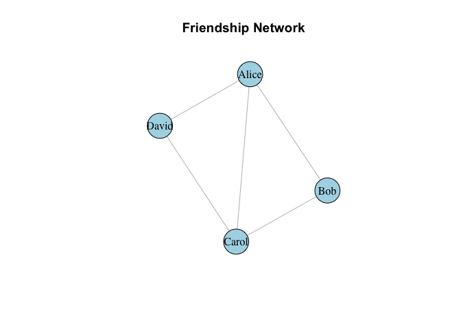<!-- -->

------------------------------------------------------------------------

### 1.3 Understanding Directed vs Undirected Networks

**Undirected networks:** Relationships are mutual (A—B means A connects
to B AND B connects to A)

- Examples: Facebook friends, co-authorship, physical proximity

**Directed networks:** Relationships have direction (A→B doesn’t mean
B→A)

- Examples: Twitter follows, email sent, advice seeking

Let’s create a **directed** network of who follows whom on social media:

``` r
# Create a directed edge list
follows <- tibble(
  follower = c("Alice", "Alice", "Bob", "Carol", "David", "David"),
  following = c("Bob", "Carol", "Carol", "David", "Alice", "Bob")
)

# View it
print(follows)
```

    ## # A tibble: 6 × 2
    ##   follower following
    ##   <chr>    <chr>    
    ## 1 Alice    Bob      
    ## 2 Alice    Carol    
    ## 3 Bob      Carol    
    ## 4 Carol    David    
    ## 5 David    Alice    
    ## 6 David    Bob

``` r
# Create directed network
g_follows <- graph_from_data_frame(follows, directed = TRUE)

# Plot with arrows
plot(g_follows,
     vertex.size = 30,
     vertex.color = "lightcoral",
     vertex.label.color = "black",
     edge.arrow.size = 0.5,
     edge.color = "gray",
     main = "Twitter Follow Network (Directed)")
```

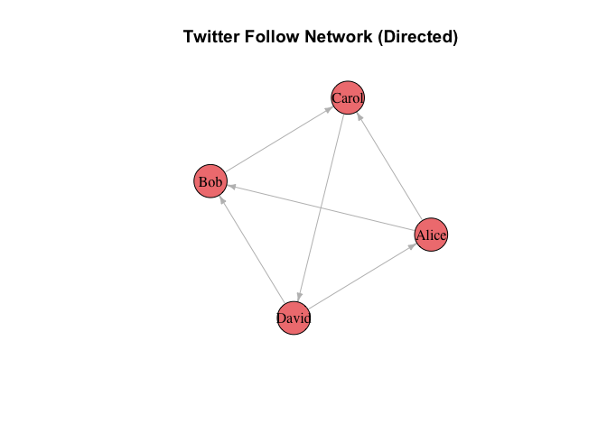<!-- -->

**Notice the arrows!** Alice follows Bob, but Bob doesn’t follow Alice
back.

------------------------------------------------------------------------

### 1.4 Adding Node Attributes

Networks become more interesting when nodes have attributes. Let’s add
information about our users:

``` r
# Create a node attribute data frame
user_info <- tibble(
  name = c("Alice", "Bob", "Carol", "David"),
  age = c(20, 22, 21, 23),
  major = c("Communication", "Computer Science", "Communication", "Biology")
)

# View it
print(user_info)
```

    ## # A tibble: 4 × 3
    ##   name    age major           
    ##   <chr> <dbl> <chr>           
    ## 1 Alice    20 Communication   
    ## 2 Bob      22 Computer Science
    ## 3 Carol    21 Communication   
    ## 4 David    23 Biology

``` r
# Create network with node attributes
g_with_attr <- graph_from_data_frame(
  d = follows,           # Edge list
  directed = TRUE,
  vertices = user_info   # Node attributes
)

# Check the attributes
vertex_attr(g_with_attr)
```

    ## $name
    ## [1] "Alice" "Bob"   "Carol" "David"
    ## 
    ## $age
    ## [1] 20 22 21 23
    ## 
    ## $major
    ## [1] "Communication"    "Computer Science" "Communication"    "Biology"

Now we can use these attributes in our visualization:

``` r
# Color nodes by major
V(g_with_attr)$color <- ifelse(V(g_with_attr)$major == "Communication", 
                                "lightblue", "lightgreen")

# Size nodes by age
V(g_with_attr)$size <- V(g_with_attr)$age * 2

# Plot
plot(g_with_attr,
     vertex.label.color = "black",
     edge.arrow.size = 0.5,
     edge.color = "gray",
     main = "Network with Attributes\n(Blue = Communication, Green = Other)")
```

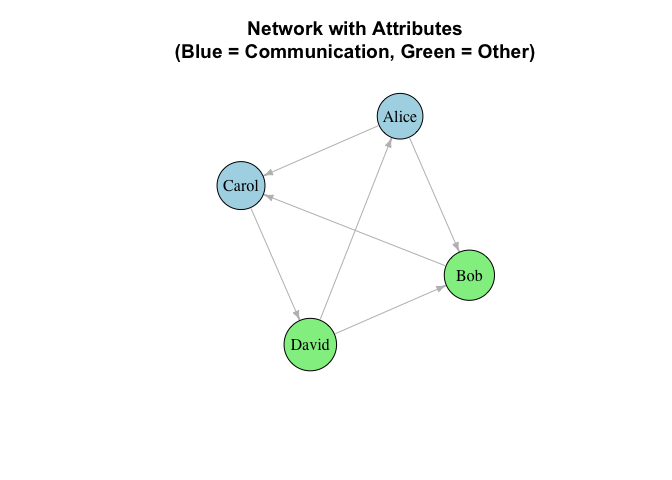<!-- -->

------------------------------------------------------------------------

### 1.5 Adding Edge Attributes (Weights)

Edges can also have attributes, most commonly **weights** that indicate
strength.

``` r
# Create weighted edge list (number of messages sent)
messages <- tibble(
  from = c("Alice", "Alice", "Bob", "Carol", "David"),
  to = c("Bob", "Carol", "Carol", "David", "Alice"),
  n_messages = c(15, 8, 3, 12, 20)  # Number of messages
)

print(messages)
```

    ## # A tibble: 5 × 3
    ##   from  to    n_messages
    ##   <chr> <chr>      <dbl>
    ## 1 Alice Bob           15
    ## 2 Alice Carol          8
    ## 3 Bob   Carol          3
    ## 4 Carol David         12
    ## 5 David Alice         20

``` r
# Create weighted network
g_weighted <- graph_from_data_frame(messages, directed = TRUE)

# Plot with edge width proportional to weight
plot(g_weighted,
     vertex.size = 30,
     vertex.color = "lightyellow",
     vertex.label.color = "black",
     edge.width = E(g_weighted)$n_messages / 3,  # Scale edge width
     edge.arrow.size = 0.5,
     edge.color = "darkblue",
     main = "Weighted Network\n(Edge width = number of messages)")
```

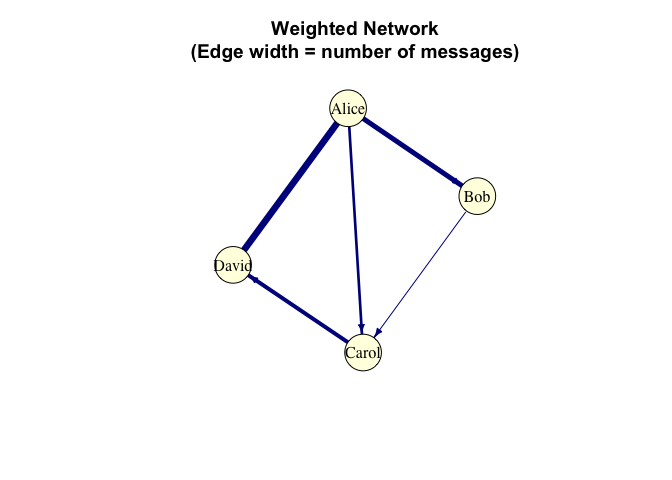<!-- -->

------------------------------------------------------------------------

### 1.6 Extracting Network Information

Once you have a network, you can extract information back into data
frames:

Edge List:

``` r
# Get edge list back as a data frame
edge_df <- as_data_frame(g_weighted, what = "edges")
print(edge_df)
```

    ##    from    to n_messages
    ## 1 Alice   Bob         15
    ## 2 Alice Carol          8
    ## 3   Bob Carol          3
    ## 4 Carol David         12
    ## 5 David Alice         20

Node List:

``` r
# Get node list with attributes
node_df <- as_data_frame(g_weighted, what = "vertices")
print(node_df)
```

    ##        name
    ## Alice Alice
    ## Bob     Bob
    ## Carol Carol
    ## David David

------------------------------------------------------------------------

### 1.7 Basic Network Statistics

Let’s calculate some basic network properties:

Number of nodes and edges:

``` r
print(paste("Number of users:", vcount(g_weighted)))
```

    ## [1] "Number of users: 4"

``` r
print(paste("Number of connections:", ecount(g_weighted)))
```

    ## [1] "Number of connections: 5"

Degree: how many connections each person has:

``` r
# Degree: how many connections each person has
degrees <- degree(g_weighted, mode = "all")
print(degrees)
```

    ## Alice   Bob Carol David 
    ##     3     2     3     2

In-degree: how many people send messages TO this person:

``` r
# In-degree: how many people send messages TO this person
in_degrees <- degree(g_weighted, mode = "in")
print(in_degrees)
```

    ## Alice   Bob Carol David 
    ##     1     1     2     1

Out-degree: how many people THIS person sends messages to:

``` r
# Out-degree: how many people THIS person sends messages to
out_degrees <- degree(g_weighted, mode = "out")
print(out_degrees)
```

    ## Alice   Bob Carol David 
    ##     2     1     1     1

**Interpretation:** - Carol has the highest in-degree (3) – receives
messages from many people

- Alice and David are most active (high out-degree)

------------------------------------------------------------------------

### 1.8 Quick Method: graph_from_literal()

For quick prototyping, igraph offers `graph_from_literal()`:

``` r
# Undirected network
g_simple <- graph_from_literal(Alice--Bob, Bob--Carol, Carol--David)
plot(g_simple, main = "Using graph_from_literal()")
```

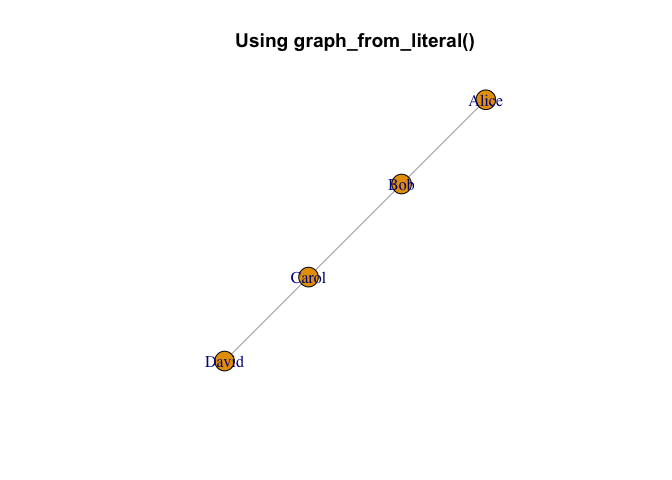<!-- -->

``` r
# Directed network
g_directed <- graph_from_literal(Alice+-Bob, Bob+-Carol, Carol+-David)
plot(g_directed, main = "Directed with +-")
```

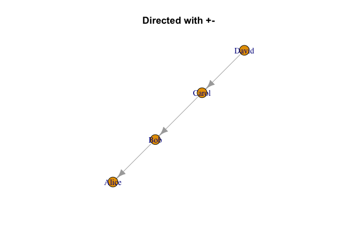<!-- -->

**Note:** The data frame method is better for real data because:

1.  Your data is usually already in a spreadsheet/CSV

2.  You can add attributes easily

3.  It’s reproducible and follows tidy principles

------------------------------------------------------------------------

### Class Exercise 1:

Create your own small network:

1.  Make a tibble edge list of 5-6 people and their connections

2.  Add a `strength` column (1-10 scale)

3.  Convert to igraph network

4.  Plot with edge width based on strength

5.  Calculate and interpret the degrees

``` r
# Your workspace:
```

------------------------------------------------------------------------

## 2. Network Structures: Theory Meets Practice

Why do network structures matter? Different social phenomena create
different network patterns. Understanding these patterns helps us:

1.  **Identify** what kind of social process created the network

2.  **Compare** real networks to theoretical models

3.  **Predict** how information, influence, or resources flow

**Additional Resource:** For more in-depth tutorials on network analysis
in R, see [Katya Ognyanova’s excellent
tutorials](https://kateto.net/tutorials/) - highly recommended for
expanding your network analysis skills!

------------------------------------------------------------------------

### 2.1 Basic Network Structures

These are building blocks that help us understand more complex
real-world networks.

#### Empty Graph

A network with nodes but no connections. This represents the starting
point before any relationships form.

``` r
# 20 people who haven't met yet
empty_net <- make_empty_graph(20)
plot(empty_net, 
     vertex.size = 15, 
     vertex.color = "lightgray",
     vertex.label = NA,
     main = "Empty Network\n(No connections yet)")
```

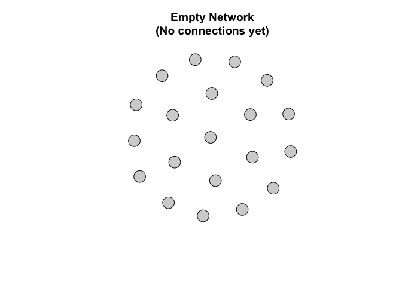<!-- -->

**Real-world example:** A new online platform before users start
connecting.

------------------------------------------------------------------------

#### Complete Graph (Fully Connected)

Every node connects to every other node. This represents maximum
possible connectivity where all relationships exist.

``` r
# Small group where everyone knows everyone
complete_net <- make_full_graph(8)
plot(complete_net, 
     vertex.size = 20, 
     vertex.color = "lightblue",
     vertex.label = NA,
     main = "Complete Network\n(Everyone knows everyone)")
```

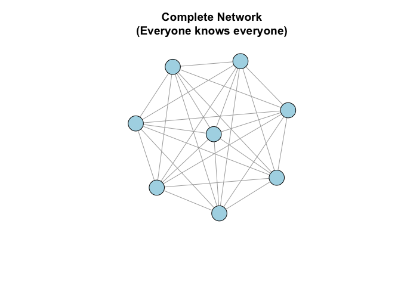<!-- -->

**Real-world example:** A small work team or friend group where everyone
interacts with everyone else.

**Question:** Why are complete graphs rare in large networks?

------------------------------------------------------------------------

#### Star Network

One central hub connected to all others, but periphery nodes don’t
connect to each other. This creates a single point of control where all
information flows through the center.

``` r
# One influencer with many followers
star_net <- make_star(15, mode = "undirected")
plot(star_net, 
     vertex.size = c(30, rep(15, 14)),  # Make center larger
     vertex.color = c("red", rep("lightblue", 14)),
     vertex.label = NA,
     main = "Star Network\n(Central hub)")
```

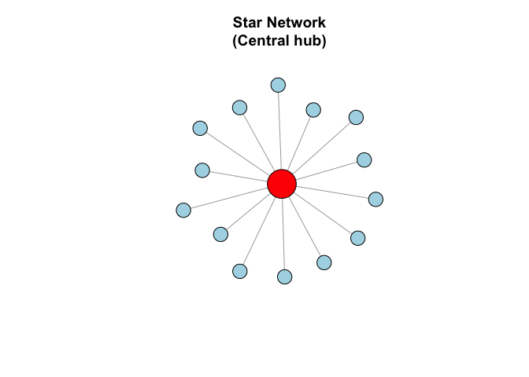<!-- -->

**Real-world examples:**

- An influencer and their followers (who don’t follow each other)

- A professor and students in office hours

- A help desk and clients

**Key insight:** Central node has enormous power and control over
information flow.

------------------------------------------------------------------------

#### Ring Network

Each node connects to two neighbors, forming a closed loop. Information
must pass through many intermediaries to travel across the network.

``` r
# People sitting in a circle
ring_net <- make_ring(20)
plot(ring_net, 
     vertex.size = 15, 
     vertex.color = "lightgreen",
     vertex.label = NA,
     layout = layout_in_circle,
     main = "Ring Network\n(Local connections only)")
```

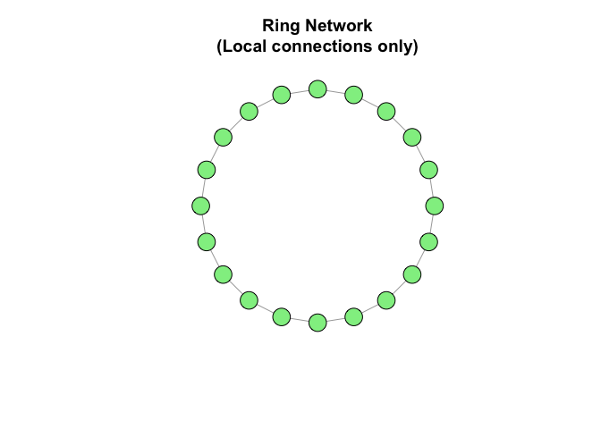<!-- -->

**Real-world example:**

- Neighbors on a street (you know the house to your left and right)

- A “telephone game” or rumor chain

**Key insight:** Information takes a long time to spread across the
network.

------------------------------------------------------------------------

#### Tree/Hierarchical Network

Branching structure with no cycles where you can’t return to a node by
following edges. This represents formal organizational hierarchies with
clear authority paths.

``` r
# Organizational chart
tree_net <- make_tree(40, children = 3, mode = "undirected")
plot(tree_net, 
     vertex.size = 10, 
     vertex.color = "lightyellow",
     vertex.label = NA,
     main = "Tree Network\n(Hierarchical structure)")
```

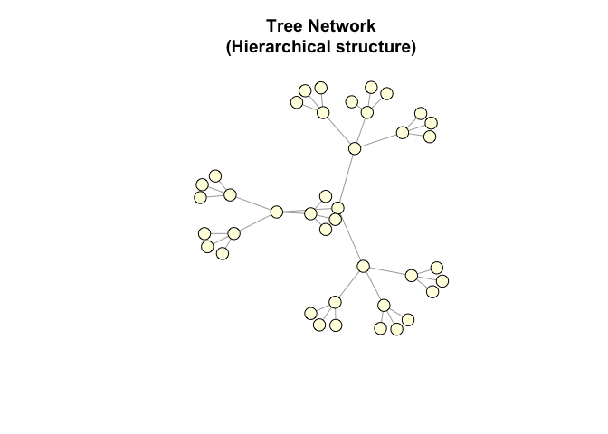<!-- -->

**Real-world examples:**

- Corporate org charts

- Family trees

- File systems on computers

**Key insight:** Clear hierarchy, efficient information flow up and
down, but no shortcuts.

------------------------------------------------------------------------

### 2.2 Random and Theoretical Network Models

These models help us understand how real networks form and function.

#### Erdős-Rényi Random Graph

Connections are formed completely at random with equal probability
between any two nodes. This serves as a null model - what would happen
if social forces didn’t exist?

``` r
# Random connections: 100 nodes, 200 random edges
random_net <- sample_gnm(n = 100, m = 200)
plot(random_net, 
     vertex.size = 5, 
     vertex.color = "lightcoral",
     vertex.label = NA,
     main = "Random Network\n(Erdős-Rényi Model)")
```

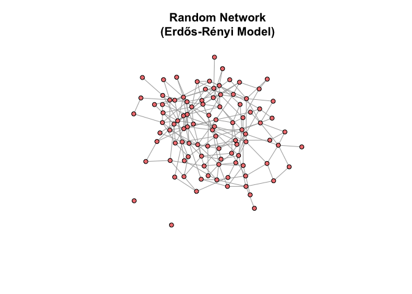<!-- -->

**Question:** Do real social networks look like this? (Hint: No!)

**Why not?** People don’t befriend others randomly - we have homophily
(like attracts like), triadic closure (friends of friends become
friends), etc.

------------------------------------------------------------------------

#### Small-World Network (Watts-Strogatz Model)

Combines local clustering (you know your neighbors’ neighbors) with
occasional long-range connections (shortcuts across the network). This
explains the “six degrees of separation” phenomenon where distant people
are connected by surprisingly short paths.

``` r
# Most connections are local, with a few long-distance links
small_world <- sample_smallworld(dim = 1, size = 30, nei = 2, p = 0.05)
plot(small_world, 
     vertex.size = 8, 
     vertex.color = "lightblue",
     vertex.label = NA, 
     layout = layout_in_circle,
     main = "Small-World Network\n('Six degrees of separation')")
```

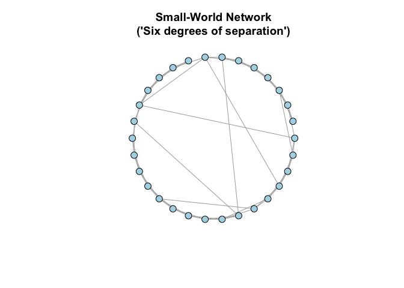<!-- -->

**Real-world examples:** - Social networks (you know your friends and
their friends, plus a few random connections)

- The famous “six degrees of separation” phenomenon

- Neural networks in the brain

**Key insight:** Explains why information can spread quickly despite
most connections being local.

------------------------------------------------------------------------

#### Scale-Free Network (Barabási-Albert Model)

“Rich get richer” via preferential attachment - new nodes preferentially
connect to already well-connected nodes, creating **hubs**. This creates
power-law degree distributions where most nodes have few connections but
a few hubs have many.

``` r
# Preferential attachment: popular nodes get more connections
scale_free <- sample_pa(n = 100, power = 1, m = 2, directed = FALSE)

# Calculate degree to identify hubs
deg <- degree(scale_free)

# Color hubs differently
V(scale_free)$color <- ifelse(deg > 10, "red", "lightblue")
V(scale_free)$size <- sqrt(deg) * 3

plot(scale_free, 
     vertex.label = NA,
     main = "Scale-Free Network\n(Red = Hubs with many connections)")
```

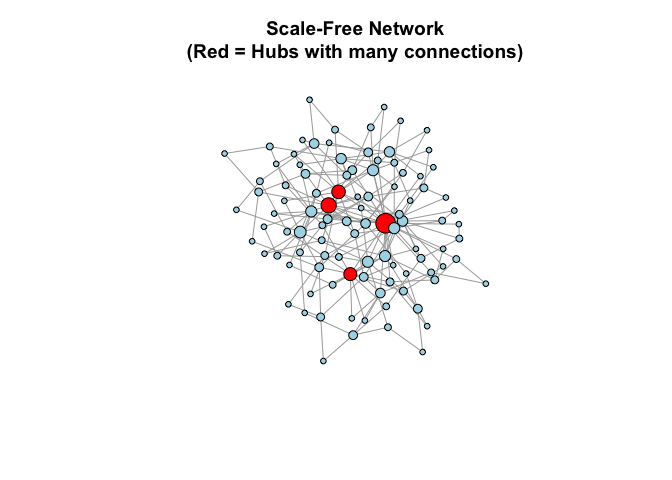<!-- -->

**Real-world examples:**

- Twitter (celebrities have millions of followers, most people have few)

- Citation networks (seminal papers get cited thousands of times)

- World Wide Web (some sites have millions of links)

- Airline networks (major hubs like Atlanta, Chicago)

**Key insight:**

- A few nodes (hubs) have massive influence

- “Removing” hubs can collapse the network

- Information spreads very quickly through hubs

------------------------------------------------------------------------

### 2.3 Comparing Network Structures

Let’s visualize degree distributions to see the difference:

``` r
# Calculate degrees for each model
deg_random <- degree(random_net)
deg_scale_free <- degree(scale_free)

# Create comparison data frame
comparison <- tibble(
  model = c(rep("Random", length(deg_random)), 
            rep("Scale-Free", length(deg_scale_free))),
  degree = c(deg_random, deg_scale_free)
)

# Plot
ggplot(comparison, aes(x = degree, fill = model)) +
  geom_histogram(alpha = 0.6, position = "identity", bins = 20) +
  labs(title = "Degree Distribution: Random vs Scale-Free",
       x = "Degree (number of connections)",
       y = "Count",
       fill = "Network Type") +
  theme_minimal()
```

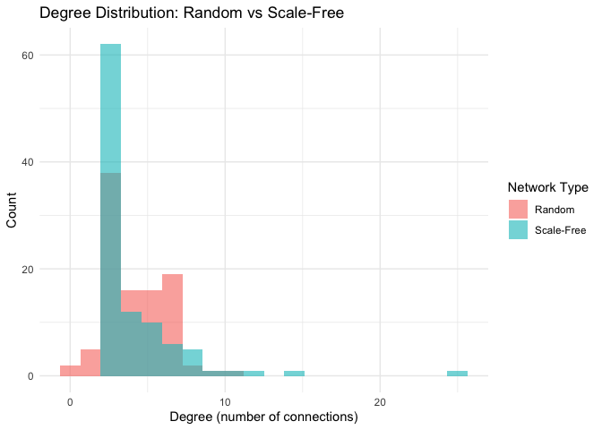<!-- -->

**Interpretation:**

- **Random network:** Most nodes have similar degrees (bell curve)

- **Scale-free network:** A few hubs with many connections, most nodes
  have few connections (power-law distribution)

------------------------------------------------------------------------

### 2.4 Famous Example: Zachary’s Karate Club

A real-world social network collected by Wayne Zachary in the 1970s. It
shows friendships in a karate club that eventually split into two groups
due to a conflict between the instructor and administrator.

``` r
# Load the famous karate club network
karate <- graph("Zachary")

# Plot
plot(karate, 
     vertex.size = 15,
     vertex.color = "orange",
     main = "Zachary's Karate Club\n(Real social network from 1977)")
```

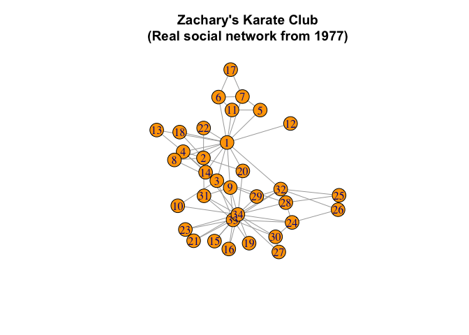<!-- -->

**Why is this dataset famous?**

- Real social network data from systematic observation

- Documents a social fission (club split due to conflict)

- Used to test community detection algorithms

- Gold standard for validating network analysis methods

We’ll analyze this more later!

------------------------------------------------------------------------

### 2.5 Network Operations

Sometimes we need to modify or combine networks for analysis or
comparison.

#### Rewiring Edges

Randomly rewire some connections while preserving the degree
distribution. This creates null models for statistical comparison.

``` r
# Original ring network
original <- make_ring(20)

# Rewire 20% of edges randomly
rewired <- rewire(original, each_edge(prob = 0.2))

# Compare
par(mfrow = c(1, 2))
plot(original, 
     vertex.size = 10, 
     vertex.label = NA,
     layout = layout_in_circle,
     main = "Original Ring")
plot(rewired, 
     vertex.size = 10, 
     vertex.label = NA,
     layout = layout_in_circle,
     main = "After Rewiring")
```

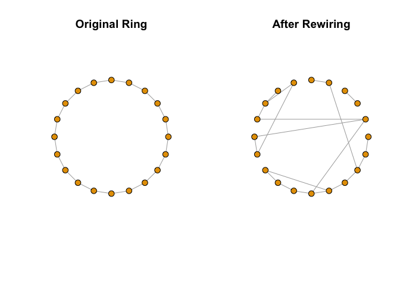<!-- -->

``` r
par(mfrow = c(1, 1))
```

**Use case:** Testing whether network structure affects an outcome, or
creating null models for statistical comparison.

------------------------------------------------------------------------

#### Extracting Subgraphs

Extract a subset of nodes and their connections to focus analysis on
specific communities or influential actors.

``` r
# Create a larger network
full_net <- sample_pa(n = 100, m = 2, directed = FALSE)

# Extract only nodes with degree > 5 (the most connected)
high_degree_nodes <- V(full_net)[degree(full_net) > 5]
subgraph <- induced_subgraph(full_net, high_degree_nodes)

# Compare
par(mfrow = c(1, 2))
plot(full_net, 
     vertex.size = 5, 
     vertex.label = NA,
     main = "Full Network")
plot(subgraph, 
     vertex.size = 10, 
     vertex.label = NA,
     main = "High-Degree Subgraph")
```

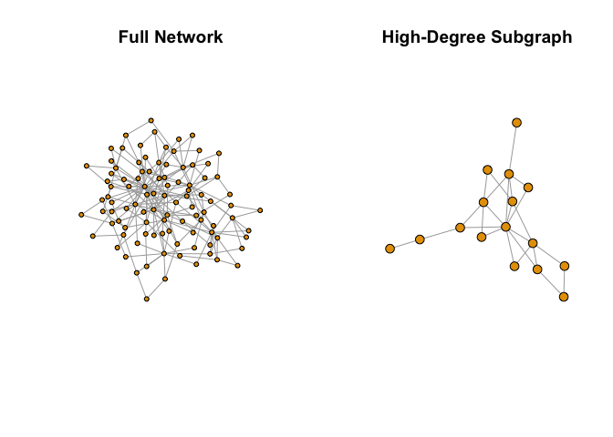<!-- -->

``` r
par(mfrow = c(1, 1))
```

**Use case:** Focusing on influencers or core members of a community.

------------------------------------------------------------------------

### Class Exercise 2:

1.  Create a scale-free network with 50 nodes

2.  Calculate the degree of each node

3.  Identify the top 3 “hubs” (nodes with highest degree)

4.  Create a subgraph containing only these hubs and their immediate
    neighbors

5.  Plot both networks and compare

**Bonus:** What happens if you remove the hubs from a scale-free
network? Try it!

``` r
# Your workspace:
```

------------------------------------------------------------------------

**Additional Resources:**

- [Katya Ognyanova’s Network Tutorials](https://kateto.net/tutorials/) -
  comprehensive guides for network visualization and analysis

- [igraph documentation](https://r.igraph.org/) - official package
  reference

------------------------------------------------------------------------

Let’s clean up our workspace before moving to real data:

``` r
rm(list = ls())
```

------------------------------------------------------------------------

## 3. Real World Data: College Communication Network

### 3.1 Understanding Real Network Data

Now let’s work with a **real communication network** from UC Irvine.
This dataset contains private messages sent on an online platform
between students over 193 days in 2004.

**Why this dataset?**

- Real human communication patterns

- Directed network (messages have a sender and receiver)

- Temporal data (we can see when messages were sent)

- Relevant to students - college communication!

**Dataset info:**

- **Nodes:** 1,899 students

- **Edges:** 20,296 messages

- **Time period:** 193 days (April-October 2004)

- **Source:** [Stanford
  SNAP](https://snap.stanford.edu/data/CollegeMsg.html) Pietro
  Panzarasa, Tore Opsahl, and Kathleen M. Carley. “Patterns and dynamics
  of users’ behavior and interaction: Network analysis of an online
  community.” Journal of the American Society for Information Science
  and Technology 60.5 (2009): 911-932.

------------------------------------------------------------------------

### 3.2 Loading Real Network Data (The Tidy Way)

Network data often comes as an **edge list** - a table where each row is
a connection. Let’s load and explore it:

``` r
# Load the data from GitHub backup
url <- "https://raw.githubusercontent.com/aysedeniz09/IntroCSS/refs/heads/main/data/CollegeMsg.txt"
college_msg <- read.table(url, header = FALSE, 
                          col.names = c("sender", "receiver", "timestamp"))

# Convert to tibble for tidy operations
college_msg <- as_tibble(college_msg)

# View the data
head(college_msg)
```

    ## # A tibble: 6 × 3
    ##   sender receiver  timestamp
    ##    <int>    <int>      <int>
    ## 1      1        2 1082040961
    ## 2      3        4 1082155839
    ## 3      5        2 1082414391
    ## 4      6        7 1082439619
    ## 5      8        7 1082439756
    ## 6      9       10 1082440403

**What does each row mean?**

- `sender`: Student ID who sent the message

- `receiver`: Student ID who received the message

- `timestamp`: Unix timestamp (seconds since January 1, 1970)

Let’s make the timestamp more readable:

``` r
# Convert Unix timestamp to readable date
college_msg <- college_msg |>
  mutate(date = as.POSIXct(timestamp, origin = "1970-01-01"),
         month = lubridate::month(date, label = TRUE),
         day_of_week = lubridate::wday(date, label = TRUE))

# View the updated data
head(college_msg)
```

    ## # A tibble: 6 × 6
    ##   sender receiver  timestamp date                month day_of_week
    ##    <int>    <int>      <int> <dttm>              <ord> <ord>      
    ## 1      1        2 1082040961 2004-04-15 10:56:01 Apr   Thu        
    ## 2      3        4 1082155839 2004-04-16 18:50:39 Apr   Fri        
    ## 3      5        2 1082414391 2004-04-19 18:39:51 Apr   Mon        
    ## 4      6        7 1082439619 2004-04-20 01:40:19 Apr   Tue        
    ## 5      8        7 1082439756 2004-04-20 01:42:36 Apr   Tue        
    ## 6      9       10 1082440403 2004-04-20 01:53:23 Apr   Tue

``` r
print(paste("Date range:", min(college_msg$date), "to", max(college_msg$date)))
```

    ## [1] "Date range: 2004-04-15 10:56:01 to 2004-10-26 03:52:22"

------------------------------------------------------------------------

### 3.3 Exploring the Data Before Building the Network

Before creating the network, let’s explore the data using tidy
principles:

``` r
# How many unique students?
n_students <- length(unique(c(college_msg$sender, college_msg$receiver)))
print(paste("Number of students:", n_students))
```

    ## [1] "Number of students: 1899"

``` r
# How many messages total?
print(paste("Total messages:", nrow(college_msg)))
```

    ## [1] "Total messages: 59835"

``` r
# Who are the most active senders?
top_senders <- college_msg |>
  count(sender, sort = TRUE) |>
  head(10)

print("Top 10 most active senders:")
```

    ## [1] "Top 10 most active senders:"

``` r
print(top_senders)
```

    ## # A tibble: 10 × 2
    ##    sender     n
    ##     <int> <int>
    ##  1      9  1091
    ##  2    323  1012
    ##  3     12   993
    ##  4    103   739
    ##  5    105   686
    ##  6   1624   640
    ##  7     41   561
    ##  8    249   493
    ##  9    372   485
    ## 10     32   457

``` r
# Who receives the most messages?
top_receivers <- college_msg |>
  count(receiver, sort = TRUE) |>
  head(10)

print("Top 10 most contacted students:")
```

    ## [1] "Top 10 most contacted students:"

``` r
print(top_receivers)
```

    ## # A tibble: 10 × 2
    ##    receiver     n
    ##       <int> <int>
    ##  1     1624   558
    ##  2      323   534
    ##  3       32   501
    ##  4      103   440
    ##  5      372   428
    ##  6      454   377
    ##  7      475   372
    ##  8      254   351
    ##  9      617   351
    ## 10      105   345

**Question:** What does it mean if someone is a top sender but not a top
receiver?

------------------------------------------------------------------------

### 3.4 Temporal Patterns: When Do Students Communicate?

Let’s explore communication patterns over time:

``` r
# Messages per month
messages_per_month <- college_msg |>
  group_by(month) |>
  summarize(n_messages = n())

# Plot
ggplot(messages_per_month, aes(x = month, y = n_messages)) +
  geom_col(fill = "steelblue") +
  labs(title = "Messages Sent Per Month",
       x = "Month",
       y = "Number of Messages") +
  theme_minimal()
```

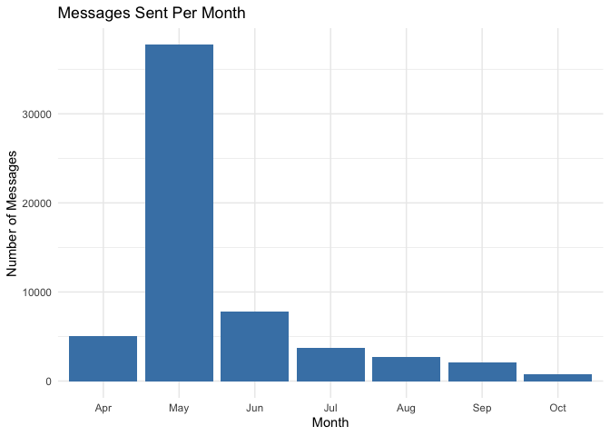<!-- -->

``` r
# Messages per day of week
messages_per_day <- college_msg |>
  group_by(day_of_week) |>
  summarize(n_messages = n())

# Plot
ggplot(messages_per_day, aes(x = day_of_week, y = n_messages)) +
  geom_col(fill = "coral") +
  labs(title = "Messages Sent Per Day of Week",
       x = "Day of Week",
       y = "Number of Messages") +
  theme_minimal()
```

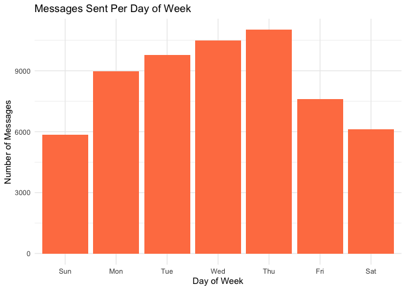<!-- -->

**Class discussion:**

- When are students most/least active?

- What might explain these patterns?

- How does this relate to Breiger’s (1974) concept of duality - students
  connected through temporal patterns?

------------------------------------------------------------------------

### 3.5 Building the Network Graph

Now let’s create the network from our edge list:

``` r
# Create network from edge list
# Note: This is a DIRECTED network (sender → receiver)
g_college <- graph_from_data_frame(
  d = college_msg |> select(sender, receiver),  # Edge list
  directed = TRUE  # Messages have direction
)

# Check the network object
print(g_college)
```

    ## IGRAPH b11a3d8 DN-- 1899 59835 -- 
    ## + attr: name (v/c)
    ## + edges from b11a3d8 (vertex names):
    ##  [1] 1 ->2  3 ->4  5 ->2  6 ->7  8 ->7  9 ->10 9 ->11 12->13 9 ->14 9 ->15
    ## [11] 9 ->16 9 ->17 9 ->14 9 ->18 19->18 20->21 19->22 8 ->23 9 ->24 9 ->22
    ## [21] 25->21 26->7  27->28 29->25 30->31 30->31 30->31 30->31 32->33 34->35
    ## [31] 34->33 36->37 38->39 36->40 41->15 41->11 41->14 41->13 41->39 41->42
    ## [41] 41->43 9 ->40 44->45 46->22 44->46 47->46 48->46 9 ->49 36->50 44->51
    ## [51] 32->52 36->32 53->54 36->55 56->57 36->32 36->58 44->59 51->58 44->14
    ## [61] 36->56 36->60 56->61 62->50 36->60 32->59 36->60 36->50 41->63 41->64
    ## [71] 41->65 41->56 41->61 41->43 41->52 41->58 41->59 9 ->64 9 ->58 12->66
    ## + ... omitted several edges

**Understanding the output:**

- `DN--` means Directed, Named network

- First number = nodes (students)

- Second number = edges (messages)

``` r
# Basic network statistics
print(paste("Number of students:", vcount(g_college)))
```

    ## [1] "Number of students: 1899"

``` r
print(paste("Number of messages:", ecount(g_college)))
```

    ## [1] "Number of messages: 59835"

``` r
print(paste("Network density:", round(edge_density(g_college), 4)))
```

    ## [1] "Network density: 0.0166"

**Network density:** What proportion of all possible connections
actually exist?

- Dense networks: High interconnection

- Sparse networks: Few connections relative to possible connections

**Question:** Why is this network so sparse? What does this tell us
about college communication?

------------------------------------------------------------------------

### 3.6 Visualizing the Full Network

``` r
# WARNING: This network is too large to visualize meaningfully
# Let's try it anyway to see what happens

plot(g_college,
     vertex.size = 2,
     vertex.label = NA,
     edge.arrow.size = 0.1,
     edge.color = rgb(0, 0, 0, 0.1),  # Transparent edges
     main = "Full College Network\n(Hard to interpret!)")
```

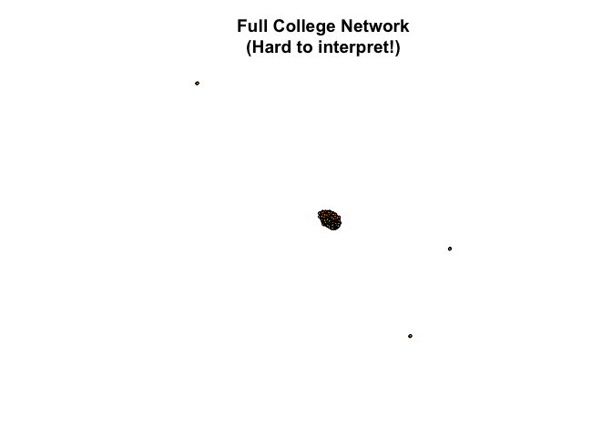<!-- -->

**Problem:** With 1,899 nodes and 20,296 edges, the full network is a
“hairball” - impossible to interpret visually!

**Solution:** We need to focus on meaningful subsets.

------------------------------------------------------------------------

### 3.7 Creating a Meaningful Subnetwork

Let’s focus on the **most active communicators** - students who sent at
least 50 messages:

``` r
# Identify active students
active_senders <- college_msg |>
  group_by(sender) |>
  summarize(n_sent = n()) |>
  filter(n_sent >= 50) |>
  pull(sender)

print(paste("Number of active senders:", length(active_senders)))
```

    ## [1] "Number of active senders: 298"

``` r
# Also include anyone they communicated with
active_network <- college_msg |>
  filter(sender %in% active_senders | receiver %in% active_senders)

print(paste("Messages in active subnetwork:", nrow(active_network)))
```

    ## [1] "Messages in active subnetwork: 54947"

Now create a network from this subset:

``` r
# Create subnetwork
g_active <- graph_from_data_frame(
  d = active_network |> select(sender, receiver),
  directed = TRUE
)

print(g_active)
```

    ## IGRAPH e45a7a0 DN-- 1712 54947 -- 
    ## + attr: name (v/c)
    ## + edges from e45a7a0 (vertex names):
    ##  [1] 1 ->2  3 ->4  6 ->7  8 ->7  9 ->10 9 ->11 12->13 9 ->14 9 ->15 9 ->16
    ## [11] 9 ->17 9 ->14 9 ->18 19->18 19->22 8 ->23 9 ->24 9 ->22 26->7  27->28
    ## [21] 32->33 34->35 34->33 36->37 38->39 36->40 41->15 41->11 41->14 41->13
    ## [31] 41->39 41->42 41->43 9 ->40 44->45 44->46 48->46 9 ->49 36->50 44->51
    ## [41] 32->52 36->32 53->54 36->55 36->32 36->58 44->59 51->58 44->14 36->56
    ## [51] 36->60 62->50 36->60 32->59 36->60 36->50 41->63 41->64 41->65 41->56
    ## [61] 41->61 41->43 41->52 41->58 41->59 9 ->64 9 ->58 12->66 32->58 12->66
    ## [71] 67->32 41->32 67->32 32->68 68->56 67->32 67->32 68->61 67->32 67->8 
    ## + ... omitted several edges

``` r
# Plot the subnetwork
plot(g_active,
     vertex.size = 5,
     vertex.label = NA,
     vertex.color = "lightblue",
     edge.arrow.size = 0.3,
     edge.color = rgb(0, 0, 0, 0.2),
     main = "Active Communicators Subnetwork\n(Students who sent 50+ messages)")
```

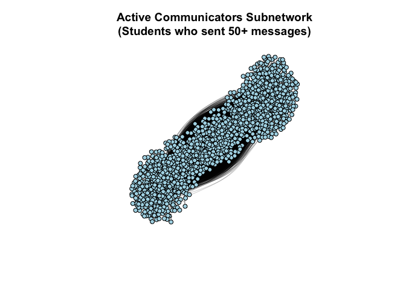<!-- -->

**Much better!** Now we can see structure.

------------------------------------------------------------------------

### 3.8 Network Statistics: Who is Important?

#### 3.8.1 Degree Centrality

**Degree** = number of connections. In directed networks:

- **Out-degree:** Number of messages SENT

- **In-degree:** Number of messages RECEIVED

- **Total degree:** Sum of both

``` r
# Calculate degrees for the active network
out_deg <- degree(g_active, mode = "out")
in_deg <- degree(g_active, mode = "in")
total_deg <- degree(g_active, mode = "all")

# Create a summary data frame
degree_summary <- tibble(
  student = V(g_active)$name,
  out_degree = out_deg,
  in_degree = in_deg,
  total_degree = total_deg
)

# Top 10 by out-degree (most active senders)
top_senders_degree <- degree_summary |>
  arrange(desc(out_degree)) |>
  head(10)

print("Top 10 Most Active Senders (Out-Degree):")
```

    ## [1] "Top 10 Most Active Senders (Out-Degree):"

``` r
print(top_senders_degree)
```

    ## # A tibble: 10 × 4
    ##    student out_degree in_degree total_degree
    ##    <chr>        <dbl>     <dbl>        <dbl>
    ##  1 9             1091       198         1289
    ##  2 323           1012       534         1546
    ##  3 12             993       217         1210
    ##  4 103            739       440         1179
    ##  5 105            686       345         1031
    ##  6 1624           640       558         1198
    ##  7 41             561       186          747
    ##  8 249            493       257          750
    ##  9 372            485       428          913
    ## 10 32             457       501          958

``` r
# Top 10 by in-degree (most popular receivers)
top_receivers_degree <- degree_summary |>
  arrange(desc(in_degree)) |>
  head(10)

print("Top 10 Most Popular Receivers (In-Degree):")
```

    ## [1] "Top 10 Most Popular Receivers (In-Degree):"

``` r
print(top_receivers_degree)
```

    ## # A tibble: 10 × 4
    ##    student out_degree in_degree total_degree
    ##    <chr>        <dbl>     <dbl>        <dbl>
    ##  1 1624           640       558         1198
    ##  2 323           1012       534         1546
    ##  3 32             457       501          958
    ##  4 103            739       440         1179
    ##  5 372            485       428          913
    ##  6 454            227       377          604
    ##  7 475            181       372          553
    ##  8 254            213       351          564
    ##  9 617            394       351          745
    ## 10 105            686       345         1031

**Interpretation:**

- High out-degree = Very active sender

- High in-degree = Very popular/central receiver

- High total degree = Overall hub in the network

``` r
# Visualize degree distribution
ggplot(degree_summary, aes(x = total_degree)) +
  geom_histogram(binwidth = 5, fill = "steelblue", color = "white") +
  labs(title = "Degree Distribution",
       x = "Total Degree",
       y = "Number of Students") +
  theme_minimal()
```

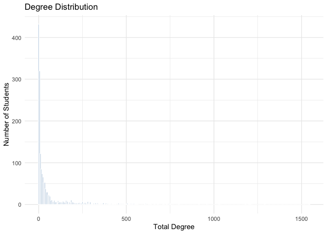<!-- -->

**What do we see?** Most students have few connections, a few students
have many - this is a **scale-free** pattern!

------------------------------------------------------------------------

#### 3.8.2 Visualize Network with Degree

Let’s size nodes by their total degree:

``` r
# Size nodes by degree
V(g_active)$size <- sqrt(total_deg) * 2

# Color by in-degree (popularity)
# Create color gradient
color_scale <- colorRampPalette(c("lightblue", "darkred"))(max(in_deg) + 1)
V(g_active)$color <- color_scale[in_deg + 1]

plot(g_active,
     vertex.label = NA,
     edge.arrow.size = 0.2,
     edge.color = rgb(0, 0, 0, 0.2),
     main = "College Network by Degree\n(Size = total degree, Color = in-degree/popularity)")
```

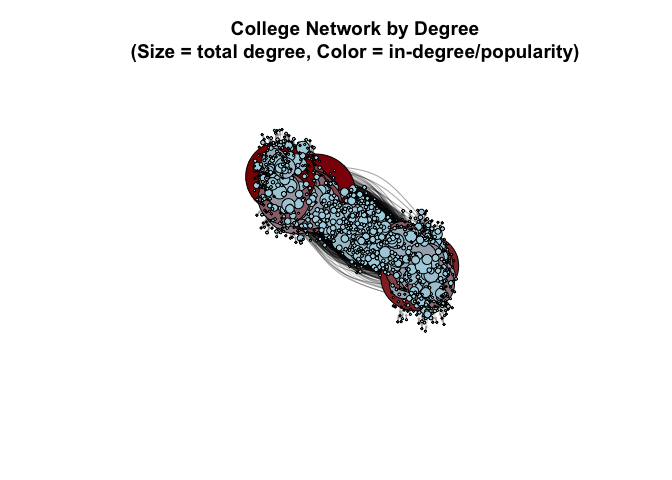<!-- -->

**Red nodes** = Students who receive many messages (popular)

**Large nodes** = Students with many connections overall

------------------------------------------------------------------------

### 3.9 Betweenness Centrality: Who Bridges Different Groups?

**Betweenness** measures how often a node lies on the shortest path
between other nodes. High betweenness = **broker** or **bridge** between
different groups.

``` r
# Calculate betweenness (this can take a moment for larger networks)
betw <- betweenness(g_active, directed = TRUE)

# Add to our summary
degree_summary$betweenness <- betw

# Top 10 by betweenness
top_brokers <- degree_summary |>
  arrange(desc(betweenness)) |>
  head(10)

print("Top 10 Brokers (Highest Betweenness):")
```

    ## [1] "Top 10 Brokers (Highest Betweenness):"

``` r
print(top_brokers)
```

    ## # A tibble: 10 × 5
    ##    student out_degree in_degree total_degree betweenness
    ##    <chr>        <dbl>     <dbl>        <dbl>       <dbl>
    ##  1 32             457       501          958     125242.
    ##  2 103            739       440         1179     105055.
    ##  3 105            686       345         1031     100941.
    ##  4 42             346       263          609      96759.
    ##  5 400            443       236          679      95504.
    ##  6 9             1091       198         1289      86611.
    ##  7 713            446       196          642      70779.
    ##  8 249            493       257          750      68428.
    ##  9 638            397       231          628      67989.
    ## 10 372            485       428          913      66930.

**Key insight from Breiger (1974):** These students act as bridges
between different social circles. They may not be the most popular, but
they connect different groups!

``` r
# Visualize with betweenness
V(g_active)$size <- sqrt(betw) / 3
V(g_active)$color <- ifelse(betw > median(betw), "orange", "lightblue")

plot(g_active,
     vertex.label = NA,
     edge.arrow.size = 0.2,
     edge.color = rgb(0, 0, 0, 0.1),
     main = "College Network by Betweenness\n(Orange = High betweenness brokers)")
```

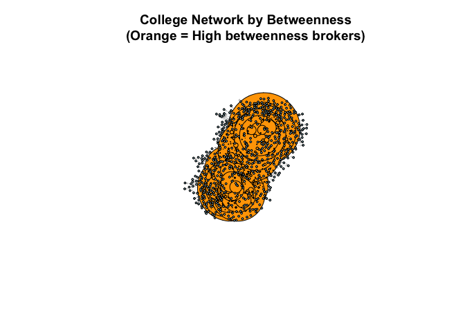<!-- -->

------------------------------------------------------------------------

### 3.10 Reciprocity: Do Students Message Each Other Back?

In communication networks, **reciprocity** is important - do people
respond to messages?

``` r
# Calculate reciprocity
recip <- reciprocity(g_active)
print(paste("Reciprocity:", round(recip, 3)))
```

    ## [1] "Reciprocity: 0.611"

**Interpretation:**

- Reciprocity = 0: No mutual communication

- Reciprocity = 1: All communication is mutual

- Our value = ?

Let’s find examples of reciprocal vs non-reciprocal relationships:

``` r
# Find mutual edges (both A→B and B→A exist)
mutual_edges <- which_mutual(g_active)
print(paste("Number of mutual connections:", sum(mutual_edges)))
```

    ## [1] "Number of mutual connections: 42805"

``` r
# Calculate percentage
pct_mutual <- (sum(mutual_edges) / ecount(g_active)) * 100
print(paste("Percentage of edges that are mutual:", round(pct_mutual, 1), "%"))
```

    ## [1] "Percentage of edges that are mutual: 77.9 %"

------------------------------------------------------------------------

### Class Exercise 3:

Using the full `g_college` network:

1.  Calculate the in-degree for all students

2.  Create a histogram of in-degree distribution

3.  Identify the top 5 “popular” students (highest in-degree)

4.  Create a subnetwork containing only these 5 students and their
    immediate neighbors

5.  Calculate the reciprocity of this subnetwork

**Questions to consider:**

- How does this subnetwork’s reciprocity compare to the full network?

- What does this tell us about communication patterns around popular
  students?

``` r
# Your workspace:
```

------------------------------------------------------------------------

## 4. Clustering & Communities

Community detection helps us understand how networks are organized into
groups. In social networks, communities represent groups of people who
interact more with each other than with outsiders.

**Why This Matters:**

- Identify friend groups or cliques

- Understand information flow patterns

- Detect organizational substructures

- Find isolated or bridge communities

------------------------------------------------------------------------

### 4.1 Transitivity (Clustering Coefficient)

**Transitivity** measures how “clique-like” a network is. If student A
messages student B, and student B messages student C, how likely is it
that student A also messages student C?

**High transitivity** → tight-knit groups (e.g., close friend circles)

**Low transitivity** → loose connections (e.g., broadcasting to many)

``` r
# Calculate global transitivity for the full network
trans_full <- transitivity(g_college, type = "global")
print(paste("Global transitivity:", round(trans_full, 3)))
```

    ## [1] "Global transitivity: 0.057"

``` r
# Calculate for our active students subnetwork
trans_sub <- transitivity(g_active, type = "global")
print(paste("Active students transitivity:", round(trans_sub, 3)))
```

    ## [1] "Active students transitivity: 0.055"

**Interpretation:**

- Values range from 0 (no triangles) to 1 (all possible triangles exist)

- Social networks typically have higher transitivity than random
  networks

- Compare these values to a random network with the same size:

``` r
# Create a random network with same number of nodes and edges
random_net <- sample_gnm(n = vcount(g_active), m = ecount(g_active), directed = TRUE)
trans_random <- transitivity(random_net, type = "global")

print(paste("Random network transitivity:", round(trans_random, 3)))
```

    ## [1] "Random network transitivity: 0.037"

The college network should have **higher** transitivity than random,
showing real social structure.

------------------------------------------------------------------------

### 4.2 Community Detection (Louvain Method)

The **Louvain algorithm** finds groups of students who message each
other frequently. It maximizes **modularity** - a measure of how
separated communities are.

Citation: Blondel, V. D., Guillaume, J.-L., Lambiotte, R., & Lefebvre,
E. (2008). Fast unfolding of communities in large networks. Journal of
Statistical Mechanics: Theory and Experiment, 10, 1–12.
<https://doi.org/10.1088/1742-5468/2008/10/P10008>

**Important Note:** Louvain works on **undirected** networks, so we’ll
create an undirected version:

``` r
# Convert directed network to undirected
g_active_undirected <- as_undirected(g_active, mode = "collapse")

# Detect communities using Louvain method
communities <- cluster_louvain(g_active_undirected)

# Summary statistics
print(paste("Number of communities found:", length(communities)))
```

    ## [1] "Number of communities found: 8"

``` r
print(paste("Modularity score:", round(modularity(communities), 3)))
```

    ## [1] "Modularity score: 0.248"

``` r
# Show community sizes
community_sizes <- sizes(communities)
print("Community sizes:")
```

    ## [1] "Community sizes:"

``` r
print(sort(community_sizes, decreasing = TRUE))
```

    ## Community sizes
    ##   2   6   4   3   1   5   7   8 
    ## 443 350 259 226 215 172  34  13

**What is Modularity?**

- Measures how well-separated communities are

- Ranges from -0.5 to 1

- Higher values (\>0.3) indicate strong community structure

- Values \< 0.3 suggest weak or no communities

------------------------------------------------------------------------

### 4.3 Visualizing Communities

Let’s visualize the communities with different colors:

``` r
# Create a color palette for communities
num_communities <- length(communities)
colors <- rainbow(num_communities)

# Assign colors to nodes based on their community
V(g_active_undirected)$color <- colors[membership(communities)]

# Plot with communities highlighted
plot(communities, g_active_undirected,
     vertex.size = 5,
     vertex.label = NA,
     edge.arrow.size = 0.3,
     main = "Student Communication Communities")
```

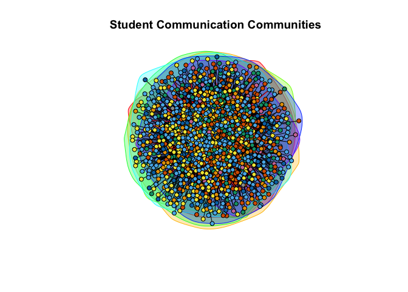<!-- -->

**What do the communities represent?**

- Friend groups or social circles

- Academic cohorts (e.g., same major, same dorm)

- Study groups or project teams

- Different communication patterns

------------------------------------------------------------------------

### 4.4 Comparing Communities

Let’s analyze community characteristics:

``` r
# Create a tibble with node information
node_info <- tibble(
  student_id = V(g_active_undirected)$name,
  community = membership(communities),
  degree = degree(g_active_undirected),
  betweenness = betweenness(g_active_undirected)
)

# Summarize by community
community_summary <- node_info |>
  group_by(community) |>
  summarise(
    n_students = n(),
    avg_degree = mean(degree),
    avg_betweenness = mean(betweenness),
    .groups = "drop"
  ) |>
  arrange(desc(n_students))

print(community_summary)
```

    ## # A tibble: 8 × 4
    ##   community  n_students avg_degree avg_betweenness
    ##   <membrshp>      <int>      <dbl>           <dbl>
    ## 1 2                 443      11.9            1759.
    ## 2 6                 350      17.4            1813.
    ## 3 4                 259      11.3            1619.
    ## 4 3                 226      18.4            1480.
    ## 5 1                 215      13.1            1465.
    ## 6 5                 172      11.7            1649.
    ## 7 7                  34       8.53           1272.
    ## 8 8                  13      13.8            1003.

**Visualize community characteristics:**

``` r
# Boxplot of degree by community (top 5 largest communities)
top_5_communities <- community_summary |>
  slice_max(n_students, n = 5) |>
  pull(community)

node_info |>
  filter(community %in% top_5_communities) |>
  ggplot(aes(x = factor(community), y = degree, fill = factor(community))) +
  geom_boxplot() +
  labs(
    title = "Degree Distribution by Community",
    x = "Community",
    y = "Degree (Number of Connections)",
    fill = "Community"
  ) +
  theme_minimal()
```

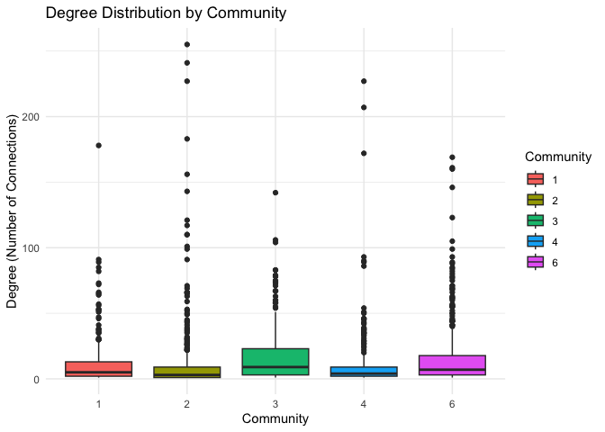<!-- -->

------------------------------------------------------------------------

### 4.5 Edge Betweenness Community Detection (Alternative Method)

Another algorithm that works with **directed** networks:

``` r
# Edge betweenness community detection (works on directed networks)
communities_eb <- cluster_edge_betweenness(g_active)
```

**Difference between methods:**

- **Louvain**: Fast, good for large networks, optimizes modularity

- **Edge Betweenness**: Slower, identifies “bridges” between
  communities, works on directed networks

------------------------------------------------------------------------

### Class Exercise 4: Community Analysis

Using the full college network (`g_college`):

1.  Calculate the global transitivity coefficient

2.  Create an undirected version and detect communities using Louvain

3.  Find the 3 largest communities

4.  Create a subnetwork containing only students from the largest
    community

5.  Calculate the average in-degree and out-degree for students in this
    community

6.  **Bonus:** Compare the transitivity of the largest community to the
    full network - is the largest community more “clique-like”?

``` r
# Your code here
```

------------------------------------------------------------------------

## 5. Gephi

### 5.1 Exporting to Gephi

[Gephi](https://gephi.org/) is a powerful, open-source software tool
designed specifically for interactive visualization and exploration of
networks.

It provides a rich interface for analyzing structural properties,
applying dynamic layouts, filtering, and producing high-quality visuals
of complex networks.

While `igraph` in R is excellent for building and analyzing networks,
Gephi allows for more control over **visual layout**, **styling**, and
**interactivity**, which makes it especially useful when preparing
network graphics for presentations or publications.

To export our graph to Gephi, we can use the `write_graph()` function
from `igraph`:

``` r
write_graph(g_college, file = "../data/GameofThrones_Network.graphml", format = "graphml")
```

------------------------------------------------------------------------

### 5.2 Opening in Gephi

To open the network in Gephi:

1.  **Launch Gephi** and select “Open Graph File”

2.  **Navigate to your .graphml file** (e.g., `college_network.graphml`)


3.  An **Import Report** will appear showing:

    - Number of nodes (1,712 in this example)

    - Number of edges (54,947)

    - Graph type (Directed/Undirected)


4.  Click **OK** to load the network into the **Overview** tab


------------------------------------------------------------------------

### 5.3 Quick Overview of the Gephi Interface

Gephi has three main tabs:

- **Overview Tab**: Where you layout, analyze, and manipulate the
  network visually

- **Data Laboratory**: A spreadsheet view of your nodes and edges (like
  Excel)

- **Preview Tab**: Renders publication-ready visuals with fine-tuned
  styling

**Key Panels in Overview:**

- **Graph** (center): Visual display of your network

- **Appearance** (left): Control node/edge colors and sizes

- **Layout** (bottom left): Apply algorithms to position nodes

- **Statistics** (right): Run network analysis metrics

- **Filters** (right): Subset the network based on attributes

------------------------------------------------------------------------

### 5.4 Copy Name to Label

Before visualizing, ensure node labels are visible:

1.  Go to the **Data Laboratory** tab

2.  Click **Copy data to other column**

3.  Select **“Id”** or **“name”** as source, **“Label”** as target


4.  Return to **Overview** tab

Now node names will display when you enable labels in the graph window.

------------------------------------------------------------------------

### 5.5 Running Community Detection

To identify clusters in your network, use the **Modularity** algorithm:

1.  In the **Statistics** panel (right), find **“Modularity”** under
    **Community Detection**


2.  Click **Run** and a settings dialog will appear:

    - **Randomize**: Check this for consistent results

    - **Use weights**: Check if your edges have weight attributes

    - **Resolution**: Default is 1.0 (higher = more communities)


3.  Click **OK** to run

**Result:** Gephi adds a new node attribute called **“Modularity
Class”**, assigning each node to a community (numbered 0, 1, 2, etc.).

------------------------------------------------------------------------

### 5.6 Coloring Nodes by Community

Once Modularity is calculated, color nodes by their community:

1.  Go to **Appearance** panel (top left) \> **Nodes** tab

2.  Click the **palette icon** (Partition)

3.  Select **“Modularity Class”** from the dropdown


4.  Gephi shows how many communities were detected (e.g., 14
    communities)

5.  You can choose a color palette or let Gephi assign random colors

6.  Click **Apply**


**Result:** Nodes are now colored by their community membership, making
clusters visually distinct.

------------------------------------------------------------------------

### 5.7 Sizing Nodes by Degree

Make important nodes (those with more connections) larger:

1.  In **Appearance** panel \> **Nodes** tab, click the **concentric
    circles icon** (Ranking)

2.  Select **“Degree”** from the dropdown

    - **Degree**: Total connections

    - **In-Degree**: Incoming edges (for directed graphs)

    - **Out-Degree**: Outgoing edges (for directed graphs)


3.  Adjust the **Min size** and **Max size** sliders

4.  Click **Apply**

**Result:** High-degree nodes (hubs) appear larger, while peripheral
nodes remain small.

------------------------------------------------------------------------

### 5.8 Applying a Layout Algorithm

Layouts position nodes to reveal network structure:

1.  Go to the **Layout** panel (bottom left)

2.  Select **ForceAtlas 2** (ideal for medium-large networks)


3.  Adjust settings if needed:

    - **Scaling**: Controls spread (higher = more spread out)

    - **Stronger Gravity**: Pulls nodes toward center

    - **Dissuade Hubs**: Prevents hubs from clustering too tightly

4.  Click **Run** and watch the network reorganize

5.  Click **Stop** once the layout stabilizes

**Other useful layouts:**

- **Yifan Hu**: Fast, good for large networks

- **Fruchterman-Reingold**: Classic layout for small networks

- **Circular**: Arranges nodes in a circle

------------------------------------------------------------------------

### 5.9 Filtering the Network

Filter to focus on specific parts of your network:

1.  Open the **Filters** panel (right side)

2.  Expand **Attributes** \> **Equal**

3.  Drag a filter (e.g., **“Modularity Class”**) to the **Queries** area


4.  Select which communities to show (e.g., only Community 0 and 1)

5.  Click **Filter** to apply

**Other useful filters:**

- **Degree Range**: Show only nodes with 10-50 connections

- **Giant Component**: Isolate the largest connected cluster

- **Edge Weight**: Hide weak connections

------------------------------------------------------------------------

### 5.10 Preview and Export

Once your network looks great, export it:

1.  Go to the **Preview** tab

2.  Click **Refresh** to render the network


3.  Adjust settings:

    - **Show Labels**: Display node names

    - **Edge thickness**: Adjust edge visibility

    - **Background color**: Change from white to black or custom

4.  Click **Export: SVG/PDF/PNG** at the bottom

**Export formats:**

- **PNG**: For presentations and websites (raster image)

- **SVG**: For publications and further editing in Adobe Illustrator
  (vector graphic)

- **PDF**: For high-quality prints

------------------------------------------------------------------------

### 5.11 Summary of Gephi Workflow

1.  **Import** your `.graphml` file

2.  **Copy** node names to labels (Data Laboratory)

3.  **Run Statistics** (e.g., Modularity for community detection)

4.  **Color** nodes by community (Appearance \> Partition)

5.  **Size** nodes by degree (Appearance \> Ranking)

6.  **Apply Layout** (e.g., ForceAtlas 2)

7.  **Filter** to focus on subsets (Filters panel)

8.  **Preview** and **Export** (Preview tab)

This workflow transforms raw network data into publication-ready
visualizations that reveal hidden patterns and structures.

------------------------------------------------------------------------

## Lecture 11 Cheat Sheet: Network Analysis

| **Function/Concept** | **Description** | **Code Example** |
|----|----|----|
| **Creating Networks** |  |  |
| `graph()` | Create a simple graph from edge pairs | `g <- graph(edges = c(1,2, 2,3), n = 3, directed = FALSE)` |
| `graph_from_literal()` | Create graph with intuitive syntax | `g <- graph_from_literal(A--B, B--C, C--A)` |
| `graph_from_data_frame()` | Create network from data frame (edge list) | `g <- graph_from_data_frame(df, directed = FALSE)` |
| **Network Properties** |  |  |
| `vcount(g)` | Number of vertices (nodes) | `vcount(g)  # Returns 126` |
| `ecount(g)` | Number of edges (connections) | `ecount(g)  # Returns 845` |
| `summary(g)` | Overview of graph structure | `summary(g)` |
| **Node/Edge Access** |  |  |
| `V(g)` | Access vertices | `V(g)$name  # Get node names` |
| `E(g)` | Access edges | `E(g)$weight  # Get edge weights` |
| **Adding Node Attributes** |  |  |
| Add attribute | Assign properties to nodes | `V(g)$color <- "blue"` |
| Multiple attributes | Add metadata from data frame | `V(g)$house <- df$house` |
| **Centrality Measures** |  |  |
| `degree(g)` | Number of direct connections per node | `deg <- degree(g)` |
| `betweenness(g)` | How often a node sits on shortest paths | `bet <- betweenness(g)` |
| `closeness(g)` | Average distance to all other nodes | `clo <- closeness(g)` |
| `eigen_centrality(g)` | Influence based on connections to influential nodes | `eig <- eigen_centrality(g)$vector` |
| **Community Detection** |  |  |
| `cluster_louvain(g)` | Louvain modularity-based communities | `comms <- cluster_louvain(g)` |
| `cluster_walktrap(g)` | Random walk-based communities | `comms <- cluster_walktrap(g)` |
| `cluster_fast_greedy(g)` | Fast greedy optimization | `comms <- cluster_fast_greedy(g)` |
| `modularity(comms)` | Quality score of community structure | `modularity(comms)` |
| **Network Metrics** |  |  |
| `transitivity(g)` | Global clustering coefficient | `transitivity(g, type = "global")` |
| `diameter(g)` | Longest shortest path in network | `diameter(g)` |
| `mean_distance(g)` | Average path length | `mean_distance(g)` |
| `edge_density(g)` | Ratio of actual to possible edges | `edge_density(g)` |
| **Network Models** |  |  |
| `make_empty_graph(n)` | Graph with nodes but no edges | `eg <- make_empty_graph(50)` |
| `make_full_graph(n)` | Fully connected graph | `fg <- make_full_graph(50)` |
| `make_star(n)` | Star network (hub and spokes) | `st <- make_star(50)` |
| `make_ring(n)` | Ring/circle network | `rn <- make_ring(50)` |
| `sample_gnm(n, m)` | Erdős-Rényi random graph | `er <- sample_gnm(n = 100, m = 50)` |
| `sample_pa(n)` | Barabási-Albert scale-free network | `ba <- sample_pa(n = 100, power = 1)` |
| **Plotting** |  |  |
| `plot(g)` | Basic network visualization | `plot(g, vertex.size = 5, vertex.label = NA)` |
| Vertex size by degree | Scale node size by centrality | `V(g)$size <- degree(g) / max(degree(g)) * 10` |
| Vertex color | Color nodes by attribute | `V(g)$color <- ifelse(V(g)$gender == "F", "pink", "blue")` |
| Edge width | Scale edge thickness by weight | `plot(g, edge.width = E(g)$weight / 2)` |
| **Data Export** |  |  |
| `write_graph()` | Export network for Gephi/other tools | `write_graph(g, "network.graphml", format = "graphml")` |
| **Gephi Workflow** |  |  |
| Import file | Open .graphml in Gephi | File \> Open Graph File |
| Copy name to label | Make labels visible | Data Laboratory \> Copy data to other column |
| Community detection | Run Modularity algorithm | Statistics \> Modularity \> Run |
| Color by community | Apply partition coloring | Appearance \> Nodes \> Partition \> Modularity Class |
| Size by degree | Scale nodes by centrality | Appearance \> Nodes \> Ranking \> Degree |
| Apply layout | Position nodes spatially | Layout \> ForceAtlas 2 \> Run |
| Filter network | Show subsets | Filters \> Attributes \> Equal \> Modularity Class |
| Export visual | Save publication-ready image | Preview \> Refresh \> Export (SVG/PNG/PDF) |
