GGPlot and Visualizations
================
Dr. Ayse D. Lokmanoglu
Lecture 3, (B) Feb 4, (A) Feb 9

## Lecture 3 Table of Contents

| Section | Topic                                        |
|---------|----------------------------------------------|
| 1       | Introduction to ggplot2                      |
| 1.1     | The Grammar of Graphics                      |
| 1.2     | Basic ggplot Structure                       |
| 2       | Geoms: Types of Graphs                       |
| 2.1     | Common Geoms Overview                        |
| 2.2     | Scatter Plots (`geom_point()`)               |
| 2.3     | Line Plots (`geom_line()`)                   |
| 2.4     | Bar Charts (`geom_bar()`, `geom_col()`)      |
| 2.5     | Histograms (`geom_histogram()`)              |
| 2.6     | Box Plots (`geom_boxplot()`)                 |
| 3       | Aesthetics                                   |
| 3.1     | Mapping vs. Setting Aesthetics               |
| 3.2     | Color, Fill, and Alpha                       |
| 3.3     | Size, Shape, and Linetype                    |
| 4       | Labels and Annotations                       |
| 4.1     | Adding Labels with `labs()`                  |
| 4.2     | Adding Text and Annotations                  |
| 5       | Scales and Axes                              |
| 5.1     | Customizing Continuous Scales                |
| 5.2     | Customizing Discrete Scales                  |
| 5.3     | Date Scales                                  |
| 5.4     | Color Scales                                 |
| 6       | Themes                                       |
| 6.1     | Built-in Themes                              |
| 6.2     | Customizing Theme Elements                   |
| 6.3     | External Themes (ggthemes)                   |
| 7       | Facets                                       |
| 7.1     | `facet_wrap()`                               |
| 7.2     | `facet_grid()`                               |
| 7.3     | Customizing Facet Labels                     |
| 8       | Color Palettes                               |
| 8.1     | Manual Colors                                |
| 8.2     | ColorBrewer                                  |
| 8.3     | Viridis                                      |
| 8.4     | Fun Palettes (wesanderson, NatParksPalettes) |

------------------------------------------------------------------------

## R Exercises

**ALWAYS** load our libraries first

``` r
library(tidyverse)
library(ggplot2)
library(lubridate)
```

------------------------------------------------------------------------

## 1. Introduction to ggplot2

### 1.1 The Grammar of Graphics

`ggplot2` is a powerful visualization package that follows the **Grammar
of Graphics** - a systematic approach to building plots layer by layer.

**Core Components:**

| Component | Description | Example |
|----|----|----|
| **Data** | The dataset you’re plotting | `data = mtcars` |
| **Aesthetics** | Mappings between data and visual properties | `aes(x = wt, y = mpg)` |
| **Geometries** | The type of plot | `geom_point()`, `geom_bar()` |
| **Scales** | Control how data maps to visual properties | `scale_x_continuous()` |
| **Facets** | Split data into panels | `facet_wrap(~ cyl)` |
| **Themes** | Control non-data elements | `theme_minimal()` |

[GGPlot Cheat
Sheet](https://posit.co/wp-content/uploads/2022/10/data-visualization-1.pdf)

------------------------------------------------------------------------

### 1.2 Basic ggplot Structure

Every ggplot follows this basic structure:

``` r
ggplot(data = <DATA>, aes(<MAPPINGS>)) +
  <GEOM_FUNCTION>() +
  <OPTIONAL_LAYERS>
```

**Create a sample dataset:**

``` r
df <- data.frame(
  Movie_Title = c(
    "YOLO", "Successor", "Pegasus 2", "Deadpool & Wolverine", "Moana 2", 
    "The Hidden Blade", "Avatar: The Spirit Returns"
  ),
  Release_Date = c(
    "January 2024", "February 2024", "March 2024", "July 2024", 
    "November 2024", "April 2024", "December 2024"
  ),
  China_Box_Office_Gross = c(
    479597304, 469612890, 466930272, 450000000, 350000000, 320000000, 550000000
  ),
  US_Box_Office_Gross = c(
    310000000, 280000000, 290000000, 438000000, 221000000, 75000000, 600000000
  ),
  Total_Worldwide_Gross = c(
    479597304, 469612890, 466930272, 850000000, 421000000, 400000000, 1300000000
  )
)
```

**Basic scatter plot:**

``` r
ggplot(data = df, aes(x = China_Box_Office_Gross, y = US_Box_Office_Gross)) +
  geom_point()
```

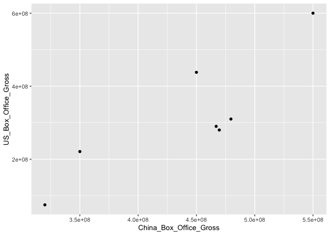<!-- -->

------------------------------------------------------------------------

## 2. Geoms: Types of Graphs

### 2.1 Common Geoms Overview

| Geom Function      | Description        | Key Aesthetics                     |
|--------------------|--------------------|------------------------------------|
| `geom_point()`     | Scatter plot       | `x`, `y`, `color`, `size`, `shape` |
| `geom_line()`      | Line plot          | `x`, `y`, `color`, `linetype`      |
| `geom_bar()`       | Bar chart (counts) | `x`, `fill`                        |
| `geom_col()`       | Bar chart (values) | `x`, `y`, `fill`                   |
| `geom_histogram()` | Histogram          | `x`, `fill`, `bins`                |
| `geom_boxplot()`   | Box plot           | `x`, `y`, `fill`                   |
| `geom_smooth()`    | Trend line         | `x`, `y`, `method`                 |
| `geom_text()`      | Add text           | `x`, `y`, `label`                  |

**Additional Geoms:**

| Geom Function    | Description                      |
|------------------|----------------------------------|
| `geom_area()`    | Area under a line                |
| `geom_violin()`  | Violin plot                      |
| `geom_density()` | Density curve                    |
| `geom_tile()`    | Heatmap tiles                    |
| `geom_segment()` | Line segments                    |
| `geom_abline()`  | Reference line (slope/intercept) |
| `geom_hline()`   | Horizontal reference line        |
| `geom_vline()`   | Vertical reference line          |

------------------------------------------------------------------------

### 2.2 Scatter Plots (`geom_point()`)

``` r
# Basic scatter plot
ggplot(data = mtcars, aes(x = wt, y = mpg)) +
  geom_point() +
  labs(
    title = "Fuel Efficiency vs. Weight",
    x = "Weight (1000 lbs)",
    y = "Miles Per Gallon"
  )
```

<!-- -->

**With color mapping:**

``` r
ggplot(data = mtcars, aes(x = wt, y = mpg, color = factor(cyl))) +
  geom_point(size = 3) +
  labs(
    title = "Fuel Efficiency by Weight and Cylinders",
    x = "Weight (1000 lbs)",
    y = "Miles Per Gallon",
    color = "Cylinders"
  )
```

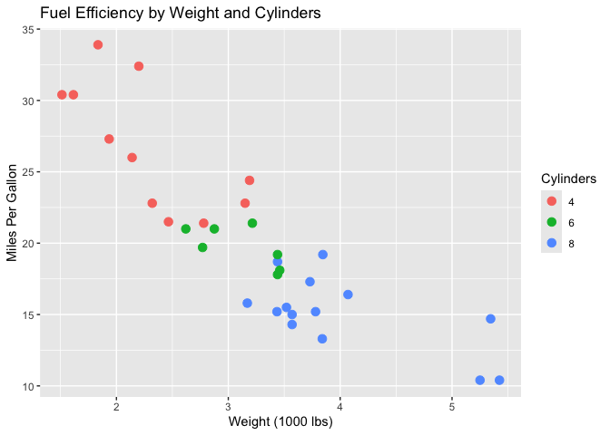<!-- -->

------------------------------------------------------------------------

### 2.3 Line Plots (`geom_line()`)

``` r
# Create time series data
time_data <- data.frame(
  month = 1:12,
  sales = c(100, 120, 115, 130, 145, 160, 155, 170, 180, 175, 190, 210)
)

ggplot(time_data, aes(x = month, y = sales)) +
  geom_line(color = "steelblue", size = 1) +
  geom_point(color = "steelblue", size = 2) +
  labs(
    title = "Monthly Sales Trend",
    x = "Month",
    y = "Sales"
  )
```

<!-- -->

------------------------------------------------------------------------

### 2.4 Bar Charts (`geom_bar()` and `geom_col()`)

**`geom_bar()`** - counts observations (stat = “count”)

``` r
ggplot(mtcars, aes(x = factor(cyl))) +
  geom_bar(fill = "steelblue") +
  labs(
    title = "Count of Cars by Cylinder",
    x = "Cylinders",
    y = "Count"
  )
```

<!-- -->

**`geom_col()`** - uses values directly (stat = “identity”)

``` r
ggplot(df, aes(x = Movie_Title, y = Total_Worldwide_Gross)) +
  geom_col(fill = "steelblue") +
  labs(
    title = "Worldwide Gross by Movie",
    x = "Movie",
    y = "Gross ($)"
  ) +
  theme(axis.text.x = element_text(angle = 45, hjust = 1))
```

<!-- -->

**Flip coordinates for horizontal bars:**

``` r
ggplot(df, aes(x = Movie_Title, y = Total_Worldwide_Gross)) +
  geom_col(fill = "steelblue") +
  coord_flip() +
  labs(
    title = "Worldwide Gross by Movie",
    x = "Movie",
    y = "Gross ($)"
  )
```

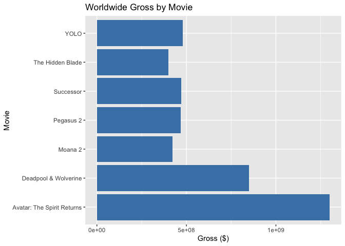<!-- -->

------------------------------------------------------------------------

### 2.5 Histograms (`geom_histogram()`)

``` r
ggplot(mtcars, aes(x = mpg)) +
  geom_histogram(binwidth = 2, fill = "steelblue", color = "white") +
  labs(
    title = "Distribution of MPG",
    x = "Miles Per Gallon",
    y = "Count"
  )
```

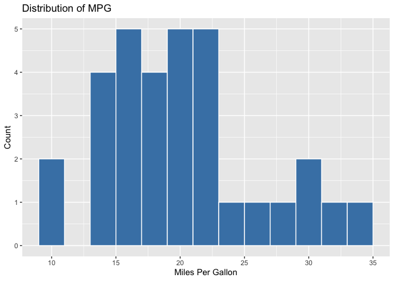<!-- -->

------------------------------------------------------------------------

### 2.6 Box Plots (`geom_boxplot()`)

Box plots show distribution and outliers: - **Box**: Interquartile range
(IQR) - middle 50% of data - **Line in box**: Median - **Whiskers**:
Extend to 1.5 × IQR - **Points**: Outliers beyond whiskers

``` r
ggplot(mtcars, aes(x = factor(cyl), y = mpg, fill = factor(cyl))) +
  geom_boxplot() +
  labs(
    title = "MPG Distribution by Cylinders",
    x = "Cylinders",
    y = "Miles Per Gallon"
  ) +
  theme(legend.position = "none")
```

<!-- -->

**Add jittered points to show actual data:**

``` r
ggplot(mtcars, aes(x = factor(cyl), y = mpg, fill = factor(cyl))) +
  geom_boxplot(outlier.shape = NA) +
  geom_jitter(width = 0.2, alpha = 0.5) +
  labs(
    title = "MPG Distribution by Cylinders",
    x = "Cylinders",
    y = "Miles Per Gallon"
  ) +
  theme(legend.position = "none")
```

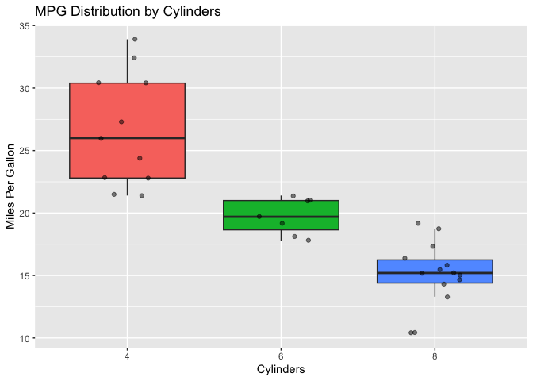<!-- -->

------------------------------------------------------------------------

#### <span style="color: purple;">Class Exercise: Basic Plots</span>

Using the `mtcars` dataset:

1.  Create a scatter plot of `hp` (horsepower) vs `mpg` (miles per
    gallon).
2.  Create a bar chart showing the count of cars by number of gears
    (`gear`).
3.  Create a histogram of `hp` with 10 bins.
4.  Create a boxplot of `mpg` grouped by `gear`.

``` r
### Your workspace
```

------------------------------------------------------------------------

## 3. Aesthetics

### 3.1 Mapping vs. Setting Aesthetics

A critical distinction! There’s an important difference between
**mapping** a variable to an aesthetic and **setting** an aesthetic to a
fixed value.

**Mapping** (inside `aes()`) - connects a *variable* to a visual
property:

``` r
# Color varies BY the data (each cylinder group gets a different color)
ggplot(data = mtcars, aes(x = wt, y = mpg, color = factor(cyl))) +
  geom_point(size = 4)
```

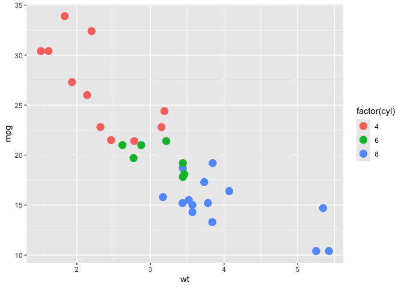<!-- -->

**Setting** (outside `aes()`) - applies a *fixed value* to all points:

``` r
# ALL points are purple
ggplot(data = mtcars, aes(x = wt, y = mpg)) +
  geom_point(size = 4, color = "purple")
```

<!-- -->

<mark>**Common Error:**</mark> What happens if you put a fixed value
inside `aes()`?

``` r
# WRONG! This creates a weird legend
ggplot(data = mtcars, aes(x = wt, y = mpg, color = "purple")) +
  geom_point(size = 4)
```

<!-- -->

R thinks “purple” is a variable name, recycles it for every row, and
picks its default color (salmon) — not what you wanted!

------------------------------------------------------------------------

### 3.2 Color, Fill, and Alpha

| Aesthetic | Description        | Used With           |
|-----------|--------------------|---------------------|
| `color`   | Outline/line color | Points, lines, text |
| `fill`    | Interior color     | Bars, boxes, areas  |
| `alpha`   | Transparency (0-1) | All geoms           |

``` r
# color vs fill
ggplot(mtcars, aes(x = factor(cyl), y = mpg)) +
  geom_boxplot(color = "darkblue", fill = "lightblue", alpha = 0.7)
```

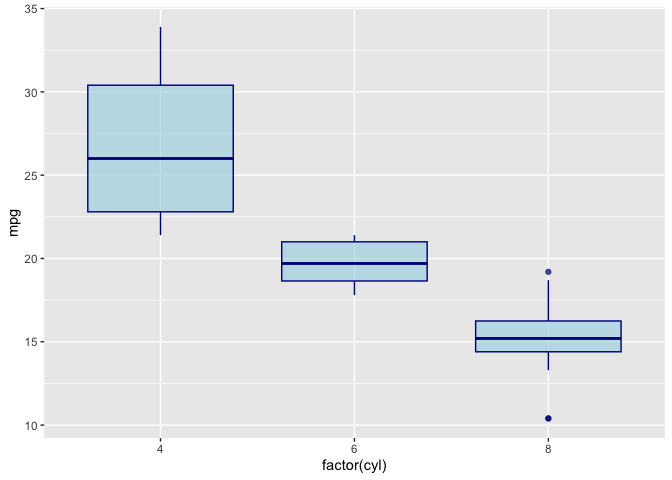<!-- -->

------------------------------------------------------------------------

### 3.3 Size, Shape, and Linetype

**Point Shapes:**

| Shape Integer | Shape Name      | Visualization |
|---------------|-----------------|---------------|
| 0             | square open     | □             |
| 1             | circle open     | ○             |
| 2             | triangle open   | △             |
| 15            | square filled   | ■             |
| 16            | circle filled   | ●             |
| 17            | triangle filled | ▲             |
| 18            | diamond filled  | ◆             |

``` r
# Multiple aesthetics
ggplot(mtcars, aes(x = wt, y = mpg, 
                   color = factor(cyl), 
                   size = hp,
                   shape = factor(gear))) +
  geom_point(alpha = 0.7) +
  labs(
    color = "Cylinders",
    size = "Horsepower",
    shape = "Gears"
  )
```

<!-- -->

**Line Types:**

``` r
# Different line types
df_lines <- data.frame(
  x = rep(1:5, 3),
  y = c(1:5, 2:6, 3:7),
  group = rep(c("A", "B", "C"), each = 5)
)

ggplot(df_lines, aes(x = x, y = y, linetype = group, color = group)) +
  geom_line(size = 1) +
  labs(title = "Different Line Types")
```

<!-- -->

------------------------------------------------------------------------

## 4. Labels and Annotations

### 4.1 Adding Labels with `labs()`

``` r
ggplot(mtcars, aes(x = wt, y = mpg, color = factor(cyl))) +
  geom_point(size = 3) +
  labs(
    title = "Fuel Efficiency by Vehicle Weight",
    subtitle = "Data from mtcars dataset",
    x = "Weight (1000 lbs)",
    y = "Miles Per Gallon",
    color = "Cylinders",
    caption = "Source: mtcars dataset in R"
  )
```

<!-- -->

------------------------------------------------------------------------

### 4.2 Adding Text and Annotations

``` r
ggplot(mtcars, aes(x = wt, y = mpg)) +
  geom_point() +
  geom_text(aes(label = rownames(mtcars)), size = 2, vjust = -0.5) +
  labs(title = "MPG vs Weight with Car Names")
```

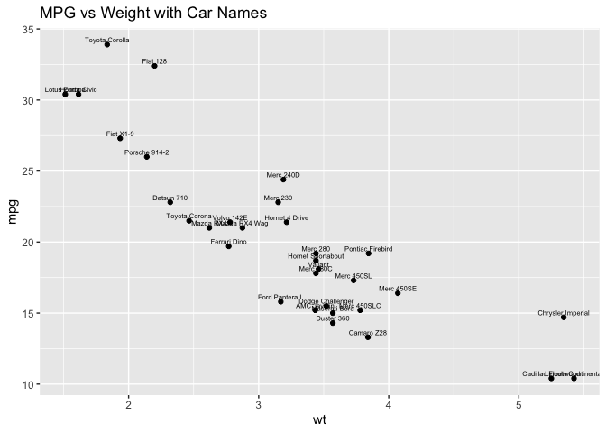<!-- -->

**Use `geom_label()` for boxed labels or `annotate()` for single
annotations:**

``` r
ggplot(mtcars, aes(x = wt, y = mpg)) +
  geom_point() +
  annotate("text", x = 5, y = 30, label = "High efficiency, heavy cars", color = "red") +
  annotate("rect", xmin = 4.5, xmax = 5.5, ymin = 28, ymax = 35, alpha = 0.2, fill = "red")
```

<!-- -->

------------------------------------------------------------------------

## 5. Scales and Axes

### 5.1 Customizing Continuous Scales

Use `scale_x_continuous()` and `scale_y_continuous()` to customize
numeric axes.

``` r
ggplot(df, aes(x = China_Box_Office_Gross, y = US_Box_Office_Gross)) +
  geom_point(size = 4, color = "steelblue") +
  scale_x_continuous(
    labels = scales::comma,
    breaks = seq(300000000, 600000000, by = 50000000)
  ) +
  scale_y_continuous(
    labels = scales::dollar,
    limits = c(0, 700000000)
  ) +
  labs(
    title = "Box Office Performance",
    x = "China Gross",
    y = "US Gross"
  )
```

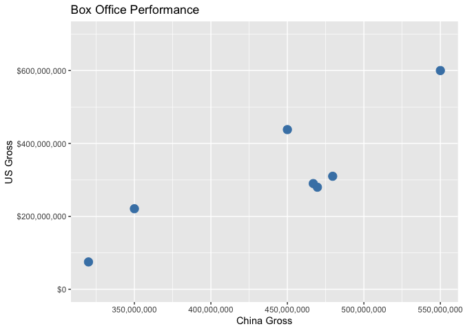<!-- -->

------------------------------------------------------------------------

### 5.2 Customizing Discrete Scales

``` r
ggplot(mtcars, aes(x = factor(cyl), y = mpg, fill = factor(cyl))) +
  geom_boxplot() +
  scale_x_discrete(labels = c("4" = "Four", "6" = "Six", "8" = "Eight")) +
  scale_fill_discrete(name = "Cylinders") +
  labs(x = "Number of Cylinders")
```

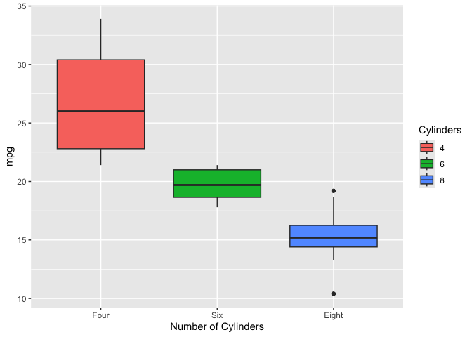<!-- -->

------------------------------------------------------------------------

### 5.3 Date Scales

When working with dates, use `scale_x_date()` to format axis labels.

``` r
# Create date data
df_dates <- df |> 
  mutate(Release_Date_Parsed = dmy(paste("01", Release_Date)))

ggplot(df_dates, aes(x = Release_Date_Parsed, y = Total_Worldwide_Gross)) +
  geom_line(color = "steelblue", size = 1) +
  geom_point(color = "steelblue", size = 3) +
  scale_x_date(
    date_breaks = "1 month",
    date_labels = "%b %Y"
  ) +
  scale_y_continuous(labels = scales::comma) +
  labs(
    title = "Worldwide Gross Over Time",
    x = "Release Date",
    y = "Total Worldwide Gross"
  ) +
  theme(axis.text.x = element_text(angle = 45, hjust = 1))
```

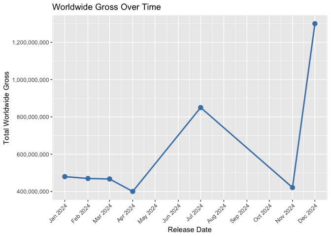<!-- -->

------------------------------------------------------------------------

### 5.4 Color Scales

| Function                  | Purpose                    |
|---------------------------|----------------------------|
| `scale_color_manual()`    | Set colors manually        |
| `scale_fill_manual()`     | Set fill colors manually   |
| `scale_color_brewer()`    | Use ColorBrewer palettes   |
| `scale_color_viridis_d()` | Viridis discrete palette   |
| `scale_color_viridis_c()` | Viridis continuous palette |
| `scale_color_gradient()`  | Continuous gradient        |
| `scale_color_gradient2()` | Diverging gradient         |

``` r
# Manual colors
ggplot(mtcars, aes(x = wt, y = mpg, color = factor(cyl))) +
  geom_point(size = 3) +
  scale_color_manual(values = c("red", "green", "blue"))
```

<!-- -->

------------------------------------------------------------------------

## 6. Themes

### 6.1 Built-in Themes

| Theme             | Description                        |
|-------------------|------------------------------------|
| `theme_minimal()` | Clean, minimal design              |
| `theme_classic()` | Classic with axes, no gridlines    |
| `theme_light()`   | Light background, subtle gridlines |
| `theme_dark()`    | Dark background                    |
| `theme_bw()`      | Black and white, good for printing |
| `theme_void()`    | Empty, no axes or background       |

``` r
p <- ggplot(mtcars, aes(x = wt, y = mpg, color = factor(cyl))) +
  geom_point(size = 3) +
  labs(title = "Theme Comparison")

# Compare themes
p + theme_minimal() + labs(subtitle = "theme_minimal()")
```

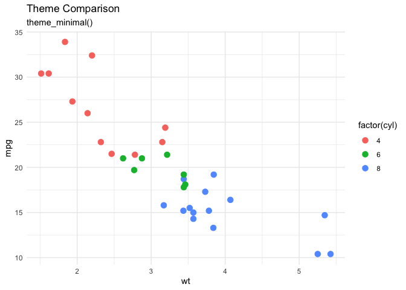<!-- -->

``` r
p + theme_classic() + labs(subtitle = "theme_classic()")
```

<!-- -->

``` r
p + theme_bw() + labs(subtitle = "theme_bw()")
```

<!-- -->

------------------------------------------------------------------------

### 6.2 Customizing Theme Elements

Use `theme()` to customize individual elements:

| Element            | Description                |
|--------------------|----------------------------|
| `plot.title`       | Main title appearance      |
| `plot.subtitle`    | Subtitle appearance        |
| `axis.title`       | Axis label appearance      |
| `axis.text`        | Axis tick label appearance |
| `legend.position`  | Legend location            |
| `panel.grid`       | Gridline appearance        |
| `panel.background` | Plot area background       |

``` r
ggplot(mtcars, aes(x = wt, y = mpg, color = factor(cyl))) +
  geom_point(size = 4) +
  labs(
    title = "Fuel Efficiency by Vehicle Weight",
    subtitle = "Custom themed plot",
    x = "Weight (1000 lbs)",
    y = "Miles Per Gallon",
    color = "Cylinders"
  ) +
  theme_light() +
  theme(
    plot.title = element_text(face = "bold", size = 16, hjust = 0.5, color = "darkblue"),
    plot.subtitle = element_text(face = "italic", size = 12, hjust = 0.5),
    axis.title = element_text(face = "bold", size = 12),
    axis.text = element_text(size = 10),
    legend.position = "top",
    panel.grid.major = element_line(color = "gray90"),
    panel.grid.minor = element_blank()
  )
```

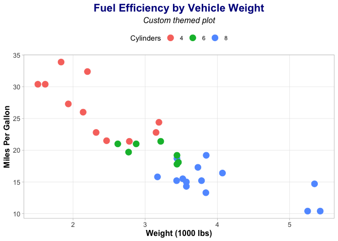<!-- -->

------------------------------------------------------------------------

### 6.3 External Themes (ggthemes)

The `ggthemes` package provides additional themes:

``` r
install.packages("ggthemes")
```

``` r
library(ggthemes)

# Economist theme
ggplot(mtcars, aes(x = wt, y = mpg, color = factor(cyl))) +
  geom_point(size = 3) +
  labs(title = "Economist Theme") +
  theme_economist() +
  scale_color_economist()
```

<!-- -->

``` r
# Wall Street Journal theme
ggplot(mtcars, aes(x = wt, y = mpg, color = factor(cyl))) +
  geom_point(size = 3) +
  labs(title = "Wall Street Journal Theme") +
  theme_wsj()
```

<!-- -->

``` r
# Tufte theme (minimalist)
ggplot(mtcars, aes(x = wt, y = mpg, color = factor(cyl))) +
  geom_point(size = 3) +
  labs(title = "Tufte Theme") +
  theme_tufte()
```

<!-- -->

------------------------------------------------------------------------

## 7. Facets

Facets split data into multiple panels by a variable.

### 7.1 `facet_wrap()`

Use `facet_wrap()` for a single grouping variable:

``` r
ggplot(mtcars, aes(x = wt, y = mpg)) +
  geom_point(color = "steelblue", size = 2) +
  facet_wrap(~ cyl) +
  labs(title = "MPG vs Weight by Cylinders")
```

<!-- -->

**Control layout with `ncol` and `nrow`:**

``` r
ggplot(mtcars, aes(x = wt, y = mpg, color = factor(cyl))) +
  geom_point(size = 3) +
  facet_wrap(~ cyl, ncol = 3) +
  labs(title = "Faceted by Cylinders (3 columns)") +
  theme(legend.position = "none")
```

<!-- -->

**Free scales:**

``` r
ggplot(mtcars, aes(x = wt, y = mpg)) +
  geom_point(color = "steelblue") +
  facet_wrap(~ gear, scales = "free") +
  labs(title = "Faceted with Free Scales")
```

<!-- -->

------------------------------------------------------------------------

### 7.2 `facet_grid()`

Use `facet_grid()` for two grouping variables:

``` r
# Rows = cyl, Columns = gear
ggplot(mtcars, aes(x = wt, y = mpg, color = factor(cyl))) +
  geom_point(size = 3) +
  facet_grid(cyl ~ gear) +
  labs(title = "Facet Grid: Cylinders × Gears") +
  theme(legend.position = "none")
```

<!-- -->

**Facet by rows only:**

``` r
ggplot(mtcars, aes(x = wt, y = mpg)) +
  geom_point(color = "steelblue") +
  facet_grid(cyl ~ .) +
  labs(title = "Facet Grid: Rows by Cylinders")
```

<!-- -->

**Facet by columns only:**

``` r
ggplot(mtcars, aes(x = wt, y = mpg)) +
  geom_point(color = "steelblue") +
  facet_grid(. ~ gear) +
  labs(title = "Facet Grid: Columns by Gears")
```

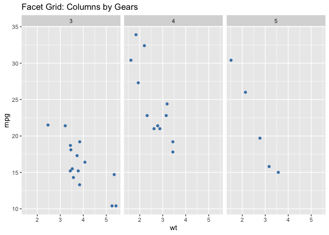<!-- -->

------------------------------------------------------------------------

### 7.3 Customizing Facet Labels

``` r
ggplot(mtcars, aes(x = wt, y = mpg, color = factor(cyl))) +
  geom_point(size = 3) +
  facet_wrap(
    ~ cyl,
    labeller = labeller(cyl = c("4" = "4 Cylinders", "6" = "6 Cylinders", "8" = "8 Cylinders"))
  ) +
  labs(title = "Custom Facet Labels") +
  theme(legend.position = "none")
```

<!-- -->

------------------------------------------------------------------------

## 8. Color Palettes

### 8.1 Manual Colors

``` r
ggplot(mtcars, aes(x = factor(cyl), fill = factor(cyl))) +
  geom_bar() +
  scale_fill_manual(values = c("tomato", "steelblue", "forestgreen")) +
  labs(title = "Manual Color Selection")
```

<!-- -->

------------------------------------------------------------------------

### 8.2 ColorBrewer

[ColorBrewer](https://colorbrewer2.org/) provides color palettes
designed for data visualization:

``` r
library(RColorBrewer)
display.brewer.all()
```

<!-- -->

``` r
ggplot(mtcars, aes(x = factor(cyl), fill = factor(cyl))) +
  geom_bar() +
  scale_fill_brewer(palette = "Set2") +
  labs(title = "ColorBrewer: Set2")
```

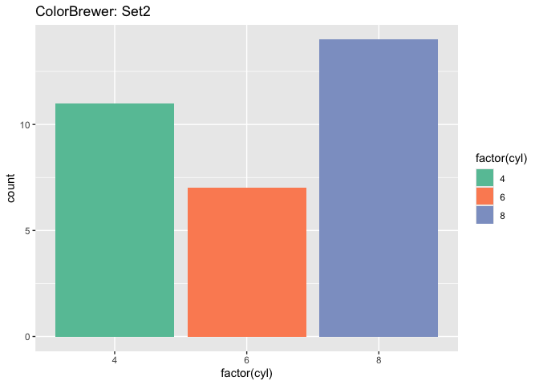<!-- -->

------------------------------------------------------------------------

### 8.3 Viridis

Viridis palettes are colorblind-friendly and print well in grayscale:

``` r
ggplot(mtcars, aes(x = wt, y = mpg, color = hp)) +
  geom_point(size = 4) +
  scale_color_viridis_c() +
  labs(title = "Viridis Continuous Scale")
```

<!-- -->

``` r
ggplot(mtcars, aes(x = factor(cyl), fill = factor(cyl))) +
  geom_bar() +
  scale_fill_viridis_d() +
  labs(title = "Viridis Discrete Scale")
```

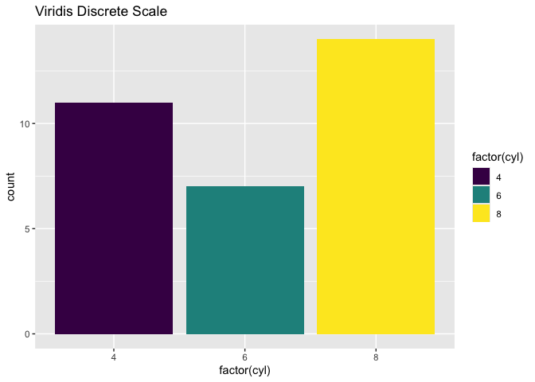<!-- -->

------------------------------------------------------------------------

### 8.4 Fun Palettes

**wesanderson:**

``` r
install.packages("wesanderson")
```

``` r
library(wesanderson)

# See available palettes
names(wes_palettes)
```

    ##  [1] "BottleRocket1"     "BottleRocket2"     "Rushmore1"        
    ##  [4] "Rushmore"          "Royal1"            "Royal2"           
    ##  [7] "Zissou1"           "Zissou1Continuous" "Darjeeling1"      
    ## [10] "Darjeeling2"       "Chevalier1"        "FantasticFox1"    
    ## [13] "Moonrise1"         "Moonrise2"         "Moonrise3"        
    ## [16] "Cavalcanti1"       "GrandBudapest1"    "GrandBudapest2"   
    ## [19] "IsleofDogs1"       "IsleofDogs2"       "FrenchDispatch"   
    ## [22] "AsteroidCity1"     "AsteroidCity2"     "AsteroidCity3"

``` r
ggplot(mtcars, aes(x = factor(cyl), fill = factor(cyl))) +
  geom_bar() +
  scale_fill_manual(values = wes_palette("GrandBudapest1", n = 3)) +
  labs(title = "Wes Anderson: Grand Budapest")
```

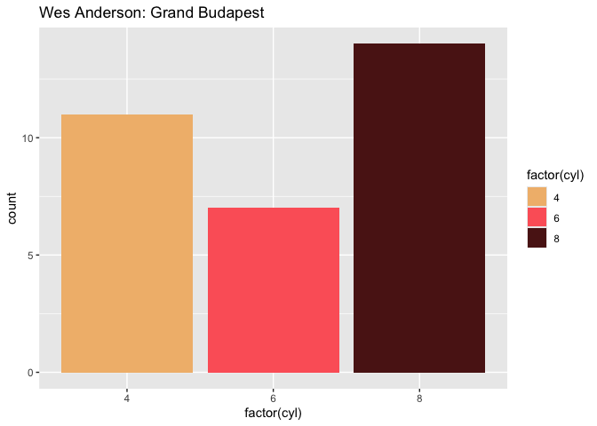<!-- -->

**NatParksPalettes:**

``` r
install.packages("NatParksPalettes")
```

``` r
library(NatParksPalettes)

# See available palettes
names(NatParksPalettes)
```

    ##  [1] "Acadia"      "Arches"      "Arches2"     "Banff"       "BryceCanyon"
    ##  [6] "CapitolReef" "Charmonix"   "CraterLake"  "Cuyahoga"    "DeathValley"
    ## [11] "Denali"      "Everglades"  "Glacier"     "GrandCanyon" "Halekala"   
    ## [16] "IguazuFalls" "KingsCanyon" "LakeNakuru"  "Olympic"     "Redwood"    
    ## [21] "RockyMtn"    "Saguaro"     "SmokyMtns"   "SouthDowns"  "Torres"     
    ## [26] "Triglav"     "WindCave"    "Volcanoes"   "Yellowstone" "Yosemite"

``` r
ggplot(mtcars, aes(x = factor(cyl), fill = factor(cyl))) +
  geom_bar() +
  scale_fill_manual(values = natparks.pals("Yellowstone", n = 3)) +
  labs(title = "National Parks: Yellowstone")
```

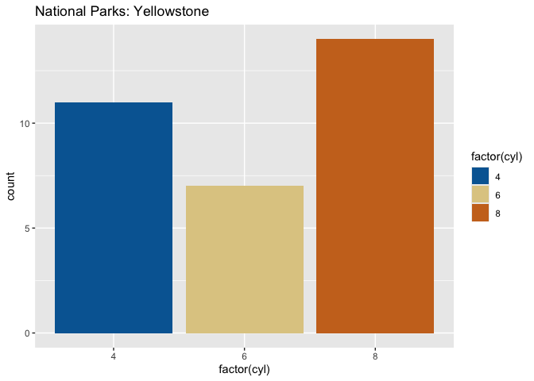<!-- -->

------------------------------------------------------------------------

#### <span style="color: purple;">Class Exercise: Comprehensive Visualization</span>

Using the `iris` dataset, create a publication-ready visualization:

1.  Create a scatter plot of `Sepal.Length` vs `Sepal.Width`, colored by
    `Species`.
2.  Add appropriate labels (title, subtitle, axis labels, caption).
3.  Use a custom color palette (try wesanderson or ColorBrewer).
4.  Apply a theme (try `theme_minimal()` or `theme_classic()`).
5.  Customize the theme with:
    - Bold, centered title
    - Legend at the bottom
    - Custom axis text size
6.  Create a faceted version by `Species`.

``` r
# Starter code
ggplot(iris, aes(x = Sepal.Length, y = Sepal.Width, color = Species)) +
  geom_point(size = 3) +
  # Add your customizations here
  labs(
    title = "...",
    subtitle = "...",
    x = "...",
    y = "...",
    caption = "..."
  )
```

------------------------------------------------------------------------

## Lecture 3 Cheat Sheet

| **Topic** | **Key Points** |
|----|----|
| **ggplot Structure** | `ggplot(data, aes()) + geom_*() + ...` - build plots layer by layer |
| **Common Geoms** | `geom_point()`: scatter; `geom_line()`: lines; `geom_bar()`/`geom_col()`: bars; `geom_histogram()`: distribution; `geom_boxplot()`: box plots |
| **Mapping vs Setting** | Inside `aes()`: map variable to aesthetic; Outside `aes()`: set fixed value |
| **Aesthetics** | `color`: outlines/lines; `fill`: interior; `alpha`: transparency; `size`: point/line size; `shape`: point shape; `linetype`: line style |
| **Labels** | `labs(title, subtitle, x, y, color, fill, caption)` |
| **Scales** | `scale_x_continuous()`, `scale_y_continuous()`, `scale_x_date()`, `scale_color_manual()`, `scale_fill_brewer()` |
| **Themes** | `theme_minimal()`, `theme_classic()`, `theme_bw()`, `theme_void()`; Customize with `theme()` |
| **Facets** | `facet_wrap(~ var)`: single variable; `facet_grid(row ~ col)`: two variables |
| **Color Palettes** | Manual: `scale_*_manual(values = c(...))`; Brewer: `scale_*_brewer(palette = "...")`; Viridis: `scale_*_viridis_d()` |
| **ggthemes** | `theme_economist()`, `theme_wsj()`, `theme_tufte()` for publication-ready styles |
