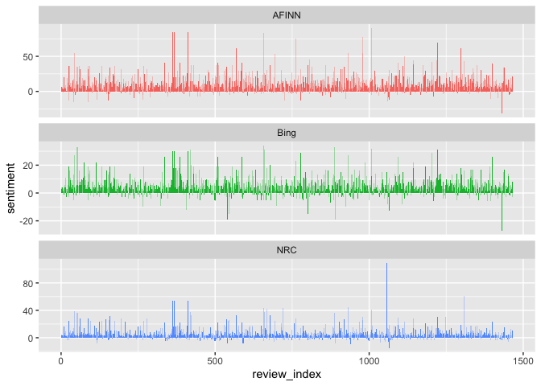
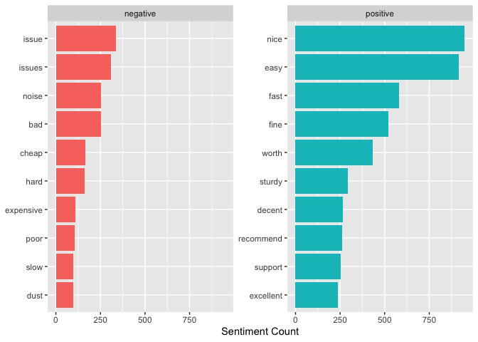
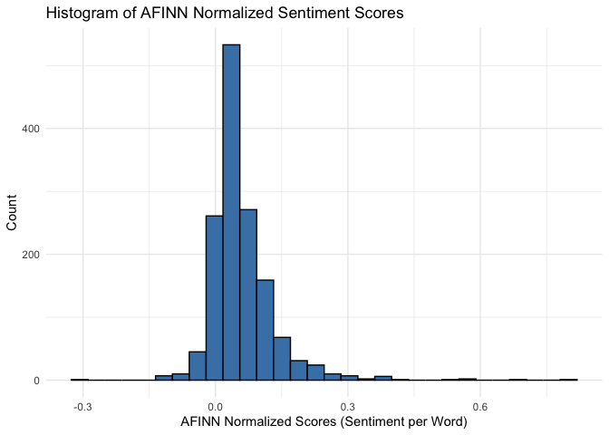
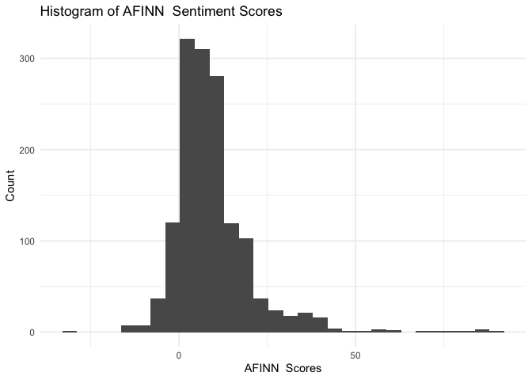

Text as Data: Dictionary Methods and Word Embeddings
================
Dr. Ayse D. Lokmanoglu
Lecture 7, (B) March 16, (A) March 4

# R Exercises

------------------------------------------------------------------------

## Lecture 7 Table of Contents

| Section | Topic                                                   |
|---------|---------------------------------------------------------|
| 1       | Introduction to Text as Data                            |
| 2       | Dictionary Methods                                      |
| 2.1     | Online Dataset: Twitter Data                            |
| 2.2     | Text Preprocessing                                      |
| 2.3     | Sentiment Analysis with Dictionary Methods              |
| 2.4     | Visualizing and Comparing Sentiment Analysis Results    |
| 2.5     | Most common positive and negative words                 |
| 2.6     | Normalize sentiment scores                              |
| 3       | Word Embeddings                                         |
| 3.1     | Introduction to Word Embeddings                         |
| 3.1.1   | Continuous Bag of Words (CBOW)                          |
| 3.1.2   | Skip-Gram Model                                         |
| 3.2     | Applying Word Embeddings in R                           |
| 3.2.1   | Training Word2Vec with CBOW                             |
| 3.2.2   | Visualize CBOW                                          |
| 3.2.3   | Training Word2Vec with Skip Gram                        |
| 4       | Class Exercises: Sentiment Analysis and Word Embeddings |

------------------------------------------------------------------------

**ALWAYS** Let’s load our libraries

``` r
library(tidyverse)   # Data manipulation and visualization (includes dplyr, ggplot2, tidyr, stringr)
library(tidytext)    # Text mining using tidy data principles
library(ggplot2)     # Creating visualizations and plots
library(stopwords)   # Access to stopword lists in multiple languages
library(word2vec)    # Training word embedding models (CBOW and Skip-Gram)
library(umap)        # Dimensionality reduction for visualizing high-dimensional data
library(wordcloud2)  # Creating interactive word clouds
library(plotly)      # Creating interactive plots and visualizations
library(htmlwidgets)
```

## 1. Introduction to Text as Data

Text data:

- is unstructured,

- requires preprocessing to be analyzed.


*source:
<https://media.geeksforgeeks.org/wp-content/uploads/20210526142713/BlockDigramofTextMining.png>*

| **Phase** | **Technique** | **Core Question** | **Purpose** | **Methods & R Packages** |
|----|----|----|----|----|
| **Text Preprocessing** | Tokenization | How can we segment text into meaningful units? | Convert text into individual words or phrases. | `tidytext` (`unnest_tokens()`), `stringr` (`str_split()`) |
|  | Stopword Removal | How can we remove redundant words? | Eliminate common words that add little meaning. | `tidytext` (`stop_words`), `stopwords` |
|  | Lemmatization & Stemming | How can we reduce word variations? | Standardize words to their root forms. | `textstem` (`lemmatize_words()`), `SnowballC` (`wordStem()`) |
| **Feature Engineering** | N-grams | How can we capture word sequences? | Identify multi-word expressions and patterns. | `tidytext` (`unnest_tokens(ngrams = 2)`), `text2vec` |
|  | Part-of-Speech Tagging | How can we recognize word functions? | Assign grammatical categories to words. | `udpipe` (`udpipe_annotate()`), `spacyr` |
| **Content Analysis** | Dictionary-Based Analysis | How can we quantify meaning in text? | Detect linguistic, psychological, or topical patterns. | `tidytext` (`get_sentiments()`), `quanteda` (`dfm_lookup()`) |
| **Machine Learning** | Supervised Classification | How can we predict categories from text? | Assign labels based on prior training examples. | `caret`, `textrecipes`, `tidymodels` |
|  | Unsupervised Clustering | How can we discover hidden patterns? | Group similar documents or topics automatically. | `topicmodels` (LDA), `quanteda` (k-means clustering), `text2vec` (word embeddings) |

We will learn 2 methods today:

1.  **Dictionary Methods** - Using predefined word lists to categorize
    text (e.g., sentiment analysis with lexicons).

2.  **Word Embeddings** - Representing words as numerical vectors to
    capture semantic relationships and similarities.

------------------------------------------------------------------------

## 2. Dictionary Methods

Dictionary-based methods assign predefined categories to words.

### 2.1 Online Dataset: Amazon Sales Data

Dataset Citation: Karkavel Raja, J. (2023). Amazon sales dataset \[Data
set\]. Kaggle.
<https://www.kaggle.com/datasets/karkavelrajaj/amazon-sales-dataset>

**Note:** **This dataset is raw and unfiltered, meaning it may contain
explicit language, including swear words. Please proceed with awareness
and discretion.**

We will use a publicly available Amazon Sales Review Dataset, which
contains tweets labeled as positive, neutral, or negative.

``` r
amazon_data <- read_csv("https://media.githubusercontent.com/media/aysedeniz09/IntroCSS/refs/heads/main/data/amazon.csv")

colnames(amazon_data)
```

    ##  [1] "product_id"          "product_name"        "category"           
    ##  [4] "discounted_price"    "actual_price"        "discount_percentage"
    ##  [7] "rating"              "rating_count"        "about_product"      
    ## [10] "user_id"             "user_name"           "review_id"          
    ## [13] "review_title"        "review_content"      "img_link"           
    ## [16] "product_link"

------------------------------------------------------------------------

### 2.2 Text Preprocessing

Since we are working with the **review_content column** from the Amazon
sales dataset, we need to ensure proper formatting before tokenization.
We will create a new `text` column, remove unnecessary whitespace,
convert text to lowercase, remove URLs and numbers, and maintain
consistency across all reviews. We’ll also add an index column to help
with merging data later in our analysis.

``` r
# Ensure text is properly formatted
amazon_data <- amazon_data |>
  mutate(textBU = review_content,   ### created a backup column so we always have the OG review
    text = str_squish(review_content)) |>
  filter(!is.na(text)) |>
  mutate(text = str_to_lower(text)) |> # Convert to lowercase
  mutate(text = str_remove_all(text, "https?://\\S+")) |> # Remove URLs
  mutate(text = str_remove_all(text, "\\d+")) |>  # Remove numbers
  mutate(review_index = seq_len(nrow(amazon_data))) |> ### creating an index
  mutate(nwords = str_count(text, "\\w+")) ### counting number of words

head(amazon_data$text)
```

    ## [1] "looks durable charging is fine toono complains,charging is really fast, good product.,till now satisfied with the quality.,this is a good product . the charging speed is slower than the original iphone cable,good quality, would recommend, had worked well till date and was having no issue.cable is also sturdy enough...have asked for replacement and company is doing the same...,value for money"                                                                                                                                                                                                                                                                                                                                                                                                                                                                                                                                                                                                                                                                                                                                                                                                                                                                                                                                                                                                                                                                                                                                                                                                                                                                                                                                                                                                                                                                                                                                                                                                                                                                                                                                                                                                                                                                                                                                                                                                                                                                                                             
    ## [2] "i ordered this cable to connect my phone to android auto of car. the cable is really strong and the connection ports are really well made. i already has a micro usb cable from ambrane and it's still in good shape. i connected my phone to the car using the cable and it got connected well and no issues. i also connected it to the charging port and yes it has fast charging support.,it quality is good at this price and the main thing is that i didn't ever thought that this cable will be so long it's good one and charging power is too good and also supports fast charging,value for money, with extra length👍,good, working fine,product quality is good,good,very good,bought for my daughter's old phone.brand new cable it was not charging, i already repacked and requested for replacement.i checked again, and there was some green colour paste/fungus inside the micro usb connector. i cleaned with an alcoholic and starts working again.checked the ampere of charging speed got around ma-ma - not bad, came with braided .m long cable, pretty impressive for the price.can't blame the manufacturer.but quality issues by the distributor, they might have stored in very humid place."                                                                                                                                                                                                                                                                                                                                                                                                                                                                                                                                                                                                                                                                                                                                                                                                                                                                                                                                                                                                                                                                                                                                                                                                                                                                                              
    ## [3] "not quite durable and sturdy, good, nice product,working well,it's a really nice product"                                                                                                                                                                                                                                                                                                                                                                                                                                                                                                                                                                                                                                                                                                                                                                                                                                                                                                                                                                                                                                                                                                                                                                                                                                                                                                                                                                                                                                                                                                                                                                                                                                                                                                                                                                                                                                                                                                                                                                                                                                                                                                                                                                                                                                                                                                                                                                                                                               
    ## [4] "good product,long wire,charges good,nice,i bought this cable for rs. worthy product for this price, i tested it in various charger adapters w and w it supports fast charging as well.,good,ok,i had got this at good price on sale on amazon and product is useful with warranty but for warranty you need to go very far not practical for such a cost and mine micro to type c connector stopped working after few days only.,i like this product"                                                                                                                                                                                                                                                                                                                                                                                                                                                                                                                                                                                                                                                                                                                                                                                                                                                                                                                                                                                                                                                                                                                                                                                                                                                                                                                                                                                                                                                                                                                                                                                                                                                                                                                                                                                                                                                                                                                                                                                                                                                                   
    ## [5] "bought this instead of original apple, does the work for rs, not as fast as apple charger but its a good option if you want cheap and good product, bought it for ipad pro . and it's working flawlessly, build quality is ok, its not like i am gonna hang my clothes on it and i want a very strong cable, even a braided cable stop working after a year, i have used both anker and apple store strong braided cable they all stop working after a year so please don't buy high end cables just for that instead choose a this one and even if it's stops working withing a year you only loose rs compares to rs.update------------------------------------pin has stopped charging from one side, now i have to slip the pin to charge from other side, but i will update and let know for how long does it work,,it’s good. not sure about durability as the pin area feels a bit fragile,does not support apple carplayso was little disappointed about thatother than that cable is made up of very good quality,best to buy,% not fathful,writing this review post  months and  orders of the same product.honestly portronics konnect l lightning cable works like magic with the original apple charging brick.seeing the price of the cable i initially hesitated buying as it was as low as ₹/- with the offers and so i wasn’t sure if it would work well with my iphone  or whether it would impact my iphone’s battery health because all the other lightning cable brands were costing over ₹/- like wayona, amazon basics, etc.earlier i was using wayona brand lightning cable with eventually frayed and stopped working.charging speed:charges my iphone fast enough almost similar compared to the original cable level when used with w original apple power adapter.quality and durability:great quality braided cable and doesn’t tangle easily and can withstand day-to-day usage.l-shaped pin:this is very innovative by portronics and it makes sure the cable doesn’t get damaged even if used while charging.carplay and data sync:works smoothly with carplay and syncs data effortlessly.ps: i have used this cable only with the original apple charging brick and extremely satisfied with its performance.,better than i expect the product i like that quality and i plan to buy same type cable come with usb c to lighting cable for emergency purpose that much i love this cable. buy for this cable only emergency uses only since good one,good product and value for money"
    ## [6] "it's a good product.,like,very good item strong and useful usb cablevalue for moneythanks to amazon and producer, product and useful product,-,sturdy but does not support w charging"

Before applying dictionary methods, we need to clean the text by:

- Tokenizing the reviews into individual words

- Removing stop words (common words like “the”, “and”, “is” that don’t
  carry much sentiment)

- Removing unnecessary characters

``` r
# Tokenize text
amazon_tokens <- amazon_data |> 
  unnest_tokens(word, text) |>
  anti_join(stop_words, by = "word") ## removing stopwords

# View tokenized words
head(amazon_tokens$word)
```

    ## [1] "durable"   "charging"  "fine"      "toono"     "complains" "charging"

------------------------------------------------------------------------

### 2.3 Sentiment Analysis with Dictionary Methods

To understand how different sentiment analysis lexicons classify text,
we will compare results from multiple dictionaries, including **Bing**,
**AFINN**, and **NRC**. Each lexicon provides different insights:

- **Bing**: Binary classification (positive/negative sentiment).
- **AFINN**: Numeric scores for sentiment intensity.
- **NRC**: Categorizes words into emotional dimensions (anger, joy,
  fear, etc.).

**Note: For AFINN and NRC you need to select 1 in your console when
prompted**

``` r
get_sentiments("afinn")
```

    ## # A tibble: 2,477 × 2
    ##    word       value
    ##    <chr>      <dbl>
    ##  1 abandon       -2
    ##  2 abandoned     -2
    ##  3 abandons      -2
    ##  4 abducted      -2
    ##  5 abduction     -2
    ##  6 abductions    -2
    ##  7 abhor         -3
    ##  8 abhorred      -3
    ##  9 abhorrent     -3
    ## 10 abhors        -3
    ## # ℹ 2,467 more rows

``` r
get_sentiments("bing")
```

    ## # A tibble: 6,786 × 2
    ##    word        sentiment
    ##    <chr>       <chr>    
    ##  1 2-faces     negative 
    ##  2 abnormal    negative 
    ##  3 abolish     negative 
    ##  4 abominable  negative 
    ##  5 abominably  negative 
    ##  6 abominate   negative 
    ##  7 abomination negative 
    ##  8 abort       negative 
    ##  9 aborted     negative 
    ## 10 aborts      negative 
    ## # ℹ 6,776 more rows

``` r
get_sentiments("nrc")
```

    ## # A tibble: 13,872 × 2
    ##    word        sentiment
    ##    <chr>       <chr>    
    ##  1 abacus      trust    
    ##  2 abandon     fear     
    ##  3 abandon     negative 
    ##  4 abandon     sadness  
    ##  5 abandoned   anger    
    ##  6 abandoned   fear     
    ##  7 abandoned   negative 
    ##  8 abandoned   sadness  
    ##  9 abandonment anger    
    ## 10 abandonment fear     
    ## # ℹ 13,862 more rows

Let’s now see how is it in our dataset

``` r
# Apply Bing sentiment lexicon
## Step 1:
bing_sentiments_S1 <- amazon_tokens |>
  inner_join(get_sentiments("bing"), by = "word")
head(bing_sentiments_S1)
```

    ## # A tibble: 6 × 21
    ##   product_id product_name                 category discounted_price actual_price
    ##   <chr>      <chr>                        <chr>    <chr>            <chr>       
    ## 1 B07JW9H4J1 Wayona Nylon Braided USB to… Compute… ₹399             ₹1,099      
    ## 2 B07JW9H4J1 Wayona Nylon Braided USB to… Compute… ₹399             ₹1,099      
    ## 3 B07JW9H4J1 Wayona Nylon Braided USB to… Compute… ₹399             ₹1,099      
    ## 4 B07JW9H4J1 Wayona Nylon Braided USB to… Compute… ₹399             ₹1,099      
    ## 5 B07JW9H4J1 Wayona Nylon Braided USB to… Compute… ₹399             ₹1,099      
    ## 6 B07JW9H4J1 Wayona Nylon Braided USB to… Compute… ₹399             ₹1,099      
    ## # ℹ 16 more variables: discount_percentage <chr>, rating <dbl>,
    ## #   rating_count <dbl>, about_product <chr>, user_id <chr>, user_name <chr>,
    ## #   review_id <chr>, review_title <chr>, review_content <chr>, img_link <chr>,
    ## #   product_link <chr>, textBU <chr>, review_index <int>, nwords <int>,
    ## #   word <chr>, sentiment <chr>

``` r
bing_sentiments_S2 <- bing_sentiments_S1 |> 
  count(review_index, sentiment)
head(bing_sentiments_S2)
```

    ## # A tibble: 6 × 3
    ##   review_index sentiment     n
    ##          <int> <chr>     <int>
    ## 1            1 negative      2
    ## 2            1 positive      6
    ## 3            2 negative      5
    ## 4            2 positive      8
    ## 5            3 positive      4
    ## 6            4 positive      4

``` r
bing_sentiments_S3 <- bing_sentiments_S2 |> 
  pivot_wider(names_from = sentiment, values_from = n, values_fill = 0)

head(bing_sentiments_S3)
```

    ## # A tibble: 6 × 3
    ##   review_index negative positive
    ##          <int>    <int>    <int>
    ## 1            1        2        6
    ## 2            2        5        8
    ## 3            3        0        4
    ## 4            4        0        4
    ## 5            5        9       11
    ## 6            6        0        3

``` r
bing_sentiments_S4 <- bing_sentiments_S3 |> 
  mutate(sentiment = positive - negative)
head(bing_sentiments_S4)
```

    ## # A tibble: 6 × 4
    ##   review_index negative positive sentiment
    ##          <int>    <int>    <int>     <int>
    ## 1            1        2        6         4
    ## 2            2        5        8         3
    ## 3            3        0        4         4
    ## 4            4        0        4         4
    ## 5            5        9       11         2
    ## 6            6        0        3         3

Full Pipe:

``` r
bing_sentiments <- amazon_tokens |>
  inner_join(get_sentiments("bing"), by = "word") |> 
  count(review_index, sentiment) |> 
  pivot_wider(names_from = sentiment, values_from = n, values_fill = 0) |> 
  mutate(sentiment = positive - negative) |> 
  mutate(method = "Bing")
```

Now let’s repeat it with AFINN, from now on I am going to give you the
full pipeline, if you want you can see step by step

``` r
afinn_sentiments <- amazon_tokens |>
  inner_join(get_sentiments("afinn")) |> 
  group_by(review_index) |>  
  summarise(sentiment = sum(value)) |> 
  mutate(method = "AFINN")
```

Now w/ NRC:

``` r
nrc_sentiments <-  amazon_tokens |> 
    inner_join(get_sentiments("nrc") |> 
                 filter(sentiment %in% c("positive", 
                                         "negative"))) |> 
  count(review_index, sentiment) |> 
  pivot_wider(names_from = sentiment, values_from = n, values_fill = 0) |> 
  mutate(sentiment = positive - negative) |> 
  mutate(method = "NRC")
```

------------------------------------------------------------------------

### 2.4 Visualizing and Comparing Sentiment Analysis Results

``` r
all_sentiments <- bind_rows(afinn_sentiments,
          bing_sentiments,
          nrc_sentiments) |> 
  dplyr::select(-positive, -negative)


ggplot(all_sentiments,
       aes(review_index, sentiment, fill = method)) +
  geom_col(show.legend = FALSE) +
  facet_wrap(~method, ncol = 1, scales = "free_y")
```

<!-- -->

**Interpreting the Sentiment Analysis Results**

The visualization above shows sentiment scores across approximately
1,500 Amazon product reviews using three different lexicons:

**AFINN (Top Panel - Red):**

- Shows sentiment scores ranging from approximately -20 to +70

- Most reviews cluster around neutral to slightly positive (0-20 range)

- Several spikes indicate strongly positive reviews (scores above 50)

- The high positive scores suggest customers who leave reviews tend to
  express strong satisfaction

- Negative sentiment appears less frequent and less extreme

**Bing (Middle Panel - Green):**

- Displays scores from approximately -30 to +30

- More balanced distribution between positive and negative sentiment

- The zero line represents neutral sentiment (equal positive and
  negative words)

- Green bars above zero indicate positive sentiment; bars below indicate
  negative

- Shows more variability and captures both satisfied and dissatisfied
  customers

**NRC (Bottom Panel - Blue):**

- Generally lower scores, mostly ranging from 0 to 40

- Few negative values, indicating this lexicon captures more positive
  than negative emotions

- Several notable spikes (around review index 1000) suggest reviews with
  strong emotional content

- The lower overall scores reflect that NRC filters for specific
  emotions (anger, joy, fear, trust) rather than general sentiment

**Key Observations:**

- All three methods show predominantly positive sentiment, which is
  typical for product reviews (satisfied customers are more likely to
  leave reviews)

- AFINN produces the highest magnitude scores, making it useful for
  detecting strong sentiment

- Bing provides the most balanced view of positive vs. negative
  sentiment

- Different lexicons can produce different results for the same text,
  highlighting the importance of comparing multiple methods

------------------------------------------------------------------------

### 2.5 Most common positive and negative words

``` r
bing_word_counts <- amazon_tokens |> 
  inner_join(get_sentiments("bing")) |> 
  count(word, sentiment, sort = TRUE) |> 
  ungroup()

head(bing_word_counts)
```

    ## # A tibble: 6 × 3
    ##   word  sentiment     n
    ##   <chr> <chr>     <int>
    ## 1 nice  positive    947
    ## 2 easy  positive    917
    ## 3 fast  positive    580
    ## 4 fine  positive    522
    ## 5 worth positive    431
    ## 6 issue negative    335

Visualize it:

``` r
bing_word_counts |> 
  group_by(sentiment) |> 
  slice_max(n, n = 10) |> 
  ungroup() |> 
  mutate(word = reorder(word, n)) |> 
  ggplot(aes(n, word, fill = sentiment)) +
  geom_col(show.legend = FALSE) +
  facet_wrap(~sentiment, scales = "free_y") +
  labs(x = "Sentiment Count",
       y = NULL)
```

<!-- -->

We can also do wordclouds using `wordcloud2`

``` r
# Get word frequencies for disgust and trust emotions
sentiment_words <- amazon_tokens |> 
  inner_join(get_sentiments("nrc")) |> 
  filter(sentiment %in% c("disgust", "trust")) |> 
  count(word, sentiment, sort = TRUE)

# # Check the data structure
# head(sentiment_words, 20)

# Create separate wordclouds for each sentiment
disgust_words <- sentiment_words |> 
  filter(sentiment == "disgust") |> 
  select(word, n) |>
  rename(freq = n)  # wordcloud2 likes 'freq' as column name

trust_words <- sentiment_words |> 
  filter(sentiment == "trust") |> 
  select(word, n) |>
  rename(freq = n)

# # Check the structure before creating wordcloud
# str(disgust_words)
# head(disgust_words)

wordcloud2(disgust_words, 
           size = 0.5,
           color = "random-dark", 
           backgroundColor = "white",
           minSize = 5)
```

<div class="wordcloud2 html-widget html-fill-item" id="htmlwidget-78bd2db478edfca78323" style="width:672px;height:480px;"></div>
<script type="application/json" data-for="htmlwidget-78bd2db478edfca78323">{"x":{"word":["bad","weight","disappointed","damage","defective","waste","powerful","finally","boil","feeling","lagging","larger","lesser","overpriced","default","dislike","smell","honest","irritating","pollution","remains","cutting","gray","hanging","weird","delay","disappoint","fat","lose","dirt","dirty","hate","misleading","ugly","wasted","bug","awful","blame","burnt","mess","pathetic","fungus","horrible","inconvenient","painful","sentence","sticky","trash","damn","fool","owing","treat","annoyance","bang","bloody","bummer","crap","debris","drunken","hell","humble","irritation","lying","saturated","speck","unbearable","unpleasant","abnormal","abuse","criticize","dire","disappointment","disaster","fleece","garbage","ill","messy","mosquito","unfair","backwards","bleeding","bloated","censor","clumsy","collapse","depressing","deteriorated","entangled","filthy","goo","idiot","infamous","intense","interior","intrusive","lie","muddy","poaching","questionable","scrub","shame","soiled","spider","stain","stomach","unsatisfied","wasting","worthless","adverse","angry","atrocious","cancer","cheat","cholera","corruption","cough","crude","crushed","cur","cursing","death","degrade","deplorable","desert","destructive","discoloration","discolored","disgusting","dismal","distorted","dying","enemy","excellence","failure","greasy","gross","harmful","hood","horrific","horror","idiotic","illegal","impure","inappropriate","incase","incompatible","insanity","instability","lawyer","lemon","lick","lord","mishap","murky","nasty","nose","offense","pollute","rat","rejection","repellent","ridiculous","rogue","rubbish","sick","snake","spoil","suffering","suffocating","suppression","surly","terrible","thief","threatening","toad","toxic","tree","uneasy","unhappy","unsatisfactory","unsettled","whine","winning"],"freq":[252,219,70,63,62,60,55,54,29,29,29,27,25,25,24,23,18,17,16,16,16,14,14,14,14,13,12,12,12,11,11,11,11,10,10,9,8,8,8,8,8,7,6,6,6,6,6,6,5,5,5,5,4,4,4,4,4,4,4,4,4,4,4,4,4,4,4,3,3,3,3,3,3,3,3,3,3,3,3,2,2,2,2,2,2,2,2,2,2,2,2,2,2,2,2,2,2,2,2,2,2,2,2,2,2,2,2,2,1,1,1,1,1,1,1,1,1,1,1,1,1,1,1,1,1,1,1,1,1,1,1,1,1,1,1,1,1,1,1,1,1,1,1,1,1,1,1,1,1,1,1,1,1,1,1,1,1,1,1,1,1,1,1,1,1,1,1,1,1,1,1,1,1,1,1,1,1,1,1,1,1,1,1],"fontFamily":"Segoe UI","fontWeight":"bold","color":"random-dark","minSize":5,"weightFactor":0.3571428571428572,"backgroundColor":"white","gridSize":0,"minRotation":-0.7853981633974483,"maxRotation":0.7853981633974483,"shuffle":true,"rotateRatio":0.4,"shape":"circle","ellipticity":0.65,"figBase64":null,"hover":null},"evals":[],"jsHooks":{"render":[{"code":"function(el,x){\n                        console.log(123);\n                        if(!iii){\n                          window.location.reload();\n                          iii = False;\n\n                        }\n  }","data":null}]}}</script>

``` r
wordcloud2(trust_words, 
           size = 0.5,
           color = "random-light", 
           backgroundColor = "white",
           minSize = 5)
```

<div class="wordcloud2 html-widget html-fill-item" id="htmlwidget-ee7ca397855144f79e6d" style="width:672px;height:480px;"></div>
<script type="application/json" data-for="htmlwidget-ee7ca397855144f79e6d">{"x":{"word":["money","recommend","budget","excellent","happy","weight","warranty","found","clean","perfect","durable","pretty","top","cover","level","expect","machine","accurate","star","bank","durability","calls","iron","deal","provide","hope","system","friendly","manual","compact","wear","content","team","stable","helpful","improve","center","base","powerful","effective","finally","trust","fixed","pay","improvement","green","reliable","suggest","save","crisp","prefer","efficient","real","genuine","personal","comfort","doubt","guard","protector","true","planning","fairly","feeling","safe","exchange","larger","share","wonderful","fitting","food","proof","providing","seal","count","responsive","enjoy","fill","operation","professional","automatic","strength","worthy","cap","guide","lover","rod","related","word","honest","intact","series","instructions","measure","remains","depend","usual","advice","friend","mother","offering","official","prestige","depth","flagship","prepared","supporting","brother","experienced","ground","intend","lovely","policy","reliability","respect","school","serve","constantly","honor","income","signature","brilliant","constant","continue","enjoying","shopping","sweet","title","assured","crucial","enable","favorite","loving","peace","pilot","evident","expert","glow","god","instruction","manage","promise","relevant","steady","sun","understanding","account","confirmation","elders","laser","management","patience","successful","calculator","cautious","confidence","guarantee","insulation","label","magnet","maintenance","majority","measured","pleasant","praise","relative","smith","visionary","achieve","cabinet","cash","confirmed","credit","explain","father","justice","owing","purification","routine","sceptical","straightforward","treat","weigh","advise","advised","appreciation","authentic","commerce","communication","companion","convincing","dance","entertainment","faith","fidelity","forecast","friendliness","protected","purify","structure","toughness","uplift","verified","architecture","assembly","assurance","authenticity","clearance","courier","elite","encourage","excel","excited","familiar","fellow","freedom","freely","hero","leading","liking","messenger","mislead","obvious","president","proven","reliance","retain","seals","secret","statement","upright","advisable","agreed","alive","authentication","authority","blessing","buddy","censor","coax","committed","compass","compensate","consistency","convinced","dependent","deserve","digit","elevation","engaging","evergreen","favorable","fortitude","fuse","generous","goodness","grin","harmony","heritage","inclusion","indestructible","inform","inspired","intense","interior","lesson","mathematical","medical","moral","neutral","nursery","opera","protecting","proud","rule","salary","theory","truth","assist","attest","bloom","champion","chocolate","civilization","communicate","compliance","compliment","confident","consult","cooperative","cradle","credibility","credible","deceiving","defended","deliverance","diagnosis","diary","dignity","economy","emphasize","endless","endow","enlighten","excellence","exhaustive","expertise","fabrication","footing","fortune","fundamental","gentleman","glory","grow","guidebook","heavenly","illumination","immerse","impeccable","incline","infinity","inspire","instruct","intelligence","intelligent","justifiable","law","lord","magnificent","majestic","merchant","merit","mighty","miracle","nest","objective","organization","passion","picnic","pill","purely","radar","ranger","reimbursement","remedy","rescue","respects","responsible","safekeeping","shoulder","sing","sir","strengthening","substantiate","temperate","thoughtful","trade","transaction","tree","unreliable","unwavering","virtue","winning"],"freq":[689,263,259,237,220,219,210,203,198,191,183,179,177,155,148,132,126,119,104,103,102,99,94,93,92,90,89,84,80,79,71,64,64,63,62,60,58,56,55,54,54,53,51,51,50,49,46,45,39,38,38,37,36,35,35,34,32,32,32,32,30,29,29,29,27,27,27,27,26,26,26,26,25,24,24,23,23,23,23,22,22,22,21,20,19,19,18,18,17,17,17,16,16,16,15,15,14,14,14,14,14,14,13,13,13,13,12,12,12,12,12,12,12,12,12,12,11,11,11,11,10,10,10,10,10,10,10,9,9,9,9,9,9,9,8,8,8,8,8,8,8,8,8,8,8,7,7,7,7,7,7,7,6,6,6,6,6,6,6,6,6,6,6,6,6,6,6,5,5,5,5,5,5,5,5,5,5,5,5,5,5,5,4,4,4,4,4,4,4,4,4,4,4,4,4,4,4,4,4,4,4,4,3,3,3,3,3,3,3,3,3,3,3,3,3,3,3,3,3,3,3,3,3,3,3,3,3,3,3,3,2,2,2,2,2,2,2,2,2,2,2,2,2,2,2,2,2,2,2,2,2,2,2,2,2,2,2,2,2,2,2,2,2,2,2,2,2,2,2,2,2,2,2,2,2,2,2,1,1,1,1,1,1,1,1,1,1,1,1,1,1,1,1,1,1,1,1,1,1,1,1,1,1,1,1,1,1,1,1,1,1,1,1,1,1,1,1,1,1,1,1,1,1,1,1,1,1,1,1,1,1,1,1,1,1,1,1,1,1,1,1,1,1,1,1,1,1,1,1,1,1,1,1,1,1,1,1,1,1,1,1,1],"fontFamily":"Segoe UI","fontWeight":"bold","color":"random-light","minSize":5,"weightFactor":0.1306240928882438,"backgroundColor":"white","gridSize":0,"minRotation":-0.7853981633974483,"maxRotation":0.7853981633974483,"shuffle":true,"rotateRatio":0.4,"shape":"circle","ellipticity":0.65,"figBase64":null,"hover":null},"evals":[],"jsHooks":{"render":[{"code":"function(el,x){\n                        console.log(123);\n                        if(!iii){\n                          window.location.reload();\n                          iii = False;\n\n                        }\n  }","data":null}]}}</script>

------------------------------------------------------------------------

### 2.6 Normalize sentiment scores

- What are some ways I can normalize sentiment scores?
  - Divide by number of words in the review!
  - This accounts for review length - longer reviews naturally have more
    sentiment words

``` r
afinn_sentiments2 <- afinn_sentiments |> 
  left_join(amazon_data, by = "review_index") |> 
  group_by(review_index) |>
  mutate(normalized_score = sentiment / nwords)

head(afinn_sentiments2)
```

    ## # A tibble: 6 × 23
    ## # Groups:   review_index [6]
    ##   review_index sentiment method product_id product_name                 category
    ##          <int>     <dbl> <chr>  <chr>      <chr>                        <chr>   
    ## 1            1         4 AFINN  B07JW9H4J1 Wayona Nylon Braided USB to… Compute…
    ## 2            2         7 AFINN  B098NS6PVG Ambrane Unbreakable 60W / 3… Compute…
    ## 3            3         6 AFINN  B096MSW6CT Sounce Fast Phone Charging … Compute…
    ## 4            4         4 AFINN  B08HDJ86NZ boAt Deuce USB 300 2 in 1 T… Compute…
    ## 5            5        -1 AFINN  B08CF3B7N1 Portronics Konnect L 1.2M F… Compute…
    ## 6            6         4 AFINN  B08Y1TFSP6 pTron Solero TB301 3A Type-… Compute…
    ## # ℹ 17 more variables: discounted_price <chr>, actual_price <chr>,
    ## #   discount_percentage <chr>, rating <dbl>, rating_count <dbl>,
    ## #   about_product <chr>, user_id <chr>, user_name <chr>, review_id <chr>,
    ## #   review_title <chr>, review_content <chr>, img_link <chr>,
    ## #   product_link <chr>, textBU <chr>, text <chr>, nwords <int>,
    ## #   normalized_score <dbl>

``` r
ggplot(afinn_sentiments2, aes(x = normalized_score)) +
  geom_histogram(bins = 30, fill = "steelblue", color = "black") +
  labs(
    title = "Histogram of AFINN Normalized Sentiment Scores",
    x = "AFINN Normalized Scores (Sentiment per Word)",
    y = "Count"
  ) +
  theme_minimal()
```

<!-- -->

To compare the non-normalized scores:

``` r
ggplot(afinn_sentiments2, aes(x = sentiment)) +
  geom_histogram() +
  labs(
    title = "Histogram of AFINN  Sentiment Scores",
    x = "AFINN  Scores",
    y = "Count"
  ) +
  theme_minimal()
```

<!-- -->

**Why normalize?**

- Longer reviews will naturally have higher absolute sentiment scores

- Normalization helps us compare sentiment intensity across reviews of
  different lengths

- A short review with score 10 might be more positive than a long review
  with score 10

------------------------------------------------------------------------

## 3. Word Embeddings

Traditional approaches treat words as discrete symbols with no inherent
relationship - “good” and “great” are just different words. Word
embeddings change this by representing words as **vectors of numbers**
where similar words have similar vector representations.

**Key Concept:** Words that appear in similar contexts tend to have
similar meanings.

For example, in product reviews:

- “This cable is **durable**”

- “This cable is **sturdy**”

- “This cable is **reliable**”

The words “durable,” “sturdy,” and “reliable” appear in similar
contexts, so their word embeddings will be close to each other in vector
space.

**Vector Arithmetic Magic:** Once words are vectors, we can perform
mathematical operations:

- `vector("good") - vector("bad")` captures the concept of quality

- `vector("phone") - vector("cable") + vector("charger")` might land
  near words related to charging accessories

**Why use word embeddings for product reviews?**

- Capture subtle differences in how customers describe products

- Identify similar product features across different reviews

- Understand relationships between descriptive words (e.g., “fast
  charging” vs “quick charging”)

- Go beyond simple positive/negative to understand what customers
  actually care about

------------------------------------------------------------------------

### 3.1 Introduction to Word Embeddings

There are several popular word embedding methods:

- **Word2Vec**: Uses a neural network model to generate word embeddings
  based on context. We’ll use this method today.
- **GloVe** (Global Vectors): Constructs word vectors based on word
  co-occurrence statistics across the entire corpus.
- **FastText**: Extends Word2Vec by representing words as subword
  n-grams, improving performance for rare words and handling typos
  better.

**For this lecture, we’ll focus on Word2Vec with two training
algorithms:**

1.  **CBOW (Continuous Bag of Words)**
    - Predicts a word based on its surrounding context words
2.  **Skip-Gram**
    - Predicts surrounding context words based on a target word

------------------------------------------------------------------------

#### 3.1.1 Continuous Bag of Words (CBOW)

The **CBOW model** predicts a target word based on the surrounding
context words. It works as follows:

1.  **Input Context**: The model takes a window of words surrounding a
    target word.
2.  **Word Representation**: Each word is mapped to a vector embedding
    that captures its semantic and syntactic properties.
3.  **Aggregation**: The individual word vectors in the context window
    are combined into a single vector.
4.  **Prediction**: The model uses this aggregated vector to predict the
    most probable target word.
5.  **Optimization**: The model is trained to minimize the difference
    between predicted and actual words, refining the vector
    representations over time.

**Example from a product review:**

Given the review: *“This cable has **excellent** charging speed”*

With a window size of 2, to predict the word **“excellent”**, the model
uses:

- Context words: \[“cable”, “has”, “charging”, “speed”\]

- The model learns that words appearing near “excellent” in reviews are
  often product features

- Over many reviews, “excellent” becomes closely associated with
  positive quality descriptors

**Why CBOW is useful for reviews:**

- Fast to train, efficient for large datasets (like thousands of product
  reviews)

- Good at learning common patterns in customer language

- Works well when you have many examples of similar contexts (e.g.,
  “great quality”, “excellent quality”, “amazing quality”)


*image from:
<https://media.geeksforgeeks.org/wp-content/uploads/20231220164157/Screenshot-2023-12-20-164143.png>*

- **Input layer**: Context words \[w(t-2), w(t-1), w(t+1), w(t+2)\] -
  the words surrounding our target
- **Hidden layer (Sum)**: These context word vectors are averaged/summed
  together
- **Output layer**: Predicts the target word w(t)

CBOW is efficient for handling large datasets and is useful for tasks
requiring general word representations.

------------------------------------------------------------------------

#### 3.1.2 Skip-Gram Model

Unlike CBOW, the **Skip-Gram model** works in reverse: it predicts
**context words** given a target word. It works as follows:

1.  **Input Target Word**: The model takes a single word as input.
2.  **Word Representation**: The target word is mapped to a
    high-dimensional vector embedding.
3.  **Probability Distribution**: The model generates probabilities for
    words likely to appear in the surrounding context.
4.  **Context Word Prediction**: Words with the highest probability are
    selected as context words.
5.  **Training Optimization**: The model fine-tunes word embeddings by
    maximizing the probability of correctly predicting surrounding
    words.


*image from:
<https://media.geeksforgeeks.org/wp-content/uploads/20231220164505/Screenshot-2023-12-20-164451.png>*

- **Input layer**: Single target word w(t)
- **Projection layer**: The word is converted to its vector
  representation
- **Output layer**: Predicts multiple context words \[w(t-2), w(t-1),
  w(t+1), w(t+2)\]

**Example from a product review:**

Given the target word **“durable”** in the review: *“This cable is very
**durable** and sturdy”*

With a window size of 2, the model tries to predict context words:

- Expected context: \[“cable”, “very”, “and”, “sturdy”\]

- The model learns what words typically appear near “durable” in product
  reviews

- Over time, it understands that “durable” is associated with product
  quality descriptors

Skip-Gram performs better on small datasets and captures relationships
between rare words more effectively, making it ideal for identifying
specific product features that might not appear frequently.

**CBOW vs Skip-Gram - Which to use?**

| Feature | CBOW | Skip-Gram |
|----|----|----|
| **Speed** | Faster to train | Slower to train |
| **Best for** | Frequent words, large datasets | Rare words, smaller datasets |
| **Accuracy** | Good for common patterns | Better for capturing nuanced relationships |
| **Our Amazon data** | Good choice (1,465 reviews) | Also viable, better for specific product terms |

------------------------------------------------------------------------

### 3.2 Applying Word Embeddings in R

We will train a **Word2Vec model** on the Amazon product reviews using
both **Continuous Bag of Words (CBOW)** and **Skip-Gram** algorithms to
analyze relationships between words customers use to describe products.

For more on word embeddings:
<https://s-ai-f.github.io/Natural-Language-Processing/Word-embeddings.html>

#### 3.2.1 Training Word2Vec with CBOW

**Step 1: Select the text column**

``` r
reviews <- amazon_data$text
```

**Step 2: Train a Word2Vec model using the CBOW algorithm**

**What do the parameters mean?**

- `dim = 15`: Each word will be represented as a vector with 15
  dimensions

- `iter = 20`: The model will iterate through the data 20 times to learn
  patterns

- `type = "cbow"`: Using Continuous Bag of Words algorithm

``` r
cbow_model <- word2vec(x = reviews, type = "cbow", dim = 15, iter = 20)
```

**Step 3: Create embeddings using the trained CBOW model and print**

``` r
# checking embeddings
cbow_embedding <- as.matrix(cbow_model)
cbow_embedding <- predict(cbow_model, c("quality", "durable"), type = "embedding")
print("The CBOW embedding for 'quality' and 'durable' is as follows:")
```

    ## [1] "The CBOW embedding for 'quality' and 'durable' is as follows:"

``` r
print(cbow_embedding)
```

    ##               [,1]        [,2]        [,3]      [,4]      [,5]       [,6]
    ## quality -0.1432550 -0.01944988 -1.33520281 0.3545887 0.8922709 -1.4407427
    ## durable  0.1990296  1.16844571  0.08784208 2.0322626 1.6657915 -0.5422918
    ##               [,7]      [,8]      [,9]     [,10]      [,11]       [,12]
    ## quality -0.9196705 0.1237909 0.1841757 -1.879075  1.8234690 -0.04557037
    ## durable -1.0173167 0.3176357 1.7563841 -0.872232 -0.4092659 -0.66954362
    ##              [,13]     [,14]     [,15]
    ## quality -0.9413491 0.4231436 1.1749244
    ## durable  0.4581091 0.5311996 0.5468527

**Step 4: Find similar words (look-alikes)**

``` r
cbow_lookslike <- predict(cbow_model, c("quality", "durable"), 
                          type = "nearest", top_n = 5)
print("The nearest words for 'quality' and 'durable' in CBOW model prediction:")
```

    ## [1] "The nearest words for 'quality' and 'durable' in CBOW model prediction:"

``` r
print(cbow_lookslike)
```

    ## $quality
    ##     term1       term2 similarity rank
    ## 1 quality        👍🏻  0.8919825    1
    ## 2 quality       build  0.8809903    2
    ## 3 quality    ambiance  0.8785139    3
    ## 4 quality         its  0.8719515    4
    ## 5 quality lookinggood  0.8615432    5
    ## 
    ## $durable
    ##     term1      term2 similarity rank
    ## 1 durable     sturdy  0.9418007    1
    ## 2 durable   reliable  0.9362234    2
    ## 3 durable      thick  0.9016238    3
    ## 4 durable       wire  0.9003165    4
    ## 5 durable convenient  0.8714653    5

**Interpreting the results:**

The output shows the most similar words based on the CBOW model:

For **“quality”**:

- Top similar words: “build”, “ok”, “appealing”, “built”

- Similarity scores range from ~0.87 to 0.89 (closer to 1 = more
  similar)

- These words often appear in similar contexts when customers discuss
  product quality

For **“durable”**:

- Top similar words: “sturdy”, “reliable”, “thick”, “wire”

- Similarity scores are very high (~0.88 to 0.95)

- Notice how “sturdy” and “reliable” are nearly synonymous with
  “durable”

- “thick” and “wire” appear because customers often discuss cable
  thickness when describing durability

**Why this matters:**

- The model learned these relationships just from how words appear
  together in reviews

- No manual labeling or dictionary was needed

- You could use these word groups to:

  - Identify product features customers care about

  - Find alternative ways customers express the same sentiment

  - Group similar customer feedback together

#### 3.2.2 Visualize CBOW

**Step 1: Prepare word list using tidy approach**

We’ll extract the top 100 most frequent words from our reviews
(excluding stopwords) to visualize.

``` r
# Get top 100 words using tidytext
word_freq <- amazon_data |>
  unnest_tokens(word, text) |>
  anti_join(stop_words, by = "word") |>
  count(word, sort = TRUE) |>
  top_n(100, n) |>
  pull(word)

cat("Number of words to visualize:", length(word_freq), "\n")
```

    ## Number of words to visualize: 100

``` r
head(word_freq, 20)
```

    ##  [1] "product"  "quality"  "cable"    "price"    "phone"    "charging"
    ##  [7] "nice"     "easy"     "battery"  "time"     "buy"      "sound"   
    ## [13] "watch"    "tv"       "money"    "fast"     "fine"     "amazon"  
    ## [19] "water"    "camera"

**Step 2: Match the embeddings**

``` r
# checking embeddings
# Get embeddings for our top 100 words
cbow_embedding <- as.matrix(cbow_model)
cbow_embedding <- predict(cbow_model, word_freq, type = "embedding")
cbow_embedding <- na.omit(cbow_embedding)  # Remove any words not found in the model

# Check how many words we successfully embedded
cat("Successfully embedded", nrow(cbow_embedding), "words\n")
```

    ## Successfully embedded 100 words

**Step 3: Reduce dimensions with UMAP for visualization** Since our
embeddings have 15 dimensions, we need to reduce them to 2D for
plotting. UMAP (Uniform Manifold Approximation and Projection) preserves
the local structure of the high-dimensional data.

``` r
# Reduce to 2D using UMAP
visualization <- umap(cbow_embedding, n_neighbors = 15, n_threads = 2)

# Create data frame for plotting
df <- data.frame(
  word = rownames(cbow_embedding), 
  x = visualization$layout[, 1], 
  y = visualization$layout[, 2], 
  stringsAsFactors = FALSE
)

# Preview the data
head(df)
```

    ##              word          x          y
    ## product   product  0.9448996 -1.0009898
    ## quality   quality -1.0688956 -1.6872446
    ## cable       cable  1.0919486  0.2036422
    ## price       price  1.5554391 -1.2303775
    ## phone       phone -0.9043437  1.8380122
    ## charging charging  0.5692280  0.3978554

**Step 4: Create interactive visualization**

``` r
# Create interactive plot
plot_ly(df, x = ~x, y = ~y, type = "scatter", mode = 'text', text = ~word) %>%
  layout(
    title = "CBOW Word Embeddings: Amazon Product Reviews",
    xaxis = list(title = "UMAP Dimension 1"),
    yaxis = list(title = "UMAP Dimension 2"),
    hovermode = "closest"
  )
```

<div class="plotly html-widget html-fill-item" id="htmlwidget-407e6459aae5ad315cb0" style="width:672px;height:480px;"></div>
<script type="application/json" data-for="htmlwidget-407e6459aae5ad315cb0">{"x":{"visdat":{"588c2865dca":["function () ","plotlyVisDat"]},"cur_data":"588c2865dca","attrs":{"588c2865dca":{"x":{},"y":{},"mode":"text","text":{},"alpha_stroke":1,"sizes":[10,100],"spans":[1,20],"type":"scatter"}},"layout":{"margin":{"b":40,"l":60,"t":25,"r":10},"title":"CBOW Word Embeddings: Amazon Product Reviews","xaxis":{"domain":[0,1],"automargin":true,"title":"UMAP Dimension 1"},"yaxis":{"domain":[0,1],"automargin":true,"title":"UMAP Dimension 2"},"hovermode":"closest","showlegend":false},"source":"A","config":{"modeBarButtonsToAdd":["hoverclosest","hovercompare"],"showSendToCloud":false},"data":[{"x":[0.94489961125542332,-1.0688956392282274,1.0919485631896366,1.555439138333963,-0.90434370683595122,0.56922804223133538,-0.85246890508550899,-0.072202786440433542,-0.37195561358810725,1.6794045200464602,1.9614254883273978,-1.703998664242423,-1.8411776503266937,-1.7042320214696958,0.69056197078747417,-0.24500718830673884,-0.56358729171624211,0.84898062815791342,0.076321040821180297,-1.6427055581509731,0.98130077501874124,-1.278899094394524,1.0401788807779329,-0.86801382523087178,2.1356178408557507,0.078232741146426754,1.4479977679839298,1.8869700661031061,1.2403874583159276,1.8393755448544764,0.37485458015654083,-0.79528351075186721,1.5448325225475701,-1.9365744110958725,1.4320101547502855,-0.44589099290232181,-0.54028964936773893,1.7188656681997687,0.68128253680336637,0.75624874915091767,-0.79048263092094229,1.2489095228899192,0.045077391313376403,-1.2513810672264218,-1.7127271359664162,0.7828872154340093,0.32396264898482174,-1.0544496427047954,-0.84046302876593804,1.5360043459735668,0.44073723114819074,-1.1338601807449182,0.43557452128494534,1.6183549550579497,-1.5101544530730082,-0.83966294648342488,-1.1633505487406282,1.9274933840075186,-1.0619871543537769,-1.8014363432972595,-1.1599020420879624,1.7787584509587693,-1.0856782327861392,0.22845377354129659,-1.3886442739449378,0.088154157755658602,-0.65786149178524123,-1.4214236369992184,-0.26253057059883211,-0.66358402180128606,1.8591225126567239,0.9855912750791932,-1.1766725419258115,-0.95991306604526394,-1.4479318606224296,-0.1033873183774896,-0.8208899451244307,1.6671718647127027,-0.77190312103150993,0.51521752880741678,-0.25521455799424109,-0.13095669187252335,-0.16446663162069042,1.5863027353607788,0.58438442814907832,0.073262761563308798,0.11868143312856105,1.1311766833178485,-1.9374517409289542,-1.6452349579410204,-0.31287649371622561,2.2604612236353683,-0.78033736004280407,-0.81631900710351535,-2.0786792246356338,-1.0230740869558332,-0.66141668669835085,2.3131164718190265,-0.50816416128230757,2.1047745589387516],"y":[-1.0009898151823864,-1.6872446145793663,0.2036422452473553,-1.2303775430848218,1.8380122363242344,0.39785544515187488,-2.4470476516171695,-1.0676601256569733,1.0037364810446037,1.9917083182676985,-0.68836342002078776,-0.65845032571950202,0.85617215431207028,1.1090166514949193,-1.7940860720746827,-2.787726589187979,-2.8214530939289317,-0.31439645614393952,0.22375067687882122,0.10182954707301994,0.32508517620352506,0.65811521563625053,-1.1303350048764484,-0.72395298036800715,-0.065595729429759331,1.0868208241848145,-1.4427979113327953,1.6242013713886552,0.67617049585137134,1.7160214806454421,0.80516000620083672,1.9198085621996808,1.2705716961149167,1.0452264699916349,1.4227868084322388,0.58091989793579157,2.1747709982556964,1.946834030060733,1.4277512829828334,0.6131207303344125,2.2134528193313856,1.5463762760383593,-2.6084898399472802,0.099827593098933076,1.6545349822490025,-0.26592702143660629,-1.1733778743667693,-2.7206769475427612,1.7107463399980736,0.29524386402402325,1.7640117727608038,-1.1395766515803489,-0.18504254076288285,-0.69214592192374558,0.52445131170909309,-1.4011685189460525,-2.3654047411039789,-0.5300339435957695,-1.7008580022775373,-0.27398051643061949,2.1683892350820533,-0.92912346086068442,-0.64105478590574971,-0.78004461693321203,-0.40537489540445198,-0.12001205354959443,-2.124904865534488,-0.90042159380608089,1.7512459621490817,0.15652006579874655,-1.1860970492862322,1.3361380925198927,1.176671159885454,-2.3473217229583274,1.6261445040270184,1.5438285413772324,0.60495661589955396,1.4489487722117849,-2.4315424027916372,-1.014909561597479,-2.6966779869913604,-2.0761054442421436,0.26413125824741635,0.43458336998250313,-0.70746697969671424,0.50134230409066716,1.1476608899371734,-0.36809435236255256,1.4524680134430565,1.2171941619568782,-0.42060954086993269,0.54672972759957894,-0.83891739078878202,-2.6700225280666707,0.42288929524449481,1.4238524065323568,-0.082088166912251737,0.32422051259115003,2.2661262461147613,-0.98382564443768494],"mode":"text","text":["product","quality","cable","price","phone","charging","nice","easy","battery","time","buy","sound","watch","tv","money","fast","fine","amazon","water","camera","power","screen","worth","bit","bought","speed","range","months","usb","days","charge","device","review","features","issue","light","mobile","day","usage","charger","laptop","issues","original","life","remote","installation","sturdy","low","mouse","box","experience","build","service","purchase","display","performance","decent","recommend","design","picture","bluetooth","budget","feel","size","noise","support","bad","bass","samsung","easily","rs","update","call","excellent","app","gb","button","month","average","it’s","expected","happy","weight","type","length","heating","normal","warranty","feature","video","job","found","plastic","amazing","boat","option","clean","received","connect","buying"],"type":"scatter","marker":{"color":"rgba(31,119,180,1)","line":{"color":"rgba(31,119,180,1)"}},"error_y":{"color":"rgba(31,119,180,1)"},"error_x":{"color":"rgba(31,119,180,1)"},"line":{"color":"rgba(31,119,180,1)"},"xaxis":"x","yaxis":"y","frame":null}],"highlight":{"on":"plotly_click","persistent":false,"dynamic":false,"selectize":false,"opacityDim":0.20000000000000001,"selected":{"opacity":1},"debounce":0},"shinyEvents":["plotly_hover","plotly_click","plotly_selected","plotly_relayout","plotly_brushed","plotly_brushing","plotly_clickannotation","plotly_doubleclick","plotly_deselect","plotly_afterplot","plotly_sunburstclick"],"base_url":"https://plot.ly"},"evals":[],"jsHooks":[]}</script>

**What to look for in the visualization:**

- **Clusters of similar words**: Words close together have similar
  meanings or appear in similar contexts

- Look for these typical clusters:

  - **Quality descriptors**: “good”, “excellent”, “quality”, “durable”,
    “sturdy”

  - **Price-related**: “price”, “worth”, “value”, “money”, “cheap”

  - **Product features**: “cable”, “charging”, “fast”, “long”, “wire”

  - **Negative feedback**: “waste”, “poor”, “bad”, “worst”,
    “disappointed”

  - **Positive emotions**: “love”, “perfect”, “happy”, “satisfied”

**Tips for interpretation:**

- The exact positions are not meaningful, but relative distances are

- Words that appear in similar review contexts will cluster together

- You can hover over words to see their exact labels (in the interactive
  plot)

- If two product-related words are close, customers likely use them
  interchangeably

------------------------------------------------------------------------

#### 3.2.3 Training Word2Vec with Skip Gram

Now let’s train a Skip-Gram model and compare it with CBOW.

Remember: Skip-Gram predicts context words from a target word, making it
better at capturing relationships for rare words.

**Step 1: Select the text column:**

``` r
reviews <- amazon_data$text
```

**Step 2: Train the Skip-Gram model**

``` r
# Using skip-gram algorithm
skip_gram_model <- word2vec(x = reviews, type = "skip-gram", dim = 15, iter = 20)
```

**What’s different from CBOW?**

- `type = "skip-gram"`: Uses Skip-Gram algorithm instead of CBOW

- Same dimensions (15) and iterations (20) for fair comparison

- Generally slower to train but better for rare/specific product terms

**Step 3: Create embeddings and examine specific words**

``` r
# Checking embeddings
skip_embedding <- as.matrix(skip_gram_model)
skip_embedding <- predict(skip_gram_model, c("quality", "durable"), type = "embedding")
print("The Skip-Gram embedding for 'quality' and 'durable' is as follows:")
```

    ## [1] "The Skip-Gram embedding for 'quality' and 'durable' is as follows:"

``` r
print(skip_embedding)
```

    ##               [,1]     [,2]      [,3]       [,4]      [,5]     [,6]       [,7]
    ## quality -1.1210241 1.218102 0.9157291 -0.1338671 0.5810309 1.872972 0.31315723
    ## durable  0.2496333 1.006719 0.3638812 -0.8497213 0.6200003 1.900644 0.02823022
    ##               [,8]     [,9]      [,10]     [,11]      [,12]     [,13]
    ## quality -0.1361544 1.729010 -0.6949782 0.1936325 -1.1119634 0.4103989
    ## durable  0.1982856 1.320035 -2.6403451 0.3671378 -0.1127407 0.3791067
    ##              [,14]     [,15]
    ## quality -1.0358466 1.2054032
    ## durable -0.1587427 0.0496783

**Step 4: Find similar words using Skip-Gram**

``` r
# Finding similar words
skip_lookslike <- predict(skip_gram_model, c("price", "quality"), type = "nearest", 
                          top_n = 5)
print("The nearest words for 'price' and 'quality' in Skip-Gram model:")
```

    ## [1] "The nearest words for 'price' and 'quality' in Skip-Gram model:"

``` r
print(skip_lookslike)
```

    ## $price
    ##   term1      term2 similarity rank
    ## 1 price      range  0.9718060    1
    ## 2 price       best  0.9449888    2
    ## 3 price       deal  0.9447658    3
    ## 4 price reasonable  0.9421468    4
    ## 5 price     itgood  0.9357279    5
    ## 
    ## $quality
    ##     term1       term2 similarity rank
    ## 1 quality       build  0.9709998    1
    ## 2 quality undoubtedly  0.9616140    2
    ## 3 quality       great  0.9615079    3
    ## 4 quality        good  0.9584234    4
    ## 5 quality     awesome  0.9547265    5

**Compare with CBOW results:**

- Do you see different similar words than CBOW found?

- Skip-Gram might capture more nuanced relationships

- Especially useful for less common product-specific terms

**Step 5: Create new embeddings for the words_list. And then draw the
visualization.**

``` r
# Get top 100 words using tidytext
word_freq <- amazon_data |>
  unnest_tokens(word, text) |>
  anti_join(stop_words, by = "word") |>
  count(word, sort = TRUE) |>
  top_n(100, n) |>
  pull(word)

# checking embeddings
skip_embedding <- as.matrix(skip_gram_model)
skip_embedding <- predict(skip_gram_model, word_freq, type = "embedding")
skip_embedding <- na.omit(skip_embedding)


vizualization <- umap(skip_embedding, n_neighbors = 15, n_threads = 2)

df  <- data.frame(word = rownames(skip_embedding), 
                  xpos = gsub(".+//", "", rownames(skip_embedding)), 
                  x = vizualization$layout[, 1], y = vizualization$layout[, 2], 
                  stringsAsFactors = FALSE)

plot_ly(df, x = ~x, y = ~y, type = "scatter", mode = 'text', text = ~word) |> 
    layout(
    title = "Skip-Gram Word Embeddings: Amazon Product Reviews",
    xaxis = list(title = "UMAP Dimension 1"),
    yaxis = list(title = "UMAP Dimension 2"),
    hovermode = "closest"
  )
```

<div class="plotly html-widget html-fill-item" id="htmlwidget-f4d6bbe05d55f1273f28" style="width:672px;height:480px;"></div>
<script type="application/json" data-for="htmlwidget-f4d6bbe05d55f1273f28">{"x":{"visdat":{"588cc8e9a21":["function () ","plotlyVisDat"]},"cur_data":"588cc8e9a21","attrs":{"588cc8e9a21":{"x":{},"y":{},"mode":"text","text":{},"alpha_stroke":1,"sizes":[10,100],"spans":[1,20],"type":"scatter"}},"layout":{"margin":{"b":40,"l":60,"t":25,"r":10},"title":"Skip-Gram Word Embeddings: Amazon Product Reviews","xaxis":{"domain":[0,1],"automargin":true,"title":"UMAP Dimension 1"},"yaxis":{"domain":[0,1],"automargin":true,"title":"UMAP Dimension 2"},"hovermode":"closest","showlegend":false},"source":"A","config":{"modeBarButtonsToAdd":["hoverclosest","hovercompare"],"showSendToCloud":false},"data":[{"x":[0.37416573231715988,1.7716433585902576,-0.74729457715658265,1.1411852886304144,-0.66060264755112064,-1.3319490587398883,1.8304672852911046,2.07676546081492,-2.1837227398727199,-2.7488601614908812,0.036032689124099626,2.1555620566011302,0.34611859835863656,-0.021554671103597656,0.54933674740796201,-1.2214256034511304,1.2886838731081256,-1.1982260509456077,-2.473107204036618,0.9822249425134415,-1.3263723761388428,0.60615678079031943,0.34754395543527972,2.1476692508410049,-0.42558556549916604,-1.6171606097170472,1.3742529563627461,-3.093055369747383,-0.55961863078396989,-2.8844112678077058,-1.6961621797329336,-0.24694441702484804,-3.1080655121338943,0.25730780551071986,-2.4600477886514183,1.3740187255347087,-0.3357369790949698,-2.9169301145390367,-3.2729435561445457,-1.1710322598215588,-0.043495987534546643,-2.7541343135963796,-1.1410646010544614,-2.6878982230776458,0.4460324651225549,-1.498215584712145,1.9909249613145135,2.1032617794454711,1.1460027725111277,-1.3404181101565986,0.47811942727645329,2.1050361109863407,-1.3682632651128799,-0.37496022181816757,1.0436914318062738,1.3997652831100909,2.0402947495235337,-0.32328944179994989,2.3892848110184421,1.4693782984262032,0.0835775813004771,0.97105459876085787,2.4527163713976985,2.2555500623795637,2.294026296480117,-1.116597347921167,1.5466270604673293,2.1064762881228041,-1.2496707812809511,1.9342831358269517,0.46277101073079985,-2.8295362150877787,-0.5124605570035965,2.099397986675974,-0.41823448742056124,-1.4083341222986716,0.53696062086806817,-3.187463706396934,1.9943663801186937,1.7906003619817583,1.5759272989675623,-0.2056806997672127,1.7259490060185807,-0.70503230407078421,1.4062141980023157,-2.1221428422252746,-2.3376465052174051,-1.8692868724930447,0.15011316899076155,-0.36728124440036103,2.3876548269465041,-2.2235369300674011,2.5384925707601895,1.8998832389791036,1.7483151070052805,0.01795474631722449,2.1945368253492847,-1.8301339284509428,0.033610463480668429,0.13760083044872395],"y":[-1.445888936776333,-1.2422862411611457,1.9854849731172559,-1.9697539708698524,0.9706530304384412,2.0998131584372306,-0.70017684592719309,0.71600808020759532,2.0385232181104853,1.1334625062883281,-2.2948525936821564,-2.1887521784790329,-0.21636131324174634,0.31701735955681287,-1.8609029876826031,1.7833493658969943,-0.052900844287538495,0.12980296004746705,1.3229114837636011,-0.81808366120657761,2.2588161090096484,0.19411298746037109,-2.2001459454703922,0.28821433898040483,-1.9151107031847658,1.900376729592137,-1.8900870433482866,0.28587376560030853,1.6254228797069368,0.55040681725120066,2.1616866633116931,1.1033767858943473,-0.036064312536088661,-0.33377713419334731,-0.018627118482990923,0.45187447967720029,1.1790980315078992,0.84595561180415224,0.27900487279960995,2.0404152836401876,1.4146108472333054,0.14627108101000541,1.7133565703035147,1.7711088499877619,0.45113142470781953,-0.20351683921377628,0.08092186588104755,-2.0139118319166203,0.2411207661920185,0.33071488891996026,-0.84212533036854831,-0.65720009223773923,-0.14761475412351932,-1.6690113164278717,-0.57420908068554688,-1.1910469190969311,-1.7212319484232297,-2.0440581250867118,-0.35311521363236298,-0.954087962494099,0.67354361348339964,-1.8317282632329928,-0.14051811808849912,0.56768842052638702,-2.0510788535224114,0.61834003195281662,-1.2965305164779601,-2.1861167952474494,0.97534294949345968,1.0915787656130906,-2.266568944516838,-0.14512196585815618,0.028651302398048362,-0.90673133857812349,0.93332487550849685,1.4362540021952002,0.71544048375401215,0.23387548455885376,-1.4449710926217767,-0.25941098671797036,-0.28278812394464636,-1.6793057968386726,0.15409310122027575,1.7569741056838302,1.0201056237806747,1.7150823765849363,1.9008053326262886,-0.25238822381954429,0.59767433068274567,0.038041519768361232,-0.28007291439130433,0.24944431195497407,0.15804005747679262,-0.93958451104798035,-1.8870756544547209,0.78115940578308318,0.82608982797985353,0.071323022516212697,1.3159058347872215,-2.2647832230687341],"mode":"text","text":["product","quality","cable","price","phone","charging","nice","easy","battery","time","buy","sound","watch","tv","money","fast","fine","amazon","water","camera","power","screen","worth","bit","bought","speed","range","months","usb","days","charge","device","review","features","issue","light","mobile","day","usage","charger","laptop","issues","original","life","remote","installation","sturdy","low","mouse","box","experience","build","service","purchase","display","performance","decent","recommend","design","picture","bluetooth","budget","feel","size","noise","support","bad","bass","samsung","easily","rs","update","call","excellent","app","gb","button","month","average","it’s","expected","happy","weight","type","length","heating","normal","warranty","feature","video","job","found","plastic","amazing","boat","option","clean","received","connect","buying"],"type":"scatter","marker":{"color":"rgba(31,119,180,1)","line":{"color":"rgba(31,119,180,1)"}},"error_y":{"color":"rgba(31,119,180,1)"},"error_x":{"color":"rgba(31,119,180,1)"},"line":{"color":"rgba(31,119,180,1)"},"xaxis":"x","yaxis":"y","frame":null}],"highlight":{"on":"plotly_click","persistent":false,"dynamic":false,"selectize":false,"opacityDim":0.20000000000000001,"selected":{"opacity":1},"debounce":0},"shinyEvents":["plotly_hover","plotly_click","plotly_selected","plotly_relayout","plotly_brushed","plotly_brushing","plotly_clickannotation","plotly_doubleclick","plotly_deselect","plotly_afterplot","plotly_sunburstclick"],"base_url":"https://plot.ly"},"evals":[],"jsHooks":[]}</script>

**Comparing CBOW vs Skip-Gram visualizations:**

After creating both visualizations, compare them side-by-side:

1.  **Word clusters**: Are the same words clustered together in both
    models?
2.  **Cluster tightness**: Which model creates tighter, more distinct
    clusters?
3.  **Rare words**: Does Skip-Gram better separate specific product
    terms?
4.  **Overall structure**: Which gives you more useful insights about
    customer language?

**Key differences you might observe:**

- Skip-Gram often creates clearer separation between different product
  aspects

- CBOW might group more general descriptive words together

- Skip-Gram may better distinguish between specific features (e.g.,
  “fast charging” vs “long cable”)

- Look for how quality-related words (“durable”, “sturdy”, “reliable”)
  cluster together

**Which model to use?**

- **CBOW**: Faster, good for frequent words, general patterns

- **Skip-Gram**: Better for rare words, specific product terms, nuanced
  relationships

- **For Amazon reviews**: Both work well! Try both and see which gives
  better insights for your specific analysis

------------------------------------------------------------------------

## 4. Class Exercises: Sentiment Analysis and Word Embeddings

### Exercise 1: Sentiment Analysis on Airline Data

- Load the Airline Sentiment dataset.

``` r
url <- "https://media.githubusercontent.com/media/aysedeniz09/IntroCSS/refs/heads/main/data/tweets.csv"
airline_user_data <- read_csv(url)
str(airline_user_data)
```

    ## spc_tbl_ [14,640 × 15] (S3: spec_tbl_df/tbl_df/tbl/data.frame)
    ##  $ tweet_id                    : num [1:14640] 5.7e+17 5.7e+17 5.7e+17 5.7e+17 5.7e+17 ...
    ##  $ airline_sentiment           : chr [1:14640] "neutral" "positive" "neutral" "negative" ...
    ##  $ airline_sentiment_confidence: num [1:14640] 1 0.349 0.684 1 1 ...
    ##  $ negativereason              : chr [1:14640] NA NA NA "Bad Flight" ...
    ##  $ negativereason_confidence   : num [1:14640] NA 0 NA 0.703 1 ...
    ##  $ airline                     : chr [1:14640] "Virgin America" "Virgin America" "Virgin America" "Virgin America" ...
    ##  $ airline_sentiment_gold      : chr [1:14640] NA NA NA NA ...
    ##  $ name                        : chr [1:14640] "cairdin" "jnardino" "yvonnalynn" "jnardino" ...
    ##  $ negativereason_gold         : chr [1:14640] NA NA NA NA ...
    ##  $ retweet_count               : num [1:14640] 0 0 0 0 0 0 0 0 0 0 ...
    ##  $ text                        : chr [1:14640] "@VirginAmerica What @dhepburn said." "@VirginAmerica plus you've added commercials to the experience... tacky." "@VirginAmerica I didn't today... Must mean I need to take another trip!" "@VirginAmerica it's really aggressive to blast obnoxious \"entertainment\" in your guests' faces &amp; they hav"| __truncated__ ...
    ##  $ tweet_coord                 : chr [1:14640] NA NA NA NA ...
    ##  $ tweet_created               : chr [1:14640] "2015-02-24 11:35:52 -0800" "2015-02-24 11:15:59 -0800" "2015-02-24 11:15:48 -0800" "2015-02-24 11:15:36 -0800" ...
    ##  $ tweet_location              : chr [1:14640] NA NA "Lets Play" NA ...
    ##  $ user_timezone               : chr [1:14640] "Eastern Time (US & Canada)" "Pacific Time (US & Canada)" "Central Time (US & Canada)" "Pacific Time (US & Canada)" ...
    ##  - attr(*, "spec")=
    ##   .. cols(
    ##   ..   tweet_id = col_double(),
    ##   ..   airline_sentiment = col_character(),
    ##   ..   airline_sentiment_confidence = col_double(),
    ##   ..   negativereason = col_character(),
    ##   ..   negativereason_confidence = col_double(),
    ##   ..   airline = col_character(),
    ##   ..   airline_sentiment_gold = col_character(),
    ##   ..   name = col_character(),
    ##   ..   negativereason_gold = col_character(),
    ##   ..   retweet_count = col_double(),
    ##   ..   text = col_character(),
    ##   ..   tweet_coord = col_character(),
    ##   ..   tweet_created = col_character(),
    ##   ..   tweet_location = col_character(),
    ##   ..   user_timezone = col_character()
    ##   .. )
    ##  - attr(*, "problems")=<externalptr>

- Apply dictionary-based sentiment analysis using **Bing**, **AFINN**,
  and **NRC**.
- Compare the results and interpret the findings.
- Create a **visualization** (bar chart or word cloud) of sentiment
  scores.

### Exercise 2: Exploring Word Embeddings

- Find a **pre-trained word embedding model** (GloVe, Word2Vec, or
  FastText).
- Identify **the top 10 most similar words** for “positive” and
  “negative”.
- Visualize word relationships.

### Optional Exercise 3: Combining Sentiment Analysis and Word Embeddings (This is an advanced exercise for those that want to try)

- Select a subset of the Airline dataset.
- Compute sentiment scores using dictionary-based methods.
- Extract word embeddings for the most frequent words in positive and
  negative tweets.
- Compare sentiment-based results with word embedding similarities.

------------------------------------------------------------------------

## Lecture 7 Cheat Sheet

| **Function/Concept** | **Description** | **Code Example** |
|----|----|----|
| Tokenization (`unnest_tokens()`) | Breaks text into individual words or phrases for processing. | `twitter_tokens |> unnest_tokens(word, text)` |
| Removing Stopwords (`anti_join(stop_words)`) | Removes common stopwords to focus on meaningful content. | `twitter_tokens |> anti_join(stop_words)` |
| Sentiment Analysis (`get_sentiments()`) | Applies sentiment lexicons (Bing, AFINN, NRC) to categorize words. | `twitter_tokens |> inner_join(get_sentiments('bing'))` |
| Bing Sentiment Analysis (`inner_join(get_sentiments('bing'))`) | Classifies words as positive or negative using the Bing lexicon. | `bing_sentiments |> count(post_index, sentiment)` |
| AFINN Sentiment Analysis (`inner_join(get_sentiments('afinn'))`) | Assigns sentiment scores based on word intensity using AFINN. | `afinn_sentiments |> group_by(text) |> summarize(score = sum(value))` |
| NRC Sentiment Analysis (`inner_join(get_sentiments('nrc'))`) | Categorizes words by emotions such as anger, joy, and fear. | `nrc_sentiments |> count(sentiment)` |
| Word Embeddings - CBOW (`word2vec(type = 'cbow')`) | Trains a Continuous Bag of Words (CBOW) model for word embeddings. | `cbow_model <- word2vec(x = tweets, type = 'cbow', dim = 15, iter = 20)` |
| Word Embeddings - Skip-Gram (`word2vec(type = 'skip-gram')`) | Trains a Skip-Gram model to predict context words from target words. | `skip_gram_model <- word2vec(x = tweets, type = 'skip-gram', dim = 15, iter = 20)` |
| Finding Similar Words (`predict(model, type = 'nearest')`) | Finds words with similar meanings based on trained word embeddings. | `predict(cbow_model, c('election', 'vote'), type = 'nearest')` |
| Extracting Word Embeddings (`predict(model, type = 'embedding')`) | Extracts vector representations of words for further analysis. | `predict(skip_gram_model, c('election', 'vote'), type = 'embedding')` |
| Visualizing Sentiments (`ggplot() + geom_col()`) | Generates bar plots to visualize sentiment distribution in text. | `ggplot(bing_summary, aes(x = sentiment, y = n, fill = sentiment)) + geom_col()` |
| UMAP for Dimensionality Reduction (`umap()`) | Reduces high-dimensional word embeddings for visualization. | `umap_result <- umap(word_embeddings, n_neighbors = 15, n_threads = 2)` |
| Normalize Sentiment Scores (`mutate(normalized_score = score / word_count)`) | Normalizes sentiment scores by dividing by word count. | `afinn_scores |> mutate(normalized_score = score / word_count)` |
| Creating a Sentiment Pipeline (`pivot_wider() + mutate()`) | Combines multiple sentiment analysis steps into a single pipeline. | `bing_sentiments |> pivot_wider(names_from = sentiment, values_from = n, values_fill = 0) |> mutate(sentiment = positive - negative)` |
| Word Frequency with Tidy (`count()`) | Counts word frequencies using tidy approach | `twitter_tokens |> count(word, sort = TRUE)` |
| Top N Words (`top_n()`) | Selects top n rows based on a variable | `word_freq |> top_n(100, n)` |
| Word Cloud (`wordcloud2()`) | Creates interactive word clouds | `wordcloud2(word_freq, color = "gray20")` |
