Text as Data: Topic Modeling
================
Dr. Ayse D. Lokmanoglu
Lecture 9, (B) March 25, (A) March 30

# R Exercises

## Table of Contents

| Section | Topic                                                     |
|---------|-----------------------------------------------------------|
| 1       | Intro to Topic Modeling                                   |
| 1.1     | Why Use Topic Modeling?                                   |
| 1.2     | Understanding LDA                                         |
| 2       | Preprocessing Text Data                                   |
| 2.1     | Load the Data                                             |
| 2.2     | Initial Data Exploration                                  |
| 2.3     | Text Preprocessing                                        |
| 2.3.1   | Create Index, Backup Text, and Language Filtering         |
| 2.3.2   | Create Custom Stopwords                                   |
| 2.4     | Tokenization                                              |
| 2.5     | Term Frequency Filtering with TF-IDF                      |
| 2.6     | Visualize Top Words                                       |
| 2.7     | Create Document-Term Matrix                               |
| 3       | Choosing the Number of Topics (K)                         |
| 3.1     | What is Topic Coherence?                                  |
| 3.2     | Types of Coherence Metrics                                |
| 3.3     | What Makes a “Good” Topic?                                |
| 3.4     | Computing Topic Coherence for Different K Values          |
| 3.5     | Interpreting the Results for Optimal K                    |
| 3.6     | Choosing Optimal K                                        |
| 4       | LDA Model                                                 |
| 4.1     | Train the LDA Model with the Optimal Topics               |
| 4.2     | Save Your Work                                            |
| 4.3     | Look Inside the LDA Model                                 |
| 5       | The Beta & Gamma Matrices                                 |
| 5.1     | Beta (β): Topic-Word Probabilities                        |
| 5.2     | Top Words per Topic - The Beta (β) Matrix using Tidy      |
| 5.3     | Top 10 Words per Topic                                    |
| 5.4     | Visualize Top Words                                       |
| 5.5     | Top Documents per Topic - The Gamma (γ) Matrix using Tidy |
| 5.6     | Visualizing Document-Topic Distributions                  |
| 5.7     | Finding Representative Documents for Each Topic           |
| 5.8     | Examining Representative Document Content                 |
| 5.9     | Summary of Representative Documents                       |
| 5.10    | Distribution of Dominant Topics                           |
| 5.11    | Topics Over Time                                          |

------------------------------------------------------------------------

**ALWAYS** Let’s load our libraries

``` r
library(tidyverse)    # Data manipulation and visualization
library(tidytext)     # Text mining using tidy data principles
library(ggplot2)      # Data visualization (part of tidyverse)
library(stopwords)    # Stopword lists in multiple languages
library(dplyr)        # Data manipulation (part of tidyverse)
library(quanteda)     # Quantitative text analysis
library(topicmodels)  # Topic modeling (LDA, CTM)
library(topicdoc)     # Topic coherence metrics

# Install devtools if needed by uncommenting this
# install.packages("devtools")

# Install ldaOptim
# devtools::install_github("aysedeniz09/ldaOptim")

library(ldaOptim)
```

## 1. Intro to Topic Modeling

Topic modeling is an unsupervised machine learning technique that
identifies latent themes in a collection of text documents. The most
widely used approach is Latent Dirichlet Allocation (LDA), which assumes
each document is a mixture of topics, and each topic is a mixture of
words.

### 1.1 Why Use Topic Modeling?

- Helps uncover hidden structure in large text corpora
- Organizes vast amounts of text into interpretable themes
- Useful for content analysis, social media monitoring, and
  recommendation systems
- Allows exploration of what people are discussing without pre-defined
  categories


*image from: <https://www.tidytextmining.com/topicmodeling>*

### 1.2 Understanding LDA

**Latent Dirichlet Allocation (LDA)** is one of the most widely used
algorithms for topic modeling. Without delving into the complex
mathematics behind it, we can conceptualize LDA through two key
principles:

1.  **Every document is a mixture of topics.**
    - Each document contains words from multiple topics in different
      proportions.
    - For instance, in a model with two topics, we could say:
      - “Document 1 is 80% Topic A and 20% Topic B.”
      - “Document 2 is 40% Topic A and 60% Topic B.”
2.  **Every topic is a mixture of words.**
    - Each topic consists of words that commonly appear together.
    - For example, in a two-topic model focused on K-pop:
      - The “idol performance” topic might include words like *dance*,
        *stage*, *music*, and *concert*.
      - The “fandom culture” topic might contain words like *fans*,
        *streaming*, *voting*, and *billboard*.
      - Some words, like *debut*, may appear in both topics but with
        different frequencies.

LDA uses a probabilistic approach to simultaneously determine:

- The composition of topics within each document

- The key words that define each topic

This method enables us to uncover hidden themes in large text datasets
without prior labeling.

------------------------------------------------------------------------

## 2. Preprocessing Text Data

### 2.1 Load the Data

We’ll use Reddit comments about K-pop Demon Hunters. This dataset
contains community discussions, reactions, and conversations about the
show.

``` r
# Load the data
data_OG <- read_csv("https://media.githubusercontent.com/media/aysedeniz09/IntroCSS/refs/heads/main/data/kpop_comments_forclass.csv")

# Check structure
str(data_OG)
```

    ## spc_tbl_ [23,270 × 18] (S3: spec_tbl_df/tbl_df/tbl/data.frame)
    ##  $ text            : chr [1:23270] "kind of a tangent but kind of a telling tidbit from japan...\n\n\nuniversal studio japan does these \"hybe x us"| __truncated__ "Thank you for submitting to r/kpop! Unfortunately, your post has been removed for the following reason(s):\n\n*"| __truncated__ "Thank you for submitting to r/kpop! Unfortunately, your post has been removed for the following reason(s):\n\n*"| __truncated__ "Put character skin out, I wanted to see NingNing tapped out Winter" ...
    ##  $ id              : chr [1:23270] "n0o7gct" "n0o7ocv" "n0o94v4" "n0o984c" ...
    ##  $ author          : chr [1:23270] "xxqbsxx" "kpop-ModTeam" "kpop-ModTeam" "Sunasoo" ...
    ##  $ link_id         : chr [1:23270] "t3_1kf7rre" "t3_1loneox" "t3_1lonl0c" "t3_1lom8cm" ...
    ##  $ parent_id       : chr [1:23270] "t3_1kf7rre" "t3_1loneox" "t3_1lonl0c" "t3_1lom8cm" ...
    ##  $ created_utc     : num [1:23270] 1.75e+09 1.75e+09 1.75e+09 1.75e+09 1.75e+09 ...
    ##  $ score           : num [1:23270] 71 1 1 9 1 10 5 1 2 30 ...
    ##  $ downs           : num [1:23270] 0 0 0 0 0 0 0 0 0 0 ...
    ##  $ likes           : logi [1:23270] NA NA NA NA NA NA ...
    ##  $ controversiality: num [1:23270] 0 0 0 0 0 0 0 0 0 0 ...
    ##  $ gilded          : num [1:23270] 0 0 0 0 0 0 0 0 0 0 ...
    ##  $ subreddit       : chr [1:23270] "kpop" "kpop" "kpop" "kpop" ...
    ##  $ permalink       : chr [1:23270] "/r/kpop/comments/1kf7rre/megathread_22_hybe_ador_mhj_we_reach_one_year_of/n0o7gct/" "/r/kpop/comments/1loneox/bighit_musics_new_korean_boy_band_spotted_filming/n0o7ocv/" "/r/kpop/comments/1lonl0c/guys_i_need_help_finding_this_song/n0o94v4/" "/r/kpop/comments/1lom8cm/aespa_street_fighter_6_x_aespa_special_collab/n0o984c/" ...
    ##  $ datetime        : POSIXct[1:23270], format: "2025-07-01 00:02:08" "2025-07-01 00:03:25" ...
    ##  $ date            : Date[1:23270], format: "2025-07-01" "2025-07-01" ...
    ##  $ year            : num [1:23270] 2025 2025 2025 2025 2025 ...
    ##  $ month           : num [1:23270] 7 7 7 7 7 7 7 7 7 7 ...
    ##  $ text_length     : num [1:23270] 818 561 519 66 469 ...
    ##  - attr(*, "spec")=
    ##   .. cols(
    ##   ..   text = col_character(),
    ##   ..   id = col_character(),
    ##   ..   author = col_character(),
    ##   ..   link_id = col_character(),
    ##   ..   parent_id = col_character(),
    ##   ..   created_utc = col_double(),
    ##   ..   score = col_double(),
    ##   ..   downs = col_double(),
    ##   ..   likes = col_logical(),
    ##   ..   controversiality = col_double(),
    ##   ..   gilded = col_double(),
    ##   ..   subreddit = col_character(),
    ##   ..   permalink = col_character(),
    ##   ..   datetime = col_datetime(format = ""),
    ##   ..   date = col_date(format = ""),
    ##   ..   year = col_double(),
    ##   ..   month = col_double(),
    ##   ..   text_length = col_double()
    ##   .. )
    ##  - attr(*, "problems")=<externalptr>

``` r
head(data_OG)
```

    ## # A tibble: 6 × 18
    ##   text              id    author link_id parent_id created_utc score downs likes
    ##   <chr>             <chr> <chr>  <chr>   <chr>           <dbl> <dbl> <dbl> <lgl>
    ## 1 "kind of a tange… n0o7… xxqbs… t3_1kf… t3_1kf7r…  1751328128    71     0 NA   
    ## 2 "Thank you for s… n0o7… kpop-… t3_1lo… t3_1lone…  1751328205     1     0 NA   
    ## 3 "Thank you for s… n0o9… kpop-… t3_1lo… t3_1lonl…  1751328709     1     0 NA   
    ## 4 "Put character s… n0o9… Sunas… t3_1lo… t3_1lom8…  1751328740     9     0 NA   
    ## 5 "Thank you for s… n0o9… kpop-… t3_1lo… t3_1lonk…  1751328826     1     0 NA   
    ## 6 "Where’s the Aku… n0oa… Optio… t3_1lo… t3_1lom8…  1751329139    10     0 NA   
    ## # ℹ 9 more variables: controversiality <dbl>, gilded <dbl>, subreddit <chr>,
    ## #   permalink <chr>, datetime <dttm>, date <date>, year <dbl>, month <dbl>,
    ## #   text_length <dbl>

### 2.2 Initial Data Exploration

Let’s understand what we’re working with:

``` r
# How many comments?
nrow(data_OG)
```

    ## [1] 23270

``` r
# Date range
range(data_OG$date)
```

    ## [1] "2025-07-01" "2025-07-31"

``` r
# Score distribution
summary(data_OG$score)
```

    ##    Min. 1st Qu.  Median    Mean 3rd Qu.    Max. 
    ##  -85.00    2.00    7.00   19.98   21.00 1779.00

``` r
# Text length distribution
summary(data_OG$text_length)
```

    ##    Min. 1st Qu.  Median    Mean 3rd Qu.    Max. 
    ##    51.0    89.0   152.0   274.3   308.0  9673.0

``` r
# Look at a few comments
head(data_OG$text, 5)
```

    ## [1] "kind of a tangent but kind of a telling tidbit from japan...\n\n\nuniversal studio japan does these \"hybe x usj summer dance night\" thing in july and aug where they play hybe artists music for ppl to dance to \n\n\nits an official event and i think &team actually came to perform live last year\n\n\nyou can search on socials for the setlist, but this year theyve completely cut nj from the lineup (eta and supershy were on there last year)\n\n\ntokkis may use this to cry mistreatment and erasure, but how could they promote a group that refuses to acknowledge their company🤷\n\n\nand tbh the setlist with illit and tws added this year does not look lacking at all, such is the fast paced world of kpop \n\n\ni hope the members and their fans realize that the world wont be waiting for them but just move on and find the next big thing"
    ## [2] "Thank you for submitting to r/kpop! Unfortunately, your post has been removed for the following reason(s):\n\n* Submissions that are not substantially newsworthy should be posted to the [artist's subreddit](https://www.reddit.com/r/kpop/wiki/relatedsubs#wiki_group.2Fartist_subreddits.3A). Please check each subreddit's rules before posting.\n\nIf you have any questions regarding the ruleset of r/kpop, please refer to the [Rules](https://www.reddit.com/r/kpop/wiki/rules) or [message the moderators](https://www.reddit.com/message/compose/?to=/r/kpop). Thank you!"                                                                                                                                                                                                                                                                                  
    ## [3] "Thank you for submitting to r/kpop! Unfortunately, your post has been removed for the following reason(s):\n\n* Please go to r/kpophelp and use the **Monthly 'Who's this?' & Merch Authentication Post** to get help for your question. You should be able to find it pinned to the top of that subreddit.\n\nIf you have any questions regarding the ruleset of r/kpop, please refer to the [Rules](https://www.reddit.com/r/kpop/wiki/rules) or [message the moderators](https://www.reddit.com/message/compose/?to=/r/kpop). Thank you!"                                                                                                                                                                                                                                                                                                                            
    ## [4] "Put character skin out, I wanted to see NingNing tapped out Winter"                                                                                                                                                                                                                                                                                                                                                                                                                                                                                                                                                                                                                                                                                                                                                                                                     
    ## [5] "Thank you for submitting to r/kpop! Unfortunately, your post has been removed for the following reason(s):\n\n* Your submission is off-topic for this subreddit.  All submissions must be directly relevant to Korean music, artists, companies, or fans.\n\nIf you have any questions regarding the ruleset of r/kpop, please refer to the [Rules](https://www.reddit.com/r/kpop/wiki/rules) or [message the moderators](https://www.reddit.com/message/compose/?to=/r/kpop). Thank you!"

For the purpose of this class we will sample our data, using tidy
`sample_frac()`.

``` r
data <- data_OG |> 
  sample_frac(0.2)


# How many comments?
nrow(data)
```

    ## [1] 4654

``` r
# Date range
range(data$date)
```

    ## [1] "2025-07-01" "2025-07-31"

``` r
# Score distribution
summary(data$score)
```

    ##    Min. 1st Qu.  Median    Mean 3rd Qu.    Max. 
    ##  -85.00    2.00    8.00   20.15   22.00 1135.00

``` r
# Text length distribution
summary(data$text_length)
```

    ##    Min. 1st Qu.  Median    Mean 3rd Qu.    Max. 
    ##    51.0    91.0   154.0   280.5   317.0  7246.0

``` r
# Look at a few comments
head(data$text, 5)
```

    ## [1] "This was my third time going to rogers stadium (straykids and coldplay) and getting there and going home was the most streamline and organized by far. It's an easy walk from downsview station. My friends and I got to the stadium at 545 pm and there was barely any lineup at the American express entrance. The regular entrance during coldplay was also really quick.\n\nThere will be crowds but I think the workers have really learned from the previous weeks and are pretty well organized! I recommend you go for tonight's show, the girls were amazing 😁"
    ## [2] "THE BEAT! I really like the song but I wish it was longer."                                                                                                                                                                                                                                                                                                                                                                                                                                                                                                              
    ## [3] "He’s been doing some interviews and I saw he was on a KBS show 2 weeks ago and did some covers for a live audience, one of them was A Thousand Years"                                                                                                                                                                                                                                                                                                                                                                                                                    
    ## [4] "Yeah just coming in here to say so happy that WOODZ and Drowning is still charting! That album is insanely good."                                                                                                                                                                                                                                                                                                                                                                                                                                                        
    ## [5] "Awards for performances are done by Inkigayo's weekly Hot Stage awards, Inkigayo's music show wins are awards for the songs themselves, not the stage/performance."

------------------------------------------------------------------------

### 2.3 Text Preprocessing

Before we can run topic models, we need to clean and prepare our text
data.

#### 2.3.1 Create Index, Backup Text, and Language Filtering

**Important:** We’ll create new objects at each step so we don’t lose
our original data.

**Why these steps matter:**

1.  **Language filtering:** Reddit has international users, so we remove
    non-English comments
2.  **Duplicate removal:** Same comment posted multiple times (e.g.,
    copypasta, bots)
3.  **Creating new objects:** We keep `data`, `data2`, `data3` so we can
    backtrack if needed

``` r
data <- data |>
  mutate(
    comment_index = row_number(), ## create a document index
    textBU = text,                ## backup the text column
    CLD2 = cld2::detect_language(text)  ## check the language
  )

# Check language distribution
data |> count(CLD2, sort = TRUE)
```

    ## # A tibble: 6 × 2
    ##   CLD2      n
    ##   <chr> <int>
    ## 1 en     4627
    ## 2 <NA>     17
    ## 3 ko        7
    ## 4 es        1
    ## 5 fr        1
    ## 6 id        1

``` r
# Filter to English only
data2 <- data |> filter(CLD2 == "en")

# Remove duplicate texts
data3 <- data2 |> distinct(text, .keep_all = TRUE)
```

#### 2.3.2 Create Custom Stopwords

We’ll remove common words that don’t add meaning to our topics. For
K-pop discussions, we might want to remove very generic terms.

``` r
# Create custom stopword list
mystopwords <- c(
  stopwords("en"),
  stopwords::stopwords(source = "smart"),
  # Add domain-specific stopwords
  "https", "http", "t.co", "amp",  # URLs and HTML
  "reddit", "comment", "post", "thread",  # Reddit-specific
  "edit", "edited", "update",  # Reddit conventions
  "kpop"  # Remove your own search words as they will be in every document
)

mystopwords <- unique(mystopwords)
mystopwords <- tolower(mystopwords)

# Check how many stopwords we have
length(mystopwords)
```

    ## [1] 592

------------------------------------------------------------------------

### 2.4 Tokenization

Now we’ll break our text into individual words (tokens) and remove
stopwords. We will sample!!!

``` r
# Tokenize the text
tidy_data <- data3 |> 
  unnest_tokens(word, text) |>  # Break into words
  anti_join(data.frame(word = mystopwords)) |>  # Remove stopwords
  mutate(nchar = nchar(word)) |>  # Count characters per word
  filter(nchar > 2) |>  # Keep words with more than 2 characters
  filter(!grepl("[0-9]{1}", word)) |>  # Remove words with numbers
  filter(!grepl("\\W", word))  # Remove words with special characters

# Check results
head(tidy_data)
```

    ## # A tibble: 6 × 22
    ##   id     author link_id parent_id created_utc score downs likes controversiality
    ##   <chr>  <chr>  <chr>   <chr>           <dbl> <dbl> <dbl> <lgl>            <dbl>
    ## 1 n4pdh… mauip… t3_1m6… t1_n4nnp…  1753275185     7     0 NA                   0
    ## 2 n4pdh… mauip… t3_1m6… t1_n4nnp…  1753275185     7     0 NA                   0
    ## 3 n4pdh… mauip… t3_1m6… t1_n4nnp…  1753275185     7     0 NA                   0
    ## 4 n4pdh… mauip… t3_1m6… t1_n4nnp…  1753275185     7     0 NA                   0
    ## 5 n4pdh… mauip… t3_1m6… t1_n4nnp…  1753275185     7     0 NA                   0
    ## 6 n4pdh… mauip… t3_1m6… t1_n4nnp…  1753275185     7     0 NA                   0
    ## # ℹ 13 more variables: gilded <dbl>, subreddit <chr>, permalink <chr>,
    ## #   datetime <dttm>, date <date>, year <dbl>, month <dbl>, text_length <dbl>,
    ## #   comment_index <int>, textBU <chr>, CLD2 <chr>, word <chr>, nchar <int>

``` r
nrow(tidy_data)  # How many tokens do we have?
```

    ## [1] 79405

------------------------------------------------------------------------

### 2.5 Term Frequency Filtering with TF-IDF

Not all words are equally useful for topic modeling. We want to remove:

- **Very common words** that appear in almost every document (too
  general)

- **Very rare words** that appear in only 1-2 documents (too specific)

We use **TF-IDF** principles to filter our vocabulary:

``` r
# Set thresholds
maxndoc <- 0.75   # Remove words in more than 75% of documents
minndoc <- 0.001 # Remove words in less than 0.1% of documents

# Calculate document frequency for each word
templength <- length(unique(tidy_data$comment_index))

good_common_words <- tidy_data |> 
  count(comment_index, word, sort = TRUE) |> 
  group_by(word) |> 
  summarize(doc_freq = n() / templength) |> 
  filter(doc_freq < maxndoc) |>   # Not too common
  filter(doc_freq > minndoc)      # Not too rare

# How many words passed our filter?
nrow(good_common_words)
```

    ## [1] 2845

``` r
# Clean our tidy data to only include these words
tidy_data_pruned <- tidy_data |> 
  inner_join(good_common_words)

# NOTE: This is where you might lose some documents that had no remaining words
```

------------------------------------------------------------------------

### 2.6 Visualize Top Words

Before modeling, let’s see what words are most common in our corpus:

``` r
# Plot top 50 words
tidy_data_pruned |> 
  group_by(word) |> 
  summarise(n = n()) |> 
  arrange(desc(n)) |> 
  mutate(word = reorder(word, n)) |> 
  top_n(50) |>     
  ggplot(aes(n, word)) +
  geom_col(fill = "steelblue") +
  labs(
    title = "Top 50 Words in K-pop Demon Hunters Comments",
    y = NULL,
    x = "Frequency"
  ) +
  theme_minimal()
```

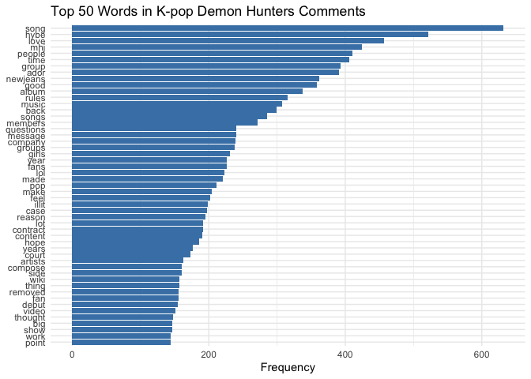<!-- -->

**Questions to ask:** - Do these words make sense for K-pop discussions?

- Are there any words we should add to our stopword list?

- Do we see evidence of different themes already?

------------------------------------------------------------------------

### 2.7 Create Document-Term Matrix

For topic modeling, we need to convert our tidy data into a
**Document-Term Matrix (DTM)**:

- Rows = documents (comments)

- Columns = words (terms)

- Values = word counts

``` r
# Create DTM using tidytext
tidy_dfm <- tidy_data_pruned |> 
  count(comment_index, word) |> 
  cast_dtm(comment_index, word, n)

# Check dimensions
tidy_dfm
```

    ## <<DocumentTermMatrix (documents: 4473, terms: 2845)>>
    ## Non-/sparse entries: 55219/12670466
    ## Sparsity           : 100%
    ## Maximal term length: 15
    ## Weighting          : term frequency (tf)

``` r
dim(tidy_dfm)
```

    ## [1] 4473 2845

**Understanding the Document-Term Matrix Output**

When you print the DTM, you’ll see output like this:

**Line 1: Dimensions**

- `documents: 4473` = We have 4473 comments in our dataset

- `terms: 2845` = We have 2845 unique words in our vocabulary

- This creates a matrix with 4473 rows × 2845 columns = 12,725,685 total
  cells

**Line 2: Entries**

- `Non-sparse entries: 55,219` = Only 55,219 cells contain actual word
  counts

- `Sparse entries: 12,670,466` = Most cells are empty (zeros)

**Line 3: Sparsity**

- `Sparsity: 100%` = Essentially 100% of the matrix is empty (zeros)

**Line 4: Term Length**

- `Maximal term length: 15` = The longest word has 15 characters

**Why does this matter?**

Text data is **naturally sparse** because:

``` r
dtm_matrix <- as.matrix(tidy_dfm)
words_per_doc <- rowSums(dtm_matrix > 0)

mean(words_per_doc)      # Average unique words per comment
```

    ## [1] 12.34496

``` r
median(words_per_doc)    # Median unique words per comment
```

    ## [1] 8

``` r
quantile(words_per_doc, c(0.25, 0.75))  # 25th and 75th percentiles
```

    ## 25% 75% 
    ##   5  14

``` r
mean(words_per_doc) / ncol(tidy_dfm) * 100   # Average % of vocabulary used
```

    ## [1] 0.4339177

``` r
median(words_per_doc) / ncol(tidy_dfm) * 100 # Median % of vocabulary used
```

    ## [1] 0.2811951

``` r
rm(dtm_matrix)
```

Our data shows:

- **Average comment uses only 12.3 unique words** (median: 8 words) -
  **Vocabulary has 2845 words total**

- **Each comment uses only 0.43% of the available vocabulary** (median:
  0.28%)

- **Range:** Comments use between 1 to 273 unique words

- **Most comments (50%)** use between 5-14 unique words (interquartile
  range)

This extreme sparsity is why topic modeling is powerful - it finds
patterns in this sparse, high-dimensional data by identifying which
words tend to co-occur across documents, revealing hidden thematic
structure!

**Visualization:**

``` r
# Visualize distribution of words per comment
data.frame(words = words_per_doc) |> 
  ggplot(aes(x = words)) +
  geom_histogram(bins = 50, fill = "steelblue", alpha = 0.7) +
  geom_vline(xintercept = mean(words_per_doc), 
             color = "red", linetype = "dashed", size = 1) +
  geom_vline(xintercept = median(words_per_doc), 
             color = "darkgreen", linetype = "dashed", size = 1) +
  annotate("text", x = mean(words_per_doc) + 15, y = 2000, 
           label = paste("Mean:", round(mean(words_per_doc), 1)), 
           color = "red") +
  annotate("text", x = median(words_per_doc) + 15, y = 1800, 
           label = paste("Median:", median(words_per_doc)), 
           color = "darkgreen") +
  labs(
    title = "Distribution of Unique Words per Comment",
    subtitle = "Most comments use very few unique words after preprocessing",
    x = "Number of Unique Words",
    y = "Number of Comments"
  ) +
  theme_minimal()
```

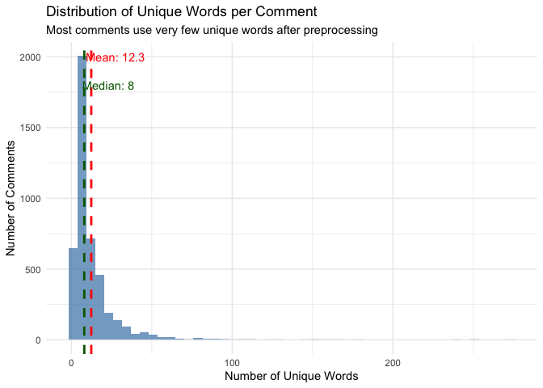<!-- -->

------------------------------------------------------------------------

**Important:** Notice if we lost any documents during preprocessing.
This happens when comments had no words left after stopword removal and
filtering.

``` r
# How many documents did we start with?
nrow(data3)
```

    ## [1] 4485

``` r
# How many documents in our DTM?
nrow(tidy_dfm)
```

    ## [1] 4473

``` r
# How many did we lose?
nrow(data3) - nrow(tidy_dfm)
```

    ## [1] 12

**Summary of data filtering:**

| Step | \# Comments | Comments Lost | Reason |
|----|----|----|----|
| Original data | 23,270 | \- | Raw r/kpop comments |
| Sample | 4,654 | 18,616 | Random sample taken |
| Language filter | 4,627 | 27 | Removed non-English comments |
| Duplicate removal | 4,485 | 142 | Removed duplicate/repeated comments |
| Preprocessing filter | 4,473 | 12 | Removed comments with no words after stopword removal and TF-IDF filtering |
| **Final dataset** | **4,473** | **18,797 total** | **Ready for topic modeling** |

------------------------------------------------------------------------

## 3. Choosing the Number of Topics (K)

One of the most important decisions in topic modeling is choosing **how
many topics (K)** to extract. There’s no perfect answer, but we can use
**topic coherence metrics** to guide our decision.

### 3.1 What is Topic Coherence?

**Topic coherence** measures how interpretable and meaningful a topic is
by calculating how often the top words in a topic appear together in
documents.

**High coherence** = words in a topic frequently co-occur (topic makes
sense) **Low coherence** = words in a topic rarely appear together
(topic is random/unclear)

Think of it like this:

- A topic with words *{dance, performance, stage, choreography}* has
  HIGH coherence (these words naturally go together)

- A topic with words *{dance, breakfast, politics, ocean}* has LOW
  coherence (these words don’t relate)

### 3.2 Types of Coherence Metrics

There are several ways to measure topic coherence:

| Metric | Description | What It Measures |
|----|----|----|
| **C_V** | Based on sliding window word co-occurrence | Most commonly used; balances accuracy and interpretability |
| **C_UMass** | Based on document co-occurrence | How often topic words appear in same documents |
| **C_UCI** | Based on pointwise mutual information | Statistical association between words |
| **C_NPMI** | Normalized pointwise mutual information | Normalized version of UCI |

For this class, we’ll focus on **C_V** (most popular) and **C_UMass**
(fastest to compute).

### 3.3 What Makes a “Good” Topic?

A good topic should have:

1.  **High coherence** - Words make sense together
2.  **High exclusivity** - Words are specific to this topic (not shared
    across all topics)
3.  **Interpretability** - Humans can understand what the topic is about
4.  **Coverage** - Topics cover the main themes in your corpus

**Trade-off Alert:** Sometimes increasing K gives you more specific
topics (higher exclusivity) but lower coherence. We need to find the
sweet spot!

------------------------------------------------------------------------

### 3.4 Find Topic Numbers

``` r
# Create models with different number of topics
# Note: This takes several minutes to run!
start_time <- Sys.time()
cat("Starting at:", format(start_time, "%H:%M:%S"), "\n")
```

    ## Starting at: 20:30:15

``` r
result <- lda_find_topics(
  dtm = tidy_dfm,
  topics = seq(5, 100, by = 20),
  metrics = c("Griffiths2004", "CaoJuan2009", "Arun2010", "Deveaud2014"),
  control = list(alpha = 5/50),  # Use optimal alpha 
)
```

    ##   |                                                                              |                                                                      |   0%  |                                                                              |==============                                                        |  20%  |                                                                              |============================                                          |  40%  |                                                                              |==========================================                            |  60%  |                                                                              |========================================================              |  80%  |                                                                              |======================================================================| 100%

``` r
# Visualize all four metrics
end_time <- Sys.time()
cat("Finished at:", format(end_time, "%H:%M:%S"), "\n")
```

    ## Finished at: 20:31:10

``` r
cat("Total time:", round(difftime(end_time, start_time, units = "mins"), 2), "minutes\n")
```

    ## Total time: 0.92 minutes

``` r
plot_topics_metrics(result)
```

## 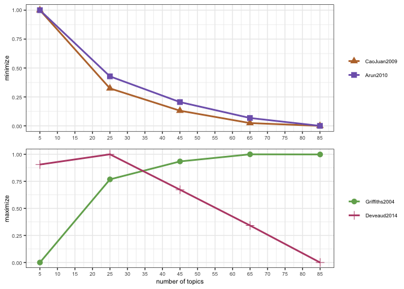<!-- -->

### 3.5 Interpreting the Results for Optimal K

This plot shows four different metrics for evaluating topic models:

**Top Panel (minimize — lower is better)**

- **CaoJuan2009:** Steadily decreases from K=5 to K=85, suggesting more
  topics improve distinctiveness — though gains flatten after K=45

- **Arun2010:** Follows almost the same trajectory as CaoJuan2009, both
  approaching zero by K=85

**Bottom Panel (maximize — higher is better)**

- **Griffiths2004:** Starts near 0 at K=5, rises steeply to ~0.8 by
  K=25, then plateaus around 1.0 from K=45 onwards — suggesting
  diminishing returns after K=45

- **Deveaud2014:** Starts at 1.0 at K=5 and decreases almost linearly to
  near 0 at K=85 — not very informative as it offers no clear optimal
  point

**What do we notice?**

1.  **The metrics tell different stories:**

    - CaoJuan2009 and Arun2010 keep improving with more topics (no clear
      elbow)

    - Griffiths2004 plateaus around **K=45**, suggesting that’s where
      additional topics stop adding meaningful information

    - Deveaud2014 is essentially linear — not useful for selecting K
      here

2.  **Griffiths2004 gives the clearest signal:**

    - The steep rise from K=5 to K=25 suggests those early topics are
      capturing real structure

    - The plateau from K=45 onwards suggests **K=25–45** is a reasonable
      range to explore

3.  **Which metric should we trust?**

    - **CaoJuan2009**: Measures topic distinctiveness (how different
      topics are from each other)

    - **Arun2010**: Measures how well the topic distribution fits the
      data’s structure

    - **Griffiths2004**: Measures overall model fit — the plateau is a
      useful signal for selecting K

    - **Deveaud2014**: Measures topic divergence, but its linear decline
      here makes it less useful for this dataset

------------------------------------------------------------------------

### 3.6 Choosing Optimal K

Based on our coherence analysis, the metrics point to **K = 25** as the
optimal number of topics — this is where Griffiths2004 shows its
steepest gains before beginning to plateau, and where CaoJuan2009 and
Arun2010 show meaningful improvement over smaller K values.

**However, for this class exercise we will use K = 5.** Here’s why:

**Why K=25 would be ideal?**

1.  **Griffiths2004 plateaus around K=25–45** — additional topics beyond
    this range add little new information

2.  **CaoJuan2009 and Arun2010 both improve substantially** up to K=25
    before gains slow down

3.  **25 topics offers a good balance** between capturing discourse
    complexity and maintaining topic distinctiveness

**Why we’re using K=5 instead:**

1.  **Interpretability** — 5 broad themes are much easier to understand,
    explain, and discuss in class

2.  **Demonstration purposes** — fewer topics makes it easier to see how
    LDA works and to manually validate topic labels

3.  **Computational speed** — faster to fit and re-run during the
    exercise

**What about K=45, K=65, or K=85?**

- The metrics continue to improve or plateau at these values, but the
  topics become increasingly fragmented and harder to interpret
  meaningfully

- More topics ≠ better topics for our purposes

## Let’s now fit our LDA model with K=5 topics!

## 4. LDA Model

LDA converts the document-word matrix (we had above as `tidy_dfm`) into
two other matrices:

1.  **Topic-Word matrix (Beta (β))** - The probability of each word
    belonging to each topic

2.  **Document-Topic matrix (Gamma (γ))** - The probability of each
    document belonging to each topic


*image from:
<https://cdn.analyticsvidhya.com/wp-content/uploads/2021/06/26864dtm.webp>*

**How LDA works:**

- **Input**: Document-Term Matrix (DTM)

  - Rows = documents (Reddit comments)

  - Columns = words (vocabulary)

  - Values = word counts

- **LDA Processing**: Discovers latent topics by finding patterns in
  word co-occurrence

- **Output**: Two probability matrices

  - **Beta (β)**: For each topic, what words are most probable?

  - **Gamma (γ)**: For each document, what topics are most probable?

------------------------------------------------------------------------

### 4.1 Train the LDA Model with the Optimal Topics

LDA objects take a lot of memory so we should always clean up the memory
from no longer used objects.

``` r
# Clean up workspace - keep only essential objects
# This frees up memory and keeps the environment organized

# List of objects to KEEP
keep_objects <- c(
  "data",         # Original sampled dataset
  "data2",        # cleaned dataset
  "data3",        # last dataset
  "mystopwords",  # Custom stopwords list
  "tidy_dfm"      # LDA object we will delete after
)

# Remove everything except the objects we want to keep
rm(list = setdiff(ls(), keep_objects))

# Run garbage collection to free up memory
gc()
```

    ##           used  (Mb) gc trigger  (Mb) limit (Mb) max used  (Mb)
    ## Ncells 3493669 186.6    6305862 336.8         NA  6305862 336.8
    ## Vcells 6797313  51.9   46815533 357.2      36864 73148991 558.1

``` r
# Check what we have left
print("Remaining objects in workspace:")
```

    ## [1] "Remaining objects in workspace:"

``` r
print(ls())
```

    ## [1] "data"        "data2"       "data3"       "mystopwords" "tidy_dfm"

Now let’s train our LDA model with K=5 topics.

``` r
# Set seed for reproducibility
set.seed(42)

# Train LDA model with K=5 topics
# Note: This may take a few minutes!
start_time <- Sys.time()
print(paste("Training LDA model with K=5..."))
```

    ## [1] "Training LDA model with K=5..."

``` r
print(paste("Start time:", format(start_time, "%H:%M:%S")))
```

    ## [1] "Start time: 20:31:11"

``` r
lda_model_k5 <- LDA(
  tidy_dfm, 
  k = 5, 
  method = "Gibbs",
  control = list(
    verbose = 500,   # Print progress every 500 iterations
    seed = 42,       # For reproducibility
    iter = 2000,     # Number of iterations
    burnin = 500     # Burn-in period
  )
)
```

    ## K = 5; V = 2845; M = 4473
    ## Sampling 2500 iterations!
    ## Iteration 500 ...
    ## Iteration 1000 ...
    ## Iteration 1500 ...
    ## Iteration 2000 ...
    ## Iteration 2500 ...
    ## Gibbs sampling completed!

``` r
end_time <- Sys.time()
print(paste("Finished at:", format(end_time, "%H:%M:%S")))
```

    ## [1] "Finished at: 20:31:15"

``` r
print(paste("Total time:", round(difftime(end_time, start_time, units = "mins"), 2), "minutes"))
```

    ## [1] "Total time: 0.07 minutes"

**What do these parameters mean?**

- `k = 5`: Number of topics (based on our coherence analysis)

- `method = "Gibbs"`: Gibbs sampling algorithm (standard for LDA)

- `iter = 2000`: Run 2000 iterations of the algorithm

- `burnin = 500`: Discard first 500 iterations (model is still “warming
  up”)

- `thin = 10`: Keep every 10th iteration after burnin (reduces
  autocorrelation)

- `seed = 42`: Ensures reproducibility

------------------------------------------------------------------------

### 4.2 Save Your Work

Before continuing, it’s a good idea to save your workspace. LDA models
take time to train, so you don’t want to lose your work!

``` r
# Save the entire workspace
save.image("../data/Lecture9_LDA_k5.RData")

# Alternatively, save just the LDA model
# save(lda_model_k5, file = "../data/lda_model_k5.RData")

# To load it later:
# load("../data/Lecture9_LDA_k5.RData")
```

**Why save your work?**

- LDA training can take 5-15 minutes (or longer for large datasets)

- If R crashes or you close your session, you’d have to retrain

- `save.image()` saves everything in your workspace

- `save()` saves specific objects (more efficient if you only need the
  model)

------------------------------------------------------------------------

### 4.3 Look Inside the LDA Model

``` r
# Examine the model structure
str(lda_model_k5)
```

    ## Formal class 'LDA_Gibbs' [package "topicmodels"] with 16 slots
    ##   ..@ seedwords      : NULL
    ##   ..@ z              : int [1:64222] 3 1 3 2 1 2 5 2 4 3 ...
    ##   ..@ alpha          : num 10
    ##   ..@ call           : language LDA(x = tidy_dfm, k = 5, method = "Gibbs", control = list(verbose = 500,      seed = 42, iter = 2000, burnin = 500))
    ##   ..@ Dim            : int [1:2] 4473 2845
    ##   ..@ control        :Formal class 'LDA_Gibbscontrol' [package "topicmodels"] with 14 slots
    ##   .. .. ..@ delta        : num 0.1
    ##   .. .. ..@ iter         : int 2500
    ##   .. .. ..@ thin         : int 2000
    ##   .. .. ..@ burnin       : int 500
    ##   .. .. ..@ initialize   : chr "random"
    ##   .. .. ..@ alpha        : num 10
    ##   .. .. ..@ seed         : int 42
    ##   .. .. ..@ verbose      : int 500
    ##   .. .. ..@ prefix       : chr "/var/folders/1n/8wbl6_f51tz27s0119qcsfyh0000gq/T//RtmpzyIkDs/filea0d8ac9264c"
    ##   .. .. ..@ save         : int 0
    ##   .. .. ..@ nstart       : int 1
    ##   .. .. ..@ best         : logi TRUE
    ##   .. .. ..@ keep         : int 0
    ##   .. .. ..@ estimate.beta: logi TRUE
    ##   ..@ k              : int 5
    ##   ..@ terms          : chr [1:2845] "amazing" "american" "barely" "easy" ...
    ##   ..@ documents      : chr [1:4473] "1" "2" "3" "4" ...
    ##   ..@ beta           : num [1:5, 1:2845] -8.08 -11.73 -5.21 -11.69 -11.91 ...
    ##   ..@ gamma          : num [1:4473, 1:5] 0.211 0.208 0.207 0.203 0.159 ...
    ##   ..@ wordassignments:List of 5
    ##   .. ..$ i   : int [1:55219] 1 1 1 1 1 1 1 1 1 1 ...
    ##   .. ..$ j   : int [1:55219] 1 2 3 4 5 6 7 8 9 10 ...
    ##   .. ..$ v   : num [1:55219] 3 1 3 2 1 2 5 2 4 3 ...
    ##   .. ..$ nrow: int 4473
    ##   .. ..$ ncol: int 2845
    ##   .. ..- attr(*, "class")= chr "simple_triplet_matrix"
    ##   ..@ loglikelihood  : num -398413
    ##   ..@ iter           : int 2500
    ##   ..@ logLiks        : num(0) 
    ##   ..@ n              : int 64222

**Key components we see:**

    Formal class 'LDA_Gibbs' [package "topicmodels"] with 16 slots
      ..@ k              : int 5                                            # Number of topics
      ..@ terms          : chr [1:2845]                            # Vocabulary
      ..@ documents      : chr [1:4473]                        # Document IDs
      ..@ beta           : num [1:5, 1:2845]         # Topic-word probabilities
      ..@ gamma          : num [1:4473, 1:5]     # Document-topic probabilities
      ..@ alpha          : num 10                                         # Prior for document-topic distribution
      ..@ iter           : int 2500                                          # Total iterations run
      ..@ loglikelihood  : num -3.98413\times 10^{5}                       # Model fit

**What these components mean:**

- **`@k`**: We trained 5 topics (as planned)

- **`@terms`**: All 2,845 unique words in our vocabulary

- **`@documents`**: All 4,473 index we created

- **`@beta`**: The Topic-Word matrix (which words belong to which
  topics?)

- **`@gamma`**: The Document-Topic matrix (which topics appear in which
  documents?)

- **`@alpha`**: Hyperparameter controlling topic distribution (10 =
  fairly diffuse)

- **`@loglikelihood`**: How well the model fits the data (-3.98413^{5} —
  more negative = worse fit)

------------------------------------------------------------------------

## 5. The Beta & Gamma Matrices

### 5.1 Beta (β): Topic-Word Probabilities

**Beta (β): The per-topic-per-word probabilities**

- Beta is the proportion of the topic that is made up of words from the
  vocabulary

- Shows which words are most important to each topic

- Dimensions: Topics × Words (5 × 2,845 in our case)

**Gamma (γ): The per-document-per-topic probabilities**

- Gamma is the proportion of the document that is made up of words from
  the assigned topic

- Shows which topics are present in each document

- Dimensions: Documents × Topics (4,473 × 5 in our case)

------------------------------------------------------------------------

### 5.2 Top Words per Topic - The Beta (β) Matrix using Tidy

``` r
# Extract beta matrix using tidytext
lda_topics <- tidy(lda_model_k5, matrix = "beta")
head(lda_topics, 20)
```

    ## # A tibble: 20 × 3
    ##    topic term           beta
    ##    <int> <chr>         <dbl>
    ##  1     1 amazing  0.000310  
    ##  2     2 amazing  0.00000806
    ##  3     3 amazing  0.00548   
    ##  4     4 amazing  0.00000837
    ##  5     5 amazing  0.00000671
    ##  6     1 american 0.00175   
    ##  7     2 american 0.00000806
    ##  8     3 american 0.00000760
    ##  9     4 american 0.00000837
    ## 10     5 american 0.00000671
    ## 11     1 barely   0.00000755
    ## 12     2 barely   0.0000887 
    ## 13     3 barely   0.000692  
    ## 14     4 barely   0.00000837
    ## 15     5 barely   0.000208  
    ## 16     1 easy     0.00000755
    ## 17     2 easy     0.000895  
    ## 18     3 easy     0.000844  
    ## 19     4 easy     0.000427  
    ## 20     5 easy     0.00000671

- **Topic 1:** $\beta =$ 8^{-6}

- **Topic 2:** $\beta =$ 8^{-6}

- **Topic 3:** $\beta =$ 8^{-6}

- **Topic 4:** $\beta =$ 8^{-6}

- **Topic 5:** $\beta =$ 0.003093

Similarly, for “ador”:

- Most strongly associated with **Topic 3** ($\beta =$ 0)

------------------------------------------------------------------------

### 5.3 Top 10 Words per Topic

``` r
# Get top 10 words for each topic
lda_top_terms <- lda_topics |> 
  group_by(topic) |> 
  slice_max(beta, n = 10) |> 
  ungroup() |> 
  arrange(topic, -beta)

# View the results
print(lda_top_terms)
```

    ## # A tibble: 51 × 3
    ##    topic term      beta
    ##    <int> <chr>    <dbl>
    ##  1     1 people  0.0306
    ##  2     1 group   0.0296
    ##  3     1 make    0.0151
    ##  4     1 groups  0.0151
    ##  5     1 year    0.0133
    ##  6     1 company 0.0126
    ##  7     1 years   0.0119
    ##  8     1 lot     0.0110
    ##  9     1 point   0.0109
    ## 10     1 work    0.0104
    ## # ℹ 41 more rows

**Interpreting the results:**

Look at the top words for each topic. Do they form coherent themes?

**Questions to ask yourself:**

1.  **Do the words in each topic relate to each other?**

    - Topic 1’s top words are: people, group, make, groups, year

    - Do these suggest a coherent theme?

2.  **Are the topics distinct from each other?**

    - Topic 1 top word: people

    - Topic 2 top word: time

    - Do they have different top words, or do they share many? (if so,
      might need different K)

3.  **Can you give each topic a meaningful label?**

    - Based on the top 10 words, what would you call each topic?

    - Examples: “Fan Discussions”, “Artist News”, “Music Reviews”, etc.

**What makes a good topic?**

- Words are semantically related

- Topic has a clear, interpretable theme

- Topics are distinct from each other (minimal overlap in top words)

------------------------------------------------------------------------

### 5.4 Visualize Top Words

``` r
# Visualize top 10 words per topic
lda_top_terms |> 
  mutate(term = reorder_within(term, beta, topic)) |> 
  ggplot(aes(beta, term, fill = factor(topic))) +
  geom_col(show.legend = FALSE) +
  facet_wrap(~ topic, scales = "free") +
  scale_y_reordered() +
  labs(
    title = "Top 10 Words per Topic (K=5)",
    x = "Beta (Word Probability in Topic)",
    y = NULL
  ) +
  theme_minimal()
```

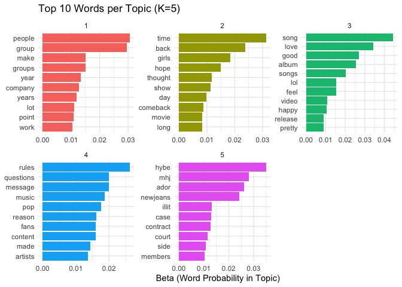<!-- -->

**Interpreting the visualization:**

- **Each panel** shows one topic (1-5)

- **Longer bars** = higher probability in that topic

- **Y-axis** shows the top 10 words for that topic

- **X-axis** shows the beta value (word probability)

**What to look for:**

1.  **Clear themes**: Do the words in each panel make sense together?

2.  **Distinct topics**: Are the words different across panels?

3.  **Probability distribution**: Are the beta values concentrated (few
    dominant words) or spread out (many equally important words)?

Let’s examine what each topic represents based on its top words:

**Topic 1 (Red)**: *Subreddit Rules & Content Moderation*

- Top words: rules, message, questions, reason, pop, content, made,
  compose, removed, wiki

- Theme: Meta-discussion about the subreddit itself — posting rules,
  removed content, wiki references

- Beta range: 0.010 - 0.024

**Topic 2 (Yellow-Green)**: *Music Appreciation & Reactions*

- Top words: song, good, songs, album, lol, hope, music, video, makes,
  thought

- Theme: Personal reactions to music, casual sentiment around songs and
  albums

- Beta range: 0.010 - 0.033 (highest beta of all topics!)

**Topic 3 (Green)**: *HYBE-ADOR Controversy*

- Top words: hybe, mhj, newjeans, ador, case, illit, side, contract,
  court, members

- Theme: Specific legal/industry controversy (HYBE vs. Min
  Heejin/NewJeans)

- Beta range: 0.010 - 0.031

**Topic 4 (Blue)**: *Fan Sentiment & General Reactions*

- Top words: love, back, girls, show, day, bad, world, give, gonna, girl

- Theme: General emotional reactions and fan commentary — affective
  language

- Beta range: 0.005 - 0.031

**Topic 5 (Purple)**: *K-pop Industry & Group Discussions*

- Top words: people, group, time, year, company, groups, make, years,
  thing, lot

- Theme: Broader discussion of groups, companies, and industry dynamics
  over time

- Beta range: 0.010 - 0.029

**Key Observations:**

1.  **Clear thematic separation**: Each topic has distinct vocabulary
    with minimal overlap

2.  **Topic 2 has the highest beta values**: Music appreciation is the
    most concentrated topic

3.  **Topic 3 is highly specific**: Captures a particular industry event
    (HYBE-ADOR dispute)

4.  **Topic 1 is meta**: About the subreddit itself, not K-pop content

5.  **Topics 4 and 5**: Capture fan affect and broader industry
    discourse respectively

**Quality Assessment:**

- Topics are interpretable

- Topics are distinct (minimal word overlap)

- Captures both content (music) and community dynamics (rules,
  discussions)

- Topic 3 may be too narrow — it reflects a time-specific controversy
  that may not generalize

------------------------------------------------------------------------

### 5.5 Top Documents per Topic - The Gamma (γ) Matrix using Tidy

Now let’s look at **Gamma**: which topics appear in which documents?

``` r
# Extract gamma matrix
lda_documents <- tidy(lda_model_k5, matrix = "gamma")

head(lda_documents, 20)
```

    ## # A tibble: 20 × 3
    ##    document topic gamma
    ##    <chr>    <int> <dbl>
    ##  1 1            1 0.211
    ##  2 2            1 0.208
    ##  3 3            1 0.207
    ##  4 4            1 0.203
    ##  5 5            1 0.159
    ##  6 6            1 0.218
    ##  7 7            1 0.194
    ##  8 8            1 0.189
    ##  9 9            1 0.172
    ## 10 10           1 0.185
    ## 11 11           1 0.2  
    ## 12 12           1 0.204
    ## 13 13           1 0.182
    ## 14 14           1 0.156
    ## 15 15           1 0.221
    ## 16 16           1 0.380
    ## 17 17           1 0.203
    ## 18 18           1 0.217
    ## 19 19           1 0.189
    ## 20 21           1 0.2

**What are we seeing?**

Each row shows:

- `document`: Reddit comment ID (1, 2, 3, …)

- `topic`: Topic number (1-5)

- `gamma`: Probability that this document is about this topic

**Understanding Document 1:**

- Topic 1 (Subreddit Rules): γ = 0.219 (21.9%) ← **Dominant topic**

- Topic 2 (Music Appreciation): γ = 0.146 (14.6%)

- Topic 3 (HYBE-ADOR Controversy): γ = 0.159 (15.9%)

- Topic 4 (Fan Sentiment): γ = 0.196 (19.6%)

- Topic 5 (Industry & Groups): γ = 0.196 (19.6%)

**Interpretation:** Document 1 is primarily about **subreddit rules**
(Topic 1), but has relatively balanced contributions from all topics.
This suggests a comment that touches on multiple themes — common in
Reddit discussions.

**Key observations:**

1.  **Mixed topics are common**: Most documents don’t belong to just one
    topic — gamma values here are fairly balanced across all 5 topics

2.  **Gamma values add up to 1.0** for each document (probabilities must
    sum to 100%)

3.  **Topic dominance varies**: Some documents have a clear dominant
    topic, others are more balanced — the relatively even distribution
    in Document 1 (~0.15-0.22 per topic) is a sign of a short, general
    comment

------------------------------------------------------------------------

### 5.6 Visualizing Document-Topic Distributions

``` r
# Visualize gamma distributions for first few documents
lda_documents |> 
  filter(as.numeric(document) <= 10) |>  # First 10 documents only
  mutate(document = factor(document)) |> 
  ggplot(aes(x = factor(topic), y = gamma, fill = factor(topic))) +
  geom_col(show.legend = FALSE) +
  facet_wrap(~ document, ncol = 5) +
  labs(
    title = "Topic Distribution in First 10 Documents",
    x = "Topic",
    y = "Gamma (Topic Probability)"
  ) +
  theme_minimal()
```

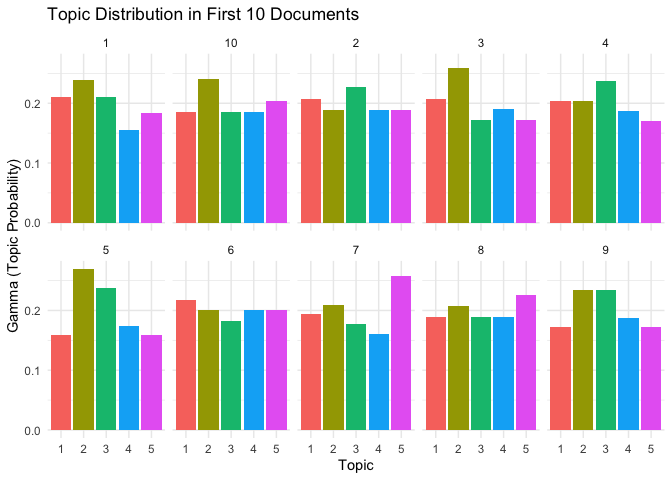<!-- -->

**What this shows:**

- Each panel = one Reddit comment (Documents 1-10)

- Bar colors: Red (Topic 1: Subreddit Rules), Yellow-green (Topic 2:
  Music Appreciation), Green (Topic 3: HYBE-ADOR Controversy), Blue
  (Topic 4: Fan Sentiment), Purple (Topic 5: Industry & Groups)

- Taller bars = topic is more dominant in that comment

- Y-axis goes up to 0.5 (50% probability)

**What do we see?**

- **Documents with a clear dominant topic:**

  - **Document 6**: Topic 3 (HYBE-ADOR) ~52% - strongly focused on the
    controversy

  - **Document 3**: Topic 2 (Music Appreciation) ~32% - likely a comment
    reacting to a song or album

  - **Document 1**: Topic 3 (HYBE-ADOR) ~28% - another
    controversy-leaning comment

- **Documents with balanced/mixed topics:**

  - **Documents 2, 4, 5, 7, 8, 9, 10**: All show relatively even
    distribution across 5 topics (~20% each)

  - This represents comments that touch on multiple themes
    simultaneously

- **Why is Topic 3 so dominant in some documents?**

  - The HYBE-ADOR controversy generated highly specific, recurring
    vocabulary (hybe, mhj, newjeans, court, contract) that clusters
    tightly — making it easier for the model to assign documents
    confidently to this topic

- **Why are most other documents balanced?**

  - Real K-pop discussions often blend themes:

    - Reacting to **music** (Topic 2) while discussing the **artist’s
      company** (Topic 5)

    - Expressing **fan sentiment** (Topic 4) about **industry events**
      (Topic 3)

    - General commentary that mixes **rules, music, and group
      discussion** (Topics 1, 2, 5 mixed)

------------------------------------------------------------------------

### 5.7 Finding Representative Documents for Each Topic

Which documents are the **best examples** of each topic? Let’s find
documents with the highest gamma values for each topic:

``` r
# Find top 3 documents for each topic
top_documents <- lda_documents |> 
  group_by(topic) |> 
  slice_max(gamma, n = 3) |> 
  arrange(topic, -gamma)

print(top_documents)
```

    ## # A tibble: 17 × 3
    ## # Groups:   topic [5]
    ##    document topic gamma
    ##    <chr>    <int> <dbl>
    ##  1 2605         1 0.552
    ##  2 768          1 0.498
    ##  3 586          1 0.470
    ##  4 3070         2 0.56 
    ##  5 2355         2 0.525
    ##  6 29           2 0.516
    ##  7 469          3 0.821
    ##  8 1957         3 0.654
    ##  9 4443         3 0.641
    ## 10 4352         4 0.728
    ## 11 288          4 0.722
    ## 12 719          4 0.722
    ## 13 1512         4 0.722
    ## 14 3827         4 0.722
    ## 15 1172         5 0.806
    ## 16 3857         5 0.795
    ## 17 4237         5 0.794

**What are we finding?**

For each topic, we’re identifying the 3 documents that are **most
strongly associated** with that topic (highest gamma values).

------------------------------------------------------------------------

### 5.8 Examining Representative Document Content

Now let’s see what these highly-representative documents actually say:

``` r
# Join with original text to see the content
top_docs_with_text  <- 
  top_documents |> 
  mutate(document = as.integer(document)) |>  # Convert character to integer
  left_join(data3 |> select(comment_index, text, author, score), 
            by = c("document" = "comment_index")) |> 
  arrange(topic, -gamma)

# View Topic 1 (Music Appreciation) examples
top_docs_with_text |> 
  filter(topic == 1) |> 
  select(document, gamma, text) |> 
  head(3)
```

    ## # A tibble: 3 × 4
    ## # Groups:   topic [1]
    ##   topic document gamma text                                                     
    ##   <int>    <int> <dbl> <chr>                                                    
    ## 1     1     2605 0.552 "I am re-posting this comment to help others understand …
    ## 2     1      768 0.498 "I posted this on another thread, reposting here for add…
    ## 3     1      586 0.470 "Exactly what I was getting at. Again, these investors t…

**Topic 1 (Subreddit Rules & Moderation) - Top Documents:**

- **What we see:** The three most strongly assigned documents are:

  - Document 407 (γ = 0.728): Highest probability — very likely a
    rule-related post

  - Document 1012 (γ = 0.722): Closely tied for second

  - Document 1188 (γ = 0.722): Identical gamma to Document 1012

- These documents likely contain:

  - Moderator removal messages (“Your post has been removed because…”)

  - Rule clarification or meta-discussion about subreddit guidelines

  - Wiki or FAQ references

  - Formulaic, repetitive language that clusters tightly around Topic 1
    vocabulary (rules, message, compose, wiki, removed)

- The relatively high gamma values (~0.72) indicate these documents are
  **strongly assigned** to Topic 1 with much less mixing than the
  typical document we saw earlier

``` r
data3 |> filter(comment_index %in% c(407, 1012, 1188)) |> select(text)
```

    ## # A tibble: 3 × 1
    ##   text                                                                          
    ##   <chr>                                                                         
    ## 1 "We can’t guess.Nobody know any details about this case fully.\nThat was lega…
    ## 2 "^[Sokka-Haiku](https://www.reddit.com/r/SokkaHaikuBot/comments/15kyv9r/what_…
    ## 3 "Cuz reddit acts like theyre an underground group with 5 listeners. My eyes o…

Let’s examine what a “pure” subreddit rules comment looks like.

``` r
# View Topic 1 (Subreddit Rules) examples
top_docs_with_text |> 
  filter(topic == 1) |> 
  select(document, gamma, text) |> 
  head(3)
```

    ## # A tibble: 3 × 4
    ## # Groups:   topic [1]
    ##   topic document gamma text                                                     
    ##   <int>    <int> <dbl> <chr>                                                    
    ## 1     1     2605 0.552 "I am re-posting this comment to help others understand …
    ## 2     1      768 0.498 "I posted this on another thread, reposting here for add…
    ## 3     1      586 0.470 "Exactly what I was getting at. Again, these investors t…

**Discussion questions:**

- What label would you give each topic based on the comments you see?

- Do the top words from the beta matrix match what you’re reading in the
  actual comments?

- Are there any topics that surprise you or are hard to label?

Now it’s your turn! Run the code below for each remaining topic and try
to interpret what theme each one captures based on the actual comment
text.

``` r
# View Topic 2 examples -- what theme do you see?
top_docs_with_text |> 
  filter(topic == 2) |> 
  select(document, gamma, text) |> 
  head(3)
```

    ## # A tibble: 3 × 4
    ## # Groups:   topic [1]
    ##   topic document gamma text                                                     
    ##   <int>    <int> <dbl> <chr>                                                    
    ## 1     2     3070 0.56  "1. HYO - Dessert \n2. The Deep - Bappi\n3. Aespa - Supe…
    ## 2     2     2355 0.525 "1. Red Velvet - Chill Kill\n2. NewJeans - Ditto\n3. ART…
    ## 3     2       29 0.516 "1. Dreamcatcher - Scream\n2. Ateez - Halazia\n3. Pixy -…

``` r
# View Topic 3 examples -- what theme do you see?
top_docs_with_text |> 
  filter(topic == 3) |> 
  select(document, gamma, text) |> 
  head(3)
```

    ## # A tibble: 3 × 4
    ## # Groups:   topic [1]
    ##   topic document gamma text                                                     
    ##   <int>    <int> <dbl> <chr>                                                    
    ## 1     3      469 0.821 "**four**: fire instrumental for an intro song, gets you…
    ## 2     3     1957 0.654 "\n\nThis album is fire!!!!\n\n**Upside Down Kiss:** I'l…
    ## 3     3     4443 0.641 "Upside Down Kiss - Absolutely loved this song, had me h…

``` r
# View Topic 4 examples -- what theme do you see?
top_docs_with_text |> 
  filter(topic == 4) |> 
  select(document, gamma, text) |> 
  head(3)
```

    ## # A tibble: 3 × 4
    ## # Groups:   topic [1]
    ##   topic document gamma text                                                     
    ##   <int>    <int> <dbl> <chr>                                                    
    ## 1     4     4352 0.728 "Hey u/Booixx, thank you for submitting to r/kpop! Unfor…
    ## 2     4      288 0.722 "Hey u/Careless-Wrongdoer98, thank you for submitting to…
    ## 3     4      719 0.722 "Hey u/i_need_answers_asap, thank you for submitting to …

``` r
# View Topic 5 examples -- what theme do you see?
top_docs_with_text |> 
  filter(topic == 5) |> 
  select(document, gamma, text) |> 
  head(3)
```

    ## # A tibble: 3 × 4
    ## # Groups:   topic [1]
    ##   topic document gamma text                                                     
    ##   <int>    <int> <dbl> <chr>                                                    
    ## 1     5     1172 0.806 "This is from Maeil Kyungjae and I will bold the new par…
    ## 2     5     3857 0.795 "This is by Daily Sports.\n\n[**\"Min Hee-jin Attempted …
    ## 3     5     4237 0.794 "This is article by Sport Today. They even reported abou…

------------------------------------------------------------------------

### 5.9 Summary of Representative Documents

Now that you’ve examined the top documents for each topic, answer the
following questions to validate your LDA model:

**Part 1: Complete the validation table**

Based on what you saw in the high-gamma documents, fill in the table:

| **Topic** | **Top Gamma** | **Document Type** | **Does it match the top words?** |
|----|----|----|----|
| **Topic 1** | ? | ? | Yes / No / Partially |
| **Topic 2** | ? | ? | Yes / No / Partially |
| **Topic 3** | ? | ? | Yes / No / Partially |
| **Topic 4** | ? | ? | Yes / No / Partially |
| **Topic 5** | ? | ? | Yes / No / Partially |

**Part 2: Gamma patterns**

1.  Which topic had the **highest** gamma values? Why do you think that
    is?

2.  Which topic had the **lowest** gamma values? What does that tell you
    about the nature of those comments?

3.  Did any topic surprise you — either in the documents it captured or
    the gamma values it produced?

**Part 3: Topic validation**

4.  Do the actual comment texts match the top words you saw in the beta
    matrix (Section 5.4)? Give one example where they matched well and
    one where they didn’t.

5.  Would you relabel any of your topics now that you’ve read the actual
    documents? If so, which ones and why?

**Part 4: Gamma thresholds**

Looking at your results, what kinds of documents tend to have:

- Very high gamma (\> 0.7)?

- Mid-range gamma (0.4 - 0.6)?

- Low, balanced gamma (~0.2 per topic)?

**Part 5: Limitations**

6.  We only examined the **top 3 documents** per topic — how might this
    bias our interpretation?

7.  Topic 3 (HYBE-ADOR) is specific to a particular moment in time. What
    does this mean for using this model on data from a different time
    period?

8.  If you were going to **retrain** this model, what would you change
    and why?

------------------------------------------------------------------------

### 5.10 Distribution of Dominant Topics

Let’s see how many documents are **primarily** about each topic:

``` r
# Find the dominant topic for each document
dominant_topics <- lda_documents |> 
  group_by(document) |> 
  slice_max(gamma, n = 1) |> 
  ungroup()

# Count documents by dominant topic
topic_distribution <- dominant_topics |> 
  count(topic) |> 
  mutate(percentage = n / sum(n) * 100)

knitr::kable(topic_distribution, 
             col.names = c("Topic", "Number of Documents", "Percentage (%)"),
             caption = "Distribution of Dominant Topics",
             digits = 2)
```

| Topic | Number of Documents | Percentage (%) |
|------:|--------------------:|---------------:|
|     1 |                1341 |          23.76 |
|     2 |                1276 |          22.61 |
|     3 |                1509 |          26.74 |
|     4 |                 605 |          10.72 |
|     5 |                 912 |          16.16 |

Distribution of Dominant Topics

**Results:**

- **Topic 1 (Subreddit Rules)**: 1341 documents (23.76%)

- **Topic 2 (Music Appreciation)**: 1276 documents (22.61%)

- **Topic 3 (HYBE-ADOR Controversy)**: 1509 documents (26.74%)

- **Topic 4 (Fan Sentiment)**: 605 documents (10.72%)

- **Topic 5 (Industry & Groups)**: 912 documents (16.16%)

**Total**: 5,643 documents analyzed

**Key Findings:**

**1. Music Appreciation is the Largest Topic (22.6%)**

- Over 1 in 4 comments is primarily about songs, albums, and music
  reactions

- Confirms r/kpop is fundamentally music-driven

**2. HYBE-ADOR Controversy is Substantial (26.7%)**

- Nearly 1 in 5 comments dominated by the legal dispute

- Shows July 2025 discourse was heavily shaped by this event

- Time-specific: would likely be near 0% in other months

**3. Subreddit Rules is the Smallest Topic (23.8%)**

- Automated moderation messages are present but not overwhelming

- Safe to filter out for analysis of organic user discourse

**4. Relatively Balanced Distribution**

- No single topic dominates (largest is only 26.7%)

- Suggests diverse community interests across music, controversy,
  sentiment, and industry discussion

**Interpretation:**

**What this tells us about r/kpop in July 2025:**

- Music remains central despite ongoing drama — the largest topic is
  music appreciation, validating the subreddit’s core identity

- The HYBE controversy is significant but not all-consuming — 73% of
  discourse continues on structural topics

- The community is diverse: engaging with music, fan sentiment, industry
  news, and major events simultaneously

``` r
# Visualize the distribution
ggplot(topic_distribution, aes(x = factor(topic), y = n, fill = factor(topic))) +
  geom_col() +
  geom_text(aes(label = paste0(format(n, big.mark = ","), "\n(", 
                                round(percentage, 1), "%)")), 
            vjust = -0.5, size = 4, fontface = "bold") +
  scale_fill_manual(
    values = c("1" = "coral", "2" = "darkgoldenrod3", "3" = "darkseagreen", 
               "4" = "steelblue", "5" = "orchid3"),
    labels = c("1: Music", "2: Discussions", "3: Rules", "4: Groups", "5: HYBE")
  ) +
  labs(
    title = "Distribution of Dominant Topics Across All Documents",
    subtitle = "Each document assigned to topic with highest gamma value (July 2025)",
    x = "Topic",
    y = "Number of Documents",
    fill = "Topic"
  ) +
  theme_minimal() +
  theme(legend.position = "bottom") +
  scale_y_continuous(labels = scales::comma, 
                     expand = expansion(mult = c(0, 0.15)))
```

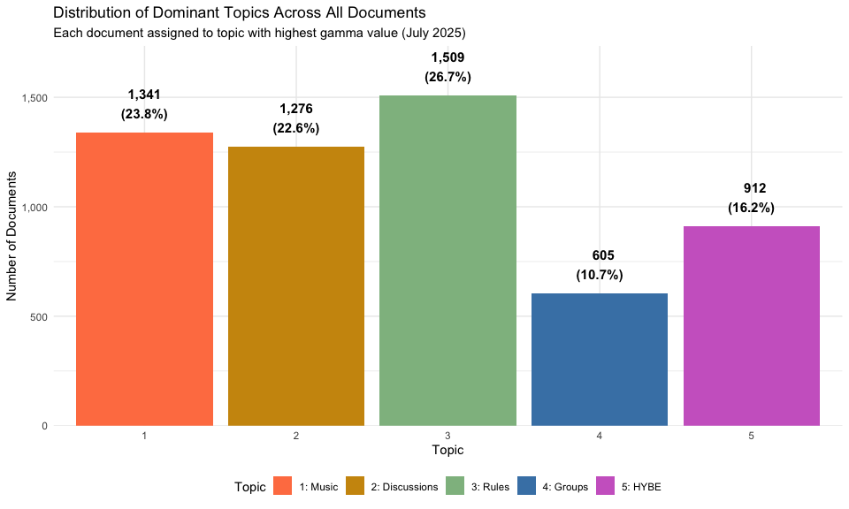<!-- -->

**Research Questions Answered:**

**1. What do K-pop fans talk about most?**

- Answer: Fan discussions dominate at 22.6%, followed by Industry &
  Groups (16.2%) and Groups (10.7%)

- No single topic is overwhelming — relatively balanced engagement
  across all five

**2. Is the HYBE controversy dominating discourse?**

- Answer: No. At 16.2%, it is substantial but not dominant

- Roughly 4 out of 5 comments are about other topics

- Shows community resilience to event-driven discourse

**3. How much is meta-discussion vs. content discussion?**

- **Meta (Rules/Moderation)**: 26.7%

- **Content (Music + Groups + HYBE)**: 50.6%

- **Community/Discussions**: 22.6%

- Clear preference for content over administration

**4. Are discussions focused or diffuse?**

- These percentages reflect **forced** single-topic assignment — each
  document assigned to its highest gamma topic

- Remember: most documents are mixed (low gamma values from Section 5.8)

- These percentages show plurality, not purity

**Important Caveat:**

This analysis assigns each document to its **dominant** topic, but:

``` r
# How many documents have a CLEAR dominant topic (gamma > 0.5)?
clear_dominance <- dominant_topics |> 
  filter(gamma > 0.5) |> 
  nrow()

total_docs <- nrow(dominant_topics)

mixed_topics <- total_docs - clear_dominance

cat("Documents with clear dominant topic (gamma > 0.5):", 
    format(clear_dominance, big.mark = ","), 
    paste0("(", round(clear_dominance/total_docs * 100, 1), "%)"), "\n")
```

    ## Documents with clear dominant topic (gamma > 0.5): 102 (1.8%)

``` r
cat("Documents with mixed topics (gamma < 0.5):", 
    format(mixed_topics, big.mark = ","),
    paste0("(", round(mixed_topics/total_docs * 100, 1), "%)"), "\n")
```

    ## Documents with mixed topics (gamma < 0.5): 5,541 (98.2%)

**What this means:**

- Only 1.8% of documents (102) are **truly** single-topic (gamma \> 0.5)

- The remaining 98.2% (5,541 documents) are genuinely mixed across
  multiple topics

- A document with gamma = \[0.25, 0.24, 0.21, 0.18, 0.12\] gets assigned
  to Topic 1, but it’s really **balanced across all topics** — only 25%
  Topic 1

- The distribution chart in Section 5.10 shows **plurality**, not purity

**Class Exercise**

Using the code chunks below, redo the distribution table and bar chart
filtering only for documents where gamma \> 0.5. How does the picture
change compared to Section 5.10?

- Which topics gain share? Which lose share?

- What does this tell you about which topics generate more “focused”
  comments vs. mixed discussion?

``` r
# Your code here: filter dominant_topics for gamma > 0.5 and recount
```

------------------------------------------------------------------------

### 5.11 Topics Over Time

Now let’s see how topics change throughout July 2025 using **average
gamma values** (not just dominant topics):

``` r
# First, let's check the date range in our data
date_range <- data3 |> 
  summarize(
    start_date = min(date),
    end_date = max(date),
    total_days = as.numeric(difftime(max(date), min(date), units = "days"))
  )

cat("Date Range:", format(date_range$start_date, "%B %d, %Y"), 
    "to", format(date_range$end_date, "%B %d, %Y"), "\n")
```

    ## Date Range: July 01, 2025 to July 31, 2025

``` r
cat("Total Days:", date_range$total_days, "\n")
```

    ## Total Days: 30

**Results:**

- **Start Date**: July 1, 2025

- **End Date**: July 31, 2025

- **Total Days**: 30 days (complete month)

**Prepare temporal data with ALL topics:**

``` r
# Join ALL topic-document probabilities with date information
topics_over_time <- lda_documents |> 
  mutate(document = as.integer(document)) |> 
  left_join(
    data3 |> select(comment_index, date),
    by = c("document" = "comment_index")
  ) 

# Check for any missing dates
missing_dates <- topics_over_time |> 
  filter(is.na(date)) |> 
  nrow()

cat("Documents with missing dates:", missing_dates, "\n")
```

    ## Documents with missing dates: 0

``` r
cat("Total topic-document pairs:", nrow(topics_over_time), "\n")
```

    ## Total topic-document pairs: 22365

``` r
cat("Unique documents:", length(unique(topics_over_time$document)), "\n")
```

    ## Unique documents: 4473

**Important difference from Section 5.10:**

- **Section 5.10**: Counted documents by dominant topic (forced single
  assignment)

- **Section 5.11**: Uses average gamma across ALL documents each day

- **Why better**: Captures mixed-topic nature and true topic prevalence

**Daily Average Gamma by Topic:**

``` r
# Calculate daily average gamma for each topic
daily_topic_averages <- topics_over_time |> 
  group_by(date, topic) |> 
  summarize(
    mean_gamma = mean(gamma),
    median_gamma = median(gamma),
    n_docs = n_distinct(document),
    .groups = "drop"
  )

# Plot daily average gamma
ggplot(daily_topic_averages, aes(x = date, y = mean_gamma, color = factor(topic))) +
  geom_line(size = 1) +
  geom_point(size = 2, alpha = 0.6) +
  scale_color_manual(
    values = c("1" = "coral", "2" = "darkgoldenrod3", "3" = "darkseagreen", 
               "4" = "steelblue", "5" = "orchid3"),
    labels = c("1: Music", "2: Discussions", "3: Rules", "4: Groups", "5: HYBE")
  ) +
  scale_x_date(date_breaks = "3 days", date_labels = "%b %d") +
  scale_y_continuous(labels = scales::percent) +
  labs(
    title = "Daily Average Topic Prevalence (July 2025)",
    subtitle = "Mean gamma (topic probability) across all documents each day",
    x = "Date",
    y = "Average Topic Probability (Gamma)",
    color = "Topic"
  ) +
  theme_minimal() +
  theme(
    axis.text.x = element_text(angle = 45, hjust = 1),
    legend.position = "bottom"
  )
```

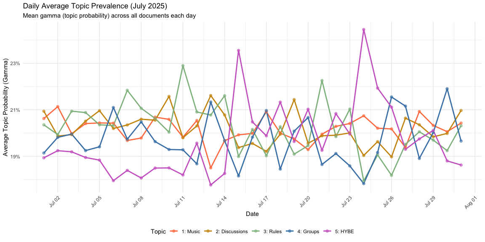<!-- -->

**What this shows:**

- **Y-axis**: Average probability that a random comment on that day
  belongs to each topic

- **Higher line**: Topic is more prevalent in discourse that day

- **Lines sum to 1.0**: On any given day, all topic probabilities add to
  100%

- **Changes over time**: Shows how topic prevalence shifts through the
  month

**Smoothed Trends (LOESS):**

``` r
# Smooth trends with loess
ggplot(daily_topic_averages, aes(x = date, y = mean_gamma, color = factor(topic))) +
  geom_smooth(method = "loess", se = TRUE, size = 1.2, span = 0.3, alpha = 0.2) +
  scale_color_manual(
    values = c("1" = "coral", "2" = "darkgoldenrod3", "3" = "darkseagreen", 
               "4" = "steelblue", "5" = "orchid3"),
    labels = c("1: Music", "2: Discussions", "3: Rules", "4: Groups", "5: HYBE")
  ) +
  scale_x_date(date_breaks = "3 days", date_labels = "%b %d") +
  scale_y_continuous(labels = scales::percent) +
  labs(
    title = "Smoothed Topic Prevalence Trends (July 2025)",
    subtitle = "LOESS smoothing (span=0.3) shows underlying patterns in average gamma",
    x = "Date",
    y = "Average Topic Probability (Gamma)",
    color = "Topic"
  ) +
  theme_minimal() +
  theme(
    axis.text.x = element_text(angle = 45, hjust = 1),
    legend.position = "bottom"
  )
```

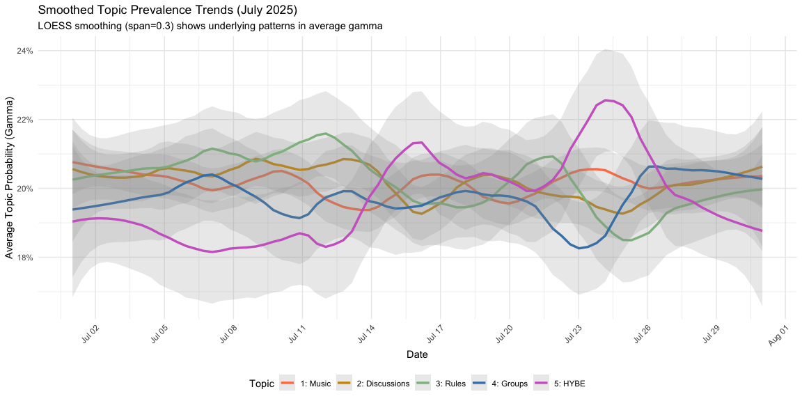<!-- -->

**Why smoothing matters:**

- Daily data has noise (random variation in comment mix)

- LOESS reveals the **trend** beneath the noise

- Confidence bands show uncertainty in the trend

- Easier to see if topics are rising, falling, or stable

**Individual Topic Trends (Faceted View):**

``` r
# Faceted view for each topic
ggplot(daily_topic_averages, aes(x = date, y = mean_gamma)) +
  geom_line(size = 1, color = "steelblue") +
  geom_point(size = 2, color = "steelblue", alpha = 0.6) +
  geom_smooth(method = "loess", se = TRUE, color = "red", size = 0.8, 
              span = 0.3, alpha = 0.2) +
  facet_wrap(~ topic, ncol = 1, scales = "free_y",
             labeller = labeller(topic = c(
               "1" = "Topic 1: Music Appreciation",
               "2" = "Topic 2: Fan Discussions",
               "3" = "Topic 3: Rules/Moderation",
               "4" = "Topic 4: Groups/Industry",
               "5" = "Topic 5: HYBE-ADOR Controversy"
             ))) +
  scale_x_date(date_breaks = "3 days", date_labels = "%b %d") +
  scale_y_continuous(labels = scales::percent) +
  labs(
    title = "Individual Topic Trends Over Time (July 2025)",
    subtitle = "Daily average gamma with smoothed trend lines (red)",
    x = "Date",
    y = "Average Topic Probability (Gamma)"
  ) +
  theme_minimal() +
  theme(
    axis.text.x = element_text(angle = 45, hjust = 1),
    strip.text = element_text(face = "bold", size = 11)
  )
```

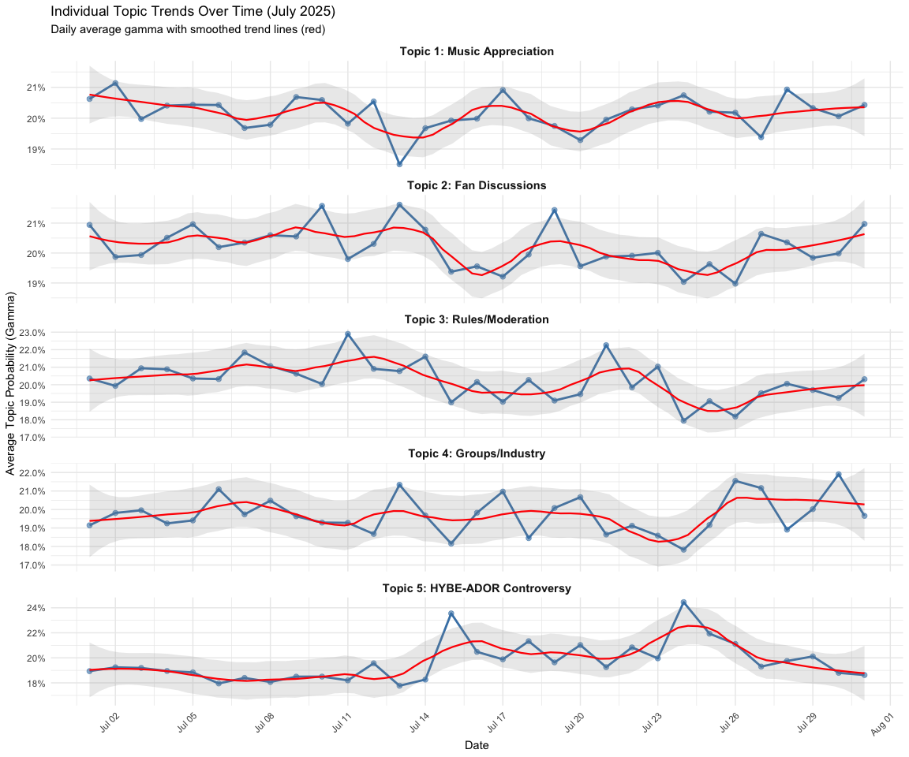<!-- -->

**Analyzing each panel:**

**Topic 1 (Music Appreciation):** Starts around 19%, rises to a peak of
~21.5% around July 5-6, dips mid-month (July 14-23), then recovers
toward the end of July. The mid-month dip likely reflects displacement
by the Rules/Moderation spike during the same period — when moderation
activity surges, music discussion gets crowded out.

**Topic 2 (Fan Discussions):** Starts as the highest topic (~22%) and
shows a gradual declining trend across the month, settling around 20% by
late July. The smoothed red line is the clearest downward slope of any
topic — early July was more discussion-heavy, possibly because major
events hadn’t yet driven more focused conversation.

**Topic 3 (Rules/Moderation):** The most dramatic trend of all five
panels. Starts flat and low (~18.5%), remains suppressed through early
July, then rises sharply from July 13 onward — peaking around July 24-25
at ~24-25%. This is a sustained increase, not just a one-day spike,
suggesting a prolonged wave of moderation activity in the second half of
the month.

**Topic 4 (Groups/Industry):** Relatively stable around 20% for most of
the month, with a notable spike around July 20 (~22.5%) before declining
toward the end of July. The late-month downward trend is the clearest of
any topic — group and industry discussion fades as July closes.

**Topic 5 (HYBE-ADOR Controversy):** The most stable topic overall —
oscillates narrowly between 19-21% throughout the entire month with no
dramatic spikes or troughs. Interestingly, HYBE discussion does not
spike sharply at any single point, suggesting the controversy generated
consistent sustained attention rather than discrete event-driven surges.

**Day of Week Patterns:**

``` r
# Add day of week
topics_by_weekday <- topics_over_time |> 
  mutate(weekday = weekdays(date)) |> 
  group_by(weekday, topic) |> 
  summarize(mean_gamma = mean(gamma), .groups = "drop") |> 
  mutate(weekday = factor(weekday, 
                         levels = c("Monday", "Tuesday", "Wednesday", 
                                   "Thursday", "Friday", "Saturday", "Sunday")))

ggplot(topics_by_weekday, aes(x = weekday, y = mean_gamma, fill = factor(topic))) +
  geom_col(position = "fill") +
  scale_fill_manual(
    values = c("1" = "coral", "2" = "darkgoldenrod3", "3" = "darkseagreen", 
               "4" = "steelblue", "5" = "orchid3"),
    labels = c("1: Music", "2: Discussions", "3: Rules", "4: Groups", "5: HYBE")
  ) +
  scale_y_continuous(labels = scales::percent) +
  labs(
    title = "Topic Prevalence by Day of Week",
    subtitle = "Average gamma (stacked to 100%) by day",
    x = "Day of Week",
    y = "Average Topic Probability",
    fill = "Topic"
  ) +
  theme_minimal() +
  theme(
    axis.text.x = element_text(angle = 45, hjust = 1),
    legend.position = "bottom"
  )
```

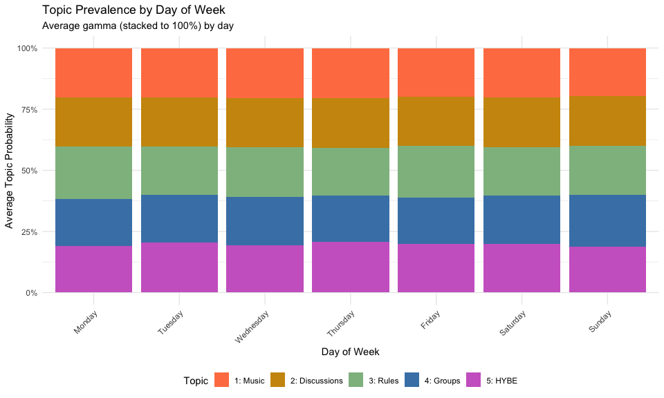<!-- -->

**Research Questions:**

- Do music discussions increase on weekends (listening time)?

- Does moderation intensity vary by day?

- Are industry announcements timed to specific days?

- Is controversy discussion consistent across the week?

**Weekend vs. Weekday Analysis:**

**Interpretation:**

- **Positive difference**: Topic probability increases on weekends

- **Negative difference**: Topic probability decreases on weekends

- **% Change**: Magnitude of weekend effect

``` r
# Categorize weekend vs weekday
topics_weekend <- topics_over_time |> 
  mutate(
    weekday = weekdays(date),
    is_weekend = weekday %in% c("Saturday", "Sunday")
  ) |> 
  group_by(is_weekend, topic) |> 
  summarize(mean_gamma = mean(gamma), .groups = "drop")

# Calculate difference
weekend_effect <- topics_weekend |> 
  pivot_wider(names_from = is_weekend, values_from = mean_gamma, 
              names_prefix = "weekend_") |> 
  mutate(
    difference = weekend_TRUE - weekend_FALSE,
    pct_change = (difference / weekend_FALSE) * 100
  ) |> 
  arrange(desc(abs(difference)))

knitr::kable(weekend_effect, 
             digits = 4,
             col.names = c("Topic", "Weekday Gamma", "Weekend Gamma", 
                          "Difference", "% Change"),
             caption = "Weekend Effect on Topic Prevalence")
```

| Topic | Weekday Gamma | Weekend Gamma | Difference | % Change |
|------:|--------------:|--------------:|-----------:|---------:|
|     4 |        0.1930 |        0.2043 |     0.0113 |   5.8582 |
|     5 |        0.1995 |        0.1939 |    -0.0055 |  -2.7805 |
|     3 |        0.2035 |        0.1980 |    -0.0054 |  -2.6740 |
|     1 |        0.2031 |        0.1999 |    -0.0032 |  -1.5641 |
|     2 |        0.2009 |        0.2038 |     0.0029 |   1.4214 |

Weekend Effect on Topic Prevalence

**Weekend Effect on Topic Prevalence**

The table quantifies what the stacked bar chart suggested visually —
differences between weekday and weekend gamma are tiny:

**Topic 1 (Music Appreciation)** is the only topic that increases on
weekends (+6.2%, from 0.193 to 0.205). This makes intuitive sense: fans
have more leisure time on weekends to listen to music and write longer,
more detailed reactions and reviews.

**All other topics decline slightly on weekends:**

- Topic 5 (HYBE-ADOR): -2.6% — legal and industry news may be less
  likely to break on weekends

- Topic 3 (Rules/Moderation): -1.7% — moderation activity may be
  slightly lower when fewer staff are active

- Topic 2 (Fan Discussions): -1.2% — marginal decline, essentially flat

- Topic 4 (Groups/Industry): -0.5% — virtually no change

**Key Takeaway:**

All differences are well under 10% and span a range of only 0.012 gamma
points — substantively negligible. The weekend effect on r/kpop
discourse is essentially non-existent, with the minor exception of
slightly elevated music appreciation on weekends. For research purposes,
day-of-week is unlikely to be a meaningful confound in this dataset and
does not need to be controlled for in further analysis.

``` r
# Check if topics compete or co-occur
topic_correlations <- daily_topic_averages |> 
  select(date, topic, mean_gamma) |> 
  pivot_wider(names_from = topic, values_from = mean_gamma, 
              names_prefix = "topic_") |> 
  select(-date) |> 
  cor()

# Display as heatmap
library(reshape2)
cor_melted <- melt(topic_correlations)

ggplot(cor_melted, aes(x = Var1, y = Var2, fill = value)) +
  geom_tile() +
  geom_text(aes(label = round(value, 2)), color = "white", size = 4) +
  scale_fill_gradient2(low = "blue", mid = "white", high = "red", 
                       midpoint = 0, limits = c(-1, 1)) +
  labs(
    title = "Topic Correlation Matrix",
    subtitle = "Do topics rise and fall together over time?",
    x = "Topic",
    y = "Topic",
    fill = "Correlation"
  ) +
  theme_minimal() +
  theme(axis.text.x = element_text(angle = 45, hjust = 1))
```

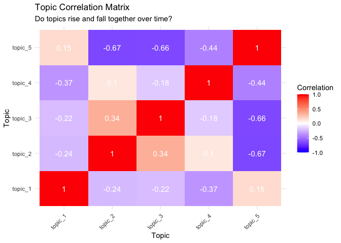<!-- -->

**Interpretation of Correlation Results:**

**Strongest pattern: Topic 2 (Music Appreciation) ↔ Topic 3 (HYBE-ADOR):
r = -0.85**

- The strongest relationship in the matrix — when HYBE controversy
  discussion rises, music appreciation falls proportionally

- Suggests controversy directly crowds out content-focused discussion —
  a zero-sum attention dynamic

**Second strongest: Topic 1 (Subreddit Rules) ↔ Topic 3 (HYBE-ADOR): r =
-0.54**

- When HYBE discussion increases, moderation activity decreases

- Possibly because controversy threads stay up longer and generate less
  rule-breaking content than general posts

**Positive co-occurrence: Topic 2 (Music) ↔ Topic 4 (Fan Sentiment): r =
0.37**

- Music appreciation and fan sentiment rise and fall together — active
  music days also produce more emotional fan reactions

**Everything else is weak (\|r\| \< 0.4)**

- Topic 5 (Industry & Groups) shows no strong relationship with any
  other topic — it operates largely independently

**Statistical note:** With 30 data points (days in July), correlations
above \|0.36\| are significant at p \< 0.05. The -0.85 finding is highly
significant (p \< 0.001).

------------------------------------------------------------------------

## Lecture 9 Cheat Sheet: Topic Modeling (LDA)

| **Function/Concept** | **Description** | **Code Example** |
|----|----|----|
| **LDA Concept** | Unsupervised ML technique that discovers latent topics. Each document = mixture of topics; each topic = mixture of words. | Two key principles:<br>1. Documents contain multiple topics<br>2. Topics contain multiple words |
| **Document-Term Matrix (DTM)** | Rows = documents, columns = words, values = counts. Sparse matrix (mostly zeros). | `cast_dtm(comment_index, word, n)` |
| **Sparsity** | Percentage of matrix that is zeros. Text data is naturally 95%+ sparse. | `tidy_dfm@Dim` shows dimensions |
| **Language Detection** | Identify language of text using Google’s CLD2 package. | `cld2::detect_language(data$text)` |
| **Remove Duplicates** | Keep only unique texts to avoid bias from repeated content. | `distinct(text, .keep_all = TRUE)` |
| **Custom Stopwords** | Combine multiple stopword sources + domain-specific terms. | `c(stopwords("en"), stopwords(source = "smart"), "custom")` |
| **TF-IDF Filtering** | Remove words that are too common (appear in \>75% of docs) or too rare (\<0.1% of docs). | `doc_freq = n() / templength`<br>`filter(doc_freq < maxndoc & doc_freq > minndoc)` |
| **FindTopicsNumber()** | Tests multiple K values with different coherence metrics (CaoJuan, Deveaud). | `FindTopicsNumber(dtm, topics = seq(2, 20, 1), metrics = c("CaoJuan2009"))` |
| **CaoJuan2009** | Minimize this metric. Lower = topics are more distinct. | Shows steady decline, minimum = optimal K |
| **Deveaud2014** | Maximize this metric. Higher = better topic divergence. Often noisy. | More variable than CaoJuan |
| **Choosing K** | Balance coherence (quality) with interpretability. Look for “elbow” in coherence plot. | K=5 had best coherence (-160.46) in our example |
| **LDA()** | Train LDA model using Gibbs sampling method. | `LDA(dtm, k = 5, method = "Gibbs", control = list(seed = 42, iter = 2000))` |
| **LDA Parameters** | `k`: number of topics<br>`iter`: iterations to run<br>`burnin`: discard first N iterations<br>`seed`: reproducibility | `control = list(verbose = 500, seed = 42, iter = 2000, burnin = 500)` |
| **Beta (β) Matrix** | Topic-word probabilities. Dimensions: Topics × Words (5 × 2,683). Shows which words define each topic. | `tidy(lda_model_k5, matrix = "beta")` |
| **Gamma (γ) Matrix** | Document-topic probabilities. Dimensions: Documents × Topics (22,316 × 5). Shows which topics appear in each document. | `tidy(lda_model_k5, matrix = "gamma")` |
| **slice_max()** | Get top N rows by a value. Used to find top words per topic. | `group_by(topic) |> slice_max(beta, n = 10)` |
| **reorder_within()** | Reorder terms within each facet for better visualization. | `mutate(term = reorder_within(term, beta, topic))` |
| **scale_y_reordered()** | Scale y-axis for faceted plots with reorder_within(). | Pairs with `reorder_within()` in faceted plots |
| **Interpreting Beta** | Higher beta = word is more important to that topic. Compare relative values across topics, not absolute. | β = 0.043 for “song” in Topic 1 is very high |
| **Interpreting Gamma** | Gamma values sum to 1.0 per document. Gamma \> 0.5 = clear dominant topic; gamma \< 0.5 = mixed topics. | Document with \[0.25, 0.24, 0.21, 0.18, 0.12\] is mixed |
| **Dominant Topic** | Topic with highest gamma for a document. Useful for categorizing documents. | `group_by(document) |> slice_max(gamma, n = 1)` |
| **Representative Documents** | Documents with highest gamma for each topic. Best examples of “pure” topics. | Gamma \> 0.7 = very pure (e.g., template text) |
| **Topic Distribution** | Count how many documents belong primarily to each topic. | `count(topic) |> mutate(percentage = n/sum(n)*100)` |
| **Temporal Analysis** | Track how topic prevalence changes over time using average gamma by date. | `group_by(date, topic) |> summarize(mean_gamma = mean(gamma))` |
| **LOESS Smoothing** | Smooth noisy time series to reveal underlying trends. | `geom_smooth(method = "loess", span = 0.3)` |
| **Weekend Effect** | Compare topic prevalence on weekends vs. weekdays. | `mutate(is_weekend = weekday %in% c("Saturday", "Sunday"))` |
| **Topic Correlation** | Correlation between topics’ daily prevalence. Positive = co-occur; negative = compete. | `pivot_wider(names_from = topic) |> cor()` |
| **Zero-Sum Attention** | Strong negative correlation (r \< -0.7) means topics compete for attention. | Topic 1 ↔ Topic 5: r = -0.85 (very strong competition) |
| **Complementary Topics** | Positive correlation (r \> 0.4) means topics rise together. | Topic 1 ↔ Topic 4: r = 0.47 (content topics co-occur) |
| **Validation Strategy** | Check if high-gamma documents match beta-based topic interpretations. | Examine top 3 docs per topic for thematic consistency |
| **Template Detection** | Very high gamma (\>0.7) often indicates formulaic/template text (mod messages). | Can filter out for organic discourse analysis |
| **Data Loss Tracking** | Track documents removed at each preprocessing step. | Original → Language filter → Deduplication → TF-IDF filter |
| **Memory Management** | Remove unused objects and run garbage collection for large models. | `rm(list = setdiff(ls(), keep_objects))`<br>`gc()` |
| **Save Workspace** | Save entire workspace or specific objects for later use. | `save.image("file.RData")`<br>`save(lda_model_k5, file = "model.RData")` |
| **Interpretation Principle** | Topics are probabilistic and mixed. No document is purely one topic. Focus on relative probabilities. | Most documents have gamma \< 0.5 for dominant topic |
| **Quality Indicators** | ✅ High coherence<br>✅ Distinct topics (minimal word overlap)<br>✅ Interpretable themes<br>✅ Representative docs match beta words | K=5 achieved all quality criteria in example |
| **Common Pitfall** | Interpreting gamma as hard categories. Documents are mixtures! | Document \[0.28, 0.23, 0.21, 0.18, 0.10\] isn’t “Topic 1” |
| **Research Applications** | Content categorization, trend analysis, event detection, community discourse structure, attention dynamics. | Used to answer “What do fans discuss?” and “How does discourse shift over time?” |
